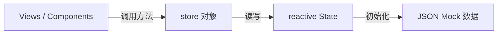

# Store API 文档

> 本文档描述 **QA Live Healthcare** 项目的全局状态管理 API，即 `src/store/index.ts` 中暴露的 `store` 对象。
>
> 本项目为纯前端 SPA，**无后端 HTTP API**。所有"API"均为内存中的 Store 方法调用。

---

## Store 架构概览



**导入方式：**
```typescript
import { store } from '../store';
import type { Doctor, Patient, Question } from '../store';
```

---

## State 状态对象

```typescript
// store.state 的完整结构
interface State {
  doctors: Doctor[];         // 所有医生列表（初始化自 doctor-user-list.json）
  patients: Patient[];       // 所有患者列表（初始化自 patient-user.json）
  questions: Question[];     // 所有问诊记录（初始化自 question-list.json）
  currentDoctor: Doctor | null;   // 当前登录的医生（未登录为 null）
  currentPatient: Patient | null; // 当前认证的患者（未认证为 null）
}
```

**访问方式：**
```typescript
store.state.doctors         // Doctor[]
store.state.currentDoctor   // Doctor | null
store.state.questions       // Question[]
```

---

## 方法 API

### 认证相关

---

#### `loginDoctor(username, password)`

医生账号密码登录。

**签名：**
```typescript
loginDoctor(username: string, password: string): Doctor | null
```

**参数：**
| 参数 | 类型 | 说明 |
|------|------|------|
| `username` | `string` | 医生账号（唯一） |
| `password` | `string` | 密码（明文，与 JSON 数据匹配） |

**返回值：**
- 登录成功：返回 `Doctor` 对象，同时设置 `state.currentDoctor`
- 登录失败：返回 `null`，`state.currentDoctor` 不变

**示例：**
```typescript
const doctor = store.loginDoctor('doctor001', 'pwd123');
if (doctor) {
  router.push({ name: 'DoctorRoom', params: { username: doctor.username } });
} else {
  message.error('用户名或密码错误');
}
```

---

#### `logoutDoctor()`

医生退出登录，清空 `state.currentDoctor`。

**签名：**
```typescript
logoutDoctor(): void
```

**示例：**
```typescript
store.logoutDoctor();
router.push({ name: 'DoctorLogin' });
```

---

#### `verifyPatient(name, birthday)`

患者身份验证（姓名 + 生日）。若记录不存在，自动创建新患者。

**签名：**
```typescript
verifyPatient(name: string, birthday: string): Patient
```

**参数：**
| 参数 | 类型 | 说明 |
|------|------|------|
| `name` | `string` | 患者姓名 |
| `birthday` | `string` | 出生日期（格式：`YYYY-MM-DD`） |

**返回值：**
- 始终返回 `Patient` 对象（匹配已有记录或新建）
- 同时设置 `state.currentPatient`

**新患者创建逻辑：**
```typescript
{
  id: `patient${Date.now()}`,  // 时间戳生成唯一 ID
  name,
  birthday,
  phone: '',    // 空字符串，待后续补充
  gender: '',   // 空字符串，待后续补充
}
```

**示例：**
```typescript
const patient = store.verifyPatient('张三', '1990-05-15');
// 无论是否存在，均返回患者对象
```

---

#### `logoutPatient()`

患者退出，清空 `state.currentPatient`。

**签名：**
```typescript
logoutPatient(): void
```

---

### 问诊记录相关

---

#### `getQuestionsByDoctor(doctorId)`

获取指定医生的所有问诊记录。

**签名：**
```typescript
getQuestionsByDoctor(doctorId: string): Question[]
```

**参数：**
| 参数 | 类型 | 说明 |
|------|------|------|
| `doctorId` | `string` | 医生 ID（如 `"d001"`） |

**返回值：** `Question[]`（包含 pending 和 answered 状态）

**示例：**
```typescript
// 在医生工作台获取待回复问题
const myQuestions = store.getQuestionsByDoctor(store.state.currentDoctor!.id);
const pendingQuestions = myQuestions.filter(q => q.status === 'pending');
```

---

#### `getQuestionsByPatient(patientId)`

获取指定患者的所有问诊记录。

**签名：**
```typescript
getQuestionsByPatient(patientId: string): Question[]
```

**示例：**
```typescript
const myHistory = store.getQuestionsByPatient(store.state.currentPatient!.id);
```

---

#### `addQuestion(question)`

患者提交新问诊问题。

**签名：**
```typescript
addQuestion(
  question: Omit<Question, 'id' | 'submitTime' | 'status' | 'answer' | 'answerTime'>
): Question
```

**参数（需提供的字段）：**
| 字段 | 类型 | 说明 |
|------|------|------|
| `patientId` | `string` | 患者 ID |
| `patientName` | `string` | 患者姓名 |
| `doctorId` | `string` | 目标医生 ID |
| `doctorName` | `string` | 目标医生姓名 |
| `question` | `string` | 问诊内容 |

**自动生成的字段：**
| 字段 | 生成规则 |
|------|----------|
| `id` | `q${Date.now()}` |
| `submitTime` | `new Date().toISOString()` |
| `status` | `'pending'` |
| `answer` | `null` |
| `answerTime` | `null` |

**示例：**
```typescript
const newQuestion = store.addQuestion({
  patientId: store.state.currentPatient!.id,
  patientName: store.state.currentPatient!.name,
  doctorId: selectedDoctor.id,
  doctorName: selectedDoctor.name,
  question: '我最近头痛，应该怎么办？',
});
message.success('问题已提交，请等待医生回复');
```

---

#### `answerQuestion(questionId, answer)`

医生通过文字回复问诊问题。

**签名：**
```typescript
answerQuestion(questionId: string, answer: string): void
```

**副作用：**
- 设置 `question.status = 'answered'`
- 设置 `question.answer = answer`
- 设置 `question.answerTime = new Date().toISOString()`

**示例：**
```typescript
store.answerQuestion('q1234567890', '建议多休息，注意饮食，如症状持续请来院就诊。');
```

---

#### `markQuestionAsAnswered(questionId)`

医生标记问题为"已口述解答"（无需输入文字答案）。

**签名：**
```typescript
markQuestionAsAnswered(questionId: string): void
```

**副作用：**
- 设置 `question.status = 'answered'`
- 设置 `question.answer = '已口述解答'`（固定字符串）
- 设置 `question.answerTime = new Date().toISOString()`

**示例：**
```typescript
// 医生已当面告知，仅标记为已处理
store.markQuestionAsAnswered('q1234567890');
```

---

### 查询辅助

---

#### `getDoctorByUsername(username)`

按用户名查找医生。

**签名：**
```typescript
getDoctorByUsername(username: string): Doctor | undefined
```

**示例：**
```typescript
// 路由守卫或页面初始化时验证医生身份
const doctorUsername = route.params.username as string;
const doctor = store.getDoctorByUsername(doctorUsername);
if (!doctor) router.push({ name: 'DoctorLogin' });
```

---

#### `getActiveDoctors()`

获取所有在线（`isActive: true`）的医生列表。

**签名：**
```typescript
getActiveDoctors(): Doctor[]
```

**示例：**
```typescript
// 患者选择医生时只展示在线医生
const onlineDoctors = computed(() => store.getActiveDoctors());
```

---

#### `getStatistics()`

获取平台统计数据摘要（用于首页/管理后台展示）。

**签名：**
```typescript
getStatistics(): {
  totalDoctors: number;    // 医生总数
  totalQuestions: number;  // 问诊记录总数
  activeSessions: number;  // 待解答问题数（status === 'pending'）
  totalSessions: number;   // 在线医生数（isActive === true）
}
```

**示例：**
```typescript
const stats = store.getStatistics();
// 返回示例：{ totalDoctors: 5, totalQuestions: 7, activeSessions: 4, totalSessions: 4 }
```

---

## 方法速查表

| 方法 | 类别 | 返回值 | 说明 |
|------|------|--------|------|
| `loginDoctor(username, password)` | 认证 | `Doctor \| null` | 医生登录 |
| `logoutDoctor()` | 认证 | `void` | 医生退出 |
| `verifyPatient(name, birthday)` | 认证 | `Patient` | 患者身份验证（自动创建） |
| `logoutPatient()` | 认证 | `void` | 患者退出 |
| `getQuestionsByDoctor(doctorId)` | 查询 | `Question[]` | 医生的问诊记录 |
| `getQuestionsByPatient(patientId)` | 查询 | `Question[]` | 患者的问诊记录 |
| `addQuestion(question)` | 写操作 | `Question` | 提交新问题 |
| `answerQuestion(questionId, answer)` | 写操作 | `void` | 文字回复问题 |
| `markQuestionAsAnswered(questionId)` | 写操作 | `void` | 标记口述已解答 |
| `getDoctorByUsername(username)` | 查询 | `Doctor \| undefined` | 按用户名查医生 |
| `getActiveDoctors()` | 查询 | `Doctor[]` | 在线医生列表 |
| `getStatistics()` | 统计 | `object` | 平台统计摘要 |

---

## 常见使用模式

### 患者完整流程
```typescript
// 1. 身份验证
const patient = store.verifyPatient('张三', '1990-05-15');

// 2. 选择医生（获取在线医生）
const doctors = store.getActiveDoctors();

// 3. 提交问题
store.addQuestion({
  patientId: patient.id,
  patientName: patient.name,
  doctorId: selectedDoctor.id,
  doctorName: selectedDoctor.name,
  question: questionText,
});

// 4. 查看历史
const history = store.getQuestionsByPatient(patient.id);
```

### 医生完整流程
```typescript
// 1. 登录
const doctor = store.loginDoctor(username, password);

// 2. 获取待处理问题
const questions = store.getQuestionsByDoctor(doctor.id);
const pending = questions.filter(q => q.status === 'pending');

// 3a. 文字回复
store.answerQuestion(questionId, '建议...');

// 3b. 或标记口述已解答
store.markQuestionAsAnswered(questionId);

// 4. 退出
store.logoutDoctor();
```

---

## 已知限制

| 限制 | 影响 | 改进方向 |
|------|------|----------|
| 内存存储，无持久化 | 刷新页面数据重置 | 接入后端 API 或 localStorage |
| 密码明文存储 | 安全风险 | 后端 JWT 认证 |
| 无并发控制 | 多标签页数据不同步 | WebSocket 或后端状态管理 |
| 患者无真实认证 | 任意输入可"登录" | 手机号验证码认证 |

---

*本文档随 Store 实现变化而更新，使用 `/asdm-context-update` 命令保持同步。*
