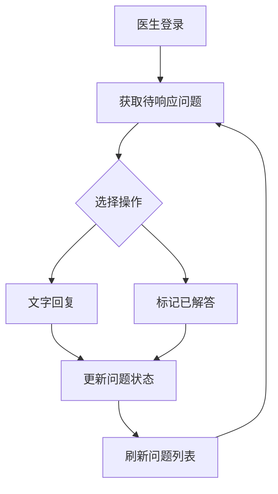
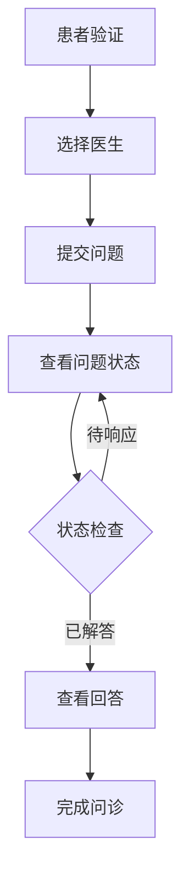

# API接口文档

## 概述

本文档定义了 qa-live-healthcare 项目的所有数据接口和功能API，涵盖用户认证、数据查询、业务操作等核心功能。由于项目采用前端模拟数据架构，所有API均在本地Store中实现。

## API架构

### 技术架构
- **数据层**: 本地状态管理 (Vue reactive)
- **接口层**: Store模块化API
- **业务层**: 组件调用接口
- **数据源**: JSON文件模拟数据

### 接口调用模式
```typescript
// 标准调用方式
import { store } from '../store'

// 数据查询
const doctors = store.getActiveDoctors()

// 业务操作
const doctor = store.loginDoctor(username, password)
```

## 认证接口

### 医生登录
**接口**: `store.loginDoctor(username: string, password: string): Doctor | null`

**请求参数**:
```typescript
interface LoginRequest {
  username: string;  // 医生用户名
  password: string;  // 医生密码
}
```

**响应数据**:
```typescript
interface Doctor {
  id: string;           // 医生ID
  username: string;     // 用户名
  password: string;     // 密码
  name: string;         // 姓名
  title: string;        // 职称
  department: string;   // 科室
  avatar: string;       // 头像
  experience: string;   // 经验
  specialties: string[]; // 专长
  isActive: boolean;    // 在线状态
}
```

**使用示例**:
```typescript
// 医生登录
const doctor = store.loginDoctor('dr-zhang-wei', '123456')
if (doctor) {
  // 登录成功，跳转到医生诊室
  router.push(`/doctor/room/${doctor.username}`)
} else {
  // 登录失败，显示错误信息
  message.error('用户名或密码错误')
}
```

### 患者验证
**接口**: `store.verifyPatient(name: string, birthday: string): Patient`

**请求参数**:
```typescript
interface PatientAuthRequest {
  name: string;      // 患者姓名
  birthday: string;  // 生日 (YYYY-MM-DD)
}
```

**响应数据**:
```typescript
interface Patient {
  id: string;       // 患者ID
  name: string;     // 姓名
  birthday: string; // 生日
  phone: string;    // 电话
  gender: string;   // 性别
}
```

**业务逻辑**:
- 如果患者不存在，自动创建新患者
- 患者ID自动生成: `patient${Date.now()}`
- 返回患者对象并设置当前患者状态

**使用示例**:
```typescript
// 患者身份验证
const patient = store.verifyPatient('张三', '1990-01-01')
// 首次登录创建账户，再次登录验证身份
```

### 退出登录
**医生退出**: `store.logoutDoctor(): void`
**患者退出**: `store.logoutPatient(): void`

## 数据查询接口

### 医生相关查询

#### 获取所有医生
**接口**: `store.state.doctors: Doctor[]`
**说明**: 获取系统中所有医生的完整列表

#### 获取在线医生
**接口**: `store.getActiveDoctors(): Doctor[]`
**说明**: 获取当前在线的医生列表 (`isActive: true`)

#### 根据用户名查找医生
**接口**: `store.getDoctorByUsername(username: string): Doctor | undefined`
**说明**: 通过用户名精确查找医生

**使用示例**:
```typescript
// 首页显示在线医生
const activeDoctors = store.getActiveDoctors()

// 根据URL参数查找医生
const doctor = store.getDoctorByUsername(route.params.username)
```

### 问题相关查询

#### 获取医生的问题列表
**接口**: `store.getQuestionsByDoctor(doctorId: string): Question[]`

**响应数据**:
```typescript
interface Question {
  id: string;                    // 问题ID
  patientId: string;            // 患者ID
  patientName: string;          // 患者姓名
  doctorId: string;             // 医生ID
  doctorName: string;           // 医生姓名
  question: string;             // 问题内容
  submitTime: string;           // 提交时间 (ISO格式)
  status: 'pending' | 'answered'; // 状态
  answer: string | null;        // 回答内容
  answerTime: string | null;    // 回答时间
}
```

#### 获取患者的问题列表
**接口**: `store.getQuestionsByPatient(patientId: string): Question[]`

#### 状态过滤示例
```typescript
// 医生诊室 - 待响应问题
const pendingQuestions = store.getQuestionsByDoctor(doctorId)
  .filter(q => q.status === 'pending')

// 医生诊室 - 已解答问题
const answeredQuestions = store.getQuestionsByDoctor(doctorId)
  .filter(q => q.status === 'answered')

// 患者页面 - 我的问题
const myQuestions = store.getQuestionsByPatient(patientId)
```

## 业务操作接口

### 问题管理

#### 提交问题
**接口**: `store.addQuestion(question: Omit<Question, 'id' | 'submitTime' | 'status' | 'answer' | 'answerTime'>): Question`

**请求参数**:
```typescript
interface AddQuestionRequest {
  patientId: string;    // 患者ID
  patientName: string;  // 患者姓名
  doctorId: string;     // 医生ID
  doctorName: string;   // 医生姓名
  question: string;     // 问题内容
}
```

**自动生成字段**:
- `id`: `q${Date.now()}` (时间戳ID)
- `submitTime`: 当前ISO时间
- `status`: `'pending'` (待响应)
- `answer`: `null`
- `answerTime`: `null`

**使用示例**:
```typescript
// 患者提交问题
const newQuestion = store.addQuestion({
  patientId: currentPatient.id,
  patientName: currentPatient.name,
  doctorId: selectedDoctor.id,
  doctorName: selectedDoctor.name,
  question: questionText
})
```

#### 回答问题
**接口**: `store.answerQuestion(questionId: string, answer: string): void`

**业务逻辑**:
- 更新问题状态为 `'answered'`
- 设置回答内容和回答时间
- 自动生成当前ISO时间戳

**使用示例**:
```typescript
// 医生文字回复问题
store.answerQuestion(questionId, answerText)
```

#### 标记已解答
**接口**: `store.markQuestionAsAnswered(questionId: string): void`

**说明**: 
- 用于口述解答的场景
- 自动设置回答内容为 `'已口述解答'`
- 更新状态和时间戳

**使用示例**:
```typescript
// 医生标记问题为已解答
store.markQuestionAsAnswered(questionId)
```

### 系统统计

#### 获取系统统计信息
**接口**: `store.getStatistics(): Statistics`

**响应数据**:
```typescript
interface Statistics {
  totalDoctors: number;     // 医生总数
  totalQuestions: number;   // 问题总数
  activeSessions: number;   // 待响应问题数
  totalSessions: number;    // 在线诊室数
}
```

**计算逻辑**:
- `totalDoctors`: `state.doctors.length`
- `totalQuestions`: `state.questions.length`
- `activeSessions`: `pending` 状态的问题数
- `totalSessions`: 在线医生数 (`isActive: true`)

**使用示例**:
```typescript
// 首页显示系统统计
const statistics = store.getStatistics()
```

## 数据模型接口

### 状态管理
**接口**: `store.state: State`

**状态结构**:
```typescript
interface State {
  doctors: Doctor[];          // 医生列表
  patients: Patient[];        // 患者列表
  questions: Question[];      // 问题列表
  currentDoctor: Doctor | null; // 当前登录医生
  currentPatient: Patient | null; // 当前登录患者
}
```

### 数据初始化
**数据源**:
- `src/data/doctor-user-list.json` - 医生数据
- `src/data/patient-user.json` - 患者数据  
- `src/data/question-list.json` - 问题数据

**初始化流程**:
```typescript
// 应用启动时加载数据
const state = reactive<State>({
  doctors: doctorData as Doctor[],
  patients: patientData as Patient[],
  questions: questionData as Question[],
  currentDoctor: null,
  currentPatient: null,
})
```

## API使用场景

### 医生工作流


### 患者工作流


## 错误处理

### 登录失败
**场景**: 用户名或密码错误
**处理**: 返回 `null`，前端显示错误提示

### 数据不存在
**场景**: 查询不存在的医生或患者
**处理**: 返回 `undefined` 或空数组

### 业务验证
**场景**: 提交问题前验证必填字段
**处理**: 前端验证，API层面不重复验证

## 性能优化

### 数据缓存
- 使用 `computed` 缓存计算结果
- 避免重复查询相同数据
- 状态变化时自动更新缓存

### 懒加载
- 按需加载问题列表
- 分页查询（当前版本为全量加载）
- 组件级别的数据隔离

## 扩展建议

### 未来API扩展
1. **分页查询**: 支持问题列表分页
2. **搜索功能**: 医生和问题搜索
3. **消息通知**: 实时消息推送
4. **文件上传**: 图片和文档支持
5. **数据导出**: 问诊记录导出

### 后端集成准备
当前前端API设计已考虑后端集成，只需将Store方法替换为HTTP请求：
- `store.loginDoctor()` → `POST /api/auth/doctor`
- `store.getQuestionsByDoctor()` → `GET /api/questions?doctorId=xxx`
- `store.answerQuestion()` → `PUT /api/questions/{id}/answer`

## 总结

本API文档详细描述了 qa-live-healthcare 项目的所有数据接口和业务操作。项目采用前端模拟数据架构，所有接口均在本地Store中实现，具备良好的扩展性和向后兼容性。

**核心特点**:
- ✅ **完整的业务逻辑覆盖** - 认证、查询、操作全流程
- ✅ **类型安全** - TypeScript接口定义
- ✅ **模块化设计** - 清晰的职责分离
- ✅ **易于扩展** - 为后端集成预留接口

---

*文档版本: 1.0*  
*最后更新: 2026-04-21*