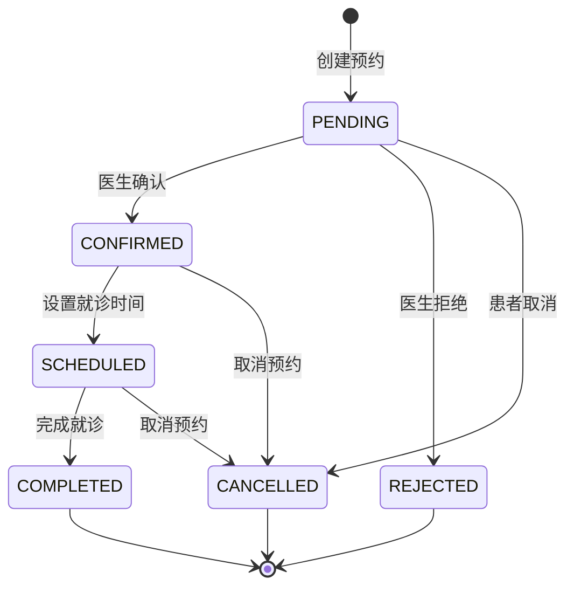

# API 接口文档

## 概述
本文档定义了 QA Live Healthcare 项目的 API 接口规范。项目目前使用前端状态管理模拟 API 调用，接口设计为后续后端开发提供参考。

## 接口设计原则

### RESTful 设计
- 使用标准的 HTTP 方法（GET、POST、PUT、DELETE）
- 资源导向的 URL 设计
- 统一的错误响应格式
- 支持内容协商

### 认证机制
- 医生使用用户名密码认证
- 患者使用姓名和生日验证
- 支持会话管理和状态保持

### 数据持久化
- 使用 localStorage 进行前端数据持久化
- API 函数负责数据同步

## 接口总览

### 基础信息
- **API 版本**: v1
- **基础路径**: `/api/v1`
- **内容类型**: `application/json`
- **字符编码**: UTF-8

### 接口列表

| 功能模块 | 接口路径 | 方法 | 描述 |
|---------|---------|------|------|
| 医生管理 | `/doctors` | GET | 获取医生列表 |
| 医生管理 | `/doctors/:id` | GET | 获取医生详情 |
| 医生管理 | `/doctors/login` | POST | 医生登录 |
| 医生管理 | `/doctors/logout` | POST | 医生登出 |
| 患者管理 | `/patients` | POST | 患者身份验证 |
| 患者管理 | `/patients/logout` | POST | 患者登出 |
| 排班管理 | `/schedules/doctor/:id` | GET | 获取医生排班 |
| 预约管理 | `/appointments` | POST | 创建预约 |
| 预约管理 | `/appointments/my` | GET | 获取我的预约列表 |
| 预约管理 | `/appointments/:id` | GET | 获取预约详情 |
| 预约管理 | `/appointments/:id/cancel` | POST | 取消预约 |
| 问诊管理 | `/questions` | GET | 获取问题列表 |
| 问诊管理 | `/questions` | POST | 提交问题 |
| 问诊管理 | `/questions/:id/answer` | POST | 回答问题 |
| 统计信息 | `/statistics` | GET | 获取平台统计 |

## 详细接口说明

### 1. 医生管理接口

#### 1.1 获取医生列表
**接口路径**: `GET /api/v1/doctors`

**请求参数**:
```typescript
{
  department?: string;    // 可选，科室筛选
  keyword?: string;       // 可选，搜索关键词
  isActive?: boolean;     // 可选，在线状态筛选
}
```

**响应示例**:
```javascript
{
  "code": 200,
  "message": "success",
  "data": [
    {
      "id": "doc001",
      "username": "dr-zhang-wei",
      "name": "张伟医生",
      "title": "主任医师",
      "department": "心内科",
      "avatar": "https://example.com/avatar.jpg",
      "experience": "15年临床经验",
      "specialties": ["高血压", "冠心病", "心律失常"],
      "isActive": true
    }
  ]
}
```

#### 1.2 医生登录
**接口路径**: `POST /api/v1/doctors/login`

**请求体**:
```javascript
{
  "username": "dr-zhang-wei",
  "password": "123456"
}
```

**响应示例**:
```javascript
{
  "code": 200,
  "message": "登录成功",
  "data": {
    "doctor": {
      "id": "doc001",
      "name": "张伟医生",
      "title": "主任医师",
      "department": "心内科"
    },
    "token": "eyJhbGciOiJIUzI1NiIsInR5cCI6IkpXVCJ9...",
    "expiresIn": 3600
  }
}
```

### 2. 患者管理接口

#### 2.1 患者身份验证
**接口路径**: `POST /api/v1/patients`

**请求体**:
```javascript
{
  "name": "赵明",
  "birthday": "1985-03-15"
}
```

**响应示例**:
```javascript
{
  "code": 200,
  "message": "验证成功",
  "data": {
    "patient": {
      "id": "patient001",
      "name": "赵明",
      "birthday": "1985-03-15",
      "phone": "138****1234",
      "gender": "男"
    },
    "isNew": false
  }
}
```

### 3. 排班管理接口

#### 3.1 获取医生排班
**接口路径**: `GET /api/v1/schedules/doctor/:id`

**路径参数**:
- `id`: 医生 ID

**查询参数**:
```typescript
{
  startDate?: string;  // 开始日期 (YYYY-MM-DD)
  endDate?: string;    // 结束日期 (YYYY-MM-DD)
}
```

**响应示例**:
```javascript
{
  "code": 200,
  "message": "success",
  "data": {
    "schedules": [
      {
        "id": "sch001",
        "doctor": { /* 医生信息 */ },
        "scheduleDate": "2026-04-22",
        "timeSlots": [
          {
            "id": "slot001",
            "date": "2026-04-22",
            "startTime": "09:00",
            "endTime": "09:30",
            "maxAppointments": 10,
            "bookedAppointments": 3,
            "remainingSlots": 7
          }
        ],
        "isAvailable": true,
        "createdAt": "2026-04-20T10:00:00Z",
        "updatedAt": "2026-04-20T10:00:00Z"
      }
    ],
    "total": 1
  }
}
```

### 4. 预约管理接口

#### 4.1 创建预约
**接口路径**: `POST /api/v1/appointments`

**请求体**:
```typescript
{
  doctorId: string;           // 医生ID
  doctorName?: string;         // 医生姓名
  doctorAvatar?: string;       // 医生头像
  doctorTitle?: string;        // 医生职称
  doctorDepartment?: string;   // 医生科室
  patientId: string;           // 患者ID
  patientName?: string;        // 患者姓名
  patientBirthday?: string;    // 患者生日
  appointmentDate: string;     // 预约日期 (YYYY-MM-DD)
  startTime?: string;          // 开始时间 (HH:mm)
  endTime?: string;            // 结束时间 (HH:mm)
  timeSlotId: string;          // 时段ID
  reason: string;              // 预约原因/症状描述
}
```

**响应示例**:
```javascript
{
  "code": 200,
  "message": "预约创建成功",
  "data": {
    "appointment": {
      "id": "appt1713772800000",
      "appointmentNo": "APT1713772800000",
      "patient": {
        "id": "patient001",
        "name": "赵明",
        "birthday": "1985-03-15",
        "phone": "",
        "gender": ""
      },
      "doctor": {
        "id": "doc001",
        "name": "张伟医生",
        "title": "主任医师",
        "department": "心内科"
      },
      "appointmentDate": "2026-04-22",
      "startTime": "09:00",
      "endTime": "09:30",
      "status": "PENDING",
      "reason": "头疼、发热",
      "createdAt": "2026-04-22T08:00:00.000Z",
      "updatedAt": "2026-04-22T08:00:00.000Z"
    }
  }
}
```

#### 4.2 获取我的预约列表
**接口路径**: `GET /api/v1/appointments/my`

**查询参数**:
```typescript
{
  patientId?: string;     // 患者ID（患者端使用）
  doctorId?: string;      // 医生ID（医生端使用）
  status?: string;        // 预约状态筛选
  startDate?: string;     // 开始日期
  endDate?: string;        // 结束日期
  page?: number;          // 页码
  pageSize?: number;      // 每页数量
}
```

**响应示例**:
```javascript
{
  "code": 200,
  "message": "success",
  "data": {
    "appointments": [
      {
        "id": "appt001",
        "appointmentNo": "APT20260422001",
        "patient": { /* 患者信息 */ },
        "doctor": { /* 医生信息 */ },
        "appointmentDate": "2026-04-22",
        "startTime": "09:00",
        "endTime": "09:30",
        "status": "CONFIRMED",
        "reason": "头疼、发热",
        "createdAt": "2026-04-20T10:00:00Z",
        "updatedAt": "2026-04-20T12:00:00Z"
      }
    ],
    "total": 1,
    "currentPage": 1,
    "pageSize": 10,
    "totalPages": 1
  }
}
```

#### 4.3 获取预约详情
**接口路径**: `GET /api/v1/appointments/:id`

**路径参数**:
- `id`: 预约 ID

**响应示例**:
```javascript
{
  "code": 200,
  "message": "success",
  "data": {
    "appointment": {
      "id": "appt001",
      "appointmentNo": "APT20260422001",
      "patient": { /* 患者信息 */ },
      "doctor": { /* 医生信息 */ },
      "appointmentDate": "2026-04-22",
      "startTime": "09:00",
      "endTime": "09:30",
      "status": "CONFIRMED",
      "reason": "头疼、发热",
      "doctorNote": "已确认，请准时就诊",
      "cancelReason": null,
      "cancelNote": null,
      "createdAt": "2026-04-20T10:00:00Z",
      "updatedAt": "2026-04-20T12:00:00Z"
    }
  }
}
```

#### 4.4 取消预约
**接口路径**: `POST /api/v1/appointments/:id/cancel`

**请求体**:
```typescript
{
  cancelReason: 'TIME_CONFLICT' | 'CONDITION_CHANGED' | 'OTHER_DOCTOR' | 'OTHER';
  cancelNote?: string;  // 取消说明（可选）
}
```

**响应示例**:
```javascript
{
  "code": 200,
  "message": "预约已取消",
  "data": {
    "appointment": {
      "id": "appt001",
      "status": "CANCELLED",
      "cancelReason": "TIME_CONFLICT",
      "cancelNote": "临时有事",
      "updatedAt": "2026-04-21T15:00:00Z"
    }
  }
}
```

### 5. 医生端预约管理接口

#### 5.1 确认预约
**接口路径**: `POST /api/v1/doctor-appointments/:id/confirm`

**请求体**:
```typescript
{
  note?: string;  // 确认备注
}
```

**响应示例**:
```javascript
{
  "code": 200,
  "message": "预约已确认",
  "data": {
    "appointment": {
      "id": "appt001",
      "status": "CONFIRMED",
      "doctorNote": "已确认，请准时就诊",
      "updatedAt": "2026-04-20T12:00:00Z"
    }
  }
}
```

#### 5.2 拒绝预约
**接口路径**: `POST /api/v1/doctor-appointments/:id/reject`

**请求体**:
```typescript
{
  reason: string;  // 拒绝原因
}
```

#### 5.3 完成预约
**接口路径**: `POST /api/v1/doctor-appointments/:id/complete`

**请求体**:
```typescript
{
  note?: string;  // 完成备注
}
```

### 6. 问诊管理接口

#### 6.1 提交问题
**接口路径**: `POST /api/v1/questions`

**请求体**:
```javascript
{
  "patientId": "patient001",
  "doctorId": "doc001",
  "question": "最近总是感觉胸闷气短,特别是爬楼梯的时候,这是什么原因?"
}
```

**响应示例**:
```javascript
{
  "code": 200,
  "message": "问题提交成功",
  "data": {
    "question": {
      "id": "q008",
      "patientId": "patient001",
      "patientName": "赵明",
      "doctorId": "doc001",
      "doctorName": "张伟医生",
      "question": "最近总是感觉胸闷气短...",
      "submitTime": "2025-11-02T18:30:00Z",
      "status": "pending"
    }
  }
}
```

#### 6.2 回答问题
**接口路径**: `POST /api/v1/questions/:id/answer`

**请求体**:
```javascript
{
  "doctorId": "doc001",
  "answer": "根据您的描述,可能是心脏功能问题。建议您做个心电图检查..."
}
```

### 7. 统计信息接口

#### 7.1 获取平台统计
**接口路径**: `GET /api/v1/statistics`

**响应示例**:
```javascript
{
  "code": 200,
  "message": "success",
  "data": {
    "totalDoctors": 15,
    "totalQuestions": 287,
    "activeSessions": 23,
    "totalSessions": 45,
    "todayQuestions": 12
  }
}
```

## 错误处理

### 统一错误响应格式
```javascript
{
  "code": 400,
  "message": "错误描述",
  "details": {
    "field": "具体的错误信息"
  }
}
```

### 常见错误码
| 错误码 | 描述 | 解决方案 |
|--------|------|----------|
| 400 | 请求参数错误 | 检查请求参数格式 |
| 401 | 未授权访问 | 检查认证信息 |
| 403 | 权限不足 | 检查用户权限 |
| 404 | 资源不存在 | 检查资源ID |
| 500 | 服务器内部错误 | 联系管理员 |

## 预约状态流转

### 状态定义
| 状态 | 描述 | 操作角色 |
|------|------|----------|
| PENDING | 待确认 | 患者发起预约 |
| CONFIRMED | 已确认 | 医生确认 |
| SCHEDULED | 待就诊 | 系统自动/医生设置 |
| COMPLETED | 已完成 | 医生完成就诊 |
| REJECTED | 已拒绝 | 医生拒绝 |
| CANCELLED | 已取消 | 患者/医生取消 |

### 状态流转图


## 前端状态管理模拟

### 当前实现
项目使用 localStorage 模拟数据持久化：

```typescript
// API 服务接口
export const appointmentApi = {
  // 创建预约
  createAppointment(data: AppointmentCreateRequest): Promise<Appointment>
  
  // 获取我的预约
  getMyAppointments(query: AppointmentListQuery): Promise<AppointmentListResponse>
  
  // 获取预约详情
  getAppointmentDetail(id: string): Promise<Appointment>
  
  // 取消预约
  cancelAppointment(id: string, reason: AppointmentCancelRequest): Promise<Appointment>
}

// 医生端预约服务
export const doctorAppointmentApi = {
  // 确认预约
  confirmAppointment(id: string, note?: string): Promise<Appointment>
  
  // 拒绝预约
  rejectAppointment(id: string, reason: string): Promise<Appointment>
  
  // 完成预约
  completeAppointment(id: string, note?: string): Promise<Appointment>
}
```

### 数据存储
- 使用 localStorage 存储预约数据
- 运行时状态保存在 Vue 响应式系统中
- API 函数负责数据同步

## 接口安全

### 认证机制
- 医生登录使用用户名密码
- 患者验证使用姓名和生日
- 支持会话管理和自动登出

### 数据验证
- 所有输入参数进行格式验证
- 防止 SQL 注入和 XSS 攻击
- 敏感信息进行脱敏处理

## 扩展规划

### 未来 API 扩展
1. **实时通信**
   - WebSocket 实时预约通知
   - 语音/视频通话接口

2. **文件上传**
   - 图片上传接口
   - 检查报告上传

3. **支付接口**
   - 挂号费用支付
   - 退款处理

4. **第三方集成**
   - 医保接口
   - 药品库接口

---
*此文件由 Context Builder 工具集生成，最后更新于 2026-04-23*
