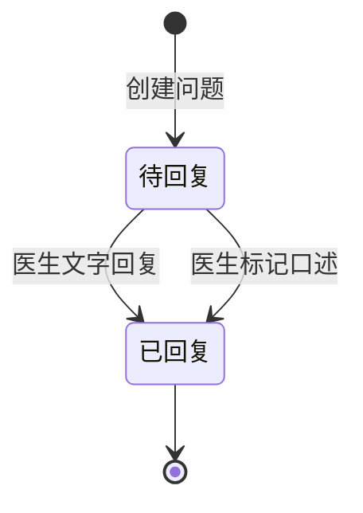

# API 接口文档

## 概述

本文档定义了在线医疗咨询平台（qa-live-healthcare）的API接口规范。当前系统采用前端静态数据模拟后端服务，所有数据操作通过前端Store管理。本文档定义了未来后端实现时应遵循的RESTful API规范。

### 技术说明

- **当前实现**：前端静态JSON数据 + Vue响应式状态管理
- **目标实现**：RESTful API + 后端数据库
- **数据传输格式**：JSON
- **认证方式**：Token-based Authentication

---

## 基础信息

### 基础URL

```
开发环境: http://localhost:5173/api
生产环境: https://api.qalive-healthcare.com/api
```

### 通用请求头

```http
Content-Type: application/json
Authorization: Bearer {token}
Accept-Language: zh-CN
```

### 通用响应格式

```json
{
  "code": 200,
  "message": "success",
  "data": { }
}
```

### 错误响应格式

```json
{
  "code": 400,
  "message": "错误信息",
  "errors": []
}
```

### HTTP 状态码

| 状态码 | 说明 |
|--------|------|
| 200 | 请求成功 |
| 201 | 资源创建成功 |
| 400 | 请求参数错误 |
| 401 | 未认证/认证失败 |
| 403 | 无权限访问 |
| 404 | 资源不存在 |
| 500 | 服务器内部错误 |

---

## 认证接口

### 1. 医生登录

**接口**: `POST /auth/doctor/login`

**描述**: 医生用户登录系统

**请求参数**:

```json
{
  "username": "string",
  "password": "string"
}
```

**请求示例**:

```json
{
  "username": "dr-zhang-wei",
  "password": "123456"
}
```

**成功响应** (200):

```json
{
  "code": 200,
  "message": "登录成功",
  "data": {
    "token": "eyJhbGciOiJIUzI1NiIsInR5cCI6IkpXVCJ9...",
    "doctor": {
      "id": "doc001",
      "username": "dr-zhang-wei",
      "name": "张伟医生",
      "title": "主任医师",
      "department": "心内科",
      "avatar": "https://...",
      "experience": "15年临床经验",
      "specialties": ["高血压", "冠心病", "心律失常"],
      "isActive": true
    }
  }
}
```

**失败响应** (401):

```json
{
  "code": 401,
  "message": "用户名或密码错误",
  "errors": []
}
```

---

### 2. 患者身份验证

**接口**: `POST /auth/patient/verify`

**描述**: 验证患者身份（首次自动注册）

**请求参数**:

```json
{
  "name": "string",
  "birthday": "YYYY-MM-DD"
}
```

**请求示例**:

```json
{
  "name": "赵明",
  "birthday": "1985-03-15"
}
```

**成功响应** (200):

```json
{
  "code": 200,
  "message": "验证成功",
  "data": {
    "patient": {
      "id": "patient001",
      "name": "赵明",
      "birthday": "1985-03-15",
      "phone": "138****1234",
      "gender": "男"
    },
    "isNewUser": false
  }
}
```

---

### 3. 医生退出登录

**接口**: `POST /auth/doctor/logout`

**描述**: 医生退出登录，清除Token

**请求头**:

```http
Authorization: Bearer {token}
```

**成功响应** (200):

```json
{
  "code": 200,
  "message": "退出成功",
  "data": null
}
```

---

## 医生接口

### 3. 获取医生列表

**接口**: `GET /doctors`

**描述**: 获取所有医生列表

**查询参数**:

| 参数 | 类型 | 必填 | 说明 |
|------|------|------|------|
| department | string | 否 | 按科室筛选 |
| online | boolean | 否 | 按在线状态筛选 |

**请求示例**:

```
GET /doctors?department=心内科&online=true
```

**成功响应** (200):

```json
{
  "code": 200,
  "message": "success",
  "data": {
    "doctors": [
      {
        "id": "doc001",
        "username": "dr-zhang-wei",
        "name": "张伟医生",
        "title": "主任医师",
        "department": "心内科",
        "avatar": "https://...",
        "experience": "15年临床经验",
        "specialties": ["高血压", "冠心病", "心律失常"],
        "isActive": true
      }
    ],
    "total": 5
  }
}
```

---

### 4. 获取单个医生信息

**接口**: `GET /doctors/{username}`

**描述**: 根据用户名获取医生详细信息

**路径参数**:

| 参数 | 类型 | 说明 |
|------|------|------|
| username | string | 医生用户名 |

**请求示例**:

```
GET /doctors/dr-zhang-wei
```

**成功响应** (200):

```json
{
  "code": 200,
  "message": "success",
  "data": {
    "id": "doc001",
    "username": "dr-zhang-wei",
    "name": "张伟医生",
    "title": "主任医师",
    "department": "心内科",
    "avatar": "https://...",
    "experience": "15年临床经验",
    "specialties": ["高血压", "冠心病", "心律失常"],
    "isActive": true
  }
}
```

**失败响应** (404):

```json
{
  "code": 404,
  "message": "医生不存在",
  "errors": []
}
```

---

### 5. 获取在线医生列表

**接口**: `GET /doctors/online`

**描述**: 获取所有在线可咨询的医生

**成功响应** (200):

```json
{
  "code": 200,
  "message": "success",
  "data": {
    "doctors": [
      {
        "id": "doc001",
        "username": "dr-zhang-wei",
        "name": "张伟医生",
        "title": "主任医师",
        "department": "心内科",
        "avatar": "https://...",
        "specialties": ["高血压", "冠心病"],
        "isActive": true
      }
    ],
    "total": 4
  }
}
```

---

### 6. 更新医生在线状态

**接口**: `PUT /doctors/{id}/status`

**描述**: 医生更新自己的在线状态

**请求头**:

```http
Authorization: Bearer {token}
```

**请求参数**:

```json
{
  "isActive": true
}
```

**成功响应** (200):

```json
{
  "code": 200,
  "message": "状态更新成功",
  "data": {
    "isActive": true
  }
}
```

---

## 咨询问题接口

### 7. 提交咨询问题

**接口**: `POST /questions`

**描述**: 患者提交新的咨询问题

**请求头**:

```http
Authorization: Bearer {patient_token}
```

**请求参数**:

```json
{
  "doctorId": "string",
  "question": "string"
}
```

**请求示例**:

```json
{
  "doctorId": "doc001",
  "question": "最近总是感觉胸闷气短，这是什么原因？"
}
```

**成功响应** (201):

```json
{
  "code": 201,
  "message": "问题提交成功",
  "data": {
    "id": "q001",
    "patientId": "patient001",
    "patientName": "赵明",
    "doctorId": "doc001",
    "doctorName": "张伟医生",
    "question": "最近总是感觉胸闷气短，这是什么原因？",
    "submitTime": "2025-11-02T09:30:00Z",
    "status": "pending",
    "answer": null,
    "answerTime": null
  }
}
```

**失败响应** (400):

```json
{
  "code": 400,
  "message": "问题描述不能为空",
  "errors": [
    {
      "field": "question",
      "message": "问题描述至少10个字符"
    }
  ]
}
```

---

### 8. 获取患者的问题列表

**接口**: `GET /patients/{patientId}/questions`

**描述**: 获取指定患者的所有咨询问题

**路径参数**:

| 参数 | 类型 | 说明 |
|------|------|------|
| patientId | string | 患者ID |

**查询参数**:

| 参数 | 类型 | 必填 | 说明 |
|------|------|------|------|
| status | string | 否 | 状态筛选（pending/answered） |

**请求示例**:

```
GET /patients/patient001/questions?status=pending
```

**成功响应** (200):

```json
{
  "code": 200,
  "message": "success",
  "data": {
    "questions": [
      {
        "id": "q001",
        "patientId": "patient001",
        "patientName": "赵明",
        "doctorId": "doc001",
        "doctorName": "张伟医生",
        "question": "最近总是感觉胸闷气短...",
        "submitTime": "2025-11-02T09:30:00Z",
        "status": "pending",
        "answer": null,
        "answerTime": null
      }
    ],
    "total": 2
  }
}
```

---

### 9. 获取医生的问题列表

**接口**: `GET /doctors/{doctorId}/questions`

**描述**: 获取指定医生的所有咨询问题

**路径参数**:

| 参数 | 类型 | 说明 |
|------|------|------|
| doctorId | string | 医生ID |

**查询参数**:

| 参数 | 类型 | 必填 | 说明 |
|------|------|------|------|
| status | string | 否 | 状态筛选（pending/answered） |
| page | number | 否 | 页码（默认1） |
| pageSize | number | 否 | 每页数量（默认10） |

**请求示例**:

```
GET /doctors/doc001/questions?status=pending&page=1&pageSize=10
```

**成功响应** (200):

```json
{
  "code": 200,
  "message": "success",
  "data": {
    "questions": [
      {
        "id": "q002",
        "patientId": "patient002",
        "patientName": "孙丽",
        "doctorId": "doc001",
        "doctorName": "张伟医生",
        "question": "孩子5岁，最近总是咳嗽...",
        "submitTime": "2025-11-02T10:15:00Z",
        "status": "pending",
        "answer": null,
        "answerTime": null
      }
    ],
    "total": 3,
    "page": 1,
    "pageSize": 10
  }
}
```

---

### 10. 获取单个问题详情

**接口**: `GET /questions/{id}`

**描述**: 获取指定问题的详细信息

**路径参数**:

| 参数 | 类型 | 说明 |
|------|------|------|
| id | string | 问题ID |

**成功响应** (200):

```json
{
  "code": 200,
  "message": "success",
  "data": {
    "id": "q001",
    "patientId": "patient001",
    "patientName": "赵明",
    "doctorId": "doc001",
    "doctorName": "张伟医生",
    "question": "最近总是感觉胸闷气短，这是什么原因？",
    "submitTime": "2025-11-02T09:30:00Z",
    "status": "answered",
    "answer": "根据您的描述，可能是心脏功能问题。",
    "answerTime": "2025-11-02T09:45:00Z"
  }
}
```

---

### 11. 医生回复问题

**接口**: `POST /questions/{id}/answer`

**描述**: 医生回复患者的问题

**请求头**:

```http
Authorization: Bearer {doctor_token}
```

**路径参数**:

| 参数 | 类型 | 说明 |
|------|------|------|
| id | string | 问题ID |

**请求参数**:

```json
{
  "answer": "string"
}
```

**请求示例**:

```json
{
  "answer": "根据您的描述，可能是心脏功能问题。建议您做个心电图检查。"
}
```

**成功响应** (200):

```json
{
  "code": 200,
  "message": "回复成功",
  "data": {
    "id": "q001",
    "status": "answered",
    "answer": "根据您的描述，可能是心脏功能问题。建议您做个心电图检查。",
    "answerTime": "2025-11-02T09:45:00Z"
  }
}
```

**失败响应** (403):

```json
{
  "code": 403,
  "message": "无权回复此问题",
  "errors": []
}
```

---

### 12. 标记问题为已解答

**接口**: `PUT /questions/{id}/status`

**描述**: 医生标记问题为已解答（口头回复）

**请求头**:

```http
Authorization: Bearer {doctor_token}
```

**路径参数**:

| 参数 | 类型 | 说明 |
|------|------|------|
| id | string | 问题ID |

**请求参数**:

```json
{
  "status": "answered"
}
```

**成功响应** (200):

```json
{
  "code": 200,
  "message": "状态更新成功",
  "data": {
    "id": "q001",
    "status": "answered",
    "answer": "已口述解答",
    "answerTime": "2025-11-02T09:50:00Z"
  }
}
```

---

## 统计接口

### 13. 获取统计数据

**接口**: `GET /statistics`

**描述**: 获取平台的统计数据

**成功响应** (200):

```json
{
  "code": 200,
  "message": "success",
  "data": {
    "totalDoctors": 5,
    "totalQuestions": 7,
    "activeSessions": 4,
    "totalSessions": 4
  }
}
```

---

## Store 方法映射

当前前端Store方法与未来API的映射关系：

| Store方法 | 对应API | 说明 |
|-----------|---------|------|
| `loginDoctor()` | `POST /auth/doctor/login` | 医生登录 |
| `logoutDoctor()` | `POST /auth/doctor/logout` | 医生退出 |
| `verifyPatient()` | `POST /auth/patient/verify` | 患者验证 |
| `getDoctorByUsername()` | `GET /doctors/{username}` | 获取医生信息 |
| `getActiveDoctors()` | `GET /doctors/online` | 获取在线医生 |
| `getQuestionsByDoctor()` | `GET /doctors/{id}/questions` | 医生问题列表 |
| `getQuestionsByPatient()` | `GET /patients/{id}/questions` | 患者问题列表 |
| `addQuestion()` | `POST /questions` | 提交问题 |
| `answerQuestion()` | `POST /questions/{id}/answer` | 回复问题 |
| `markQuestionAsAnswered()` | `PUT /questions/{id}/status` | 标记已解答 |
| `getStatistics()` | `GET /statistics` | 获取统计 |

---

## 业务规则

### 咨询状态流转



### 问题提交规则

1. 患者必须先完成身份验证
2. 问题描述至少10个字符，最多500个字符
3. 一个问题只能指定一个医生
4. 问题提交后状态为 `pending`

### 回复规则

1. 只有指定医生可以回复问题
2. 回复后问题状态变为 `answered`
3. 回复后 `answerTime` 被记录

---

## 示例请求（cURL）

### 医生登录

```bash
curl -X POST http://localhost:5173/api/auth/doctor/login \
  -H "Content-Type: application/json" \
  -d '{"username": "dr-zhang-wei", "password": "123456"}'
```

### 提交问题

```bash
curl -X POST http://localhost:5173/api/questions \
  -H "Content-Type: application/json" \
  -H "Authorization: Bearer {patient_token}" \
  -d '{"doctorId": "doc001", "question": "最近总是感觉胸闷气短，这是什么原因？"}'
```

### 医生回复问题

```bash
curl -X POST http://localhost:5173/api/questions/q001/answer \
  -H "Content-Type: application/json" \
  -H "Authorization: Bearer {doctor_token}" \
  -d '{"answer": "根据您的描述，可能是心脏功能问题。"}'
```

---

## 扩展接口（未来）

| 接口 | 方法 | 说明 | 优先级 |
|------|------|------|--------|
| `/patients` | POST | 注册患者账号 | 高 |
| `/patients/{id}` | GET | 获取患者详情 | 中 |
| `/doctors/{id}` | PUT | 更新医生信息 | 中 |
| `/questions/{id}` | DELETE | 删除问题 | 低 |
| `/messages` | POST | 发送即时消息 | 高 |
| `/appointments` | GET/POST | 预约管理 | 中 |

---

**生成时间**: 2026-04-21  
**工具集**: Context Builder (ID: context-builder)  
**语言**: 简体中文 (zh-CN)
