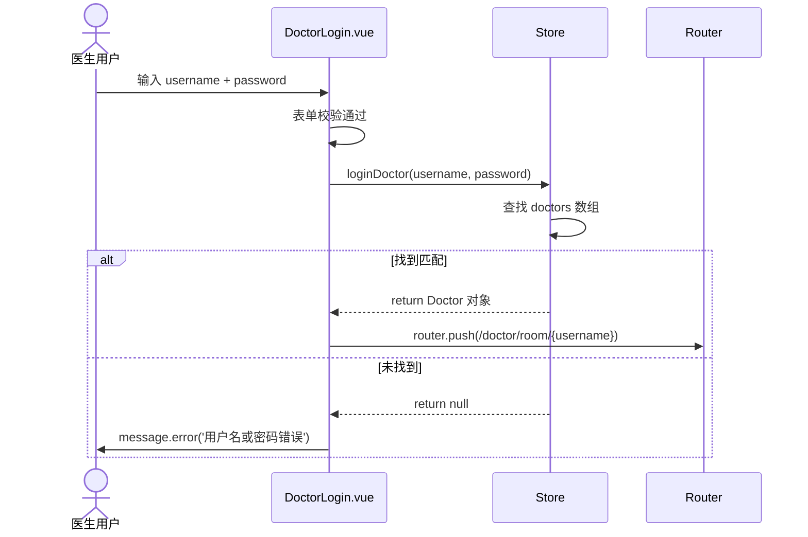
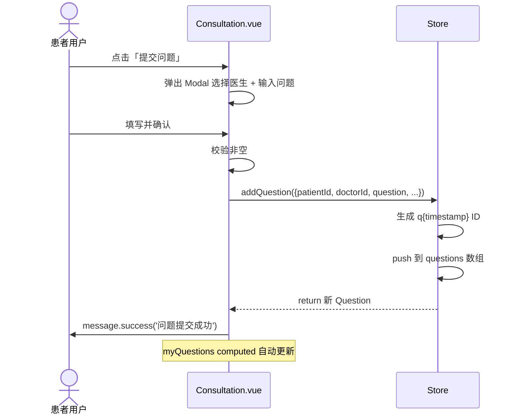
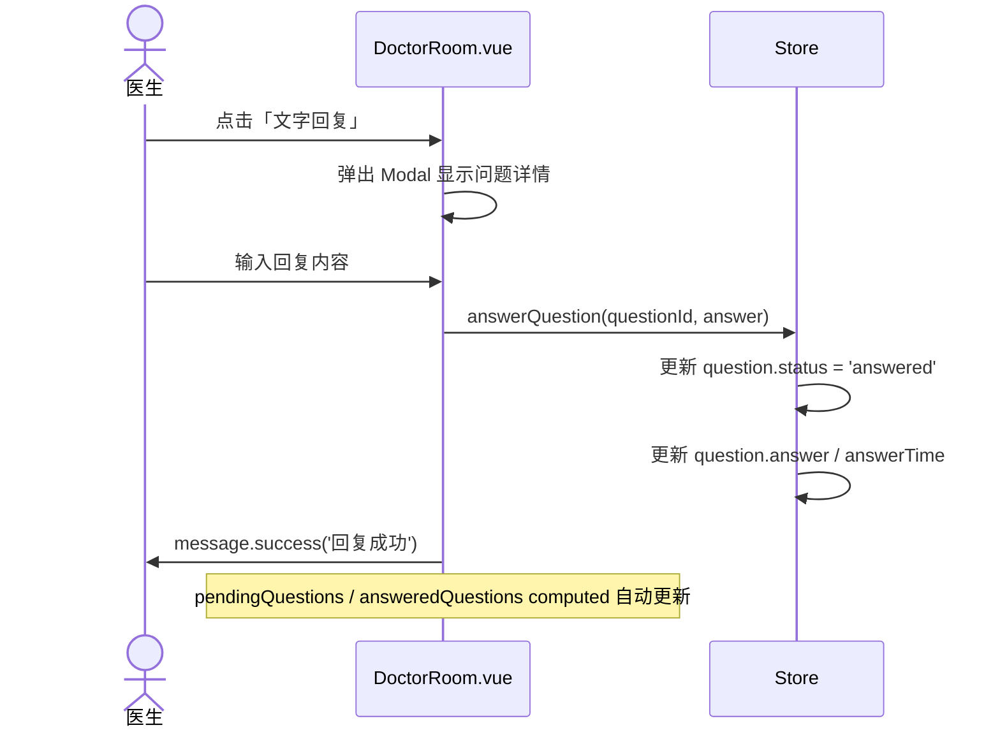

# API 接口文档

> **生成时间**: 2026-04-29
> **项目**: qa-live-healthcare（在线问诊平台）
> **架构**: 纯前端应用，数据通过 Store 层管理（模拟 RESTful API 模式）

---

## 目录

1. [API 概览](#1-api-概览)
2. [数据源说明](#2-数据源说明)
3. [Store 方法 API 参考](#3-store-方法-api-参考)
4. [路由端点映射](#4-路由端点映射)
5. [数据流时序图](#5-数据流时序图)
6. [请求/响应示例](#6-请求响应示例)
7. [错误处理规范](#7-错误处理规范)

---

## 1. API 概览

本项目为**纯前端 SPA 应用**，无后端服务器交互。所有数据操作通过 **Store 层** (`src/store/index.ts`) 实现，采用**内存中的响应式状态管理**模式。

### 架构特点

```
┌─────────────────────────────────────────────┐
│              浏览器 (Client)                 │
│                                              │
│  ┌───────────┐    ┌───────────┐             │
│  │  Views     │───▶│   Store    │             │
│  │  (.vue)    │◀──▶│  (API层)   │             │
│  └───────────┘    └─────▲─────┘              │
│                          │                    │
│                   ┌──────┴──────┐            │
│                   │  JSON 数据   │           │
│                   │  (静态文件)  │            │
│                   └─────────────┘            │
└─────────────────────────────────────────────┘
```

| 特征 | 说明 |
|------|------|
| **通信协议** | 内存调用（同步） |
| **数据持久化** | 无（刷新页面后重置） |
| **认证方式** | 内存状态（currentDoctor / currentPatient） |
| **异步模拟** | setTimeout(500ms) 模拟网络延迟 |

---

## 2. 数据源说明

### 静态 JSON 数据文件

| 文件 | 路径 | 用途 | 记录数 |
|------|------|------|--------|
| 医生列表 | `src/data/doctor-user-list.json` | 医生账号和基本信息 | 5 |
| 患者列表 | `src/data/patient-user.json` | 预置患者数据 | 5 |
| 问题列表 | `src/data/question-list.json` | 预置问诊问题 | 7 |

### 数据加载方式

```typescript
// store/index.ts - 启动时一次性导入
import doctorData from '../data/doctor-user-list.json';
import patientData from '../data/patient-user.json';
import questionData from '../data/question-list.json';

const state = reactive<State>({
  doctors: doctorData as Doctor[],
  patients: patientData as Patient[],
  questions: questionData as Question[],
});
```

> **注意**: 所有 JSON 数据在应用启动时一次性加载到内存中。运行期间的新增数据（如新患者、新问题）仅存在于内存状态中。

---

## 3. Store 方法 API 参考

Store 对象暴露了 **12 个公开方法**，按功能域分类如下：

### 3.1 认证模块 (Auth)

#### `loginDoctor` — 医生登录

```typescript
store.loginDoctor(username: string, password: string): Doctor | null
```

| 参数 | 类型 | 必填 | 说明 |
|------|------|------|------|
| username | string | ✅ | 医生用户名 |
| password | string | ✅ | 密码（明文） |

**返回值**: 成功返回 Doctor 对象，失败返回 null

**逻辑**: 在 `state.doctors` 中查找匹配 `username` 和 `password` 的医生记录，命中则设置 `state.currentDoctor`

**调用位置**: `DoctorLogin.vue:81`

---

#### `logoutDoctor` — 医生登出

```typescript
store.logoutDoctor(): void
```

**效果**: 将 `state.currentDoctor` 设为 null

**调用位置**: `DoctorRoom.vue:168`

---

#### `verifyPatient` — 患者身份验证/注册

```typescript
store.verifyPatient(name: string, birthday: string): Patient
```

| 参数 | 类型 | 必填 | 说明 |
|------|------|------|------|
| name | string | ✅ | 患者姓名 |
| birthday | string | ✅ | 出生日期 (YYYY-MM-DD) |

**返回值**: 始终返回 Patient 对象（已存在或新建）

**逻辑**:
1. 在 `state.patients` 中查找 name + birthday 匹配的记录
2. 若找到 → 返回已有 Patient
3. 若未找到 → 创建新 Patient 并 push 到数组（ID 格式: `patient{timestamp}`）

**副作用**: 设置 `state.currentPatient`

**调用位置**: `Consultation.vue:234`

---

#### `logoutPatient` — 患者登出

```typescript
store.logoutPatient(): void
```

**效果**: 将 `state.currentPatient` 设为 null

**调用位置**: `Consultation.vue:244`

---

### 3.2 问题模块 (Questions)

#### `getQuestionsByDoctor` — 按医生查询问题

```typescript
store.getQuestionsByDoctor(doctorId: string): Question[]
```

| 参数 | 类型 | 必填 | 说明 |
|------|------|------|------|
| doctorId | string | ✅ | 医生 ID |

**返回值**: 该医生关联的 Question[] 数组

**调用位置**: `DoctorRoom.vue:139-141`, `DoctorRoom.vue:144-146`

---

#### `getQuestionsByPatient` — 按患者查询问题

```typescript
store.getQuestionsByPatient(patientId: string): Question[]
```

| 参数 | 类型 | 必填 | 说明 |
|------|------|------|------|
| patientId | string | ✅ | 患者 ID |

**返回值**: 该患者提交的 Question[] 数组

**调用位置**: `Consultation.vue:180-184`

---

#### `addQuestion` — 提交新问题

```typescript
store.addQuestion(
  question: Omit<Question, 'id' | 'submitTime' | 'status' | 'answer' | 'answerTime'>
): Question
```

| 参数字段 | 类型 | 必填 | 说明 |
|----------|------|------|------|
| patientId | string | ✅ | 提交者 ID |
| patientName | string | ✅ | 提交者姓名 |
| doctorId | string | ✅ | 目标医生 ID |
| doctorName | string | ✅ | 目标医生姓名 |
| question | string | ✅ | 问题内容 |

**返回值**: 完整的 Question 对象（含自动填充字段）

**自动填充规则**:
- `id`: `q{Date.now()}`
- `submitTime`: `new Date().toISOString()`
- `status`: `'pending'`
- `answer`: `null`
- `answerTime`: `null`

**调用位置**: `Consultation.vue:285-291`

---

#### `answerQuestion` — 医生文字回复

```typescript
store.answerQuestion(questionId: string, answer: string): void
```

| 参数 | 类型 | 必填 | 说明 |
|------|------|------|------|
| questionId | string | ✅ | 问题 ID |
| answer | string | ✅ | 回复内容 |

**效果**:
- `question.status` → `'answered'`
- `question.answer` → 回复文本
- `question.answerTime` → 当前 ISO 时间

**调用位置**: `DoctorRoom.vue:203`

---

#### `markQuestionAsAnswered` — 标记已解答（口述回复）

```typescript
store.markQuestionAsAnswered(questionId: string): void
```

| 参数 | 类型 | 必填 | 说明 |
|------|------|------|------|
| questionId | string | ✅ | 问题 ID |

**效果**: 与 `answerQuestion` 类似，但 answer 固定为 `'已口述解答'`

**调用位置**: `DoctorRoom.vue:212`

---

### 3.3 查询模块 (Queries)

#### `getDoctorByUsername` — 按用户名查医生

```typescript
store.getDoctorByUsername(username: string): Doctor | undefined
```

**调用位置**: `Consultation.vue:215`

---

#### `getActiveDoctors` — 获取在线医生列表

```typescript
store.getActiveDoctors(): Doctor[]
```

**返回值**: `doctors.filter(d => d.isActive === true)` 结果

**调用位置**: `Consultation.vue:209`, `Doctors.vue`（隐式使用 allDoctors）

---

#### `getStatistics` — 获取统计概要

```typescript
store.getStatistics(): {
  totalDoctors: number;      // 总医生数
  totalQuestions: number;    // 总问题数
  activeSessions: number;    // 待回答问题数
  totalSessions: number;     // 在线医生数
}
```

**计算逻辑**:
- `totalDoctors`: `state.doctors.length`
- `totalQuestions`: `state.questions.length`
- `activeSessions`: status === 'pending' 的问题数
- `totalSessions`: isActive === true 的医生数

---

## 4. 路由端点映射

| 路由路径 | 名称 | 组件 | 角色 | Store 调用 |
|----------|------|------|------|------------|
| `/` | Home | Home.vue | 公共 | 无 |
| `/consultation` | Consultation | Consultation.vue | 患者 | `verifyPatient`, `getActiveDoctors`, `addQuestion`, `getQuestionsByPatient` |
| `/consultation/:doctorUsername` | ConsultationRoom | Consultation.vue | 患者 | 同上 + `getDoctorByUsername` |
| `/doctors` | Doctors | Doctors.vue | 公共 | `state.doctors` (只读) |
| `/about` | About | About.vue | 公众 | 无 |
| `/doctor/login` | DoctorLogin | DoctorLogin.vue | 医生 | `loginDoctor` |
| `/doctor/room/:username` | DoctorRoom | DoctorRoom.vue | 医生 | `logoutDoctor`, `getQuestionsByDoctor`, `answerQuestion`, `markQuestionAsAnswered` |

### 路由与权限矩阵

```
                    医生    患者    访客
/consultation       ❌      ✅      ✅ (需先验证)
/consultation/:id   ❌      ✅      ✅ (需先验证)
/doctors            ✅      ✅      ✅
/about              ✅      ✅      ✅
/doctor/login       ✅      ❌      ⚠️ (可访问)
/doctor/room/:id    ✅(仅本人) ❌   🔒 (重定向至登录)
/                   ✅      ✅      ✅
```

---

## 5. 数据流时序图

### 5.1 医生登录流程



### 5.2 患者提问流程



### 5.3 医生回复流程



---

## 6. 请求/响应示例

### 6.1 登录示例

```typescript
// 请求 (模拟)
const result = store.loginDoctor('dr-zhang-wei', '123456');

// 成功响应
{
  id: "doc001",
  username: "dr-zhang-wei",
  password: "123456",
  name: "张伟",
  title: "主任医师",
  department: "内科",
  avatar: "...",
  experience: "25年临床经验",
  specialties: ["心血管", "糖尿病"],
  isActive: true
}

// 失败响应
null
```

### 6.2 患者验证示例

```typescript
// 请求 - 新患者注册
const patient = store.verifyPatient('李明', '1990-05-15');

// 响应 - 新建对象
{
  id: "patient1746123456789",
  name: "李明",
  birthday: "1990-05-15",
  phone: "",
  gender: ""
}

// 请求 - 已有患者登录
const existing = store.verifyPatient('王芳', '1985-03-22');

// 响应 - 已有对象
{
  id: "patient001",
  name: "王芳",
  birthday: "1985-03-22",
  phone: "138****5678",
  gender: "女"
}
```

### 6.3 提交问题示例

```typescript
// 请求
const newQ = store.addQuestion({
  patientId: "patient1746123456789",
  patientName: "李明",
  doctorId: "doc001",
  doctorName: "张伟",
  question: "最近经常头晕，需要做什么检查？"
});

// 响应
{
  id: "q1746123500000",
  patientId: "patient1746123456789",
  patientName: "李明",
  doctorId: "doc001",
  doctorName: "张伟",
  question: "最近经常头晕，需要做什么检查？",
  submitTime: "2026-04-29T07:30:00.000Z",
  status: "pending",
  answer: null,
  answerTime: null
}
```

### 6.4 回复问题示例

```typescript
// 请求
store.answerQuestion("q1746123500000", "建议做血压监测和头颅CT检查");

// 效果: 对应 question 对象被原地更新:
{
  id: "q1746123500000",
  // ... 其他字段不变 ...
  status: "answered",
  answer: "建议做血压监测和头颅CT检查",
  answerTime: "2026-04-29T07:35:30.000Z"
}
```

### 6.5 统计数据示例

```typescript
// 请求
const stats = store.getStatistics();

// 响应
{
  totalDoctors: 5,
  totalQuestions: 8,          // 7 条预置 + 1 条新增
  activeSessions: 3,          // pending 状态的问题数
  totalSessions: 4            // isActive=true 的医生数
}
```

---

## 7. 错误处理规范

### 7.1 错误码约定（概念性）

| 场景 | 处理方式 | 用户提示 |
|------|----------|----------|
| 登录凭据不匹配 | 返回 null | `"用户名或密码错误"` |
| 表单必填项为空 | 前端校验拦截 | Ant Design Form rules 内联错误 |
| 未选择医生就提交 | 前端判断拦截 | `"请选择医生"` |
| 未输入问题内容 | 前端 trim 判断 | `"请输入问题"` |
| 未输入回复内容 | 前端 trim 判断 | `"请输入回复内容"` |
| 医生未登录访问诊室 | onMounted 守卫 | 重定向到 `/doctor/login` + `"请先登录"` |
| 未选择生日 | 前端判断 | `"请选择生日"` |

### 7.2 异步模拟延迟

项目中所有涉及 Store 写操作的 UI 交互均使用 **500ms setTimeout** 模拟网络延迟：

| 操作 | 延迟 | 代码位置 |
|------|------|----------|
| 医生登录 | 500ms | `DoctorLogin.vue:80-91` |
| 患者提交问题 | 500ms | `Consultation.vue:280-298` |
| 医生回复问题 | 500ms | `DoctorRoom.vue:199-208` |

### 7.3 全局消息通知

所有用户反馈均通过 `message.success()` / `message.error()` 实现（Ant Design Vue Message 组件），不使用自定义 Toast 或 Alert 弹窗。

---

## 附录 A: TypeScript 接口定义

完整接口定义位于 `src/store/index.ts:6-38`：

```typescript
export interface Doctor {
  id: string;
  username: string;
  password: string;
  name: string;
  title: string;
  department: string;
  avatar: string;
  experience: string;
  specialties: string[];
  isActive: boolean;
}

export interface Patient {
  id: string;
  name: string;
  birthday: string;
  phone: string;
  gender: string;
}

export interface Question {
  id: string;
  patientId: string;
  patientName: string;
  doctorId: string;
  doctorName: string;
  question: string;
  submitTime: string;
  status: 'pending' | 'answered';
  answer: string | null;
  answerTime: string | null;
}
```

## 附录 B: 测试账号速查

| 角色 | 用户名 | 密码 | 姓名 |
|------|--------|------|------|
| 医生 | dr-zhang-wei | 123456 | 张伟 |
| 医生 | dr-li-na | 123456 | 李娜 |
| 医生 | dr-wang-jun | 123456 | 王军 |
| 医生 | dr-chen-fang | 123456 | 陈芳 |
| 医生 | zhao-qiang | 123456 | 赵强 |

> 患者无需预设账号，输入任意姓名+生日即可自动注册或登录。
