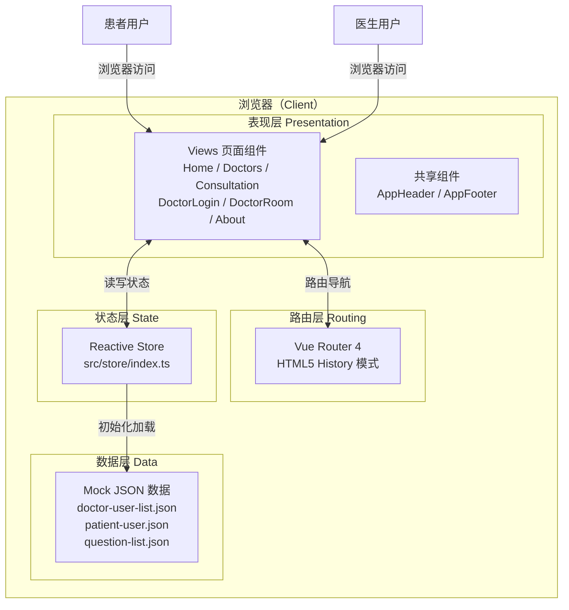
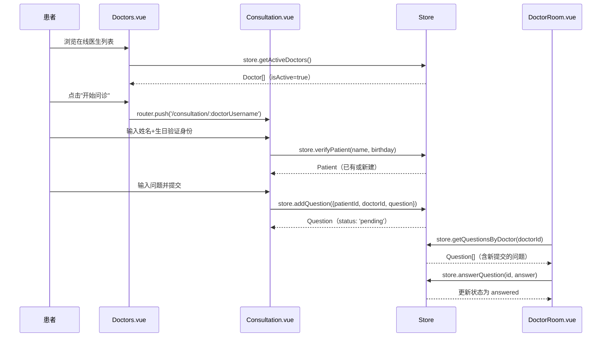
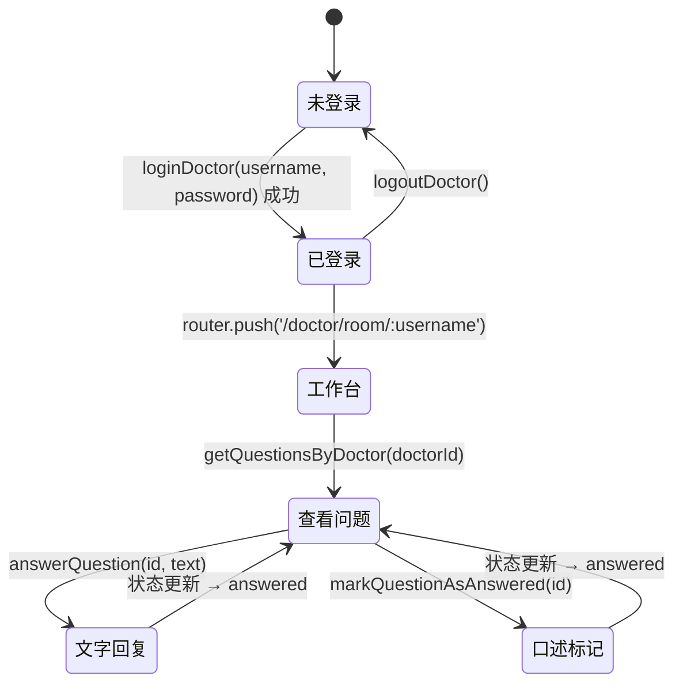
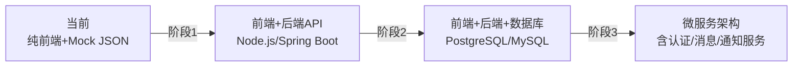

# 系统架构

> 本文档描述 **QA Live Healthcare**（在线问诊平台）的系统架构设计，供 AI 模型在功能开发、重构和技术决策时参考。

---

## 架构概览

本项目是**纯前端单页应用（SPA）**，无独立后端服务，所有业务逻辑在浏览器端运行。



---

## 分层架构

### 1. 表现层（Presentation Layer）

**职责**：用户界面渲染、用户交互处理、路由导航触发

```
src/views/        ← 页面级组件（与路由 1:1 对应）
src/components/   ← 跨页面共享的 UI 组件
```

页面组件清单：

| 组件 | 路由 | 用户角色 | 核心功能 |
|------|------|----------|----------|
| `Home.vue` | `/` | 所有用户 | 平台入口、统计展示、快速导航 |
| `Doctors.vue` | `/doctors` | 患者 | 在线医生列表、选择医生跳转 |
| `Consultation.vue` | `/consultation/:doctorUsername?` | 患者 | 身份验证、提交问诊、查看历史 |
| `DoctorLogin.vue` | `/doctor/login` | 医生 | 账号密码登录 |
| `DoctorRoom.vue` | `/doctor/room/:username` | 医生 | 查看问题列表、文字回复、标记解答 |
| `About.vue` | `/about` | 所有用户 | 平台介绍信息 |

### 2. 路由层（Routing Layer）

**职责**：URL 与组件的映射、页面跳转控制

```typescript
// src/router/index.ts
const routes = [
  { path: '/',                           name: 'Home',             component: Home },
  { path: '/consultation',               name: 'Consultation',     component: Consultation },
  { path: '/consultation/:doctorUsername', name: 'ConsultationRoom', component: Consultation },
  { path: '/doctors',                    name: 'Doctors',          component: Doctors },
  { path: '/about',                      name: 'About',            component: About },
  { path: '/doctor/login',               name: 'DoctorLogin',      component: DoctorLogin },
  { path: '/doctor/room/:username',      name: 'DoctorRoom',       component: DoctorRoom },
]
```

> **注意**：当前无路由守卫（Navigation Guards），医生工作台页面可直接通过 URL 访问，无强制认证跳转。

### 3. 状态层（State Layer）

**职责**：全局共享状态存储、业务逻辑处理

```typescript
// src/store/index.ts
const state = reactive<State>({
  doctors: [...],         // 全量医生数据
  patients: [...],        // 全量患者数据（含运行时新增）
  questions: [...],       // 全量问诊记录（含运行时新增）
  currentDoctor: null,    // 当前登录医生
  currentPatient: null,   // 当前认证患者
})
```

使用 Vue 3 `reactive()` 实现响应式，组件直接引用 `store.state.*` 即可获得响应式更新。

### 4. 数据层（Data Layer）

**职责**：提供初始化数据

```
src/data/
├── doctor-user-list.json   # 5 名医生（含登录凭据、专科信息）
├── patient-user.json       # 预置患者数据
└── question-list.json      # 7 条问诊记录（3 已答 / 4 待答）
```

> **无持久化**：数据仅存在于运行时内存，页面刷新后恢复初始状态。

---

## 数据流

### 患者问诊数据流



### 医生工作台数据流



---

## 组件通信模式

本项目采用**全局 Store 中心化通信**，无组件间 Props/Emit 的跨层传递：

```
页面组件 A                    页面组件 B
    │                              │
    ▼                              ▼
store.addQuestion()         store.getQuestionsByDoctor()
    │                              │
    └─────────► reactive State ◄──┘
                (单一数据源)
```

**组件内部**（父子关系）使用 Props / Emits：
- `AppHeader.vue`：接收路由状态，无自定义 Props
- `AppFooter.vue`：无 Props，纯展示

---

## 技术架构决策

### 为什么使用 `reactive` 而非 Pinia/Vuex？

| 方案 | 优势 | 本项目选择理由 |
|------|------|----------------|
| `reactive` Store | 零依赖，代码量少，学习成本低 | ✅ 项目规模小，无需复杂状态管理 |
| Pinia | DevTools 支持好，模块化，TypeScript 友好 | 可扩展选项，规模增大时迁移 |
| Vuex | 成熟生态，严格单向数据流 | ❌ Vue 3 项目不推荐，Pinia 已是官方推荐 |

### 为什么使用 Mock JSON 而非真实 API？

- 项目为演示/原型性质，快速开发验证业务流程
- 无需搭建后端服务，降低运行成本
- **改进路径**：将 `store/index.ts` 中的 CRUD 方法替换为 `fetch`/`axios` API 调用

---

## 架构改进路径（未来）

当项目需要从原型升级到生产时，建议的演进路径：



**阶段 1 关键改动：**
1. `store/index.ts` 的 Store 方法改为调用 REST API
2. 添加 JWT 认证（`Authorization: Bearer <token>`）
3. 添加路由守卫（登录检查、权限控制）
4. 引入 Pinia 替代 `reactive` Store（更好的 DevTools 和模块化）

**阶段 2 关键改动：**
1. 后端数据库替代 JSON 文件
2. 密码哈希（bcrypt）替代明文存储
3. 添加输入验证（Zod/Yup）
4. 错误边界和统一错误处理

---

## 安全架构说明（当前状态）

| 安全关注点 | 当前状态 | 风险 |
|-----------|----------|------|
| 密码存储 | 明文存储在 JSON 文件 | ⚠️ 高（仅适用于演示） |
| 患者认证 | 姓名+生日，无真实验证 | ⚠️ 高（演示用途） |
| 路由保护 | 无路由守卫 | ⚠️ 中（直接 URL 可访问任何页面） |
| 数据传输 | 无网络传输（纯前端） | ✅ 无风险 |
| XSS 防护 | Vue 模板自动转义 | ✅ 默认安全 |

---

*本文档随系统架构变化而更新，使用 `/asdm-context-update` 命令保持同步。*
