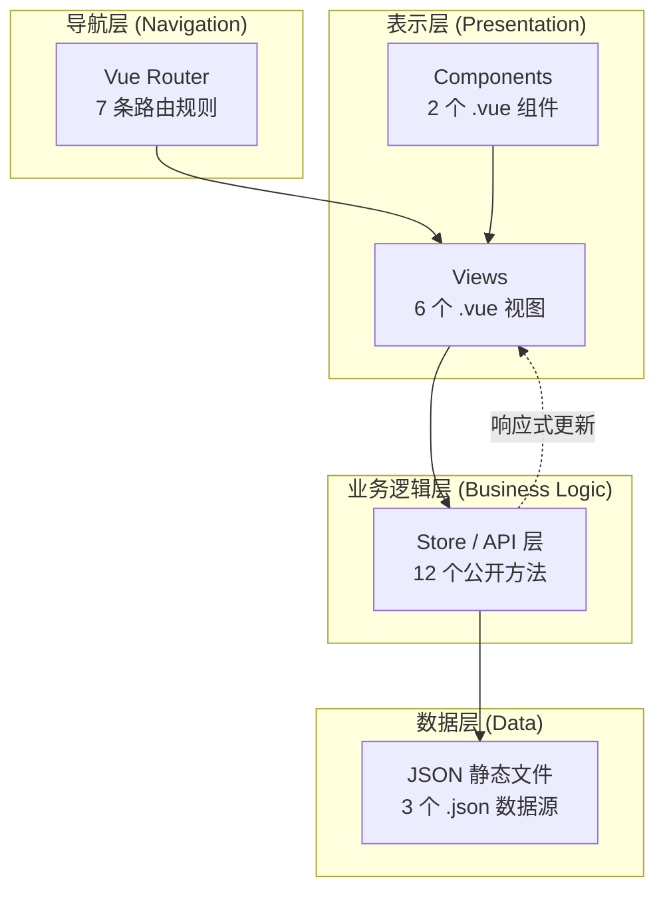
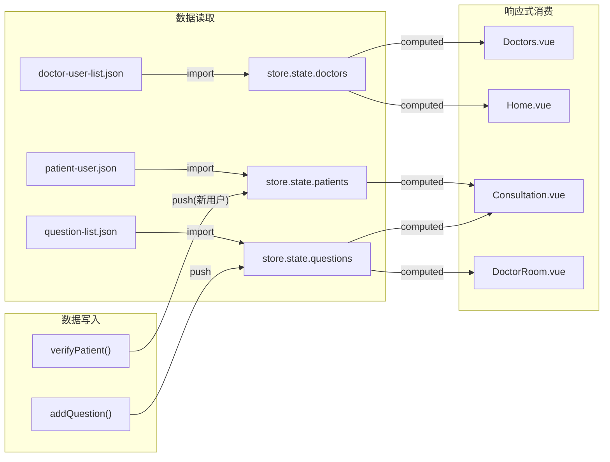
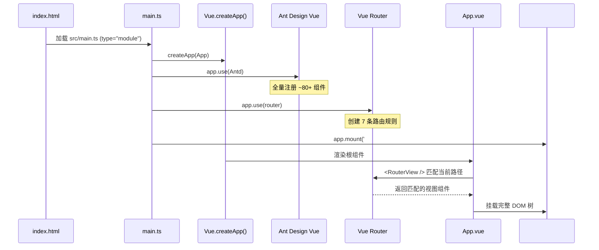
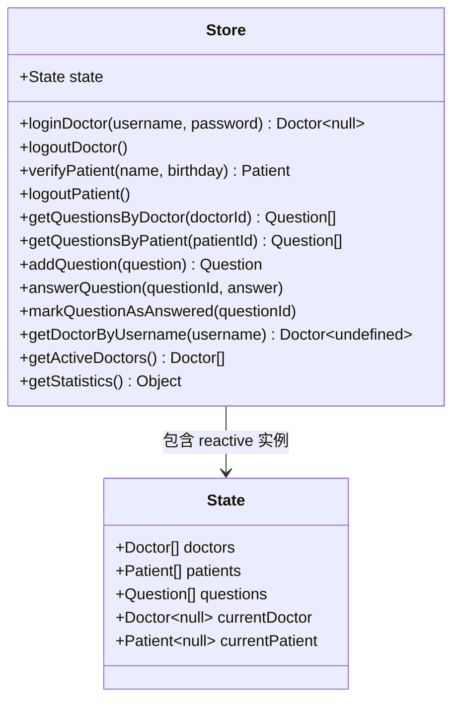

# 系统架构文档

> **生成时间**: 2026-04-29
> **项目**: qa-live-healthcare（QA Live Healthcare 在线问诊平台）
> **类型**: 单页应用 (SPA) · 纯前端 · 无后端

---

## 目录

1. [系统概述](#1-系统概述)
2. [技术栈总览](#2-技术栈总览)
3. [分层架构图](#3-分层架构图)
4. [应用启动流程](#4-应用启动流程)
5. [组件层级结构](#5-组件层级结构)
6. [状态管理架构](#6-状态管理架构)
7. [路由架构](#7-路由架构)
8. [构建工具链](#8-构建工具链)
9. [设计决策与权衡](#9-设计决策与权衡)
10. [扩展建议](#10-扩展建议)

---

## 1. 系统概述

### 1.1 项目定位

**QA Live Healthcare** 是一个面向 QA 测试场景的在线医疗问诊模拟平台。项目以 **纯前端 SPA 架构** 构建，使用内存中的响应式状态管理模拟后端 API 行为，适用于：

- 前端 UI/UX 测试验证
- 组件集成测试
- 用户交互流程演练
- 前端技术栈演示

### 1.2 核心功能模块

| 模块 | 说明 | 入口 |
|------|------|------|
| 首页展示 | Hero 区 + 统计数据 + 开放诊室 | `/` |
| 医生团队 | 全部医生列表卡片 | `/doctors` |
| 在线问诊 | 患者身份验证 → 提交问题 → 查看回复 | `/consultation[/:doctorUsername]` |
| 医生诊室 | 登录 → 查看待回答问题 → 文字/口述回复 | `/doctor/login` → `/doctor/room/:username` |
| 关于页面 | 平台介绍 | `/about` |

### 1.3 用户角色

```
┌──────────────┐         ┌──────────────┐
│   访客       │         │   患者       │
│              │         │              │
│ • 浏览首页   │  ──▶    │ • 身份验证   │
│ • 查看医生   │  自动注册│ • 提交问题   │
│ • 阅读关于   │         │ • 查看回复   │
└──────────────┘         └──────────────┘

┌──────────────┐
│   医生       │
│              │
│ • 账号登录   │
│ • 回复问题   │
│ • 管理诊室   │
└──────────────┘
```

---

## 2. 技术栈总览

### 2.1 核心依赖

| 类别 | 技术 | 版本 | 用途 |
|------|------|------|------|
| **框架** | Vue.js | ^3.5.10 | 响应式前端框架，Composition API (`<script setup>`) |
| **UI 库** | Ant Design Vue | ^4.2.6 | 企业级 UI 组件库（全量注册） |
| **路由** | Vue Router | ^4.6.3 | SPA 路由管理，HTML5 History 模式 |
| **语言** | TypeScript | ^5.5.3 | 类型安全的 JavaScript 超集（严格模式） |
| **构建** | Vite | ^5.4.8 | 下一代前端构建工具（ESM 原生） |
| **日期处理** | Day.js | ^1.11.19 | 轻量级日期格式化库 |

### 2.2 开发依赖

| 类别 | 技术 | 版本 | 用途 |
|------|------|------|------|
| **Vite 插件** | @vitejs/plugin-vue | ^5.1.4 | Vite 对 Vue SFC 的编译支持 |
| **类型检查** | vue-tsc | ^2.1.6 | Vue SFC 的 TypeScript 类型检查 |

### 2.3 依赖关系图

```
                    ┌─────────────┐
                    │   App.vue   │
                    └──────┬──────┘
                           │
              ┌────────────┼────────────┐
              ▼            ▼            ▼
     ┌────────────┐ ┌──────────┐ ┌───────────┐
     │ Vue Router │ │Ant Design│ │  Day.js   │
     └────────────┘ └──────────┘ └───────────┘
              │            │
              ▼            ▼
     ┌────────────────────────────┐
     │        Vue 3 Core          │
     │  (reactive, computed, ref) │
     └─────────────┬──────────────┘
                   │
                   ▼
     ┌────────────────────────────┐
     │      TypeScript 5.5        │
     │    (strict mode, ES2020)   │
     └────────────────────────────┘
                   │
                   ▼
     ┌────────────────────────────┐
     │         Vite 5.4           │
     │  (@vitejs/plugin-vue)      │
     └────────────────────────────┘
```

---

## 3. 分层架构图

### 3.1 整体分层

本项目采用经典的 **四层架构**，所有层均运行在浏览器端：



### 3.2 各层职责说明

| 层级 | 组成 | 职责 | 文件数 |
|------|------|------|--------|
| **表示层** | `src/views/*.vue`, `src/components/*.vue` | UI 渲染、用户交互、表单处理、事件绑定 | 8 |
| **导航层** | `src/router/index.ts` | URL 路由映射、参数传递、编程式导航 | 1 |
| **业务逻辑层** | `src/store/index.ts` | 数据 CRUD 操作、认证逻辑、查询计算、状态变更 | 1 |
| **数据层** | `src/data/*.json` | 静态数据存储（医生/患者/问题的预置数据） | 3 |

### 3.3 数据流向



---

## 4. 应用启动流程

### 4.1 初始化序列



### 4.2 启动时序详解

| 步骤 | 操作 | 代码位置 | 影响 |
|------|------|----------|------|
| 1 | HTML 加载入口脚本 | `index.html:12` | `<script type="module" src="/src/main.ts">` |
| 2 | 创建 Vue 应用实例 | `main.ts:8` | `createApp(App)` |
| 3 | 注册 Ant Design Vue | `main.ts:10` | 全局可用 `<a-*>` 组件 |
| 4 | 导入 Antd 重置样式 | `main.ts:3` | 统一浏览器默认样式 |
| 5 | 导入全局样式 | `main.ts:4` | `style.css`（CSS 变量等） |
| 6 | 注册路由器 | `main.ts:11` | 全局 `$router` / `$route` 可用 |
| 7 | 挂载到 DOM | `main.ts:12` | 应用渲染完成 |
| 8 | Store 模块初始化 | `store/index.ts:48-54` | 导入 JSON → 创建 reactive state |

---

## 5. 组件层级结构

### 5.1 组件树

```
App.vue (根组件 - Layout 容器)
├── AppHeader.vue (全局导航栏 - 固定定位)
│   ├── Logo + 品牌名
│   ├── Navigation Menu (4 个菜单项 + watch 路由高亮)
│   └── 医生登录按钮
├── <RouterView /> (动态内容区)
│   ├── Home.vue (首页)
│   │   ├── Hero Section (标语 + 特性 + CTA 按钮)
│   │   ├── Statistics Section (4 张统计卡)
│   │   └── Active Rooms Section (在线诊室网格)
│   ├── Consultation.vue (患者问诊)
│   │   ├── AuthSection (身份验证表单) [v-if 未登录]
│   │   └── PatientPortal [v-else 已登录]
│   │       ├── PortalHeader (欢迎语 + 切换用户)
│   │       ├── SelectedDoctorAlert (当前诊室提示)
│   │       ├── QuestionsSection (我的问题列表)
│   │       └── SubmitQuestionModal (提问弹窗)
│   ├── Consultation.vue (+ doctorUsername 参数)
│   │   └── 同上，但预选了目标医生
│   ├── Doctors.vue (医生团队)
│   │   └── DoctorCard Grid (N 张医生卡片)
│   ├── About.vue (关于我们)
│   ├── DoctorLogin.vue (医生登录)
│   │   └── Login Form (username + password)
│   └── DoctorRoom.vue (医生诊室)
│       ├── RoomHeader (医生信息 + 操作按钮)
│       ├── RoomUrl (诊室链接提示)
│       ├── PendingQuestions (待响应列表)
│       ├── AnswerModal (文字回复弹窗)
│       └── AnsweredQuestions (已解答折叠面板)
└── AppFooter.vue (全局页脚)
    ├── 品牌介绍
    ├── 快速链接
    ├── 联系方式
    └── 法律信息
```

### 5.2 组件分类矩阵

| 分类 | 组件 | 类型 | 复用性 |
|------|------|------|--------|
| **布局组件** | `App.vue`, `AppHeader.vue`, `AppFooter.vue` | Structural | 全局复用 |
| **公共视图** | `Home.vue`, `Doctors.vue`, `About.vue` | Page | 无需登录 |
| **患者功能** | `Consultation.vue` | Page | 双模式（有/无参数） |
| **医生功能** | `DoctorLogin.vue`, `DoctorRoom.vue` | Page | 需要认证 |

### 5.3 Props / Events 流向

本项目中**组件间无 Props 传递**，所有跨组件通信通过 **Store** 实现。唯一的父子组件交互是各视图内部的局部状态（如 Modal 开关、Form 数据）。

```
┌─────────────────────────────────────────────────┐
│                  Store (Singleton)                │
│                                                   │
│  state.doctors ← ─ ─ ─ ─ ─ ─ Doctors.vue (只读)  │
│  state.doctors ← ─ ─ ─ ─ ─ ─ Home.vue (只读)     │
│  state.patients ← ─ → Consultation.vue (读写)    │
│  state.questions ← → DoctorRoom.vue (读写)        │
│  state.questions ← → Consultation.vue (写+读)    │
│  currentDoctor ← ─ → DoctorLogin/Room.vue         │
│  currentPatient ← ─ → Consultation.vue           │
└─────────────────────────────────────────────────┘
```

---

## 6. 状态管理架构

### 6.1 Store 设计模式

采用 **轻量级 Singleton Store 模式**（非 Vuex/Pinia），核心特点：



### 6.2 响应式机制

```
┌──────────────────────────────────────────────────┐
│                  Vue Reactivity System             │
│                                                    │
│  const state = reactive({State})                  │
│                                                    │
│  ┌────────────────────────────────────────────┐   │
│  │  Proxy-based Deep Reactive                 │   │
│  │                                            │   │
│  │  state.doctors.push(newDoc)                │   │
│  │    → trigger → 所有依赖 doctors 的 computed │   │
│  │                                            │   │
│  │  state.questions[i].status = 'answered'    │   │
│  │    → trigger → 所有依赖该 question 的 computed│  │
│  └────────────────────────────────────────────┘   │
│                                                    │
│  组件中通过 computed() 创建派生状态：               │
│  ┌────────────────────────────────────────────┐   │
│  │  const myQuestions = computed(() =>         │   │
│  │    store.getQuestionsByPatient(patient.id)  │   │
│  │  )                                          │   │
│  │  // 当 questions 数组变化时自动重新计算        │   │
│  └────────────────────────────────────────────┘   │
└──────────────────────────────────────────────────┘
```

### 6.3 状态生命周期

```
创建                    使用                        销毁
  │                       │                           │
  ▼                       ▼                           ▼
┌─────────┐  import   ┌─────────┐  mutation   ┌─────────┐
│ JSON    │ ────────▶ │ reactive │ ─────────▶ │  内存    │
│ 文件    │           │  State   │             │  (刷新丢失)│
└─────────┘           └─────────┘             └─────────┘
  (磁盘)               (内存)                   (GC)
```

> **重要**: 所有运行期间的数据变更（新增患者、新提交的问题）**不会持久化**，页面刷新后恢复为 JSON 文件的初始状态。

---

## 7. 路由架构

### 7.1 路由配置详情

| # | 路径 | 名称 | 组件 | 参数 | 认证要求 |
|---|------|------|------|------|----------|
| 1 | `/` | Home | Home.vue | 无 | 公开 |
| 2 | `/consultation` | Consultation | Consultation.vue | 无 | 需患者验证（组件内） |
| 3 | `/consultation/:doctorUsername` | ConsultationRoom | Consultation.vue | `doctorUsername` | 需患者验证（组件内） |
| 4 | `/doctors` | Doctors | Doctors.vue | 无 | 公开 |
| 5 | `/about` | About | About.vue | 无 | 公开 |
| 6 | `/doctor/login` | DoctorLogin | DoctorLogin.vue | 无 | 公开（仅医生用） |
| 7 | `/doctor/room/:username` | DoctorRoom | DoctorRoom.vue | `username` | 需医生登录（onMounted 守卫） |

### 7.2 路由守卫策略

项目**未使用 Vue Router 的全局/路由级导航守卫**，而是采用**组件内守卫**模式：

| 路由 | 守卫方式 | 代码位置 | 行为 |
|------|----------|----------|------|
| `/doctor/room/:username` | onMounted 检查 | `DoctorRoom.vue:155-160` | 未登录则 `router.push('/doctor/login')` |
| `/consultation*` | v-if/v-else 渲染 | `Consultation.vue:4,52` | 未验证显示表单，已验证显示面板 |

### 7.3 路径设计决策

| 决策 | 说明 | 原因 |
|------|------|------|
| History 模式 | `createWebHistory()` | 更干净的 URL（无需 `#/`） |
| 医生用户名作为路径参数 | `/consultation/:doctorUsername` | 语义清晰，便于分享诊室链接 |
| 医生房间独立路径前缀 | `/doctor/room/:username` | 明确区分医生和患者空间 |
| 无嵌套路由 | 所有路由平铺 | 项目规模小，无需复杂嵌套 |

---

## 8. 构建工具链

### 8.1 构建流程

```
源码 (Source)              编译 (Compile)              输出 (Output)
                           
*.vue ──┐                                        
        ├─▶ @vitejs/plugin-vue ──▶ *.js         
*.ts  ──┤                      │                  
        ├─▶ esbuild (TS→JS)   ──▶ bundle.js     
*.json ─┤                      │                  ┌─▶ dist/
*.css ──┘                      └─▶ Rollup 打包 ──▶├─▶ assets/
                               (生产环境)         └─▶ index.html
```

### 8.2 NPM Scripts

| 命令 | 说明 | 用途 |
|------|------|------|
| `npm run dev` | 启动开发服务器 | Vite Dev Server (HMR) |
| `npm run build` | 生产构建 | `vue-tsc -b && vite build`（先类型检查再打包） |
| `npm run preview` | 预览构建结果 | 本地静态服务器预览 dist 目录 |

### 8.3 TypeScript 配置要点

**tsconfig.app.json** 关键选项：

| 选项 | 值 | 影响 |
|------|-----|------|
| `target` | ES2020 | 支持可选链 `?.`, 空值合并 `??` 等 |
| `module` | ESM (ESNext) | 使用原生 import/export |
| `strict` | true | 启用全部严格类型检查 |
| `noUnusedLocals` | true | 未使用的局部变量报错 |
| `noUnusedParameters` | true | 未使用的函数参数报错 |
| `noFallthroughCasesInSwitch` | true | switch 缺少 break 报错 |
| `moduleResolution` | bundler | 兼容 Vite/Rollup 的模块解析 |
| `jsx` | preserve | Vue SFC 的 JSX 保持原样交给 Vue 编译 |

### 8.4 Vite 配置

当前配置为**极简模式**，仅注册 Vue 插件：

```typescript
// vite.config.ts
export default defineConfig({
  plugins: [vue()],
});
```

未配置项（使用默认值）：端口 `5173`、HTTPS 关闭、代理无、别名无。

---

## 9. 设计决策与权衡

### 9.1 架构决策记录 (ADR)

#### ADR-001: 选择轻量级 Store 而非 Pinia/Vuex

| 维度 | 分析 |
|------|------|
| **背景** | 项目需要集中式状态管理，但规模较小 |
| **决策** | 使用单例 reactive 对象 + 手动方法定义 |
| **理由** | ① 仅 3 个实体、12 个方法，Pinia 过重 ② 无需 devtools 集成 ③ 无需插件生态 ④ 减少依赖体积 |
| **权衡** | ❌ 不支持时间旅行调试 ❌ 不支持模块热重载状态 ✅ 代码简单直观 ✅ 零额外依赖 |
| **可逆性** | 高 — 迁移至 Pinia 只需将 store 拆为 defineStore |

#### ADR-002: JSON 文件作为数据源而非 REST API

| 维度 | 分析 |
|------|------|
| **背景** | 项目是 QA 演示平台，需要可控的测试数据 |
| **决策** | 使用本地 JSON 文件导入为初始状态 |
| **理由** | ① 无需搭建后端服务 ② 数据确定性强 ③ 首屏加载快 ④ 简化部署 |
| **权衡** | ❌ 数据不持久化 ❌ 无并发控制 ✅ 部署简单（纯静态）✅ 离线可用 |

#### ADR-003: 全量引入 Ant Design Vue

| 维度 | 分析 |
|------|------|
| **背景** | 项目大量使用 Ant Design 组件 |
| **决策** | `app.use(Antd)` 全量注册 |
| **理由** | ① 项目使用了 15+ 种组件 ② 演示项目对包体积不敏感 ③ 避免逐个 import 的繁琐 |
| **权衡** | ❌ 打包体积较大（约 ~2MB gzipped 前更大） ✅ 开发体验好 ✅ 不会有遗漏引用 |

#### ADR-004: 组件内认证守卫而非路由守卫

| 维度 | 分析 |
|------|------|
| **背景** | 医生诊室需要登录保护，问诊页面需要患者验证 |
| **决策** | 各组件内部通过 onMounted / v-if 控制访问 |
| **理由** | ① 不同角色的"认证"语义不同（医生=登录，患者=自动注册） ② UI 反馈更自然（同页面切换而非跳转） ③ 代码分散在各视图，职责清晰 |
| **权衡** | ❌ 认证逻辑分散 ❌ 无法统一拦截 | ✅ 每个页面可以定制认证 UX |

### 9.2 已知限制

| # | 限制 | 影响 | 建议 |
|---|------|------|------|
| 1 | **无数据持久化** | 刷新页面丢失所有新数据 | 后续可接入 localStorage 或后端 API |
| 2 | **明文密码存储** | JSON 中密码为明文 | 仅限测试环境，生产环境必须加密 |
| 3 | **无请求取消** | 快速操作可能导致竞态条件 | 当前延迟固定500ms，实际影响低 |
| 4 | **无错误边界** | 组件崩溃会导致白屏 | 可添加 Vue ErrorBoundary |
| 5 | **无单元测试** | 无自动化测试覆盖 | 建议添加 Vitest + Vue Test Utils |

---

## 10. 扩展建议

### 10.1 短期优化（不影响架构）

| 优先级 | 改进项 | 工作量 | 说明 |
|--------|--------|--------|------|
| P0 | 添加 ESLint + Prettier | 小 | 统一代码风格 |
| P0 | 添加 `.env` 管理 | 小 | 分离环境变量 |
| P1 | 路径别名 `@/` | 小 | `vite.config.ts` 配置 resolve.alias |
| P1 | localStorage 持久化 | 中 | 使用 `watch` + `localStorage.sync` |
| P2 | Vitest 单元测试 | 中 | 覆盖 Store 方法核心逻辑 |

### 10.2 中期演进（架构增强）

| 方向 | 方案 | 说明 |
|------|------|------|
| **状态管理迁移** | 迁移至 Pinia | 支持 devtools、模块拆分、TypeScript 推断更好 |
| **按需引入 Antd** | `unplugin-vue-components` | 自动按需导入，减小 bundle 约 60% |
| **API 层抽象** | 封装 `api/` 目录 | 将 Store 方法改为调用 api 函数，便于后续对接真实后端 |
| **请求库接入** | 引入 axios | 统一错误处理、拦截器、请求取消 |

### 10.3 长期愿景（功能扩展）

| 功能 | 涉及改动 | 说明 |
|------|----------|------|
| **真实后端对接** | 新增 `src/api/` + 环境变量 | 替换 JSON 导入为 HTTP 请求 |
| **用户认证** | JWT Token + 拦截器 | 替换当前的内存登录态 |
| **实时消息** | WebSocket / SSE | 医生回复即时推送给患者 |
| **国际化 (i18n)** | vue-i18n | 多语言支持 |
| **暗色模式** | CSS 变量 + Antd ConfigProvider | 主题切换能力 |

---

## 附录 A: 文件依赖关系全图

```
index.html
  └── src/main.ts
        ├── vue (npm)
        ├── ant-design-vue (npm)
        ├── vue-router (npm)
        ├── ./style.css
        ├── ./App.vue
        │     ├── vue-router (RouterView)
        │     ├── ./components/AppHeader.vue
        │     │     ├── vue-router (useRouter, useRoute)
        │     │     └── @ant-design/icons-vue (5 icons)
        │     └── ./components/AppFooter.vue
        └── ./router/index.ts
              ├── ../views/Home.vue
              │     ├── ../store (store, getStatistics, getActiveDoctors)
              │     └── @ant-design/icons-vue (5 icons)
              ├── ../views/Consultation.vue
              │     ├── dayjs (npm)
              │     ├── ../store (store, Doctor interface)
              │     └── @ant-design/icons-vue (3 icons)
              ├── ../views/Doctors.vue
              │     ├── ../store (store, Doctor interface)
              │     └── vue-router (useRouter)
              ├── ../views/About.vue
              ├── ../views/DoctorLogin.vue
              │     ├── ../store (store)
              │     └── @ant-design/icons-vue (2 icons)
              └── ../views/DoctorRoom.vue
                    ├── dayjs (npm)
                    ├── ../store (store, Question interface)
                    └── @ant-design/icons-vue (6 icons)

src/store/index.ts
  ├── ../data/doctor-user-list.json
  ├── ../data/patient-user.json
  └── ../data/question-list.json
```

## 附录 B: Bundle 大小估算（生产构建）

| 来源 | 估算大小 (gzipped) | 说明 |
|------|---------------------|------|
| Vue 3 Runtime | ~44 KB | 核心 + Compiler |
| Ant Design Vue (全量) | ~200 KB | ~80+ 组件 |
| Vue Router | ~10 KB | 路由引擎 |
| Day.js | ~7 KB | 日期库 |
| 业务代码 | ~5 KB | Store + Views + Components |
| **合计** | **~266 KB** | 首屏 JS 总量 |

> 注意：如启用按需引入 Antd + Tree-shaking，预计可降至 ~80-100 KB。
