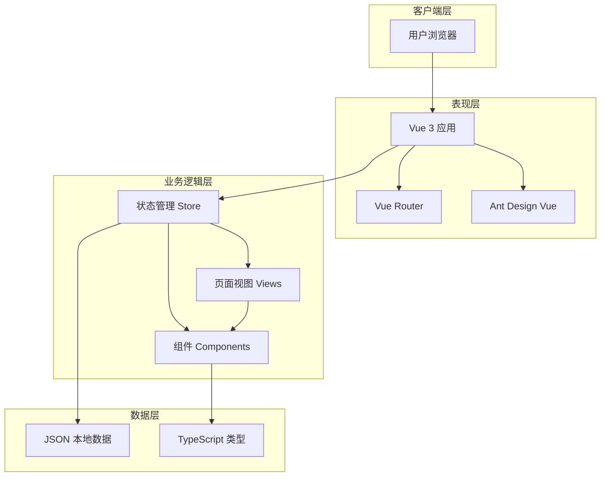
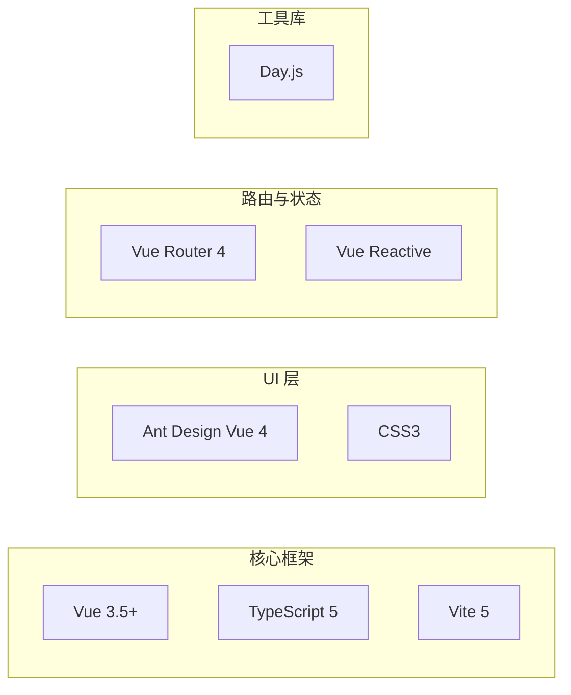
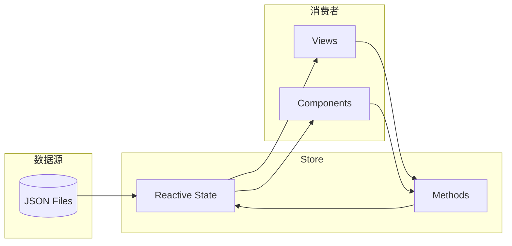
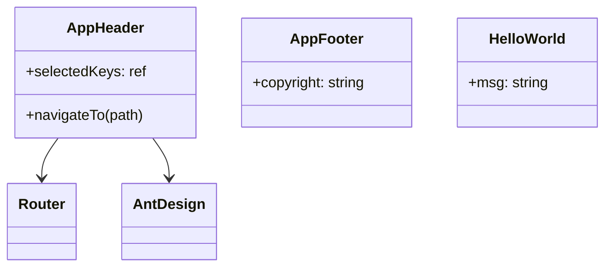
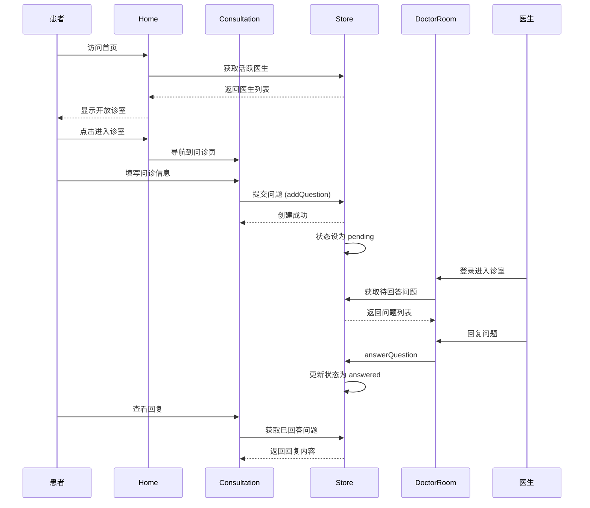
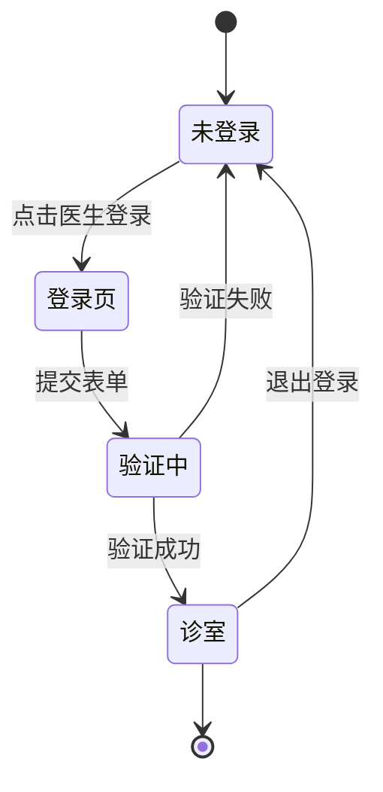
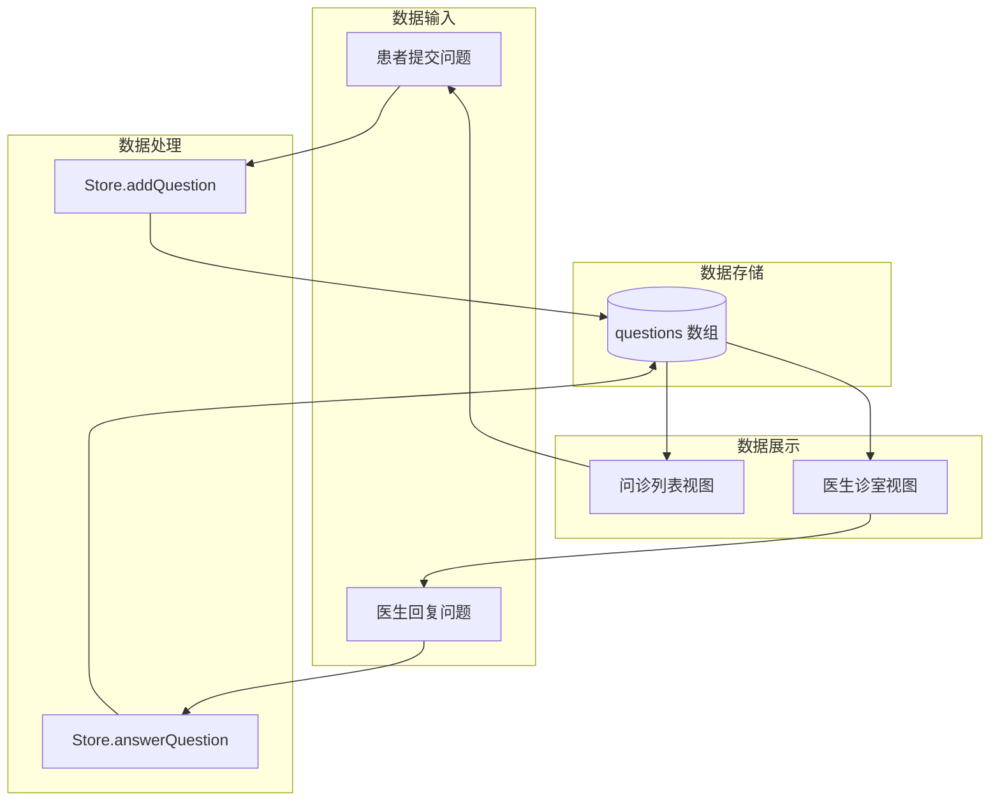
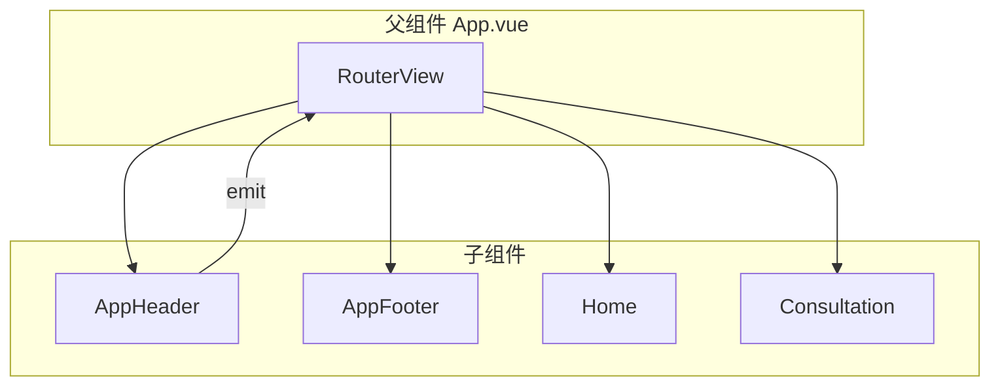

# 系统架构文档

## 概述

本文档描述了 QA Live Healthcare 在线医疗问诊平台的系统架构、设计决策和技术方案。作为一个基于 Vue 3 + TypeScript 的前端单页应用（SPA），平台采用现代化的组件化架构，为医患双方提供便捷的在线问诊服务。

## 系统概览

### 项目类型
- **前端应用**：Vue 3 单页应用（SPA）
- **技术栈**：Vue 3 + TypeScript + Vite + Ant Design Vue
- **架构模式**：组件化架构 + 状态管理模式

### 核心功能
- 医生展示与搜索
- 在线问诊咨询
- 医患沟通平台
- 医生诊室管理

## 架构分层



## 技术架构

### 前端技术栈



### 依赖关系

| 依赖包 | 版本 | 用途 |
|--------|------|------|
| `vue` | ^3.5.10 | 核心框架 |
| `vue-router` | ^4.6.3 | 路由管理 |
| `ant-design-vue` | ^4.2.6 | UI 组件库 |
| `dayjs` | ^1.11.19 | 日期处理 |
| `typescript` | ^5.5.3 | 类型检查 |
| `vite` | ^5.4.8 | 构建工具 |

## 项目架构

### 目录结构

```
src/
├── assets/              # 静态资源
├── components/          # 公共组件
│   ├── AppHeader.vue    # 顶部导航
│   ├── AppFooter.vue    # 底部信息
│   └── HelloWorld.vue   # 示例组件
├── data/                # 模拟数据
│   ├── doctor-user-list.json
│   ├── patient-user.json
│   └── question-list.json
├── router/              # 路由配置
│   └── index.ts
├── store/               # 状态管理
│   └── index.ts
├── views/               # 页面组件
│   ├── Home.vue         # 首页
│   ├── Consultation.vue # 问诊页
│   ├── DoctorLogin.vue  # 医生登录
│   ├── DoctorRoom.vue  # 医生诊室
│   ├── Doctors.vue      # 医生列表
│   └── About.vue        # 关于页
├── App.vue              # 根组件
├── main.ts              # 入口文件
└── style.css           # 全局样式
```

## 核心模块设计

### 1. 路由模块 (Router)

**文件位置**: `src/router/index.ts`

```typescript
import { createRouter, createWebHistory, RouteRecordRaw } from 'vue-router';
import Home from '../views/Home.vue';
import Consultation from '../views/Consultation.vue';

const routes: RouteRecordRaw[] = [
  { path: '/', name: 'Home', component: Home },
  { path: '/consultation', name: 'Consultation', component: Consultation },
  { path: '/consultation/:doctorUsername', name: 'ConsultationRoom', component: Consultation },
  { path: '/doctors', name: 'Doctors', component: Doctors },
  { path: '/doctor/login', name: 'DoctorLogin', component: DoctorLogin },
  { path: '/doctor/room/:username', name: 'DoctorRoom', component: DoctorRoom },
];

const router = createRouter({
  history: createWebHistory(),
  routes,
});
```

**路由架构图**：

```mermaid
graph TD
    subgraph "公开路由"
        HOME[/]
        CONSULTATION[/consultation]
        DOCTORS[/doctors]
        ABOUT[/about]
    end
    
    subgraph "认证路由"
        DOCTOR_LOGIN[/doctor/login]
        DOCTOR_ROOM[/doctor/room/:username]
    end
    
    HOME --> HOME_VUE[Home.vue]
    CONSULTATION --> CONSULTATION_VUE[Consultation.vue]
    DOCTORS --> DOCTORS_VUE[Doctors.vue]
    DOCTOR_LOGIN --> LOGIN_VUE[DoctorLogin.vue]
    DOCTOR_ROOM --> ROOM_VUE[DoctorRoom.vue]
```

### 2. 状态管理模块 (Store)

**文件位置**: `src/store/index.ts`

```typescript
import { reactive } from 'vue';
import doctorData from '../data/doctor-user-list.json';
import patientData from '../data/patient-user.json';
import questionData from '../data/question-list.json';

interface State {
  doctors: Doctor[];
  patients: Patient[];
  questions: Question[];
  currentDoctor: Doctor | null;
  currentPatient: Patient | null;
}

const state = reactive<State>({
  doctors: doctorData as Doctor[],
  patients: patientData as Patient[],
  questions: questionData as Question[],
  currentDoctor: null,
  currentPatient: null,
});

export const store = {
  state,
  loginDoctor(username: string, password: string): Doctor | null { ... },
  verifyPatient(name: string, birthday: string): Patient { ... },
  addQuestion(question: Omit<Question, 'id' | 'submitTime' | 'status' | 'answer' | 'answerTime'>): Question { ... },
  answerQuestion(questionId: string, answer: string) { ... },
  getActiveDoctors(): Doctor[] { ... },
  getStatistics() { ... },
};
```

**Store 数据流**：



### 3. 页面组件 (Views)

| 页面 | 路由 | 职责 | 主要组件 |
|------|------|------|----------|
| Home | `/` | 首页展示 | Hero、统计卡片、开放诊室列表 |
| Consultation | `/consultation` | 问诊列表 | 问诊卡片、问诊表单 |
| Doctors | `/doctors` | 医生列表 | 医生卡片、筛选器 |
| DoctorLogin | `/doctor/login` | 医生登录 | 登录表单 |
| DoctorRoom | `/doctor/room/:username` | 医生诊室 | 问题列表、回复表单 |
| About | `/about` | 关于页面 | 静态内容 |

### 4. 公共组件 (Components)



## 页面流程架构

### 医患问诊流程



### 医生登录流程



## 数据流架构

### 问诊数据流



### 医生数据流

```mermaid
flowchart LR
    subgraph "医生数据"
        A[(doctor-user-list.json)]
    end
    
    subgraph "Store"
        B[doctors: Doctor[]]
        C[currentDoctor: Doctor | null]
    end
    
    subgraph "功能模块"
        D[Home: 显示活跃医生]
        E[Doctors: 显示所有医生]
        F[DoctorRoom: 诊室信息]
    end
    
    A -->|加载| B
    B -->|computed| D
    B -->|computed| E
    C -->|登入| F
```

## 组件通信架构

### 父子组件通信



### Props 传递模式

```vue
<!-- 父组件 -->
<template>
  <DoctorCard :doctor="doctor" @select="handleSelect" />
</template>

<!-- 子组件 DoctorCard -->
<script setup lang="ts">
interface Props {
  doctor: Doctor;
}
const props = defineProps<Props>();
const emit = defineEmits<{
  (e: 'select', doctor: Doctor): void;
}>();
</script>
```

## 未来架构演进

### 当前架构（演示阶段）

```
┌─────────────────────────────────┐
│         Vue 3 SPA              │
│  ┌─────────────────────────────┐│
│  │   Components + Views       ││
│  │   + Reactive Store         ││
│  │   + JSON Mock Data         ││
│  └─────────────────────────────┘│
└─────────────────────────────────┘
```

### 目标架构（生产阶段）

```
┌─────────────────────────────────┐
│         Vue 3 SPA              │
│  ┌─────────────────────────────┐│
│  │   Components + Views        ││
│  │   + Reactive Store          ││
│  └─────────────────────────────┘│
│              │                  │
│              ▼                  │
│  ┌─────────────────────────────────┐
│  │         REST API               │
│  │  ┌─────────┐  ┌─────────────┐  │
│  │  │ 医生服务 │  │  问诊服务    │  │
│  │  └─────────┘  └─────────────┘  │
│  └─────────────────────────────────┘
│              │                  │
│              ▼                  │
│  ┌─────────────────────────────────┐
│  │       PostgreSQL / MongoDB      │
│  └─────────────────────────────────┘
└─────────────────────────────────┘
```

### 架构升级路径

| 阶段 | 目标 | 关键变更 |
|------|------|----------|
| 1 | 演示版 | 当前状态，纯前端 + JSON 数据 |
| 2 | API 集成 | 接入 REST API 后端服务 |
| 3 | 用户认证 | JWT 认证，支持患者登录 |
| 4 | 实时通信 | WebSocket 支持实时问诊 |
| 5 | 数据持久化 | 接入数据库，替代 JSON |

## 设计原则

### 1. 组件化原则
- 每个组件职责单一
- 组件高度可复用
- 使用 `<script setup>` 组合式 API

### 2. 状态管理原则
- 集中式状态管理（Store）
- 响应式数据更新
- 类型安全（TypeScript）

### 3. 路由设计原则
- 清晰的 URL 结构
- 动态路由参数支持
- 懒加载优化性能

### 4. 代码质量原则
- 严格 TypeScript 类型定义
- 统一的编码风格
- 组件样式 scoped 隔离

## 相关文档

- [项目结构](./standard-project-structure.md)
- [编码规范](./standard-coding-style.md)
- [数据模型](./data-models.md)
- [API 文档](./api.md)

---

*本文档由 ASDM Context Builder 自动生成。架构变更时请更新本文档并使用 `/asdm-context-update` 同步更新。*
