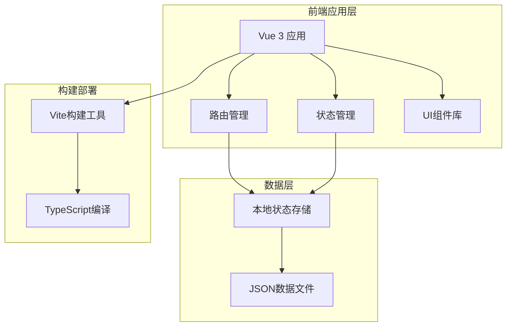
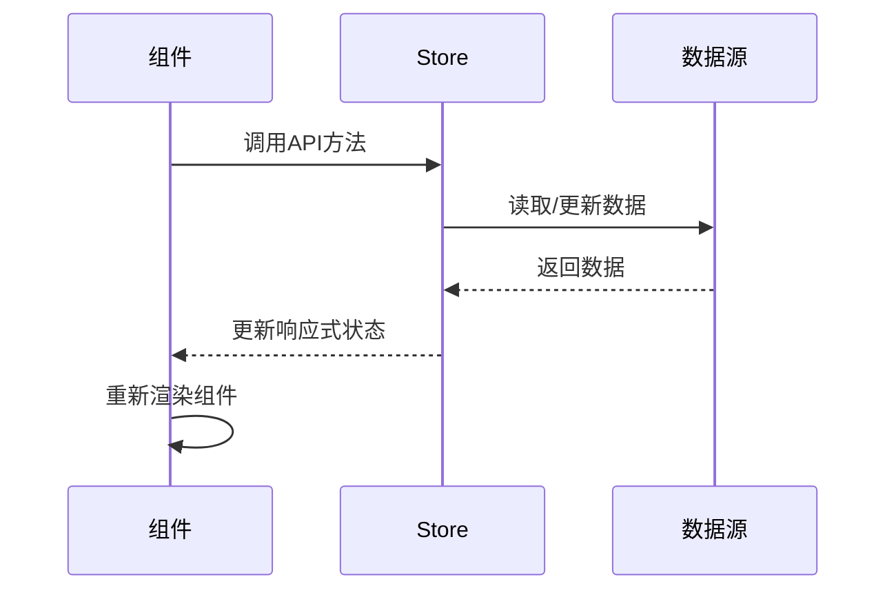
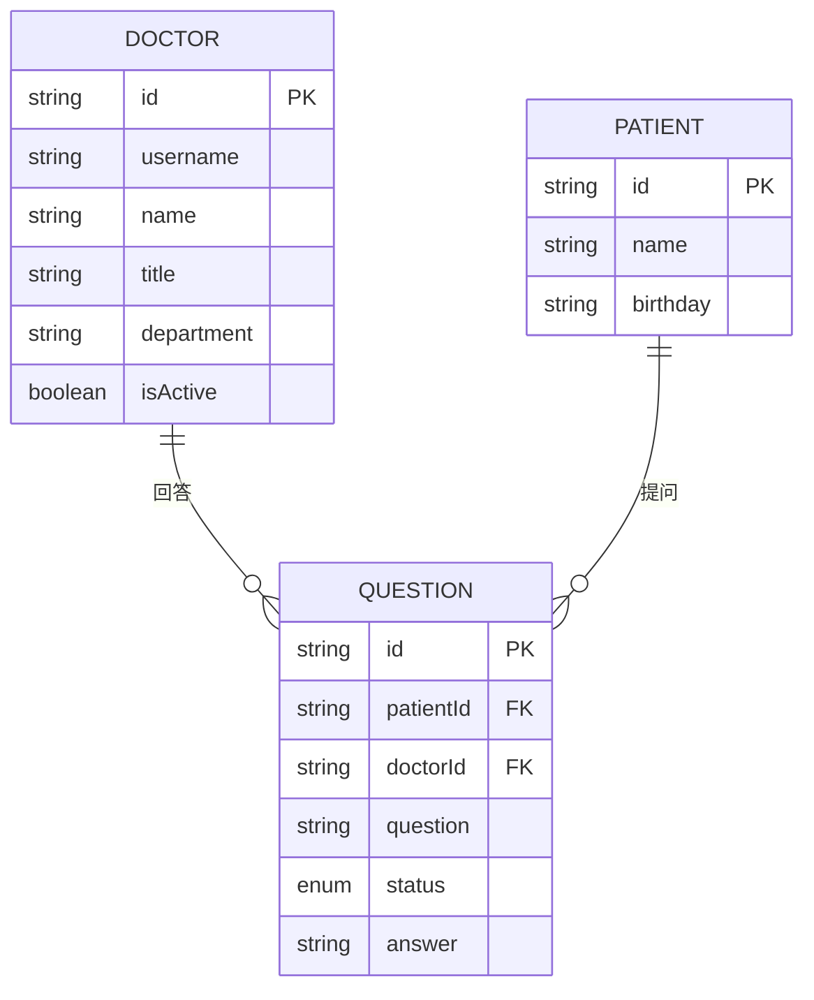

# 系统架构文档

## 概述

本文档详细描述了 qa-live-healthcare（在线医疗问诊平台）的整体系统架构设计，包括技术选型、架构模式、组件设计和数据流管理。项目采用现代化的前端技术栈，构建了一个完整的单页应用(SPA)。

## 架构概览

### 系统架构图



### 技术栈组成

| 层级 | 技术 | 版本 | 作用 |
|------|------|------|------|
| **框架层** | Vue 3 | 3.5.10 | 核心应用框架 |
| **语言层** | TypeScript | 5.5.3 | 类型安全开发 |
| **构建层** | Vite | 5.4.8 | 现代化构建工具 |
| **路由层** | Vue Router | 4.6.3 | 单页应用路由 |
| **UI层** | Ant Design Vue | 4.2.6 | 企业级UI组件 |
| **工具层** | Vue TSC | 2.1.6 | Vue类型检查 |

## 应用架构设计

### MVC架构模式

项目采用基于Vue 3的**组件化MVC架构**：

- **Model层**: Store状态管理 + JSON数据源
- **View层**: Vue组件模板 + Ant Design UI
- **Controller层**: Composition API + 业务逻辑

### 组件架构分层

```
应用架构层次
├── 应用层 (App Layer)
│   ├── App.vue - 根组件
│   ├── main.ts - 应用入口
│   └── router - 路由配置
├── 页面层 (Page Layer)
│   ├── Home.vue - 首页
│   ├── Consultation.vue - 问诊页面
│   ├── DoctorRoom.vue - 医生诊室
│   └── DoctorLogin.vue - 医生登录
├── 组件层 (Component Layer)
│   ├── AppHeader.vue - 应用头部
│   ├── AppFooter.vue - 应用底部
│   └── HelloWorld.vue - 示例组件
└── 数据层 (Data Layer)
    ├── store - 状态管理
    └── data - 静态数据
```

## 技术架构详解

### Vue 3 组合式API架构

#### 核心设计理念
- **函数式编程**: 使用组合式API替代Options API
- **逻辑复用**: 通过Composable函数实现业务逻辑复用
- **类型安全**: 完整的TypeScript集成
- **响应式系统**: 基于Proxy的现代响应式系统

#### 组件设计模式
```typescript
// 标准组件结构
<template>
  <!-- 视图层 -->
</template>

<script setup lang="ts">
// 控制器层
import { ref, reactive, computed, watch } from 'vue'
import { useRoute, useRouter } from 'vue-router'
import { store } from '../store'

// 响应式数据
const count = ref(0)
const formState = reactive({ username: '', password: '' })

// 计算属性
const doubleCount = computed(() => count.value * 2)

// 监听器
watch(() => route.path, (newPath) => {
  // 路由变化处理
})

// 业务方法
const handleSubmit = () => {
  // 业务逻辑
}
</script>

<style scoped>
/* 样式层 */
</style>
```

### 路由架构设计

#### 路由配置结构
```typescript
const routes: RouteRecordRaw[] = [
  {
    path: '/',
    name: 'Home',
    component: Home, // 首页组件
  },
  {
    path: '/consultation',
    name: 'Consultation',
    component: Consultation, // 问诊页面
  },
  {
    path: '/consultation/:doctorUsername',
    name: 'ConsultationRoom',
    component: Consultation, // 特定医生问诊
  },
  {
    path: '/doctor/room/:username',
    name: 'DoctorRoom',
    component: DoctorRoom, // 医生诊室
  }
]
```

#### 路由特性
- **历史模式**: 使用HTML5 History API
- **动态路由**: 支持参数化路由
- **懒加载**: 组件按需加载（当前为同步加载）
- **导航守卫**: 支持路由拦截和权限控制

### 状态管理架构

#### 自定义Store设计

项目采用**轻量级自定义Store**而非Pinia/Vuex：

```typescript
// 状态定义
interface State {
  doctors: Doctor[]
  patients: Patient[]
  questions: Question[]
  currentDoctor: Doctor | null
  currentPatient: Patient | null
}

// 响应式状态
const state = reactive<State>({
  doctors: [],
  patients: [],
  questions: [],
  currentDoctor: null,
  currentPatient: null,
})

// Store API
export const store = {
  state,
  loginDoctor(username: string, password: string): Doctor | null {
    // 登录逻辑
  },
  verifyPatient(name: string, birthday: string): Patient {
    // 患者验证
  }
  // ... 其他方法
}
```

#### 状态管理优势
- **简化架构**: 避免第三方状态库的复杂性
- **类型安全**: 完整的TypeScript支持
- **响应式**: 基于Vue 3的响应式系统
- **模块化**: 清晰的API接口设计

## 数据架构设计

### 数据流架构



### 数据模型设计

#### 核心实体关系


#### 数据持久化策略
- **前端存储**: 内存状态管理
- **数据源**: JSON文件模拟后端API
- **状态持久化**: 页面刷新后重置（可扩展为localStorage）

## 构建与部署架构

### Vite构建架构

#### 构建配置
```typescript
// vite.config.ts
export default defineConfig({
  plugins: [vue()], // Vue插件
  // 支持TypeScript、热重载、代码分割等
})
```

#### 构建流程
1. **开发阶段**: 热重载开发服务器
2. **构建阶段**: TypeScript编译 + 资源优化
3. **输出阶段**: 生成静态文件用于部署

### TypeScript配置

#### 严格类型检查
```json
{
  "compilerOptions": {
    "strict": true,
    "noUnusedLocals": true,
    "noUnusedParameters": true,
    "noFallthroughCasesInSwitch": true
  }
}
```

#### 模块解析
- **ES模块**: 使用现代ES模块系统
- **类型声明**: 完整的类型定义文件
- **路径解析**: 支持TypeScript路径映射

## 性能与优化架构

### 响应式优化

#### 计算属性缓存
```typescript
// 使用computed缓存计算结果
const pendingQuestions = computed(() => 
  store.getQuestionsByDoctor(doctorId).filter(q => q.status === 'pending')
)
```

#### 监听器优化
```typescript
// 精确监听必要的数据变化
watch(() => route.path, (newPath) => {
  // 只在路由变化时执行
}, { immediate: true })
```

### 组件优化

#### 条件渲染
```vue
<!-- 使用v-if避免不必要的渲染 -->
<div v-if="currentDoctor" class="room-container">
  <!-- 医生诊室内容 -->
</div>
```

#### 列表渲染优化
```vue
<!-- 使用key优化列表渲染 -->
<div v-for="question in pendingQuestions" :key="question.id">
  <!-- 问题项内容 -->
</div>
```

## 安全架构设计

### 前端安全措施

#### 输入验证
```typescript
// 表单验证规则
const rules = {
  username: [{ required: true, message: '请输入用户名' }],
  password: [{ required: true, message: '请输入密码' }],
}
```

#### XSS防护
- **模板转义**: Vue自动转义HTML内容
- **安全属性**: 使用v-bind绑定安全数据
- **内容过滤**: 避免直接插入用户输入

### 数据安全

#### 模拟数据安全
- **敏感信息**: 密码等敏感数据仅为演示用途
- **数据隔离**: 前端数据与真实业务数据隔离
- **权限控制**: 基于角色的访问控制

## 扩展性架构

### 模块化设计

#### 组件模块化
- **单一职责**: 每个组件专注特定功能
- **接口清晰**: 明确的props和emit接口
- **可复用性**: 通用组件设计为可复用

#### 业务模块化
- **功能分离**: 认证、问诊、管理模块分离
- **路由模块化**: 按功能划分路由结构
- **状态模块化**: 按业务域组织状态

### 技术扩展点

#### 后端集成
```typescript
// 当前前端API易于替换为HTTP调用
// store.loginDoctor() → POST /api/auth/doctor
// store.getQuestions() → GET /api/questions
```

#### 功能扩展
- **实时通信**: WebSocket支持实时问诊
- **文件上传**: 图片和文档支持
- **移动端**: 响应式设计支持移动端
- **国际化**: i18n多语言支持

## 部署架构

### 静态部署

#### 构建输出
```
dist/
├── index.html          # 应用入口
├── assets/             # 静态资源
│   ├── js/            # JavaScript文件
│   ├── css/           # 样式文件
│   └── images/        # 图片资源
└── favicon.ico        # 网站图标
```

#### 部署环境
- **CDN部署**: 静态文件CDN加速
- **服务器部署**: 任何Web服务器支持
- **容器化**: Docker容器部署支持

## 架构决策总结

### 技术选型理由

1. **Vue 3 over Vue 2**
   - 更好的性能（Proxy-based响应式）
   - 组合式API提供更好的逻辑复用
   - 更好的TypeScript支持

2. **Vite over Webpack**
   - 更快的冷启动和热重载
   - 更简单的配置
   - 更好的开发体验

3. **Ant Design Vue over Element Plus**
   - 企业级UI组件库
   - 丰富的组件生态
   - 良好的中文文档支持

4. **自定义Store over Pinia**
   - 项目复杂度较低，无需完整状态库
   - 减少依赖，简化架构
   - 更好的类型控制

### 架构优势

1. **现代化技术栈**: 使用最新的前端技术
2. **类型安全**: 完整的TypeScript支持
3. **开发效率**: 热重载和优秀的开发体验
4. **性能优秀**: 基于Vite的优化构建
5. **易于维护**: 清晰的架构和代码组织

### 可改进点

1. **状态持久化**: 添加localStorage支持
2. **错误边界**: 完善的错误处理机制
3. **测试覆盖**: 单元测试和E2E测试
4. **性能监控**: 添加性能分析和监控

---

*文档版本: 1.0*  
*最后更新: 2026-04-21*