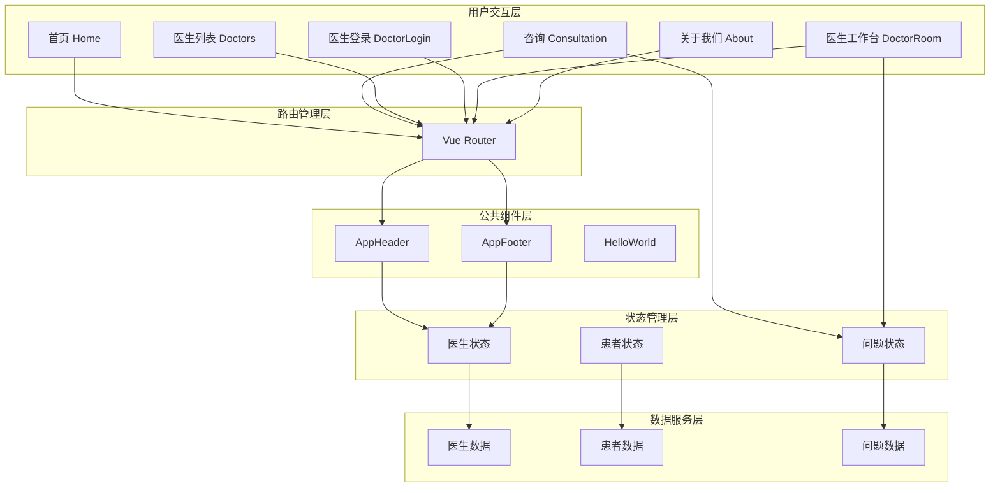
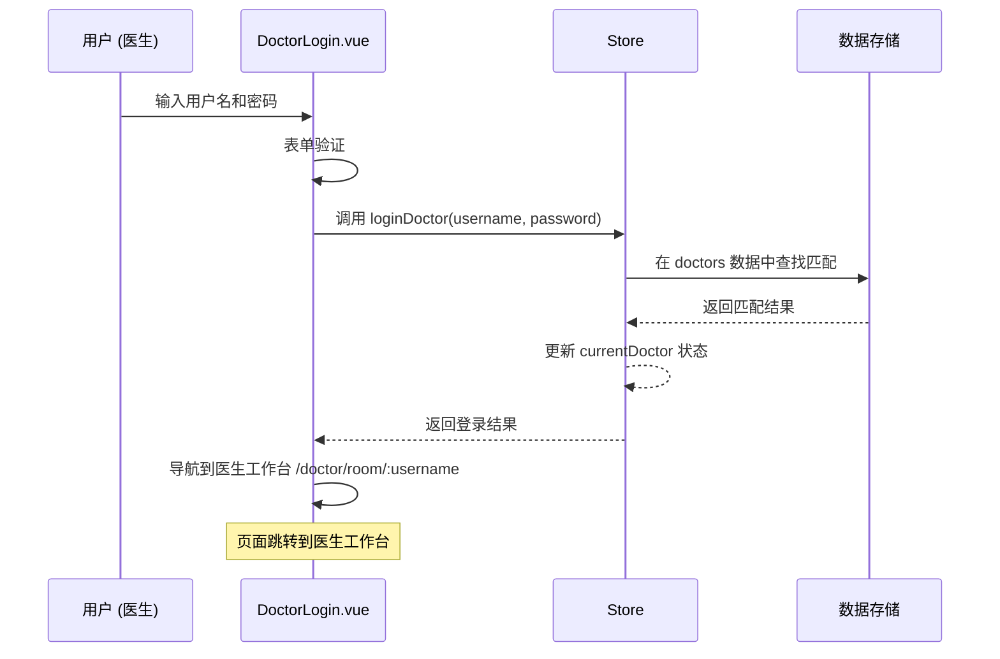
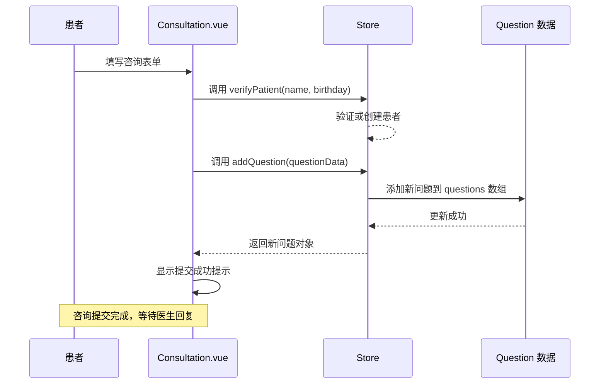

# QA Live Healthcare 系统架构文档

## 1. 架构概述

### 1.1 项目定位

**QA Live Healthcare** 是一个面向在线医疗咨询场景的前端应用系统，采用现代化的前端技术栈构建，为医患双方提供便捷的在线问诊服务平台。

### 1.2 核心设计理念

```
┌─────────────────────────────────────────────────────────────────┐
│                         用户层 (User Layer)                      │
├─────────────────────────────────────────────────────────────────┤
│  ┌─────────────────┐    ┌─────────────────┐    ┌─────────────┐ │
│  │   患者用户       │    │   医生用户       │    │   管理员     │ │
│  │   (Patient)      │    │   (Doctor)       │    │   (Admin)    │ │
│  └────────┬────────┘    └────────┬────────┘    └──────┬──────┘ │
└───────────┼───────────────────────┼────────────────────┼────────┘
            │                       │                    │
            ▼                       ▼                    ▼
┌─────────────────────────────────────────────────────────────────┐
│                       视图层 (View Layer)                        │
├─────────────────────────────────────────────────────────────────┤
│  ┌──────────────────────────────────────────────────────────┐   │
│  │                    Ant Design Vue                         │   │
│  │  ┌─────────┐ ┌─────────┐ ┌─────────┐ ┌─────────┐        │   │
│  │  │  表格    │ │  表单    │ │  卡片    │ │  布局    │        │   │
│  │  └─────────┘ └─────────┘ └─────────┘ └─────────┘        │   │
│  └──────────────────────────────────────────────────────────┘   │
└─────────────────────────────────────────────────────────────────┘
            │
            ▼
┌─────────────────────────────────────────────────────────────────┐
│                     业务逻辑层 (Business Layer)                   │
├─────────────────────────────────────────────────────────────────┤
│  ┌─────────────────┐    ┌─────────────────┐                    │
│  │   路由管理       │    │   状态管理       │                    │
│  │   (Vue Router)   │    │   (Reactive Store)│                   │
│  └─────────────────┘    └─────────────────┘                    │
└─────────────────────────────────────────────────────────────────┘
            │
            ▼
┌─────────────────────────────────────────────────────────────────┐
│                       数据层 (Data Layer)                        │
├─────────────────────────────────────────────────────────────────┤
│  ┌─────────────────┐    ┌─────────────────┐                    │
│  │   JSON 数据文件  │    │   LocalStorage  │                    │
│  │   (静态数据)      │    │   (持久化)       │                    │
│  └─────────────────┘    └─────────────────┘                    │
└─────────────────────────────────────────────────────────────────┘
```

### 1.3 技术选型理由

| 技术 | 版本 | 选型理由 |
|------|------|---------|
| Vue 3 | 3.4+ | 组合式 API、更好的 TypeScript 支持、性能提升 |
| TypeScript | 5.0+ | 类型安全、IDE 智能提示、维护成本降低 |
| Vite | 5.0+ | 极速开发体验、即时热更新、优化的生产构建 |
| Ant Design Vue | 4.0+ | 企业级 UI 组件库、丰富的医疗场景组件 |
| Vue Router | 4.0+ | 官方路由解决方案、声明式路由配置 |

---

## 2. 系统架构分层

### 2.1 分层架构图

```
┌────────────────────────────────────────────────────────────────────────────┐
│                              前端应用架构                                     │
├────────────────────────────────────────────────────────────────────────────┤
│                                                                            │
│  ┌────────────────────────────────────────────────────────────────────┐    │
│  │                        第 5 层：展现层 (Presentation Layer)          │    │
│  │  ┌──────────────────────────────────────────────────────────────┐  │    │
│  │  │                        Vue 组件                               │  │    │
│  │  │  ┌─────────────┐  ┌─────────────┐  ┌─────────────┐           │  │    │
│  │  │  │  页面组件    │  │  业务组件    │  │  基础组件    │           │  │    │
│  │  │  │  (Views)    │  │ (Components)│  │  (Shared)   │           │  │    │
│  │  │  └─────────────┘  └─────────────┘  └─────────────┘           │  │    │
│  │  └──────────────────────────────────────────────────────────────┘  │    │
│  └────────────────────────────────────────────────────────────────────┘    │
│                                      │                                       │
│                                      ▼                                       │
│  ┌────────────────────────────────────────────────────────────────────┐    │
│  │                        第 4 层：交互层 (Interaction Layer)           │    │
│  │  ┌──────────────────────────────────────────────────────────────┐  │    │
│  │  │                    路由配置 (Vue Router)                       │  │    │
│  │  │   • 路由定义    • 路由守卫    • 路由元信息    • 懒加载          │  │    │
│  │  └──────────────────────────────────────────────────────────────┘  │    │
│  └────────────────────────────────────────────────────────────────────┘    │
│                                      │                                       │
│                                      ▼                                       │
│  ┌────────────────────────────────────────────────────────────────────┐    │
│  │                        第 3 层：业务层 (Business Layer)              │    │
│  │  ┌──────────────────────────────────────────────────────────────┐  │    │
│  │  │                     状态管理 (Store)                          │  │    │
│  │  │   • 医生状态    • 患者状态    • 咨询状态    • 会话状态          │  │    │
│  │  └──────────────────────────────────────────────────────────────┘  │    │
│  └────────────────────────────────────────────────────────────────────┘    │
│                                      │                                       │
│                                      ▼                                       │
│  ┌────────────────────────────────────────────────────────────────────┐    │
│  │                        第 2 层：数据层 (Data Layer)                  │    │
│  │  ┌──────────────────────────────────────────────────────────────┐  │    │
│  │  │                      数据接口 (Data API)                      │  │    │
│  │  │   • 医生数据    • 患者数据    • 问题数据    • 统计接口          │  │    │
│  │  └──────────────────────────────────────────────────────────────┘  │    │
│  └────────────────────────────────────────────────────────────────────┘    │
│                                      │                                       │
│                                      ▼                                       │
│  ┌────────────────────────────────────────────────────────────────────┐    │
│  │                        第 1 层：基础设施层 (Infrastructure Layer)    │    │
│  │  ┌──────────────────┐  ┌──────────────────┐  ┌──────────────────┐  │    │
│  │  │   构建工具        │  │   开发服务器      │  │   类型系统        │  │    │
│  │  │   (Vite)         │  │   (Dev Server)   │  │   (TypeScript)   │  │    │
│  │  └──────────────────┘  └──────────────────┘  └──────────────────┘  │    │
│  └────────────────────────────────────────────────────────────────────┘    │
│                                                                            │
└────────────────────────────────────────────────────────────────────────────┘
```

### 2.2 各层职责定义

| 层级 | 名称 | 核心职责 | 技术实现 |
|------|------|---------|---------|
| L5 | 展现层 | 用户界面渲染、交互响应 | Vue 组件 + Ant Design |
| L4 | 交互层 | 页面导航、权限控制 | Vue Router |
| L3 | 业务层 | 状态管理、业务逻辑 | Reactive Store |
| L2 | 数据层 | 数据操作、接口抽象 | 数据服务模块 |
| L1 | 基础层 | 构建、类型、检查 | Vite + TypeScript |

---

## 3. 核心模块设计

### 3.1 模块架构图



### 3.2 模块职责说明

#### 3.2.1 视图模块 (Views)

| 模块 | 路由路径 | 核心功能 | 依赖组件 |
|------|---------|---------|---------|
| `Home.vue` | `/` | 首页展示、医生推荐 | AppHeader, AppFooter |
| `Consultation.vue` | `/consultation` | 患者发起咨询 | AppHeader, 咨询表单 |
| `Doctors.vue` | `/doctors` | 医生列表展示 | AppHeader, 医生卡片 |
| `DoctorLogin.vue` | `/doctor/login` | 医生登录认证 | AppHeader, 登录表单 |
| `DoctorRoom.vue` | `/doctor/room/:username` | 医生工作台 | AppHeader, 问题列表 |
| `About.vue` | `/about` | 关于我们 | AppHeader |

#### 3.2.2 公共组件模块 (Components)

| 组件 | 功能描述 | 复用场景 |
|------|---------|---------|
| `AppHeader.vue` | 应用顶部导航栏 | 全局通用 |
| `AppFooter.vue` | 应用底部信息栏 | 全局通用 |
| `HelloWorld.vue` | 示例组件 | 开发调试 |

#### 3.2.3 路由模块 (Router)

```typescript
// 路由配置架构
interface RouteArchitecture {
  // 公共路由
  publicRoutes: [
    { path: '/', name: 'Home', component: 'Home' },
    { path: '/doctors', name: 'Doctors', component: 'Doctors' },
    { path: '/about', name: 'About', component: 'About' }
  ];
  
  // 患者路由
  patientRoutes: [
    { path: '/consultation', name: 'Consultation', component: 'Consultation' },
    { path: '/consultation/:doctorUsername', name: 'ConsultationRoom', component: 'Consultation' }
  ];
  
  // 医生路由
  doctorRoutes: [
    { path: '/doctor/login', name: 'DoctorLogin', component: 'DoctorLogin' },
    { path: '/doctor/room/:username', name: 'DoctorRoom', component: 'DoctorRoom' }
  ];
}
```

#### 3.2.4 状态管理模块 (Store)

```typescript
// 状态管理架构
interface StoreArchitecture {
  // 医生状态
  doctorState: {
    doctors: Doctor[];           // 医生列表
    currentDoctor: Doctor | null; // 当前登录医生
    activeDoctors: Doctor[];      // 在线医生
  };
  
  // 患者状态
  patientState: {
    patients: Patient[];          // 患者列表
    currentPatient: Patient | null; // 当前患者
  };
  
  // 咨询状态
  consultationState: {
    questions: Question[];        // 咨询问题列表
    pendingQuestions: Question[];  // 待回复问题
    answeredQuestions: Question[]; // 已回复问题
  };
}
```

---

## 4. 数据流架构

### 4.1 双向数据流设计

```
┌─────────────────────────────────────────────────────────────────────────────┐
│                              数据流向架构                                     │
├─────────────────────────────────────────────────────────────────────────────┤
│                                                                              │
│    ┌──────────┐         用户操作          ┌──────────┐                       │
│    │          │    ─────────────────▶    │          │                       │
│    │   用户    │                          │   视图    │                       │
│    │          │    ◀─────────────────     │   组件    │                       │
│    └──────────┘         UI 更新          └──────────┘                       │
│         │                                        │                         │
│         │                                        │                         │
│         ▼                                        ▼                         │
│    ┌──────────────────────────────────────────────────────┐                 │
│    │                      事件触发                         │                 │
│    │  @click / @change / @submit / @input                 │                 │
│    └──────────────────────────────────────────────────────┘                 │
│                              │                                               │
│                              ▼                                               │
│    ┌──────────────────────────────────────────────────────┐                 │
│    │                    业务逻辑处理                        │                 │
│    │  状态更新 / 表单验证 / 权限检查 / 数据转换               │                 │
│    └──────────────────────────────────────────────────────┘                 │
│                              │                                               │
│                              ▼                                               │
│    ┌──────────────────────────────────────────────────────┐                 │
│    │                    状态变更通知                        │                 │
│    │  Vue 响应式系统自动追踪依赖                            │                 │
│    └──────────────────────────────────────────────────────┘                 │
│                              │                                               │
│                              ▼                                               │
│    ┌──────────────────────────────────────────────────────┐                 │
│    │                    自动重新渲染                        │                 │
│    │  依赖该状态的组件自动更新视图                          │                 │
│    └──────────────────────────────────────────────────────┘                 │
│                                                                              │
└─────────────────────────────────────────────────────────────────────────────┘
```

### 4.2 核心数据流转示例

#### 场景一：医生登录流程



#### 场景二：患者发起咨询



---

## 5. 路由架构设计

### 5.1 路由配置结构

```typescript
// 路由架构设计
interface RouteConfig {
  // 基础配置
  history: 'HTML5History';  // 使用 HTML5 History API
  basePath: '/';             // 应用基础路径
  
  // 路由分组
  routeGroups: {
    // 首页路由组
    home: {
      path: '/',
      name: 'Home',
      component: 'Home',
      meta: { requiresAuth: false }
    };
    
    // 咨询路由组
    consultation: {
      paths: [
        '/consultation',
        '/consultation/:doctorUsername'
      ];
      meta: { requiresAuth: false, role: 'patient' }
    };
    
    // 医生路由组
    doctor: {
      paths: [
        '/doctors',
        '/doctor/login',
        '/doctor/room/:username'
      ];
      meta: { requiresAuth: false, role: 'doctor' }
    };
    
    // 信息路由组
    info: {
      path: '/about',
      name: 'About',
      component: 'About',
      meta: { requiresAuth: false }
    };
  };
  
  // 路由守卫配置
  guards: {
    beforeEach: (to, from, next) => {
      // 权限检查逻辑
    };
  };
}
```

### 5.2 路由与视图映射

```
┌─────────────────────────────────────────────────────────────────────────────┐
│                              路由映射表                                       │
├─────────────────────────────────────────────────────────────────────────────┤
│                                                                              │
│  URL 路径                          视图组件           路由名称                 │
│  ─────────────────────────────────────────────────────────────────────────  │
│  /                                →  Home.vue        →  Home                │
│  /consultation                    →  Consultation.vue →  Consultation        │
│  /consultation/:doctorUsername   →  Consultation.vue →  ConsultationRoom    │
│  /doctors                         →  Doctors.vue     →  Doctors              │
│  /doctor/login                   →  DoctorLogin.vue  →  DoctorLogin          │
│  /doctor/room/:username          →  DoctorRoom.vue   →  DoctorRoom           │
│  /about                          →  About.vue        →  About                │
│                                                                              │
└─────────────────────────────────────────────────────────────────────────────┘
```

---

## 6. 状态管理架构

### 6.1 状态管理设计模式

```typescript
// 状态管理架构设计
interface StoreArchitecture {
  // 单一数据源
  singleSourceOfTruth: {
    doctors: Doctor[];
    patients: Patient[];
    questions: Question[];
  };
  
  // 派生状态 (Computed)
  computedState: {
    activeDoctors: () => Doctor[];
    pendingQuestions: () => Question[];
    answeredQuestions: () => Question[];
    statistics: () => Statistics;
  };
  
  // 业务方法
  businessMethods: {
    // 认证相关
    loginDoctor: (username: string, password: string) => Doctor | null;
    logoutDoctor: () => void;
    verifyPatient: (name: string, birthday: string) => Patient;
    logoutPatient: () => void;
    
    // 问题管理
    addQuestion: (data: QuestionInput) => Question;
    answerQuestion: (questionId: string, answer: string) => void;
    markQuestionAsAnswered: (questionId: string) => void;
    
    // 查询方法
    getQuestionsByDoctor: (doctorId: string) => Question[];
    getQuestionsByPatient: (patientId: string) => Question[];
    getDoctorByUsername: (username: string) => Doctor | undefined;
    getActiveDoctors: () => Doctor[];
    getStatistics: () => Statistics;
  };
}
```

### 6.2 状态变更通知机制

```
┌─────────────────────────────────────────────────────────────────────────────┐
│                           响应式状态更新流程                                   │
├─────────────────────────────────────────────────────────────────────────────┤
│                                                                              │
│    1. 状态初始化                                                              │
│    ┌────────────────────────────────────────────────────────────────────┐    │
│    │  const state = reactive<State>({                                  │    │
│    │    doctors: [...],                                                 │    │
│    │    questions: [...],                                              │    │
│    │    currentDoctor: null,                                           │    │
│    │    currentPatient: null                                           │    │
│    │  });                                                               │    │
│    └────────────────────────────────────────────────────────────────────┘    │
│                              │                                               │
│                              ▼                                               │
│    2. 业务方法调用                                                            │
│    ┌────────────────────────────────────────────────────────────────────┐    │
│    │  store.addQuestion({ doctorId: 'd1', patientId: 'p1', ... })       │    │
│    └────────────────────────────────────────────────────────────────────┘    │
│                              │                                               │
│                              ▼                                               │
│    3. 状态变更触发                                                            │
│    ┌────────────────────────────────────────────────────────────────────┐    │
│    │  state.questions.push(newQuestion)  // 触发响应式更新                 │    │
│    └────────────────────────────────────────────────────────────────────┘    │
│                              │                                               │
│                              ▼                                               │
│    4. 视图自动更新                                                            │
│    ┌────────────────────────────────────────────────────────────────────┐    │
│    │  template>                                                         │    │
│    │    <div v-for="q in store.state.questions">...</div>  // 自动更新   │    │
│    │  </template>                                                       │    │
│    └────────────────────────────────────────────────────────────────────┘    │
│                                                                              │
└─────────────────────────────────────────────────────────────────────────────┘
```

---

## 7. 组件架构设计

### 7.1 组件层级结构

```
┌─────────────────────────────────────────────────────────────────────────────┐
│                             组件层级架构                                     │
├─────────────────────────────────────────────────────────────────────────────┤
│                                                                              │
│                        App.vue (根组件)                                      │
│                              │                                               │
│         ┌────────────────────┼────────────────────┐                         │
│         │                    │                    │                         │
│         ▼                    ▼                    ▼                         │
│   ┌──────────┐      ┌──────────────┐      ┌──────────┐                  │
│   │ AppHeader │      │ RouterView    │      │ AppFooter│                  │
│   │ (公共组件) │      │ (路由视图)    │      │ (公共组件) │                  │
│   └──────────┘      └──────────────┘      └──────────┘                  │
│                             │                                               │
│         ┌───────────────────┼───────────────────┐                          │
│         │                   │                   │                          │
│         ▼                   ▼                   ▼                          │
│   ┌──────────┐      ┌──────────────┐      ┌──────────┐                   │
│   │  Home.vue │      │ Consultation │      │ Doctors  │                   │
│   │ (首页)    │      │   .vue       │      │  .vue    │                   │
│   └──────────┘      └──────────────┘      └──────────┘                   │
│                             │                                               │
│         ┌───────────────────┼───────────────────┐                          │
│         │                   │                   │                          │
│         ▼                   ▼                   ▼                          │
│   ┌──────────┐      ┌──────────────┐      ┌──────────┐                   │
│   │ DoctorLogin│     │ DoctorRoom   │      │  About   │                   │
│   │   .vue    │      │   .vue       │      │  .vue    │                   │
│   └──────────┘      └──────────────┘      └──────────┘                   │
│                                                                              │
└─────────────────────────────────────────────────────────────────────────────┘
```

### 7.2 组件分类规范

| 组件类型 | 命名规范 | 存放位置 | 复用级别 |
|---------|---------|---------|---------|
| 页面组件 | `PascalCase.vue` | `views/` | 页面级，不可复用 |
| 业务组件 | `PascalCase.vue` | `components/` | 业务级，可复用 |
| 基础组件 | `PascalCase.vue` | `components/common/` | 通用级，全项目复用 |
| 布局组件 | `Layout*.vue` | `components/layout/` | 布局级，全项目复用 |

### 7.3 组件通信模式

```typescript
// 组件通信架构
interface ComponentCommunication {
  // 父子组件通信
  parentChild: {
    props: '父组件向子组件传递数据';
    emits: '子组件向父组件发送事件';
    v-model: '双向数据绑定';
  };
  
  // 跨层级通信
  crossLevel: {
    provide: '父组件向后代组件提供数据';
    inject: '后代组件注入父组件提供的数据';
  };
  
  // 全局通信
  global: {
    store: '通过状态管理中心进行全局数据共享';
    router: '通过路由进行页面导航';
  };
}
```

---

## 8. 技术架构优势

### 8.1 架构优势总结

| 优势维度 | 具体优势 | 带来的价值 |
|---------|---------|-----------|
| **模块化设计** | 分层清晰，模块职责明确 | 易于维护和扩展 |
| **类型安全** | 全面使用 TypeScript | 减少运行时错误，提高开发效率 |
| **响应式架构** | Vue 3 响应式系统 | 数据与视图自动同步，开发体验好 |
| **组件化开发** | 高复用性的组件设计 | 开发效率提升，代码量减少 |
| **路由管理** | 集中式路由配置 | 页面导航清晰，权限控制方便 |
| **状态管理** | 单一数据源模式 | 数据一致性高，问题定位容易 |

### 8.2 性能优化策略

```
┌─────────────────────────────────────────────────────────────────────────────┐
│                              性能优化策略                                     │
├─────────────────────────────────────────────────────────────────────────────┤
│                                                                              │
│  1. 构建优化                                                                 │
│     • Vite 极速冷启动                                                        │
│     • 按需编译，只编译变更文件                                                │
│     • 生产环境自动代码分割                                                    │
│                                                                              │
│  2. 运行时优化                                                               │
│     • Vue 3 虚拟 DOM 提升                                                    │
│     • 响应式系统依赖追踪优化                                                  │
│     • 组件懒加载（路由级别）                                                  │
│                                                                              │
│  3. 包体积优化                                                               │
│     • Tree Shaking 无用代码消除                                              │
│     • Ant Design Vue 按需引入                                                │
│     • 图片和静态资源压缩                                                      │
│                                                                              │
└─────────────────────────────────────────────────────────────────────────────┘
```

---

## 9. 扩展性设计

### 9.1 未来扩展方向

```typescript
// 扩展性设计接口
interface FutureExtensions {
  // 1. 后端 API 集成
  backendIntegration: {
    current: '纯前端，数据存储在 JSON 文件中';
    future: 'RESTful API / GraphQL 接口';
    impact: '数据层重构，Store 适配器模式';
  };
  
  // 2. 用户认证系统
  authentication: {
    current: '简单的用户名密码验证';
    future: 'JWT / OAuth 2.0 认证系统';
    impact: '增加认证模块，路由守卫增强';
  };
  
  // 3. 实时通信
  realTime: {
    current: '轮询查询问题状态';
    future: 'WebSocket 实时推送';
    impact: '消息推送模块，服务端推送集成';
  };
  
  // 4. 多端适配
  multiPlatform: {
    current: 'Web 端单平台';
    future: '移动端 App / 小程序 / 桌面端';
    impact: 'UNI-APP 跨平台迁移或原生开发';
  };
  
  // 5. 数据分析
  analytics: {
    current: '简单的统计接口';
    future: '用户行为分析、数据可视化';
    impact: '埋点系统、BI 报表集成';
  };
}
```

### 9.2 模块化扩展架构

```
┌─────────────────────────────────────────────────────────────────────────────┐
│                              模块化扩展架构                                   │
├─────────────────────────────────────────────────────────────────────────────┤
│                                                                              │
│  ┌─────────────────────────────────────────────────────────────────────┐    │
│  │                         核心模块 (Core)                               │    │
│  │   • 路由管理    • 状态管理    • 组件系统    • 构建工具                   │    │
│  └─────────────────────────────────────────────────────────────────────┘    │
│                                    │                                        │
│           ┌────────────────────────┼────────────────────────┐               │
│           │                        │                        │               │
│           ▼                        ▼                        ▼               │
│  ┌──────────────────┐    ┌──────────────────┐    ┌──────────────────┐       │
│  │   业务模块 A      │    │   业务模块 B      │    │   业务模块 C      │       │
│  │   (医生管理)      │    │   (患者管理)      │    │   (咨询管理)      │       │
│  └──────────────────┘    └──────────────────┘    └──────────────────┘       │
│                                    │                                        │
│                                    ▼                                        │
│  ┌─────────────────────────────────────────────────────────────────────┐    │
│  │                         扩展模块 (Extensions)                        │    │
│  │   • API 适配器    • 认证模块    • 消息推送    • 分析模块                │    │
│  └─────────────────────────────────────────────────────────────────────┘    │
│                                                                              │
└─────────────────────────────────────────────────────────────────────────────┘
```

---

## 10. 部署架构

### 10.1 部署架构图

```
┌─────────────────────────────────────────────────────────────────────────────┐
│                              部署架构图                                       │
├─────────────────────────────────────────────────────────────────────────────┤
│                                                                              │
│                           用户访问                                           │
│                              │                                              │
│                              ▼                                              │
│  ┌──────────────────────────────────────────────────────────────────────┐   │
│  │                        CDN 加速节点                                    │   │
│  │                   (静态资源全球分发)                                    │   │
│  └──────────────────────────────────────────────────────────────────────┘   │
│                              │                                              │
│                              ▼                                              │
│  ┌──────────────────────────────────────────────────────────────────────┐   │
│  │                        Web 服务器                                      │   │
│  │                    (Nginx / Apache)                                   │   │
│  │                         │                                             │   │
│  │         ┌───────────────┼───────────────┐                            │   │
│  │         │               │               │                            │   │
│  │         ▼               ▼               ▼                            │   │
│  │   ┌───────────┐  ┌───────────┐  ┌───────────┐                      │   │
│  │   │  /dist    │  │ /api      │  │ /static   │                      │   │
│  │   │  前端资源  │  │  API代理  │  │  静态资源  │                      │   │
│  │   └───────────┘  └───────────┘  └───────────┘                      │   │
│  └──────────────────────────────────────────────────────────────────────┘   │
│                              │                                              │
│                              ▼                                              │
│  ┌──────────────────────────────────────────────────────────────────────┐   │
│  │                        后端服务                                        │   │
│  │                 (未来扩展：API 服务器)                                  │   │
│  └──────────────────────────────────────────────────────────────────────┘   │
│                              │                                              │
│                              ▼                                              │
│  ┌──────────────────────────────────────────────────────────────────────┐   │
│  │                        数据库服务                                      │   │
│  │                 (未来扩展：PostgreSQL/MySQL)                          │   │
│  └──────────────────────────────────────────────────────────────────────┘   │
│                                                                              │
└─────────────────────────────────────────────────────────────────────────────┘
```

### 10.2 构建产物说明

| 产物目录 | 内容说明 | 部署位置 |
|---------|---------|---------|
| `dist/index.html` | 应用入口 HTML | Web 服务器根目录 |
| `dist/assets/` | 打包后的 JS 和 CSS 文件 | CDN 或 Web 服务器 |
| `dist/favicon.ico` | 网站图标 | Web 服务器根目录 |
| `public/` | 纯静态资源，不经构建处理 | 复制到部署目录 |

---

## 11. 文档总结

### 11.1 架构文档导航

| 文档名称 | 描述 | 关联文档 |
|---------|------|---------|
| **架构文档 (本文档)** | 系统整体架构设计 | 所有其他文档的基础 |
| [数据模型文档](./data-models.md) | 数据实体和关系定义 | 依赖本架构设计 |
| [项目结构文档](./standard-project-structure.md) | 目录结构和组织规范 | 依赖本架构设计 |
| [代码风格文档](./standard-coding-style.md) | 代码编写规范和最佳实践 | 依赖本架构设计 |
| [API 文档](./api.md) | 接口定义和调用规范 | 依赖数据模型文档 |

### 11.2 快速参考

**项目启动命令：**
```bash
# 开发环境
npm run dev

# 生产构建
npm run build

# 预览生产构建
npm run preview
```

**核心路由地址：**
- 首页：http://localhost:5173/
- 医生列表：http://localhost:5173/doctors
- 患者咨询：http://localhost:5173/consultation
- 医生登录：http://localhost:5173/doctor/login

---

*文档版本：1.0.0*  
*最后更新：2026-04-21*  
*维护团队：QA Live Healthcare 开发团队*
