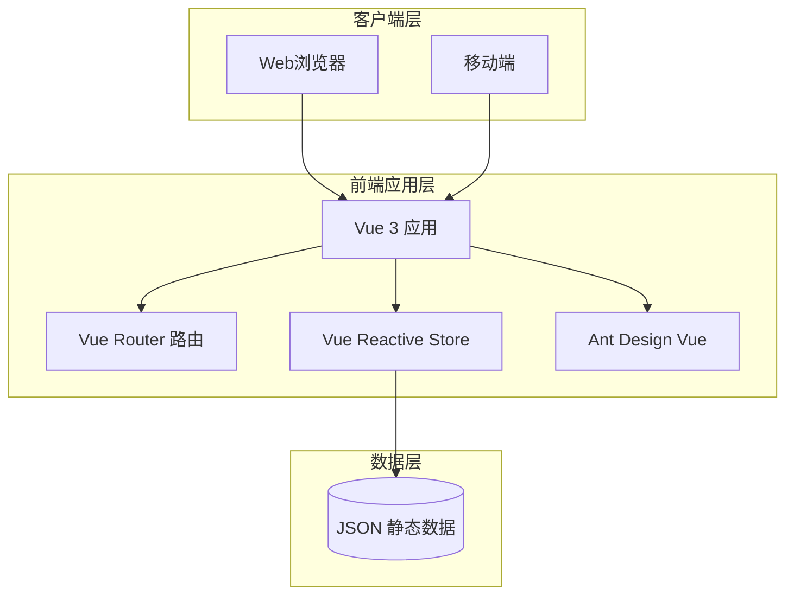
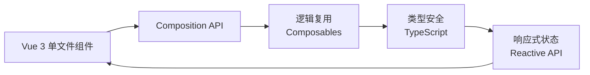
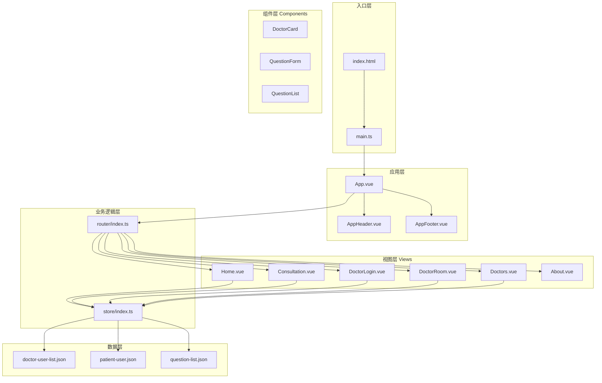
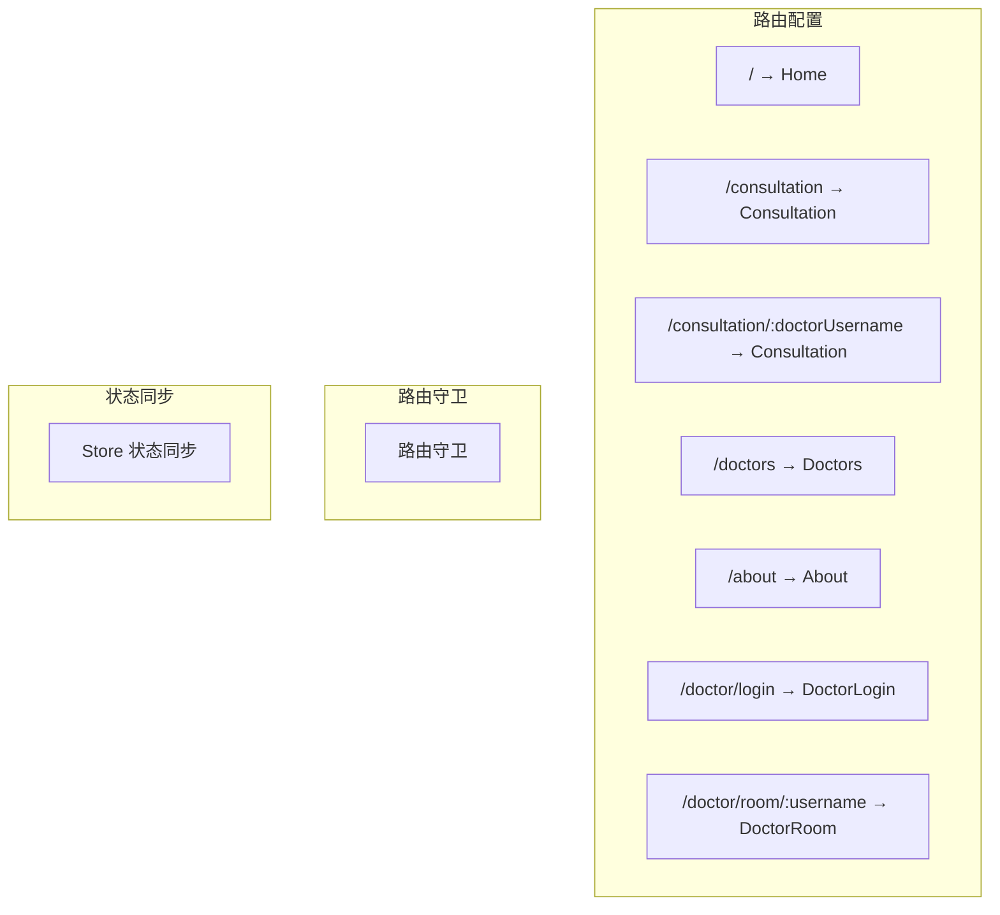
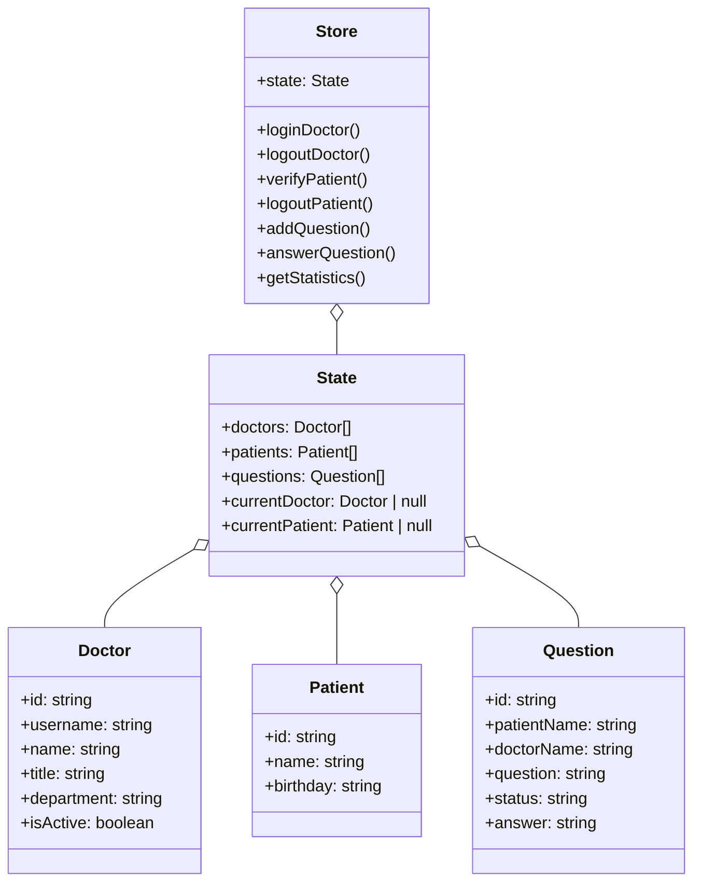
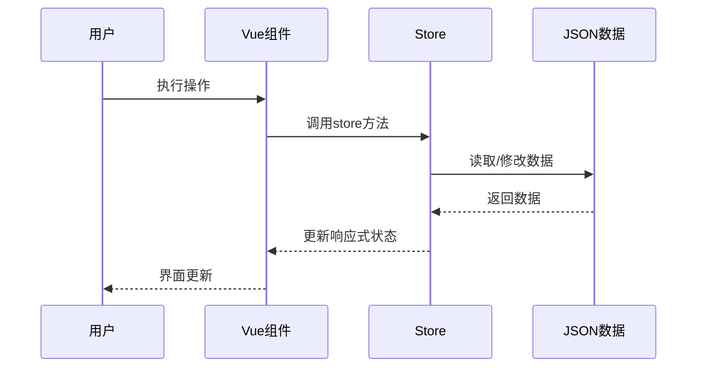
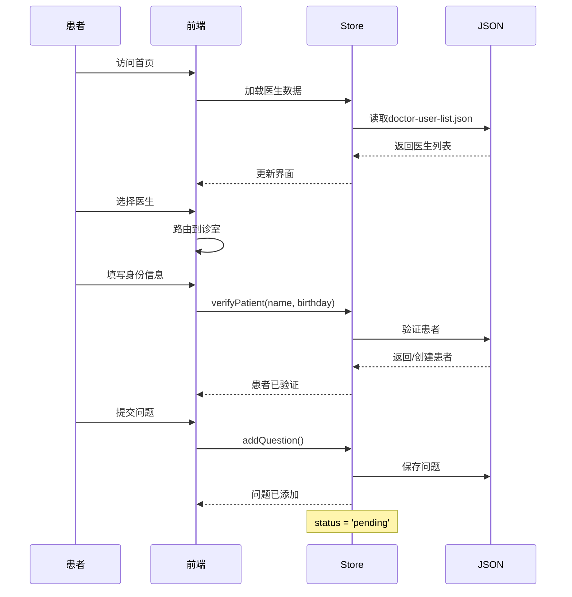
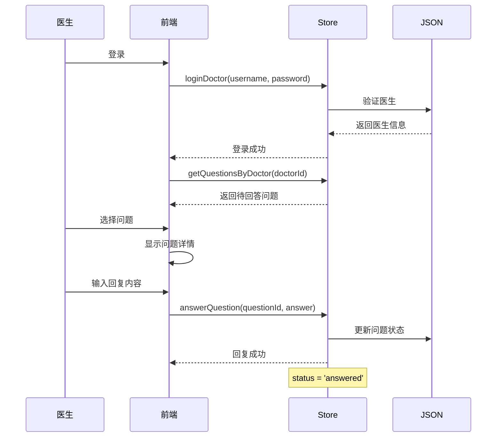

# 架构设计

## 概述

本文档描述在线医疗问诊平台的系统架构、设计决策和技术模式。

## 架构概览



## 技术架构

### 技术栈概览

| 层级 | 技术 | 说明 |
|------|------|------|
| **前端框架** | Vue 3 | 渐进式 JavaScript 框架 |
| **类型系统** | TypeScript | 类型安全的 JavaScript 超集 |
| **UI 组件库** | Ant Design Vue | 企业级 UI 组件库 |
| **路由管理** | Vue Router | Vue.js 官方路由管理器 |
| **构建工具** | Vite | 下一代前端构建工具 |
| **状态管理** | Vue Reactive | Vue 3 响应式 API |

### 架构特点



## 应用架构

### 整体架构图



## 页面路由架构

### 路由配置



### 路由表

| 路径 | 组件 | 用途 | 访问控制 |
|------|------|------|----------|
| `/` | Home.vue | 首页 | 公开 |
| `/consultation` | Consultation.vue | 问诊页 | 公开 |
| `/consultation/:doctorUsername` | Consultation.vue | 指定医生诊室 | 公开 |
| `/doctors` | Doctors.vue | 医生列表 | 公开 |
| `/about` | About.vue | 关于页面 | 公开 |
| `/doctor/login` | DoctorLogin.vue | 医生登录 | 公开 |
| `/doctor/room/:username` | DoctorRoom.vue | 医生工作台 | 需登录 |

## 状态管理架构

### Store 结构



### 状态流



## 设计模式

### 1. 单文件组件模式 (SFC)

```vue
<template>
  <!-- 视图结构 -->
  <div class="component">
    <slot></slot>
  </div>
</template>

<script setup lang="ts">
// 逻辑代码
import { ref, computed } from 'vue';
</script>

<style scoped>
/* 样式代码 */
</style>
```

### 2. 组合式函数模式

```typescript
// composables/useDoctor.ts
import { computed } from 'vue';
import { store } from '@/store';

export function useDoctor(doctorId: string) {
  const doctor = computed(() => 
    store.state.doctors.find(d => d.id === doctorId)
  );
  
  const questions = computed(() => 
    store.getQuestionsByDoctor(doctorId)
  );
  
  return { doctor, questions };
}
```

### 3. 响应式状态模式

```typescript
// store/index.ts
import { reactive } from 'vue';

interface State {
  doctors: Doctor[];
  questions: Question[];
}

const state = reactive<State>({
  doctors: [],
  questions: [],
});

export const store = {
  state,
  // 方法...
};
```

## 页面组件架构

### 首页 (Home)

```mermaid
graph TB
    subgraph "Home.vue"
        H1[Hero区域]
        H2[统计卡片]
        H3[医生诊室列表]
    end
    
    subgraph "子组件"
        C1[AppHeader]
        C2[AppFooter]
    end
    
    subgraph "数据来源"
        D1[getStatistics()]
        D2[getActiveDoctors()]
    end
    
    H1 --> D1
    H2 --> D1
    H3 --> D2
    H1 --> C1
    H3 --> C2
```

### 问诊页面 (Consultation)

```mermaid
graph TB
    subgraph "Consultation.vue"
        P1[医生选择]
        P2[患者验证表单]
        P3[问题提交表单]
        P4[问题列表展示]
    end
    
    subgraph "Store方法"
        S1[verifyPatient()]
        S2[addQuestion()]
        S3[getQuestionsByPatient()]
    end
    
    P2 --> S1
    P3 --> S2
    P4 --> S3
```

### 医生端 (Doctor)

```mermaid
graph TB
    subgraph "DoctorLogin.vue"
        L1[登录表单]
    end
    
    subgraph "DoctorRoom.vue"
        R1[问题列表]
        R2[回复表单]
        R3[统计数据]
    end
    
    subgraph "Store方法"
        M1[loginDoctor()]
        M2[getQuestionsByDoctor()]
        M3[answerQuestion()]
        M4[logoutDoctor()]
    end
    
    L1 --> M1
    R1 --> M2
    R2 --> M3
    R1 --> M4
```

## 数据流程

### 患者问诊流程



### 医生回答流程



## 模块职责

| 模块 | 职责 | 文件位置 |
|------|------|----------|
| 路由管理 | 页面导航、路由守卫 | `router/index.ts` |
| 状态管理 | 数据存储、业务逻辑 | `store/index.ts` |
| 视图组件 | 页面展示、用户交互 | `views/*.vue` |
| 公共组件 | 复用组件 | `components/*.vue` |
| 静态数据 | 模拟后端数据 | `data/*.json` |

## 扩展建议

### 当前架构的优势

1. **轻量级**: 使用 Vue 3 响应式 API，无需额外状态管理库
2. **类型安全**: TypeScript 提供完整的类型检查
3. **组件化**: SFC 模式便于代码复用和维护
4. **简单数据流**: 静态 JSON 数据简化了数据管理

### 未来扩展方向

1. **API 服务层**: 添加 axios 封装真实 API 调用
2. **持久化存储**: 使用 localStorage 或 IndexedDB 持久化数据
3. **用户认证**: 添加 JWT token 认证机制
4. **实时通信**: WebSocket 实现医生回复实时通知
5. **移动端适配**: 响应式布局支持移动设备

---

*最后更新: 2026-04-21*
