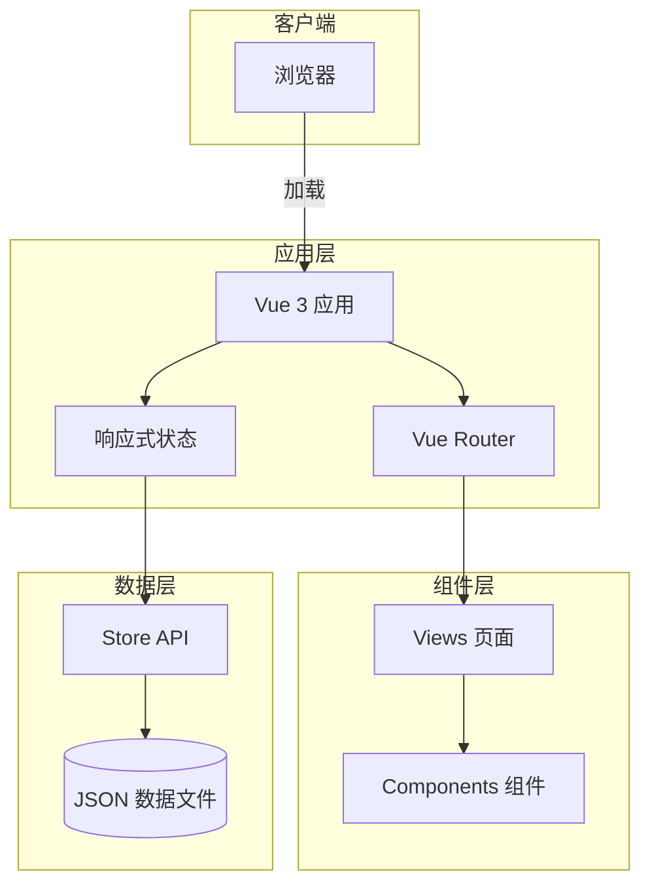
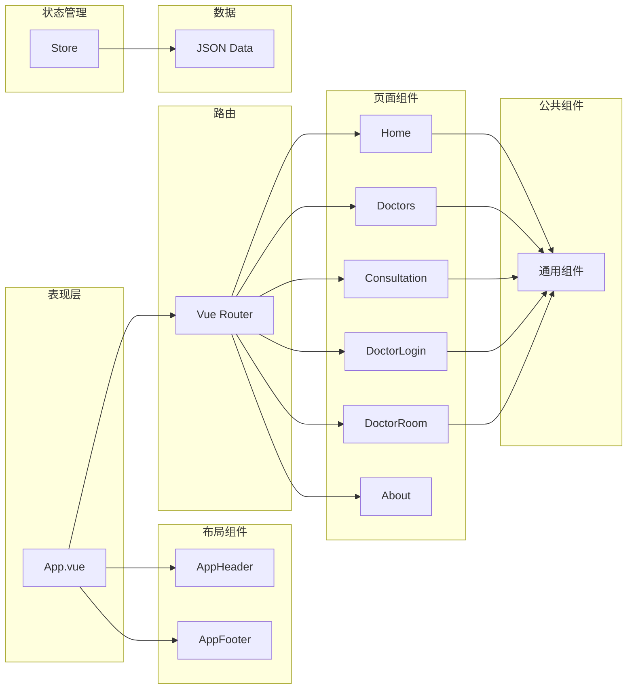
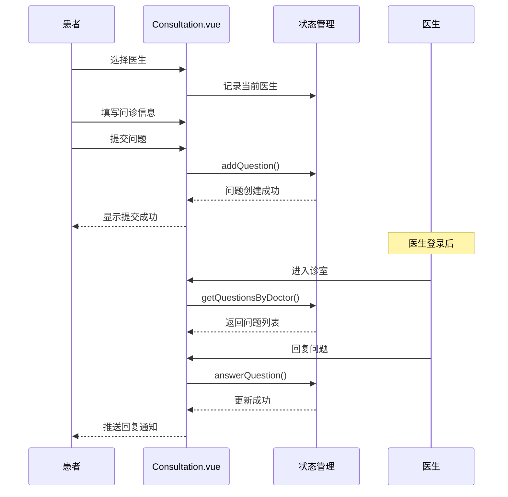
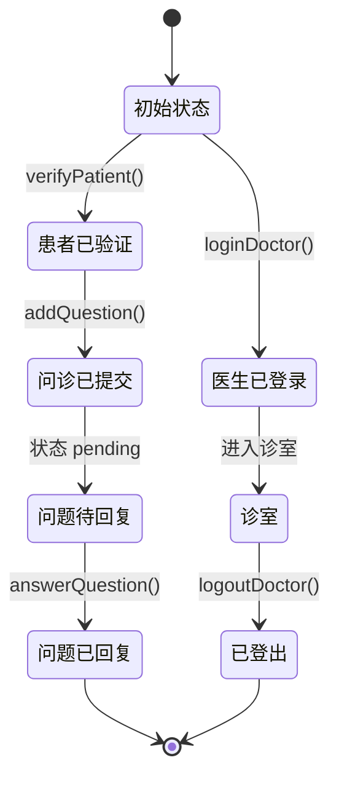

# 架构设计

## 概述

本文档描述了在线医疗问诊平台的系统架构、设计决策和技术模式。系统采用 Vue 3 + TypeScript 构建的前端单页应用架构。

## 架构概览



## 架构原则

### 1. 组件化架构

- **单一职责**: 每个组件只负责一个功能
- **可复用性**: 通用组件提取到 `components/` 目录
- **独立性**: 组件之间通过 props 和 events 通信

### 2. 响应式数据流

- **单向数据流**: 数据从父组件流向子组件
- **状态提升**: 共享状态提升到 Store 层
- **响应式绑定**: Vue 3 reactive 自动追踪依赖

### 3. 路由驱动

- **声明式路由**: 路由配置与组件映射
- **懒加载**: 页面组件按需加载
- **history 模式**: 干净的 URL 结构

## 技术架构

### 技术栈

| 层级 | 技术 | 说明 |
|------|------|------|
| **框架** | Vue 3.5 | 渐进式前端框架 |
| **语言** | TypeScript 5.5 | 类型安全 |
| **构建** | Vite 5.4 | 快速开发构建 |
| **路由** | Vue Router 4.6 | SPA 路由管理 |
| **UI** | Ant Design Vue 4.2 | 企业级 UI 组件库 |
| **状态** | Vue reactive | 轻量级状态管理 |
| **日期** | dayjs | 日期处理 |

### 项目架构图



## 核心模块

### 路由模块

**目的**: 管理应用页面导航

**实现**: Vue Router history 模式

```typescript
// src/router/index.ts
const routes: RouteRecordRaw[] = [
  { path: '/', name: 'Home', component: Home },
  { path: '/consultation/:doctorUsername?', name: 'Consultation', component: Consultation },
  { path: '/doctor/room/:username', name: 'DoctorRoom', component: DoctorRoom },
];
```

### 状态管理模块

**目的**: 管理应用全局状态

**实现**: Vue 3 reactive

```typescript
// src/store/index.ts
const state = reactive<State>({
  doctors: doctorData,
  patients: patientData,
  questions: questionData,
  currentDoctor: null,
  currentPatient: null,
});

export const store = {
  state,
  loginDoctor,
  logoutDoctor,
  verifyPatient,
  addQuestion,
  answerQuestion,
  // ...
};
```

### 组件模块

**目的**: 构建可复用 UI

**组织**: 按功能划分

| 组件 | 类型 | 说明 |
|------|------|------|
| `AppHeader.vue` | 布局 | 顶部导航栏 |
| `AppFooter.vue` | 布局 | 底部信息栏 |
| `HelloWorld.vue` | 示例 | 开发测试组件 |

### 页面模块

**目的**: 业务功能页面

| 页面 | 路由 | 职责 |
|------|------|------|
| Home | `/` | 平台首页、统计、开放诊室 |
| Doctors | `/doctors` | 医生列表展示 |
| Consultation | `/consultation` | 问诊发起与聊天 |
| DoctorLogin | `/doctor/login` | 医生身份认证 |
| DoctorRoom | `/doctor/room/:username` | 医生问题管理 |
| About | `/about` | 平台介绍 |

## 数据流设计

### 用户问诊流程



### 状态变化流程



## 设计模式

### 模块模式

```typescript
// Store 模块化组织
export const store = {
  state,           // 响应式状态
  
  // 医生相关
  loginDoctor() { },
  logoutDoctor() { },
  getActiveDoctors() { },
  
  // 患者相关
  verifyPatient() { },
  logoutPatient() { },
  
  // 问诊相关
  addQuestion() { },
  answerQuestion() { },
  getQuestionsByDoctor() { },
  
  // 统计
  getStatistics() { },
};
```

### 组合式函数模式

```typescript
// src/composables/useDoctor.ts
export function useDoctor() {
  const doctor = ref<Doctor | null>(null);
  
  const login = (username: string, password: string) => {
    doctor.value = store.loginDoctor(username, password);
  };
  
  const logout = () => {
    store.logoutDoctor();
    doctor.value = null;
  };
  
  return { doctor, login, logout };
}
```

### 组件模式

```vue
<script setup lang="ts">
// 1. 导入
import { ref, computed, onMounted } from 'vue';
import { useRouter } from 'vue-router';
import { store } from '../store';

// 2. 响应式状态
const loading = ref(false);
const doctors = computed(() => store.state.doctors);

// 3. 方法
const navigateTo = (path: string) => {
  router.push(path);
};

// 4. 生命周期
onMounted(() => {
  loading.value = true;
  loading.value = false;
});
</script>
```

## 安全性考虑

### 数据安全

- 模拟数据存储在 JSON 文件中（演示环境）
- 生产环境需后端 API 支持
- 敏感操作需身份验证

### 路由守卫

```typescript
// 路由守卫示例（可扩展）
router.beforeEach((to, from, next) => {
  // 检查是否需要登录
  if (to.meta.requiresAuth && !store.state.currentDoctor) {
    next({ name: 'DoctorLogin' });
  } else {
    next();
  }
});
```

## 性能优化

### 组件懒加载

```typescript
// 路由懒加载
const routes: RouteRecordRaw[] = [
  {
    path: '/',
    component: () => import('../views/Home.vue'),
  },
];
```

### 依赖预构建

```typescript
// vite.config.ts
export default defineConfig({
  optimizeDeps: {
    include: ['vue', 'vue-router', 'ant-design-vue'],
  },
});
```

### 响应式优化

```typescript
// 使用 computed 避免不必要的计算
const activeDoctors = computed(() => 
  store.state.doctors.filter(d => d.isActive)
);
```

## 可扩展性

### 添加新页面

1. 创建 `src/views/NewPage.vue`
2. 在 `src/router/index.ts` 添加路由
3. 可选：在 `AppHeader.vue` 添加导航

### 添加新组件

1. 创建 `src/components/NewComponent.vue`
2. 在需要的页面中导入使用

### 添加新功能

1. 在 `src/store/index.ts` 添加状态和方法
2. 在 `src/data/` 添加 JSON 数据文件
3. 在对应的页面中调用

## 相关文档

- [项目结构](./standard-project-structure.md)
- [编码规范](./standard-coding-style.md)
- [数据模型](./data-models.md)
- [部署配置](./deployment.md)

---

*本架构文档应随重大设计变更进行更新。*
