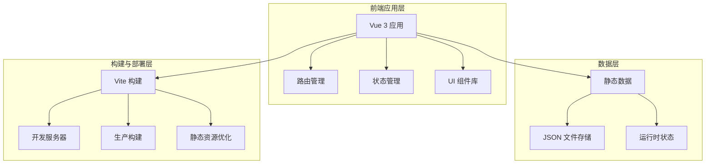
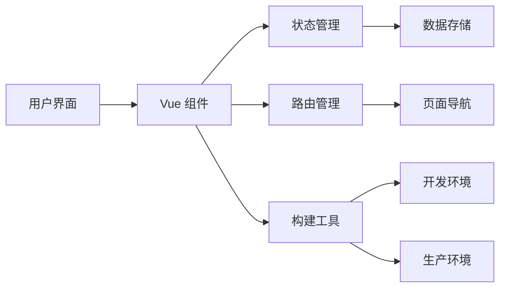
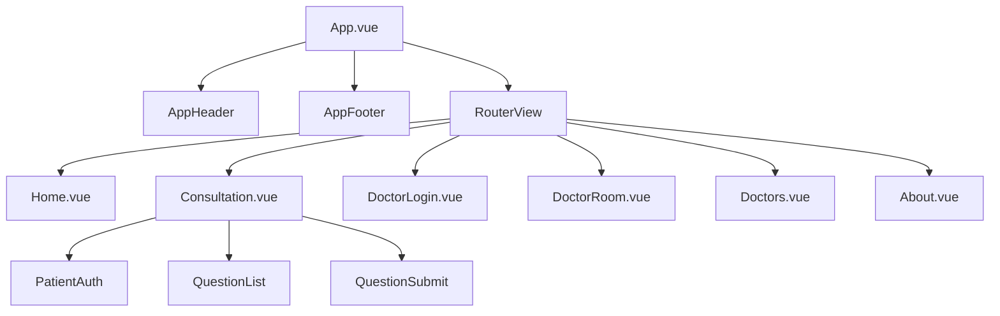
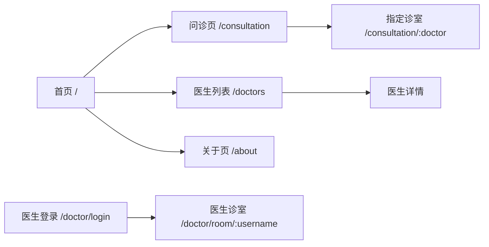
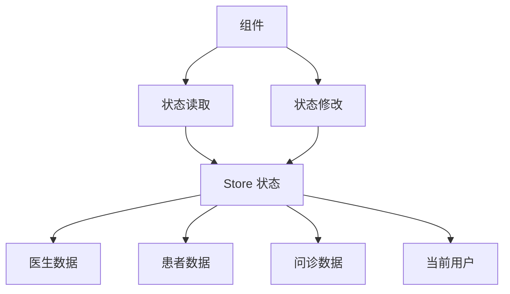
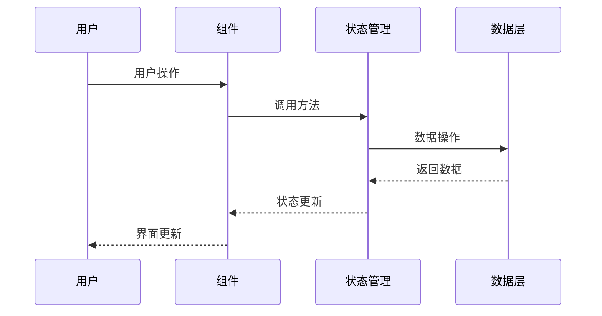
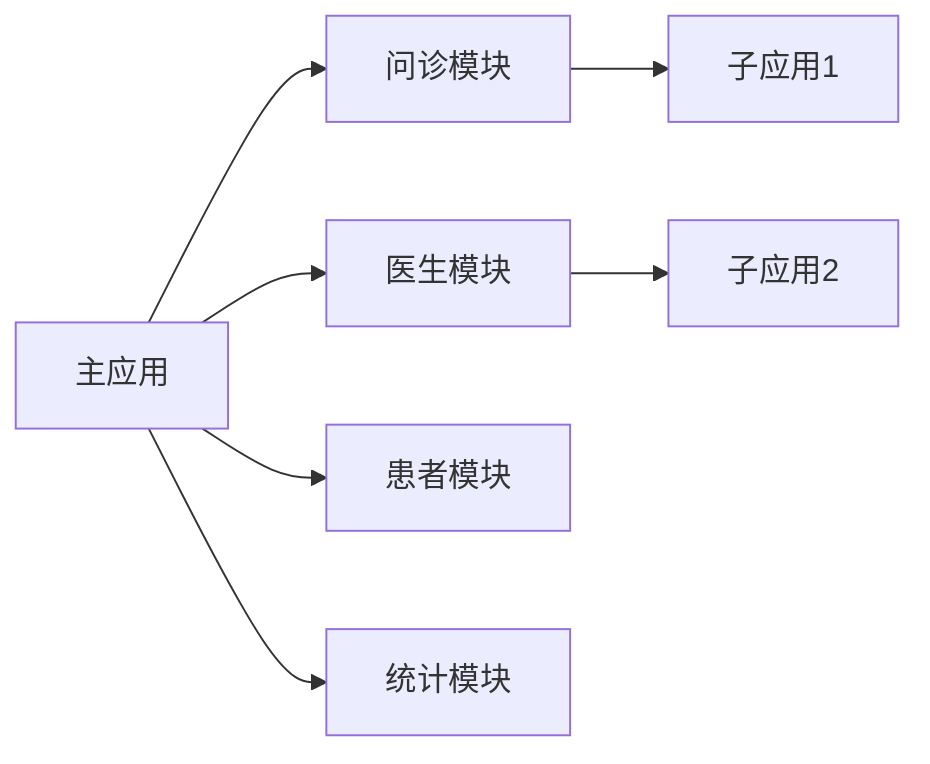
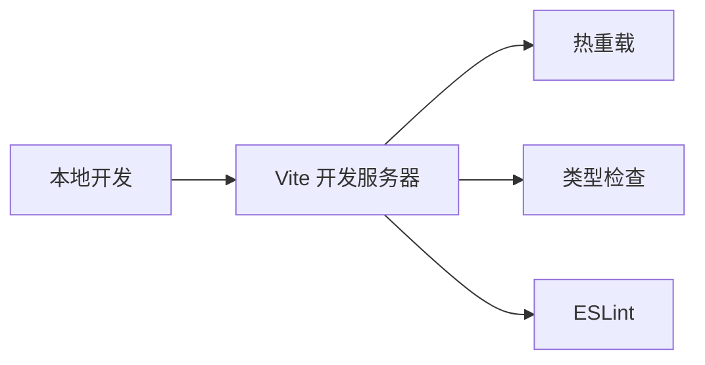
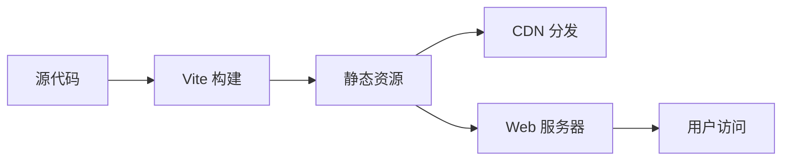

# 系统架构

## 概述
QA Live Healthcare 是一个基于现代前端技术栈的单页面应用（SPA），采用 Vue 3 + TypeScript 构建的在线医疗问诊平台。系统采用组件化、模块化的架构设计，具有良好的可扩展性和维护性。

## 架构总览



## 技术架构

### 前端架构


### 核心框架选择

#### Vue 3 + Composition API
- **优势**: 更好的类型支持、逻辑复用、代码组织
- **特点**: 组合式 API、响应式系统、TypeScript 集成

#### TypeScript
- **类型安全**: 编译时类型检查
- **开发体验**: 智能提示、代码重构
- **维护性**: 清晰的接口定义

#### Vite 构建工具
- **开发效率**: 快速的冷启动、热更新
- **构建优化**: 代码分割、Tree Shaking
- **插件生态**: 丰富的插件支持

## 应用架构

### 组件架构


### 路由架构


### 状态管理架构


## 模块设计

### 核心模块

#### 1. 用户认证模块
- **功能**: 医生登录、患者验证
- **组件**: `DoctorLogin.vue`, `Consultation.vue`（认证部分）
- **状态**: `currentDoctor`, `currentPatient`

#### 2. 问诊管理模块
- **功能**: 问题提交、问题查看、问题回答
- **组件**: `Consultation.vue`, `DoctorRoom.vue`
- **状态**: `questions` 列表

#### 3. 医生管理模块
- **功能**: 医生列表展示、医生详情
- **组件**: `Doctors.vue`, `Home.vue`（医生卡片）
- **状态**: `doctors` 列表

#### 4. 统计展示模块
- **功能**: 平台数据统计、实时状态展示
- **组件**: `Home.vue`（统计部分）
- **状态**: 计算属性动态生成

### 数据流设计



## 性能优化策略

### 1. 代码分割
```javascript
// 路由懒加载
const Home = () => import('./views/Home.vue')
const Consultation = () => import('./views/Consultation.vue')
```

### 2. 组件优化
- 使用 `v-if` 和 `v-show` 合理
- 计算属性缓存
- 事件处理防抖

### 3. 资源优化
- 图片懒加载
- 字体文件优化
- CSS 压缩

### 4. 构建优化
- Tree Shaking 移除未使用代码
- 代码分割按需加载
- Gzip 压缩

## 安全架构

### 前端安全措施
1. **输入验证**: 所有用户输入进行验证
2. **XSS 防护**: 使用 Vue 的模板转义
3. **CSRF 防护**: 后续可添加 token 验证
4. **数据脱敏**: 敏感信息显示处理

### 认证安全
- 医生密码前端加密（后续可改为后端加密）
- 会话超时处理
- 权限控制

## 扩展性设计

### 微前端架构准备


### 插件化设计
- 组件可插拔设计
- 功能模块化
- 配置外部化

### API 抽象层
- 统一的 HTTP 客户端
- 错误处理中间件
- 请求/响应拦截器

## 部署架构

### 开发环境


### 生产环境


### 环境配置
- 开发环境：热重载、调试工具
- 测试环境：完整功能测试
- 生产环境：优化构建、CDN 加速

## 监控与日志

### 前端监控
- 错误捕获和上报
- 性能指标监控
- 用户行为分析

### 日志系统
- 操作日志记录
- 错误日志收集
- 调试信息输出

## 未来架构演进

### 技术栈升级路径
1. **Vue 3** → **Vue 3.5+**（保持最新）
2. **状态管理** → **Pinia**（替代当前实现）
3. **构建工具** → **Vite 5+**（性能优化）

### 架构演进方向
1. **微服务化**: 后端服务拆分
2. **实时通信**: WebSocket 集成
3. **移动端**: PWA 或原生应用
4. **国际化**: 多语言支持

---
*此文件由 Context Builder 工具集生成，最后更新于 2026-04-21*