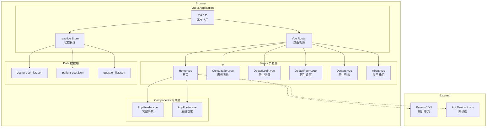
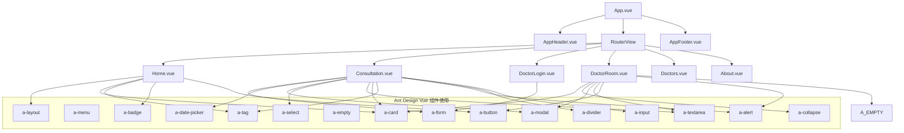
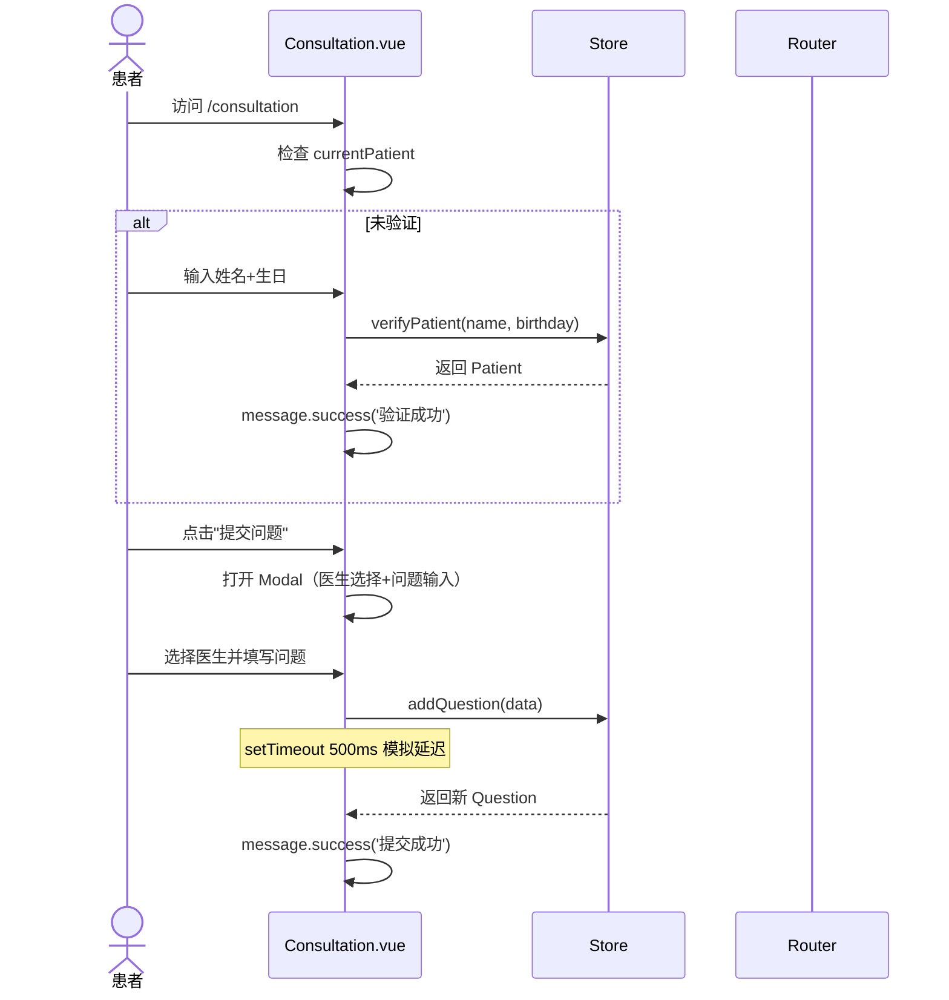
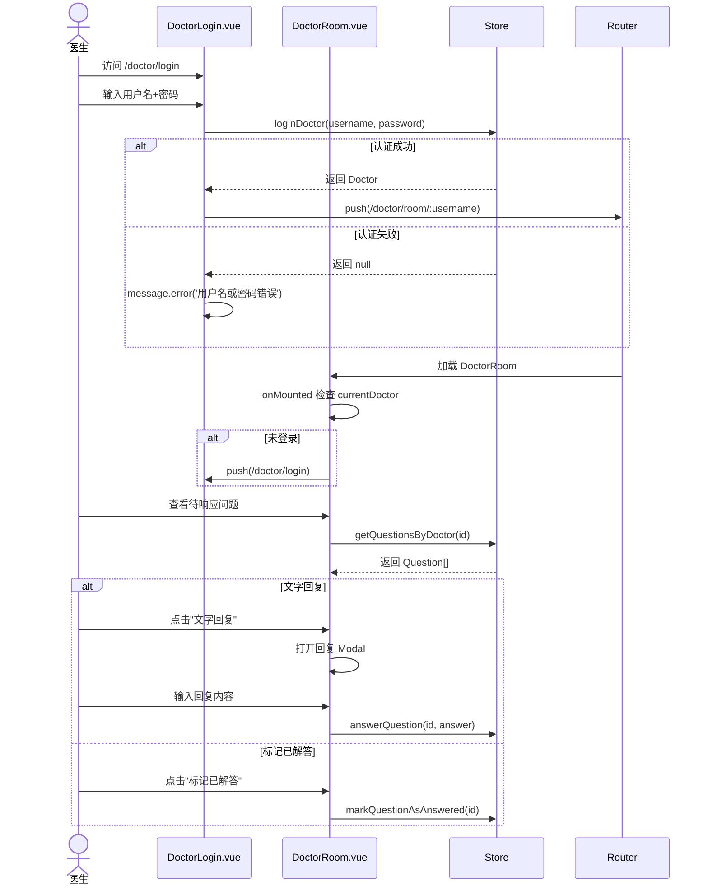

# 系统架构

## Overview
QA Live Healthcare 是一个纯前端单页应用（SPA），无后端服务、无数据库、无微服务。采用 Vue 3 Composition API 架构，数据存储在浏览器内存中。

## Architecture Diagram



## Architecture Layers

### 1. Entry Layer（入口层）
- **`index.html`** - SPA 入口 HTML，加载 `/src/main.ts`
- **`main.ts`** - 注册 Ant Design Vue（全量引入）+ Vue Router，挂载到 `#app`

### 2. Routing Layer（路由层）
- **`src/router/index.ts`** - 7 条路由，HTML5 History 模式
- **无路由守卫** - DoctorRoom 页面的鉴权在 `onMounted` 中手动检查

### 3. State Layer（状态层）
- **`src/store/index.ts`** - 自定义 reactive Store（非 Pinia/Vuex）
- 包含 Doctor、Patient、Question 三个接口定义
- 提供 11 个 Store 方法（登录/验证/查询/提交/回复等）

### 4. View Layer（视图层）
- 6 个页面组件，每个对应一个路由
- 共用 Header + Footer 全局布局（在 App.vue 中组合）

### 5. Data Layer（数据层）
- 3 个静态 JSON 文件作为初始数据
- 构建时打包进 bundle，运行时加载到 reactive state

## Component Architecture



## Key Business Flows

### Patient Consultation Flow（患者问诊流程）



### Doctor Room Flow（医生诊室流程）



## Design Decisions

### 为什么使用 reactive Store 而非 Pinia/Vuex？
- 项目为演示原型，数据量小且无持久化需求
- `reactive()` 足以满足简单的内存状态管理
- 减少依赖和代码复杂度

### 为什么无路由守卫？
- DoctorRoom 的鉴权在 `onMounted` 中通过 `store.state.currentDoctor` 检查
- 这是一个简化方案，生产环境应使用 `router.beforeEach` 全局守卫

### 为什么全量引入 Ant Design Vue？
- 简化配置，快速开发
- 缺点：打包体积大，生产环境应配置按需加载（unplugin-vue-components）

### 为什么使用 setTimeout 模拟异步？
- 无后端服务，用 500ms 延迟模拟网络请求
- 提供 loading 状态的真实感

## Technology Decision Matrix

| 决策点 | 选择 | 备选方案 | 选择理由 |
|--------|------|----------|----------|
| 状态管理 | reactive() | Pinia / Vuex | 项目简单，无需复杂状态管理 |
| UI 组件库 | Ant Design Vue | Element Plus | 医疗行业企业级风格 |
| CSS 方案 | Scoped CSS + 纯 CSS | SCSS / Tailwind | 减少构建依赖 |
| 日期处理 | dayjs | moment.js | 更轻量（2KB vs 67KB） |
| HTTP 客户端 | 无（内存数据） | axios / fetch | 项目无后端 |
| 图标方案 | @ant-design/icons-vue | 自定义 SVG | 与 Ant Design 风格统一 |

## External Dependencies

### CDN Resources
- **Pexels Images**: 医生头像和 Hero 背景图
  - `https://images.pexels.com/photos/5215024/...`
  - `https://images.pexels.com/photos/4386467/...`
  - 等 5 个不同的 Pexels 图片 URL

### NPM Dependencies
```json
{
  "dependencies": {
    "ant-design-vue": "^4.2.6",    // UI 组件库
    "dayjs": "^1.11.19",           // 日期格式化
    "vue": "^3.5.10",              // 核心框架
    "vue-router": "^4.6.3"         // 路由
  },
  "devDependencies": {
    "@vitejs/plugin-vue": "^5.1.4", // Vue Vite 插件
    "typescript": "^5.5.3",        // TypeScript 编译器
    "vite": "^5.4.8",              // 构建工具
    "vue-tsc": "^2.1.6"            // Vue TS 类型检查
  }
}
```

## Known Limitations

1. **无数据持久化** - 刷新页面丢失所有操作数据
2. **无真实后端** - 所有操作仅内存模拟
3. **无路由守卫** - 仅在组件内手动鉴权
4. **明文密码** - 医生密码以明文存储
5. **无并发控制** - 多标签页操作可能导致状态冲突
6. **全量打包** - Ant Design Vue 未做按需加载
7. **无错误边界** - 组件错误可能导致白屏
8. **HelloWorld.vue 残留** - 脚手架示例文件未清理

---

*此架构文档应在重大设计变更时更新。使用 `/asdm-context-update architecture` 保持文档最新。*
