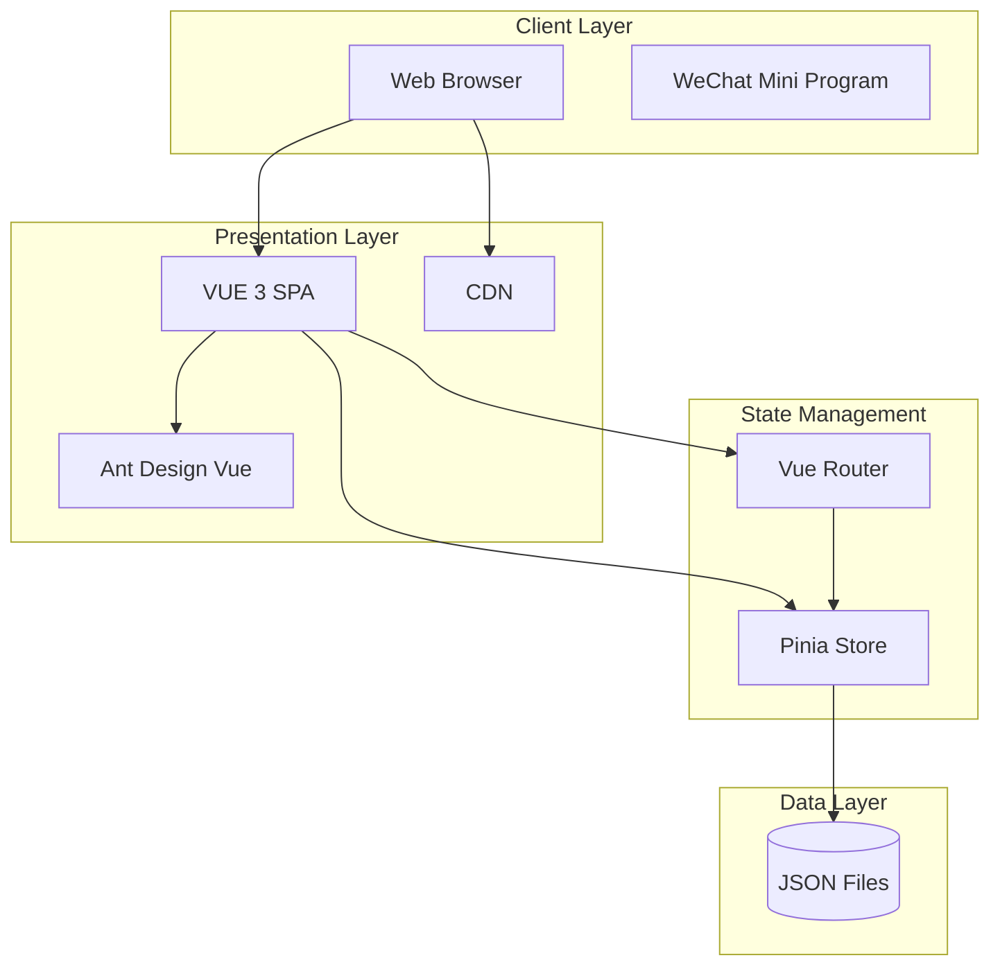
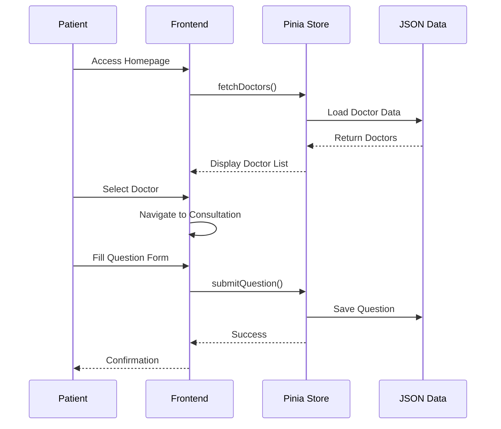
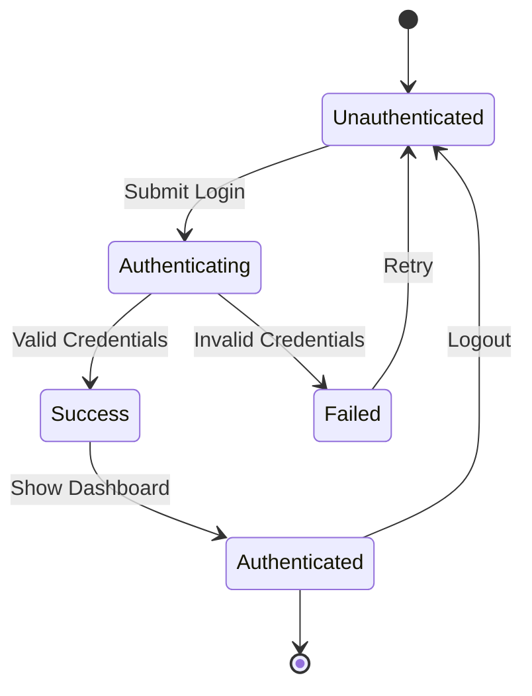

# System Architecture

## Overview
本文档描述了在线问诊健康医疗系统的整体架构、设计决策和技术选型。

## Architecture Overview

### High-Level Architecture Diagram


### Architecture Style
- **架构风格**: 单页应用 (SPA)，前端主导架构
- **核心框架**: Vue 3 + TypeScript
- **UI 组件库**: Ant Design Vue
- **状态管理**: Pinia (内存状态)
- **数据存储**: 本地 JSON 文件（演示数据）
- **路由**: Vue Router

### Technical Stack
| 层级 | 技术 | 版本 |
|------|------|------|
| 框架 | Vue | 3.x |
| 语言 | TypeScript | 5.x |
| 构建工具 | Vite | 5.x |
| UI 组件库 | Ant Design Vue | 4.x |
| 路由 | Vue Router | 4.x |
| 状态管理 | Pinia | 2.x |

## Architecture Principles

### 1. Separation of Concerns
- **视图层 (Views)**: 页面级组件，处理路由视图
- **组件层 (Components)**: 可复用 UI 组件
- **逻辑层 (Store)**: 状态管理和业务逻辑
- **路由层 (Router)**: 页面导航和权限控制
- **数据层 (Data)**: 静态 JSON 数据模拟

### 2. Component-Based Architecture
- 组件高度解耦，可独立开发和测试
- 统一的组件接口设计
- Props 向下传递，事件向上传递
- Composables 实现逻辑复用

### 3. Type-Safe Development
- TypeScript 静态类型检查
- 完整的接口类型定义
- 路由配置类型安全

### 4. Responsive Design
- 移动优先的响应式设计
- Flexbox 和 Grid 布局
- 统一的间距和字体系统

## Component Details

### Views Layer
**职责**: 页面级组件，对应路由
```
src/views/
├── Home.vue           # 首页
├── Consultation.vue    # 问诊页面
├── DoctorLogin.vue     # 医生登录
├── DoctorRoom.vue      # 医生诊室
├── Doctors.vue         # 医生列表
└── About.vue          # 关于页面
```

### Components Layer
**职责**: 可复用 UI 组件
```
src/components/
├── AppHeader.vue       # 应用头部
├── AppFooter.vue       # 应用底部
├── DoctorCard.vue      # 医生卡片
├── QuestionForm.vue    # 问题表单
├── ConsultationCard.vue # 问诊卡片
└── ...
```

### Store Layer (Pinia)
**职责**: 集中状态管理，处理业务逻辑
```typescript
// Store 结构
interface HealthStore {
  // State
  doctors: Doctor[];
  patients: Patient[];
  questions: Question[];
  currentUser: Doctor | Patient | null;
  
  // Actions
  loginAsDoctor(credentials): Promise<boolean>;
  loginAsPatient(credentials): Promise<boolean>;
  submitQuestion(question): Promise<void>;
  fetchDoctors(): Promise<void>;
  fetchQuestions(): Promise<void>;
}
```

### Router Layer
**职责**: 路由配置和导航守卫
```typescript
// 路由结构
const routes = [
  { path: '/', name: 'Home', component: Home },
  { path: '/consultation', name: 'Consultation', component: Consultation },
  { path: '/consultation/:doctorUsername', name: 'ConsultationRoom', component: Consultation },
  { path: '/doctors', name: 'Doctors', component: Doctors },
  { path: '/doctor/login', name: 'DoctorLogin', component: DoctorLogin },
  { path: '/doctor/room/:username', name: 'DoctorRoom', component: DoctorRoom },
];
```

## Data Flow Patterns

### Patient Consultation Flow


### Doctor Login Flow


## Design Patterns

### Store Pattern (Pinia)
```typescript
// Store 定义示例
import { defineStore } from 'pinia';

interface Doctor {
  username: string;
  name: string;
  department: string;
  title: string;
  hospital: string;
  avatar: string;
  rating: number;
  consultationCount: number;
  isOnline: boolean;
}

export const useHealthStore = defineStore('health', {
  state: () => ({
    doctors: [] as Doctor[],
    currentDoctor: null as Doctor | null,
    loading: false,
  }),
  
  actions: {
    async loginAsDoctor(username: string, password: string): Promise<boolean> {
      this.loading = true;
      try {
        // 验证逻辑
        const doctor = this.doctors.find(d => d.username === username);
        if (doctor && password === '123456') {
          this.currentDoctor = doctor;
          return true;
        }
        return false;
      } finally {
        this.loading = false;
      }
    },
  },
});
```

### Component Props Pattern
```typescript
// Props 定义示例
interface Props {
  doctor: Doctor;
  showActions?: boolean;
  compact?: boolean;
}

const props = withDefaults(defineProps<Props>(), {
  showActions: true,
  compact: false,
});
```

### Router Navigation Pattern
```typescript
// 编程式导航
import { useRouter } from 'vue-router';

const router = useRouter();

// 带参数导航
router.push({
  name: 'ConsultationRoom',
  params: { doctorUsername: doctor.username },
});

// 查询参数
router.push({
  name: 'Doctors',
  query: { department: 'cardiology' },
});
```

## Security Architecture

### Client-Side Authentication
```typescript
// Store 认证状态
interface AuthState {
  currentUser: Doctor | Patient | null;
  userType: 'doctor' | 'patient' | null;
  isAuthenticated: boolean;
}

// 登录验证
async function loginAsDoctor(username: string, password: string): Promise<boolean> {
  // 验证医生凭证（实际应用中应调用后端 API）
  const doctor = await fetchDoctorByUsername(username);
  if (doctor && validatePassword(password)) {
    this.currentDoctor = doctor;
    this.userType = 'doctor';
    return true;
  }
  return false;
}
```

### Route Guards
```typescript
// 路由守卫示例
router.beforeEach((to, from, next) => {
  const store = useHealthStore();
  
  // 需要医生权限的路由
  if (to.path.startsWith('/doctor/room') && !store.currentDoctor) {
    next({ name: 'DoctorLogin', query: { redirect: to.fullPath } });
    return;
  }
  
  next();
});
```

## Performance Considerations

### Code Splitting
- 按路由进行代码分割
- 组件懒加载
- Tree shaking 优化

### Caching Strategy
- 浏览器缓存静态资源
- JSON 数据缓存于 Store
- Keep-alive 缓存组件状态

### Bundle Optimization
```typescript
// vite.config.ts
export default defineConfig({
  build: {
    rollupOptions: {
      output: {
        manualChunks: {
          vendor: ['vue', 'vue-router', 'pinia'],
          antd: ['ant-design-vue'],
        },
      },
    },
  },
});
```

## Project Structure

```
qa-live-healthcare/
├── public/                 # 静态资源
│   └── *.svg              # SVG 图标
├── src/
│   ├── assets/            # 资源文件
│   ├── components/        # 可复用组件
│   │   ├── AppHeader.vue
│   │   ├── AppFooter.vue
│   │   ├── DoctorCard.vue
│   │   └── ...
│   ├── data/              # JSON 模拟数据
│   │   ├── doctor-user-list.json
│   │   ├── patient-user.json
│   │   └── question-list.json
│   ├── router/            # 路由配置
│   │   └── index.ts
│   ├── store/             # 状态管理
│   │   └── index.ts
│   ├── views/             # 页面组件
│   │   ├── Home.vue
│   │   ├── Consultation.vue
│   │   ├── DoctorLogin.vue
│   │   ├── DoctorRoom.vue
│   │   ├── Doctors.vue
│   │   └── About.vue
│   ├── App.vue            # 根组件
│   ├── main.ts            # 入口文件
│   └── style.css          # 全局样式
├── .asdm/                 # ASDM 配置
│   ├── contexts/          # 上下文文件
│   └── toolsets/          # 工具集
├── index.html             # HTML 入口
├── package.json           # 依赖配置
├── vite.config.ts         # Vite 配置
└── tsconfig.json          # TypeScript 配置
```

## Future Architecture Evolution

### Phase 1: Add Backend API
- 迁移 JSON 数据到后端数据库
- 实现 RESTful API
- 添加用户认证服务

### Phase 2: Real-time Communication
- WebSocket 实现实时问诊
- 消息推送服务
- 在线状态同步

### Phase 3: Multi-Platform
- 微信小程序适配
- 移动端 PWA
- API 统一网关

### Versioning Strategy
- **API Versioning**: URL path versioning (`/api/v1/`, `/api/v2/`)
- **Database Migrations**: Flyway/Liquibase for schema evolution
- **Service Compatibility**: Backward compatibility for 2 major versions
- **Deprecation Policy**: 6 months notice before breaking changes

---

*此架构文档在发生重大设计变更时应更新。使用 `/asdm-context-update` 保持文档最新。*
