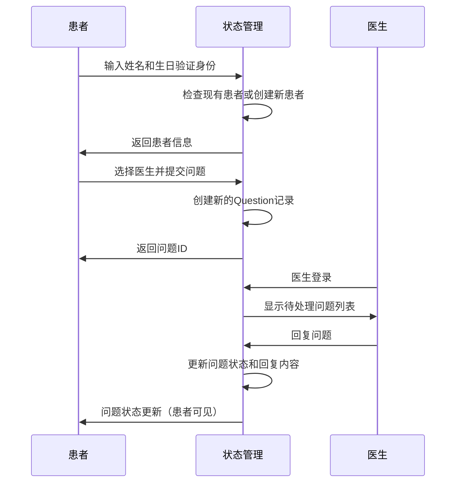
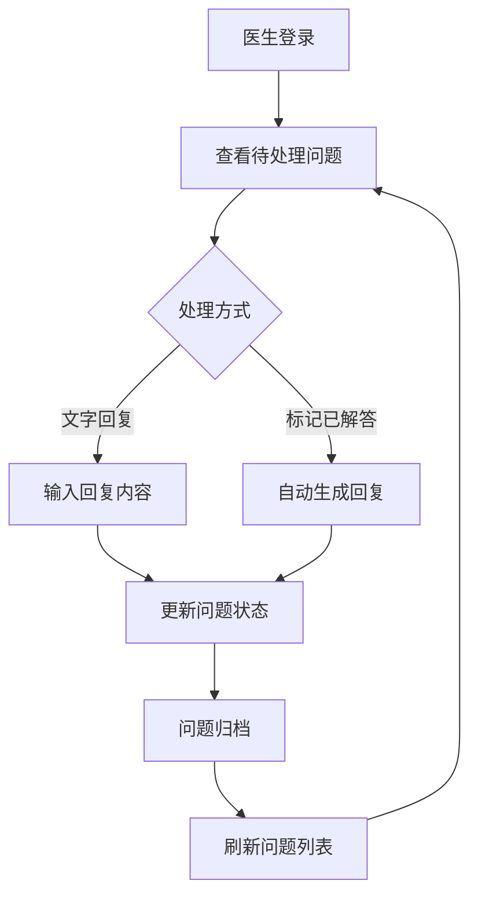

# 数据模型文档

## 📊 数据模型概览

QA Live Healthcare 应用采用客户端状态管理模式，数据模型主要包含三大核心实体：医生、患者和咨询问题。所有数据通过 TypeScript 接口定义，并存储在客户端的内存状态中。

## 🏗️ 实体关系图


## 🔧 实体定义

### 1. 医生实体 (Doctor)

**定义位置**: `src/store/index.ts`

```typescript
export interface Doctor {
  id: string;              // 医生唯一标识符
  username: string;        // 用户名（登录用）
  password: string;        // 密码
  name: string;           // 医生姓名
  title: string;          // 职称（如：主任医师）
  department: string;     // 科室
  avatar: string;         // 头像URL
  experience: string;     // 从业经验
  specialties: string[];  // 擅长领域
  isActive: boolean;      // 是否在线状态
}
```

**示例数据**（来自 `src/data/doctor-user-list.json`）:
```json
{
  "id": "doctor1",
  "username": "zhangweiming",
  "password": "123456",
  "name": "张伟明",
  "title": "主任医师",
  "department": "心血管内科",
  "avatar": "https://example.com/doctor1.jpg",
  "experience": "从业15年",
  "specialties": ["高血压", "冠心病", "心律失常"],
  "isActive": true
}
```

### 2. 患者实体 (Patient)

**定义位置**: `src/store/index.ts`

```typescript
export interface Patient {
  id: string;          // 患者唯一标识符
  name: string;       // 患者姓名
  birthday: string;   // 生日（YYYY-MM-DD格式）
  phone: string;      // 联系电话
  gender: string;     // 性别
}
```

**示例数据**（来自 `src/data/patient-user.json`）:
```json
{
  "id": "patient1",
  "name": "李小明",
  "birthday": "1985-06-15",
  "phone": "13800138000",
  "gender": "男"
}
```

### 3. 咨询问题实体 (Question)

**定义位置**: `src/store/index.ts`

```typescript
export interface Question {
  id: string;                     // 问题唯一标识符
  patientId: string;             // 患者ID（外键）
  patientName: string;           // 患者姓名
  doctorId: string;              // 医生ID（外键）
  doctorName: string;            // 医生姓名
  question: string;              // 问题内容
  submitTime: string;            // 提交时间（ISO格式）
  status: 'pending' | 'answered'; // 问题状态
  answer: string | null;         // 医生回复内容
  answerTime: string | null;     // 回复时间（ISO格式）
}
```

**状态说明**:
- `pending`: 待解答状态
- `answered`: 已解答状态

**示例数据**（来自 `src/data/question-list.json`）:
```json
{
  "id": "q123456789",
  "patientId": "patient1",
  "patientName": "李小明",
  "doctorId": "doctor1",
  "doctorName": "张伟明",
  "question": "最近感觉胸闷，偶尔有疼痛感，请问需要做什么检查？",
  "submitTime": "2024-01-15T10:30:00Z",
  "status": "answered",
  "answer": "建议您先做心电图检查，同时注意休息，避免剧烈运动。",
  "answerTime": "2024-01-15T14:20:00Z"
}
```

## 📁 数据存储结构

### 应用状态 (State)

**定义位置**: `src/store/index.ts`

```typescript
interface State {
  doctors: Doctor[];           // 医生列表
  patients: Patient[];         // 患者列表
  questions: Question[];       // 咨询问题列表
  currentDoctor: Doctor | null; // 当前登录医生
  currentPatient: Patient | null; // 当前登录患者
}
```

### 数据文件结构

应用使用 JSON 文件作为初始数据源：

```
src/data/
├── doctor-user-list.json    # 医生数据
├── patient-user.json        # 患者数据
└── question-list.json       # 咨询问题数据
```

## 🔄 数据操作 API

### 状态管理方法

**医生相关操作**:
```typescript
// 医生登录
loginDoctor(username: string, password: string): Doctor | null

// 医生登出
logoutDoctor(): void

// 根据用户名获取医生信息
getDoctorByUsername(username: string): Doctor | undefined

// 获取在线医生列表
getActiveDoctors(): Doctor[]
```

**患者相关操作**:
```typescript
// 患者身份验证（自动创建新患者）
verifyPatient(name: string, birthday: string): Patient

// 患者登出
logoutPatient(): void

// 根据患者ID获取问题列表
getQuestionsByPatient(patientId: string): Question[]
```

**咨询问题相关操作**:
```typescript
// 根据医生ID获取问题列表
getQuestionsByDoctor(doctorId: string): Question[]

// 提交新问题
addQuestion(questionData: Omit<Question, 'id' | 'submitTime' | 'status' | 'answer' | 'answerTime'>): Question

// 回复问题
answerQuestion(questionId: string, answer: string): void

// 标记问题为已解答（无文字回复）
markQuestionAsAnswered(questionId: string): void
```

**统计信息**:
```typescript
// 获取系统统计信息
getStatistics(): {
  totalDoctors: number;      // 医生总数
  totalQuestions: number;    // 问题总数
  activeSessions: number;    // 待响应问题数
  totalSessions: number;     // 在线诊室数
}
```

## 📊 数据流程

### 1. 患者咨询流程


### 2. 医生工作流程


## 🔍 数据验证规则

### 患者身份验证
- **姓名**: 必填，非空字符串
- **生日**: 必填，有效日期格式（YYYY-MM-DD）
- **验证逻辑**: 同一姓名+生日组合视为同一患者

### 问题提交验证
- **医生选择**: 必选，有效医生ID
- **问题内容**: 必填，非空字符串
- **患者状态**: 必须已通过身份验证

### 医生回复验证
- **回复内容**: 非空字符串（仅文字回复时）
- **问题状态**: 必须为待处理状态

## 📈 数据统计指标

应用提供以下关键指标：
- **医生总数**: 系统注册医生数量
- **问题总数**: 历史咨询问题总量
- **待响应问题**: 当前需要医生处理的咨询数
- **在线诊室**: 当前活跃的医生诊室数量

## 💡 扩展建议

### 当前数据模型特点
- **客户端存储**: 所有数据存储在浏览器内存中
- **简单验证**: 基于姓名和生日的患者识别
- **实时更新**: 状态变化立即反映在UI中

### 未来扩展方向
- **持久化存储**: 集成后端数据库
- **用户权限**: 更完善的身份验证系统
- **数据加密**: 医疗数据的隐私保护
- **历史记录**: 咨询记录的长期存储和分析

---

*最后更新: 2026年4月21日*  
*本文档由 Context Builder 工具集自动生成*