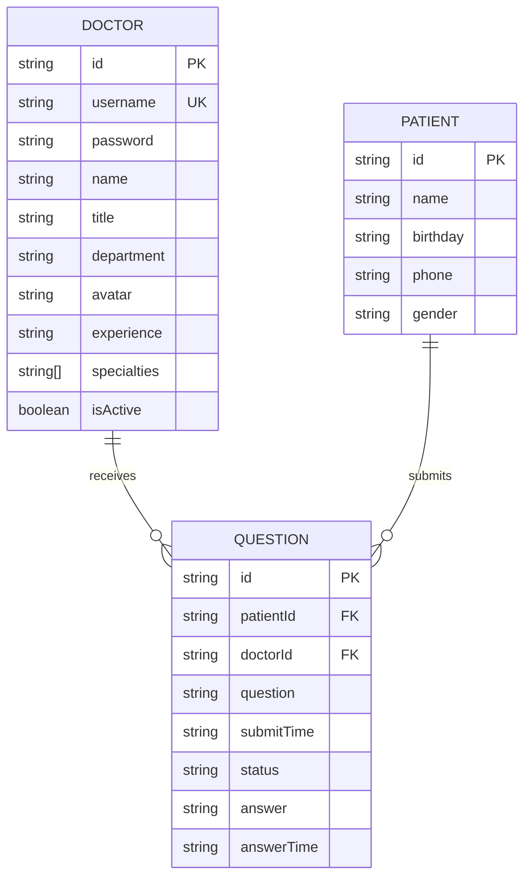
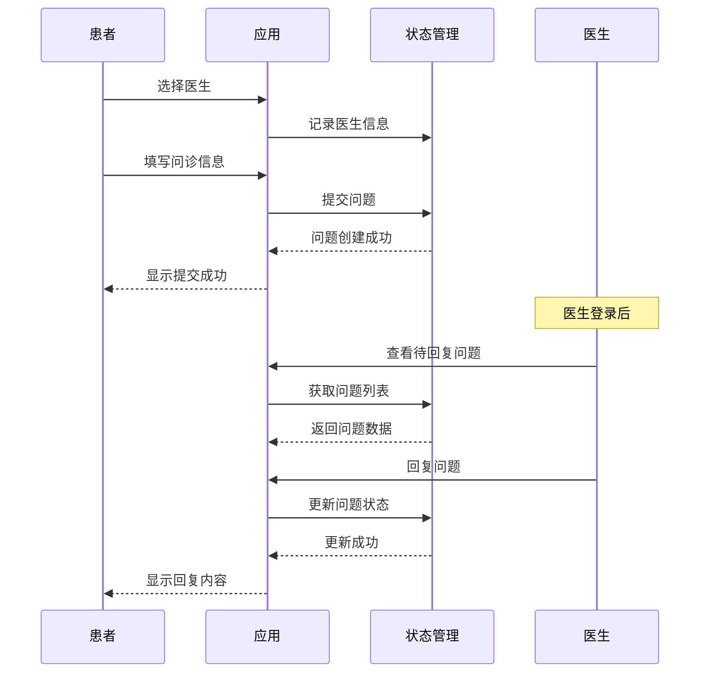
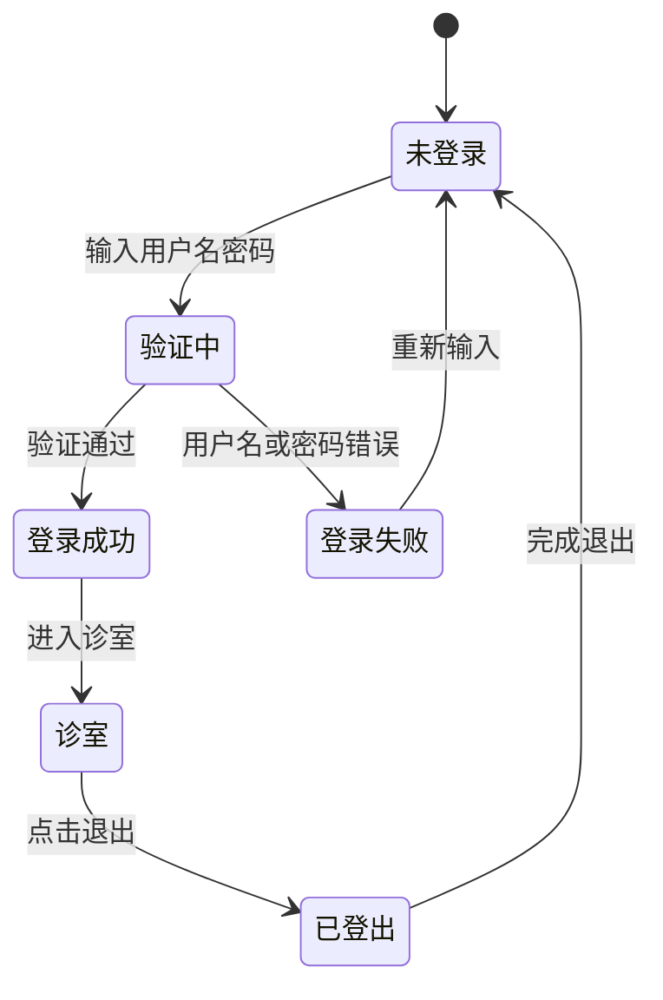

# 数据模型

## 概述

本文档描述了在线医疗问诊平台的数据模型、关系和数据流。数据采用 JSON 文件模拟后端存储，位于 `src/data/` 目录。

## 数据模型概览



## 实体定义

### Doctor（医生）

**用途**: 表示平台上的医生用户信息。

```typescript
interface Doctor {
  id: string;           // 医生ID，如 "doc001"
  username: string;     // 用户名，用于登录，如 "dr-zhang-wei"
  password: string;     // 密码，如 "123456"
  name: string;         // 姓名，如 "张伟医生"
  title: string;        // 职称，如 "主任医师"
  department: string;   // 科室，如 "心内科"
  avatar: string;       // 头像图片URL
  experience: string;    // 从业经验，如 "15年临床经验"
  specialties: string[]; // 专长领域，如 ["高血压", "冠心病"]
  isActive: boolean;    // 是否在线接诊
}
```

### Patient（患者）

**用途**: 表示使用平台问诊服务的患者。

```typescript
interface Patient {
  id: string;       // 患者ID，如 "patient001"
  name: string;     // 姓名，如 "王小明"
  birthday: string; // 出生日期，如 "1990-05-15"
  phone: string;    // 联系电话，如 "13800138000"
  gender: string;   // 性别，如 "男" 或 "女"
}
```

### Question（问诊问题）

**用途**: 表示患者的问诊记录和医生的回复。

```typescript
interface Question {
  id: string;           // 问题ID，如 "q1234567890"
  patientId: string;   // 患者ID
  patientName: string;  // 患者姓名
  doctorId: string;     // 医生ID
  doctorName: string;   // 医生姓名
  question: string;     // 问题内容
  submitTime: string;   // 提交时间（ISO格式）
  status: 'pending' | 'answered';  // 状态：待回复/已回复
  answer: string | null; // 医生回复内容
  answerTime: string | null;  // 回复时间
}
```

## 数据关系


### 一对多关系

1. **医生 → 问诊问题**: 一个医生可接收多个患者的问诊
2. **患者 → 问诊问题**: 一个患者可提交多个问诊问题

## 数据文件结构

### doctor-user-list.json

```json
[
  {
    "id": "doc001",
    "username": "dr-zhang-wei",
    "password": "123456",
    "name": "张伟医生",
    "title": "主任医师",
    "department": "心内科",
    "avatar": "https://images.pexels.com/photos/5215024/pexels-photo-5215024.jpeg?auto=compress&cs=tinysrgb&w=400",
    "experience": "15年临床经验",
    "specialties": ["高血压", "冠心病", "心律失常"],
    "isActive": true
  }
]
```

### patient-user.json

```json
[
  {
    "id": "patient001",
    "name": "王小明",
    "birthday": "1990-05-15",
    "phone": "13800138000",
    "gender": "男"
  }
]
```

### question-list.json

```json
[
  {
    "id": "q001",
    "patientId": "patient001",
    "patientName": "王小明",
    "doctorId": "doc001",
    "doctorName": "张伟医生",
    "question": "医生您好，我最近经常感到胸闷气短，是什么原因？",
    "submitTime": "2024-01-15T10:30:00Z",
    "status": "pending",
    "answer": null,
    "answerTime": null
  }
]
```

## 数据流程图

### 患者问诊流程



### 医生登录流程



## 数据验证规则

### 医生数据验证

```typescript
const doctorValidationRules = {
  id: {
    required: true,
    pattern: /^doc\d{3}$/,
    message: '医生ID格式错误'
  },
  username: {
    required: true,
    minLength: 3,
    maxLength: 50,
    pattern: /^[a-z0-9-]+$/,
    message: '用户名只能包含小写字母、数字和连字符'
  },
  password: {
    required: true,
    minLength: 6,
    message: '密码至少6位'
  },
  name: {
    required: true,
    minLength: 2,
    maxLength: 50,
    message: '姓名长度需在2-50字符之间'
  },
  title: {
    required: true,
    enum: ['主任医师', '副主任医师', '主治医师', '住院医师'],
    message: '职称格式不正确'
  },
  department: {
    required: true,
    minLength: 2,
    message: '科室不能为空'
  },
  specialties: {
    required: true,
    minItems: 1,
    maxItems: 5,
    message: '专长领域需1-5项'
  }
};
```

### 问诊问题验证

```typescript
const questionValidationRules = {
  patientId: {
    required: true,
    message: '患者ID不能为空'
  },
  doctorId: {
    required: true,
    message: '医生ID不能为空'
  },
  question: {
    required: true,
    minLength: 10,
    maxLength: 2000,
    message: '问题内容需在10-2000字符之间'
  },
  status: {
    required: true,
    enum: ['pending', 'answered'],
    message: '状态值不正确'
  }
};
```

## 数据统计

```typescript
// 获取统计信息
interface Statistics {
  totalDoctors: number;      // 医生总数
  totalQuestions: number;    // 问题总数
  activeSessions: number;     // 待回复问题数
  totalSessions: number;      // 在线诊室数
}

function getStatistics(): Statistics {
  return {
    totalDoctors: state.doctors.length,
    totalQuestions: state.questions.length,
    activeSessions: state.questions.filter(q => q.status === 'pending').length,
    totalSessions: state.doctors.filter(d => d.isActive).length,
  };
}
```

## 相关文档

- [项目结构](./standard-project-structure.md)
- [API 定义](./api.md)
- [架构设计](./architecture.md)

---

*本数据模型文档基于实际业务需求制定，随着业务发展可能需要调整。*
