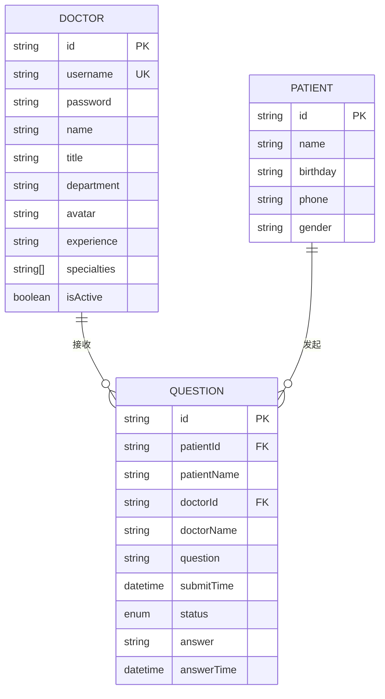
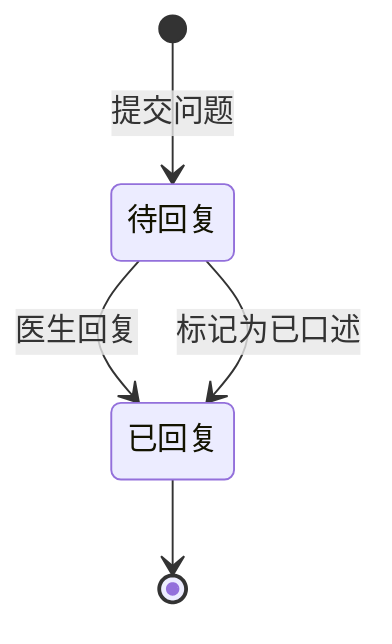
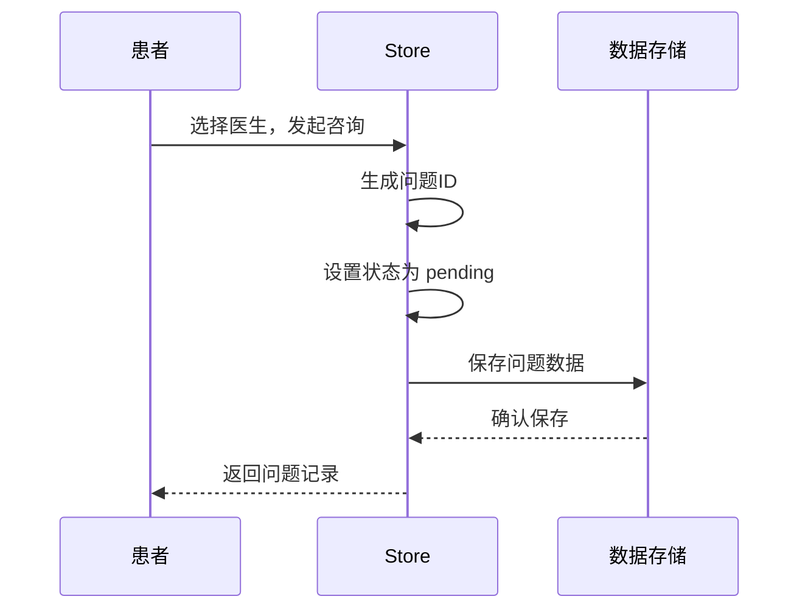
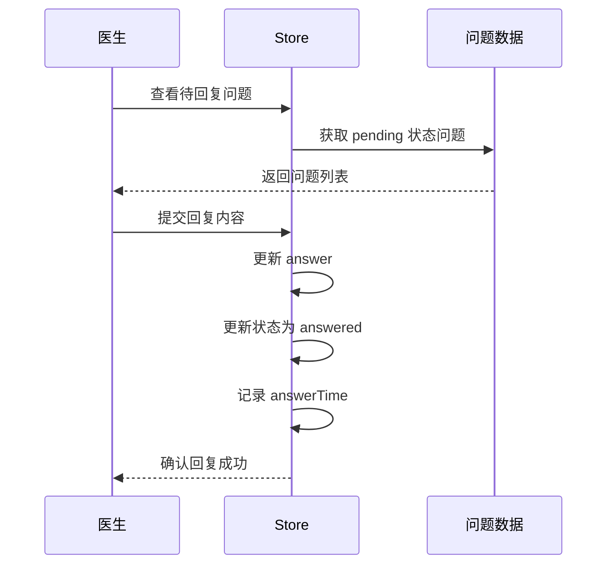

# 数据模型

## 概述

本文档定义了在线医疗咨询平台（qa-live-healthcare）的数据模型，包括实体定义、数据结构、关系映射和业务规则。系统采用静态JSON数据存储，用于模拟真实的数据持久化场景。

## 技术实现

### 数据存储策略

- **静态JSON文件**：存放于 `src/data/` 目录
- **响应式状态管理**：使用 Vue 3 的 `reactive()` 实现状态管理
- **类型安全**：使用 TypeScript 接口定义数据结构

### 数据文件结构

```
src/data/
├── doctor-user-list.json    # 医生用户数据
├── patient-user.json         # 患者用户数据
└── question-list.json        # 咨询问题数据
```

---

## 实体定义

### 1. 医生实体（Doctor）

医生是平台的核心用户角色，提供医疗咨询服务。

```typescript
interface Doctor {
  /** 医生唯一标识 */
  id: string;
  
  /** 登录用户名（唯一） */
  username: string;
  
  /** 登录密码 */
  password: string;
  
  /** 医生姓名 */
  name: string;
  
  /** 职称：主任医师、副主任医师、主治医师等 */
  title: string;
  
  /** 所属科室 */
  department: string;
  
  /** 头像图片URL */
  avatar: string;
  
  /** 从业经验描述 */
  experience: string;
  
  /** 专业领域标签数组 */
  specialties: string[];
  
  /** 在线状态：true=在线可咨询，false=离线 */
  isActive: boolean;
}
```

#### 示例数据

```json
{
  "id": "doc001",
  "username": "dr-zhang-wei",
  "password": "123456",
  "name": "张伟医生",
  "title": "主任医师",
  "department": "心内科",
  "avatar": "https://images.pexels.com/photos/5215024/pexels-photo-5215024.jpeg",
  "experience": "15年临床经验",
  "specialties": ["高血压", "冠心病", "心律失常"],
  "isActive": true
}
```

#### 业务规则

| 字段 | 约束 | 说明 |
|------|------|------|
| `id` | 唯一，非空 | 格式：`doc` + 序号 |
| `username` | 唯一，非空 | 英文字母+数字组合 |
| `password` | 非空 | 最小6位 |
| `name` | 非空 | 2-20个字符 |
| `title` | 非空 | 枚举：主任医师、副主任医师、主治医师、住院医师 |
| `department` | 非空 | 科室名称 |
| `specialties` | 至少1项 | 医生擅长领域 |
| `isActive` | 必须 | 布尔值，表示在线状态 |

---

### 2. 患者实体（Patient）

患者是平台的另一核心用户角色，寻求医疗咨询服务。

```typescript
interface Patient {
  /** 患者唯一标识 */
  id: string;
  
  /** 患者姓名 */
  name: string;
  
  /** 出生日期 */
  birthday: string;
  
  /** 联系电话（脱敏显示） */
  phone: string;
  
  /** 性别 */
  gender: '男' | '女';
}
```

#### 示例数据

```json
{
  "id": "patient001",
  "name": "赵明",
  "birthday": "1985-03-15",
  "phone": "138****1234",
  "gender": "男"
}
```

#### 业务规则

| 字段 | 约束 | 说明 |
|------|------|------|
| `id` | 唯一，非空 | 格式：`patient` + 序号 |
| `name` | 非空 | 2-20个字符 |
| `birthday` | 非空，合法日期 | 格式：YYYY-MM-DD |
| `phone` | 可为空 | 手机号脱敏显示 |
| `gender` | 非空 | 枚举：男、女 |

---

### 3. 咨询问题实体（Question）

咨询问题是患者向医生发起的医疗咨询记录。

```typescript
interface Question {
  /** 问题唯一标识 */
  id: string;
  
  /** 提问患者ID */
  patientId: string;
  
  /** 提问患者姓名 */
  patientName: string;
  
  /** 目标医生ID */
  doctorId: string;
  
  /** 目标医生姓名 */
  doctorName: string;
  
  /** 问题描述 */
  question: string;
  
  /** 提交时间（ISO 8601格式） */
  submitTime: string;
  
  /** 咨询状态 */
  status: 'pending' | 'answered';
  
  /** 医生回复内容 */
  answer: string | null;
  
  /** 回复时间 */
  answerTime: string | null;
}
```

#### 示例数据

```json
{
  "id": "q001",
  "patientId": "patient001",
  "patientName": "赵明",
  "doctorId": "doc001",
  "doctorName": "张伟医生",
  "question": "最近总是感觉胸闷气短，特别是爬楼梯的时候，这是什么原因？",
  "submitTime": "2025-11-02T09:30:00",
  "status": "answered",
  "answer": "根据您的描述，可能是心脏功能问题。建议您做个心电图和心脏彩超检查。",
  "answerTime": "2025-11-02T09:45:00"
}
```

#### 业务规则

| 字段 | 约束 | 说明 |
|------|------|------|
| `id` | 唯一，非空 | 格式：`q` + 序号或时间戳 |
| `patientId` | 必须引用存在的患者 | 外键关联 |
| `doctorId` | 必须引用存在的医生 | 外键关联 |
| `question` | 非空，10-500字 | 详细描述症状 |
| `submitTime` | 非空 | ISO 8601 时间格式 |
| `status` | 必须 | pending=待回复，answered=已回复 |
| `answer` | 可为空 | 仅当status为answered时有值 |
| `answerTime` | 可为空 | 仅当status为answered时有值 |

---

## 实体关系图

### ER图（Mermaid）



### 关系说明

| 关系类型 | 描述 |
|----------|------|
| **Doctor → Question** | 一对多关系，一个医生可以接收多个患者的咨询问题 |
| **Patient → Question** | 一对多关系，一个患者可以发起多个咨询问题 |

---

## 状态机

### 咨询问题状态流转



### 状态说明

| 状态 | 值 | 说明 | 触发条件 |
|------|-----|------|----------|
| 待回复 | `pending` | 问题已提交，等待医生处理 | 患者提交问题 |
| 已回复 | `answered` | 医生已给出回复或标记 | 医生回答或口述 |

---

## 数据统计

系统提供以下统计数据：

```typescript
interface Statistics {
  /** 医生总数 */
  totalDoctors: number;
  
  /** 问题总数 */
  totalQuestions: number;
  
  /** 待回复问题数 */
  activeSessions: number;
  
  /** 在线医生数 */
  totalSessions: number;
}
```

### 统计计算规则

| 指标 | 计算方式 |
|------|----------|
| `totalDoctors` | `state.doctors.length` |
| `totalQuestions` | `state.questions.length` |
| `activeSessions` | `questions.filter(q => q.status === 'pending').length` |
| `totalSessions` | `doctors.filter(d => d.isActive).length` |

---

## 数据操作接口

### Store 方法映射

```typescript
export const store = {
  // 医生操作
  loginDoctor(username: string, password: string): Doctor | null;
  logoutDoctor(): void;
  getDoctorByUsername(username: string): Doctor | undefined;
  getActiveDoctors(): Doctor[];
  
  // 患者操作
  verifyPatient(name: string, birthday: string): Patient;
  logoutPatient(): void;
  
  // 问题操作
  getQuestionsByDoctor(doctorId: string): Question[];
  getQuestionsByPatient(patientId: string): Question[];
  addQuestion(question: QuestionInput): Question;
  answerQuestion(questionId: string, answer: string): void;
  markQuestionAsAnswered(questionId: string): void;
  
  // 统计
  getStatistics(): Statistics;
};
```

### 新增问题输入类型

```typescript
type QuestionInput = Omit<Question, 'id' | 'submitTime' | 'status' | 'answer' | 'answerTime'>;
```

---

## 科室与专业领域

### 科室列表

| 科室ID | 科室名称 | 说明 |
|--------|----------|------|
| cardiology | 心内科 | 心脏及心血管疾病 |
| pediatrics | 儿科 | 儿童疾病 |
| orthopedics | 骨科 | 骨骼、关节疾病 |
| obstetrics | 妇产科 | 孕产及妇科疾病 |
| gastroenterology | 消化内科 | 消化系统疾病 |

### 职称等级

| 等级 | 职称 |
|------|------|
| 1 | 主任医师 |
| 2 | 副主任医师 |
| 3 | 主治医师 |
| 4 | 住院医师 |

---

## 验证规则

### 医生登录验证

```typescript
function loginDoctor(username: string, password: string): Doctor | null {
  return state.doctors.find(
    d => d.username === username && d.password === password
  ) ?? null;
}
```

### 患者身份验证

```typescript
function verifyPatient(name: string, birthday: string): Patient {
  let patient = state.patients.find(
    p => p.name === name && p.birthday === birthday
  );
  
  // 不存在则创建新患者
  if (!patient) {
    patient = {
      id: `patient${Date.now()}`,
      name,
      birthday,
      phone: '',
      gender: '',
    };
    state.patients.push(patient);
  }
  
  return patient;
}
```

---

## 数据流转示意

### 患者发起咨询流程



### 医生回复流程



---

## 安全考虑

### 隐私保护

1. **电话号码脱敏**：存储时使用 `138****1234` 格式
2. **密码本地存储**：仅用于演示，生产环境应加密或使用后端认证
3. **患者信息最小化**：仅收集必要的医疗咨询信息

### 数据隔离

- 前端仅访问当前用户相关数据
- 医生只能看到分配给自己的问题
- 患者只能看到自己发起的问题

---

## 扩展计划

### 未来数据模型扩展

| 扩展项 | 说明 | 影响范围 |
|--------|------|----------|
| 就诊记录 | 记录历史就诊信息 | 新增实体 |
| 医生排班 | 医生可用时间表 | 修改Doctor实体 |
| 评价系统 | 患者对医生评价 | 新增实体 |
| 消息系统 | 即时通讯功能 | 新增实体 |
| 病历档案 | 患者病史记录 | 新增实体 |

---

**生成时间**: 2026-04-21  
**工具集**: Context Builder (ID: context-builder)  
**语言**: 简体中文 (zh-CN)
