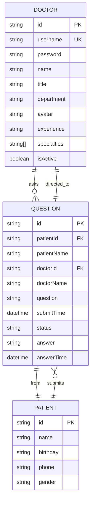
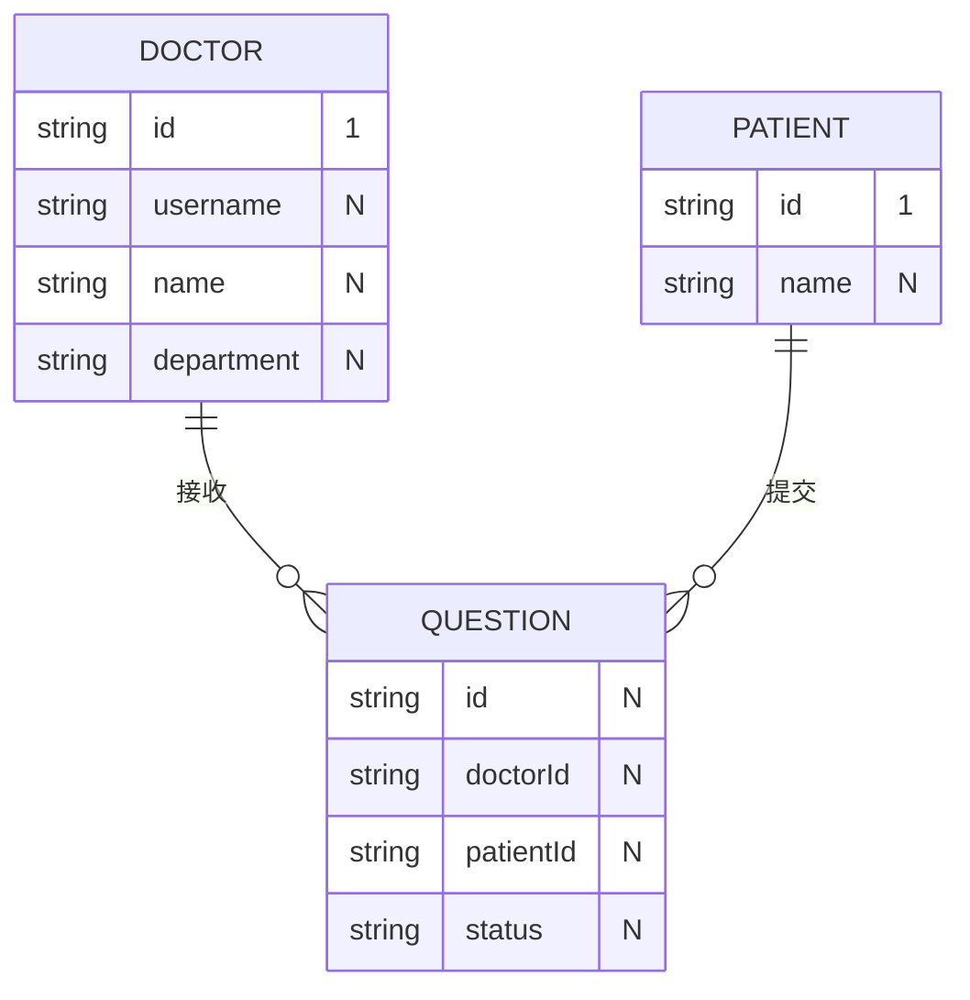
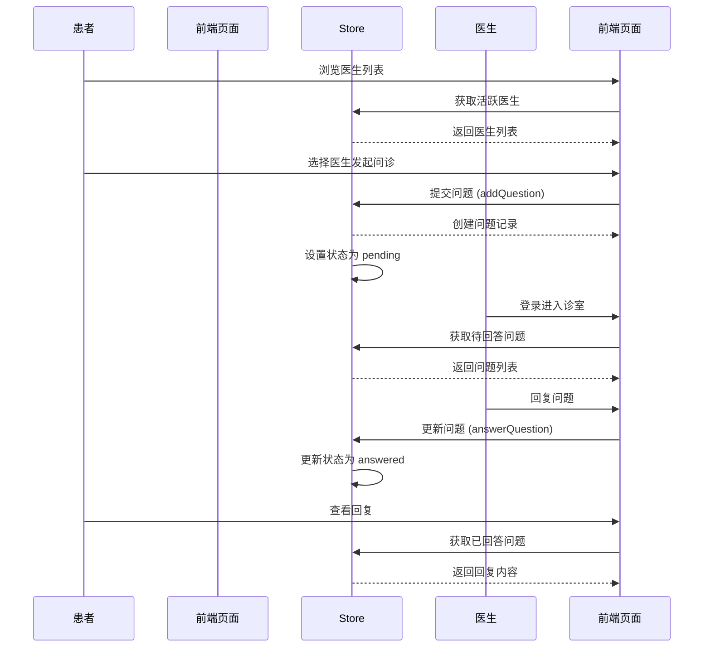
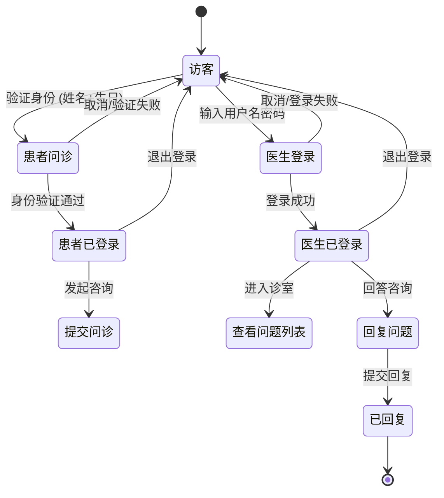

# 数据模型

## 概述

本文档描述了 QA Live Healthcare 在线医疗问诊平台的数据模型、实体关系和数据流。它为 AI 模型提供理解数据结构所需的必要知识，以便有效地处理代码库。

## 数据模型概览图



## 实体定义

### Doctor 医生实体

**用途**: 代表平台上的注册医生，包含个人信息和登录凭证。

```typescript
interface Doctor {
  id: string;              // 医生唯一标识，如 "doc001"
  username: string;        // 登录用户名，如 "dr-zhang-wei"
  password: string;        // 登录密码（当前为明文存储，生产环境需加密）
  name: string;           // 医生姓名，如 "张伟医生"
  title: string;          // 职称，如 "主任医师"、"副主任医师"
  department: string;      // 科室，如 "心内科"、"儿科"、"骨科"
  avatar: string;          // 头像 URL
  experience: string;      // 从业经验描述，如 "15年临床经验"
  specialties: string[];   // 专长领域数组，如 ["高血压", "冠心病"]
  isActive: boolean;       // 是否在线接诊
}
```

**枚举值**:

| 职称 | 说明 |
|------|------|
| 主任医师 | 最高级别医师 |
| 副主任医师 | 副高级别医师 |
| 主治医师 | 中级别医师 |

**科室列表**:
- 心内科
- 儿科
- 骨科
- 妇产科
- 消化内科

### Patient 患者实体

**用途**: 代表使用平台进行问诊的患者。

```typescript
interface Patient {
  id: string;           // 患者唯一标识，如 "patient001"
  name: string;         // 患者姓名
  birthday: string;     // 出生日期，格式 "YYYY-MM-DD"
  phone: string;        // 手机号（脱敏处理）
  gender: string;       // 性别，"男" 或 "女"
}
```

### Question 问诊问题实体

**用途**: 代表患者的问诊咨询，包含问题内容和医生的回复。

```typescript
interface Question {
  id: string;              // 问题唯一标识，如 "q001"
  patientId: string;        // 患者 ID（外键）
  patientName: string;      // 患者姓名
  doctorId: string;         // 医生 ID（外键）
  doctorName: string;       // 医生姓名
  question: string;        // 患者提问内容
  submitTime: string;      // 提交时间，ISO 8601 格式
  status: QuestionStatus;  // 问题状态
  answer: string | null;    // 医生回复内容
  answerTime: string | null; // 回复时间
}

enum QuestionStatus {
  PENDING = 'pending',    // 待回答
  ANSWERED = 'answered'  // 已回答
}
```

## 实体关系图



### 关系说明

| 关系类型 | 说明 |
|----------|------|
| Doctor → Question | 一对多：一位医生可接收多个问诊 |
| Patient → Question | 一对多：一位患者可提交多个问诊 |

## 数据流图

### 问诊流程



### 医患登录流程



## 数据验证规则

### 医生数据验证

```typescript
const doctorValidationRules = {
  username: {
    required: true,
    pattern: /^dr-[a-z]+-[a-z]+$/,  // 格式: dr-zhang-wei
    minLength: 5,
    maxLength: 50,
  },
  password: {
    required: true,
    minLength: 6,
  },
  name: {
    required: true,
    maxLength: 50,
  },
  title: {
    required: true,
    enum: ['主任医师', '副主任医师', '主治医师'],
  },
  department: {
    required: true,
    enum: ['心内科', '儿科', '骨科', '妇产科', '消化内科'],
  },
};
```

### 患者数据验证

```typescript
const patientValidationRules = {
  name: {
    required: true,
    minLength: 2,
    maxLength: 50,
  },
  birthday: {
    required: true,
    pattern: /^\d{4}-\d{2}-\d{2}$/,  // 格式: YYYY-MM-DD
  },
  gender: {
    required: true,
    enum: ['男', '女'],
  },
};
```

### 问诊数据验证

```typescript
const questionValidationRules = {
  question: {
    required: true,
    minLength: 5,
    maxLength: 1000,
  },
  doctorId: {
    required: true,
  },
  patientId: {
    required: true,
  },
};
```

## 示例数据

### 医生示例

```json
{
  "id": "doc001",
  "username": "dr-zhang-wei",
  "password": "123456",
  "name": "张伟医生",
  "title": "主任医师",
  "department": "心内科",
  "avatar": "https://images.pexels.com/photos/5215024/pexels-photo-5215024.jpeg",
  "experience": "15年临床经验",
  "specialties": ["高血压", "冠心病", "心律失常"],
  "isActive": true
}
```

### 患者示例

```json
{
  "id": "patient001",
  "name": "赵明",
  "birthday": "1985-03-15",
  "phone": "138****1234",
  "gender": "男"
}
```

### 问诊示例

```json
{
  "id": "q001",
  "patientId": "patient001",
  "patientName": "赵明",
  "doctorId": "doc001",
  "doctorName": "张伟医生",
  "question": "最近总是感觉胸闷气短,特别是爬楼梯的时候,这是什么原因?",
  "submitTime": "2025-11-02T09:30:00",
  "status": "answered",
  "answer": "根据您的描述,可能是心脏功能问题。建议您做个心电图和心脏彩超检查,同时注意休息,避免剧烈运动。",
  "answerTime": "2025-11-02T09:45:00"
}
```

## 状态管理 (Store)

项目使用 Vue 3 Reactive 进行状态管理，定义在 `src/store/index.ts`。

### Store 方法

| 方法 | 说明 | 参数 | 返回值 |
|------|------|------|--------|
| `loginDoctor` | 医生登录 | `username, password` | `Doctor \| null` |
| `logoutDoctor` | 医生登出 | - | - |
| `verifyPatient` | 患者身份验证 | `name, birthday` | `Patient` |
| `logoutPatient` | 患者登出 | - | - |
| `addQuestion` | 提交新问诊 | `Omit<Question>` | `Question` |
| `answerQuestion` | 回复问题 | `questionId, answer` | - |
| `getQuestionsByDoctor` | 获取医生的问题 | `doctorId` | `Question[]` |
| `getQuestionsByPatient` | 获取患者的问题 | `patientId` | `Question[]` |
| `getActiveDoctors` | 获取在线医生 | - | `Doctor[]` |
| `getStatistics` | 获取统计数据 | - | `Statistics` |

### 统计对象

```typescript
interface Statistics {
  totalDoctors: number;    // 医生总数
  totalQuestions: number;  // 问题总数
  activeSessions: number;   // 待响应问题数
  totalSessions: number;    // 在线诊室数
}
```

## 数据存储

当前版本使用本地 JSON 文件存储数据：

| 文件路径 | 内容 |
|----------|------|
| `src/data/doctor-user-list.json` | 医生用户列表 |
| `src/data/patient-user.json` | 患者用户列表 |
| `src/data/question-list.json` | 问诊问题列表 |

**注意**: 当前为前端演示项目，数据存储在内存中，刷新页面会重置。如需持久化存储，应接入后端 API 或本地存储 (LocalStorage/IndexedDB)。

## 数据安全

### 当前状态
- 密码明文存储于 JSON 文件中
- 无用户权限控制
- 无数据加密

### 生产环境建议
- 使用 HTTPS 传输数据
- 后端存储密码应使用 bcrypt 加密
- 实现 JWT 或 Session 认证
- 添加用户角色权限控制
- 敏感数据脱敏处理

---

*本文档由 ASDM Context Builder 自动生成。当数据库架构或数据结构变更时请使用 `/asdm-context-update` 更新。*
