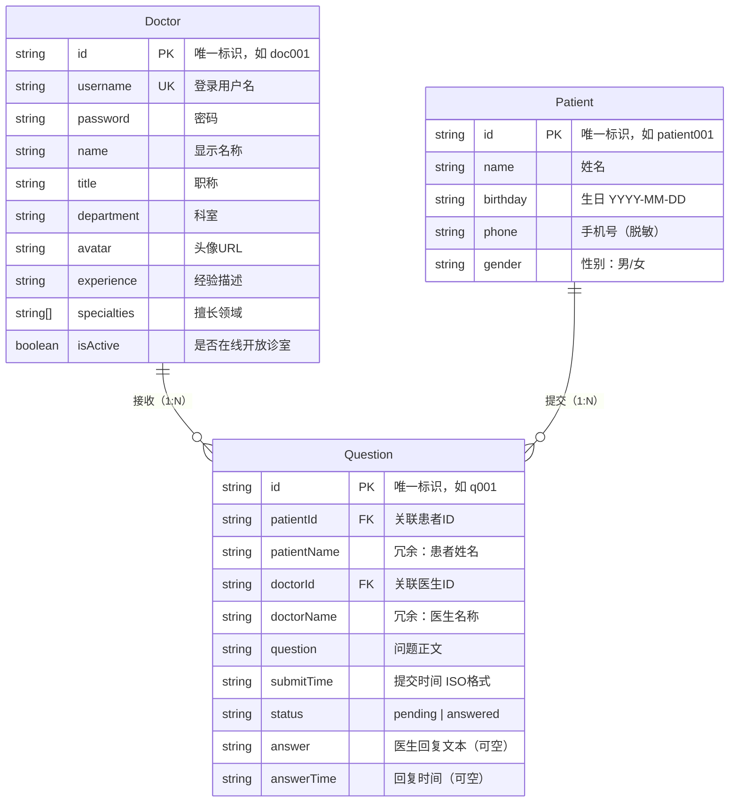
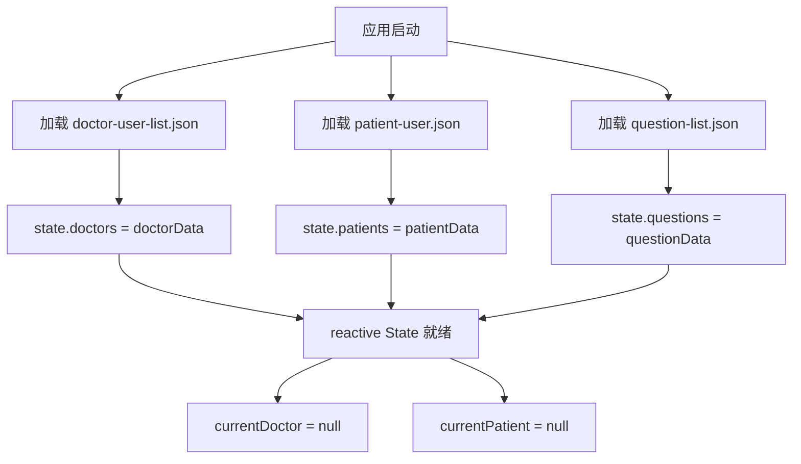
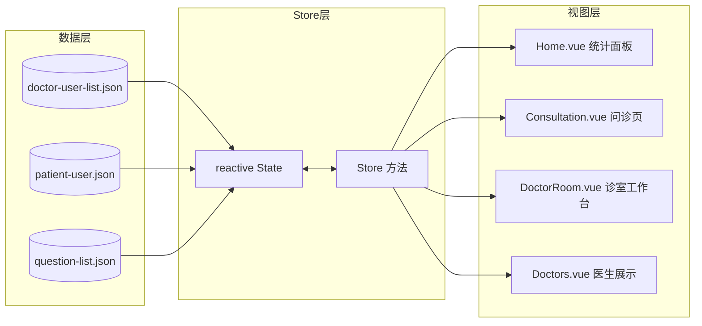

# 数据模型文档

> **项目**: QA Live Healthcare
> **生成时间**: 2026-04-29
> **数据源**: `src/store/index.ts` + `src/data/*.json`

---

## 实体关系图（ER Diagram）



---

## 数据模型详解

### 1. Doctor（医生）

**源文件**: [src/store/index.ts:6-17](../src/store/index.ts#L6-L17)
**数据文件**: [src/data/doctor-user-list.json](../src/data/doctor-user-list.json)

| 字段 | 类型 | 必填 | 说明 | 示例 |
|------|------|------|------|------|
| `id` | `string` | ✅ | 唯一标识符，格式为 `doc` + 3位数字 | `"doc001"` |
| `username` | `string` | ✅ | 登录用户名，全局唯一 | `"dr-zhang-wei"` |
| `password` | `string` | ✅ | 登录密码（明文存储，仅用于 Demo） | `"123456"` |
| `name` | `string` | ✅ | 医生显示名称 | `"张伟医生"` |
| `title` | `string` | ✅ | 职称 | `"主任医师"` / `"副主任医师"` / `"主治医师"` |
| `department` | `string` | ✅ | 所属科室 | `"心内科"` / `"儿科"` / `"骨科"` |
| `avatar` | `string` | ✅ | 头像图片 URL（Pexels 外链） | `"https://images.pexels.com/photos/..."` |
| `experience` | `string` | ✅ | 临床经验描述 | `"15年临床经验"` |
| `specialties` | `string[]` | ✅ | 擅长领域数组 | `["高血压", "冠心病", "心律失常"]` |
| `isActive` | `boolean` | ✅ | 是否在线开放诊室 | `true` / `false` |

**预置数据统计**: 共 5 位医生

| ID | 姓名 | 科室 | 职称 | 在线状态 |
|----|------|------|------|----------|
| doc001 | 张伟医生 | 心内科 |主任医师 | ✅ 在线 |
| doc002 | 李娜医生 | 儿科 | 副主任医师 | ✅ 在线 |
| doc003 | 王强医生 | 骨科 | 主治医师 | ✅ 在线 |
| doc004 | 刘敏医生 | 妇产科 | 主任医师 | ❌ 离线 |
| doc005 | 陈杰医生 | 消化内科 | 副主任医师 | ✅ 在线 |

> 所有医生密码统一为: `123456`

---

### 2. Patient（患者）

**源文件**: [src/store/index.ts:19-25](../src/store/index.ts#L19-L25)
**数据文件**: [src/data/patient-user.json](../src/data/patient-user.json)

| 字段 | 类型 | 必填 | 说明 | 示例 |
|------|------|------|------|------|
| `id` | `string` | ✅ | 唯一标识符，预置格式 `patient`+3位数字；动态创建时使用 `patient`+时间戳 | `"patient001"` / `"patient1714382400000"` |
| `name` | `string` | ✅ | 患者姓名 | `"赵明"` |
| `birthday` | `string` | ✅ | 出生日期，格式 `YYYY-MM-DD` | `"1985-03-15"` |
| `phone` | `string` | ❌ | 手机号（脱敏显示），动态注册时为空字符串 | `"138****1234"` / `""` |
| `gender` | `string` | ❌ | 性别，值域：`"男"` / `"女"`，动态注册时为空字符串 | `"男"` / `""` |

**预置数据**: 共 5 位患者

| ID | 姓名 | 生日 | 性别 |
|----|------|------|------|
| patient001 | 赵明 | 1985-03-15 | 男 |
| patient002 | 孙丽 | 1990-07-22 | 女 |
| patient003 | 周杰 | 1978-11-08 | 男 |
| patient004 | 吴芳 | 1995-05-20 | 女 |
| patient005 | 郑浩 | 1988-09-12 | 男 |

**动态注册逻辑**: 当患者通过 `verifyPatient(name, birthday)` 验证时，若未找到匹配记录，系统会自动创建新患者：

```typescript
// 自动注册 - src/store/index.ts:79-88
patient = {
  id: `patient${Date.now()}`,   // 时间戳作为唯一 ID
  name,                          // 用户输入的姓名
  birthday,                      // 用户输入的生日
  phone: '',                     // 动态注册时为空
  gender: '',                    // 动态注册时为空
};
```

---

### 3. Question（问诊问题）

**源文件**: [src/store/index.ts:27-38](../src/store/index.ts#L27-L38)
**数据文件**: [src/data/question-list.json](../src/data/question-list.json)

| 字段 | 类型 | 必填 | 默认值 | 说明 | 示例 |
|------|------|------|--------|------|------|
| `id` | `string` | ✅ | 自动生成 | 唯一标识，预置 `q`+3位数字；新建 `q`+时间戳 | `"q001"` / `"q1714382400000"` |
| `patientId` | `string` | ✅ | - | 关联的患者 ID（外键 → Patient.id） | `"patient001"` |
| `patientName` | `string` | ✅ | - | 冗余存储的患者姓名（避免联表查询） | `"赵明"` |
| `doctorId` | `string` | ✅ | - | 关联的医生 ID（外键 → Doctor.id） | `"doc001"` |
| `doctorName` | `string` | ✅ | - | 冗余存储的医生名称（避免联表查询） | `"张伟医生"` |
| `question` | `string` | ✅ | - | 问题正文内容 | `"最近总是感觉胸闷气短..."` |
| `submitTime` | `string` | ✅ | 当前 ISO 时间 | 提交时间，ISO 8601 格式 | `"2025-11-02T09:30:00"` |
| `status` | `string` | ✅ | `"pending"` | 问题状态，枚举值 | `"pending"` / `"answered"` |
| `answer` | `string \| null` | ❌ | `null` | 医生的文字回复内容 | `"建议您做个心电图..."` / `null` |
| `answerTime` | `string \| null` | ❌ | `null` | 回复时间，ISO 8601 格式 | `"2025-11-02T09:45:00"` / `null` |

**状态枚举**

| 状态值 | 含义 | answer | 可执行操作 |
|--------|------|--------|------------|
| `pending` | 待响应 | `null` | 医生可回复、标记已解答 |
| `answered` | 已解答 | 非空字符串 | 仅查看历史记录 |

**预置数据统计**: 共 7 条问题

| ID | 患者 | 医生 | 状态 | 简述 |
|----|------|------|------|------|
| q001 | 赵明 | 张伟医生 | ✅ 已回答 | 胸闷气短问题 |
| q002 | 孙丽 | 李娜医生 | ⏳ 待处理 | 孩子咳嗽问题 |
| q003 | 周杰 | 王强医生 | ✅ 已回答 | 脚踝扭伤处理 |
| q004 | 赵明 | 张伟医生 | ⏳ 待处理 | 血压偏高咨询 |
| q005 | 吴芳 | 陈杰医生 | ⏳ 待处理 | 胃痛问题 |
| q006 | 郑浩 | 张伟医生 | ⏳ 待处理 | 心律不齐咨询 |
| q007 | 孙丽 | 李娜医生 | ✅ 已回答 | 宝宝辅食添加 |

---

## 全局状态（State）

**源文件**: [src/store/index.ts:40-46](../src/store/index.ts#L40-L46)

```typescript
interface State {
  doctors: Doctor[];              // 全部医生列表（初始从 JSON 加载）
  patients: Patient[];            // 全部患者列表（初始从 JSON 加载）
  questions: Question[];          // 全部问题列表（初始从 JSON 加载）
  currentDoctor: Doctor | null;   // 当前登录的医生（登录后赋值）
  currentPatient: Patient | null; // 当前登录的患者（验证后赋值）
}
```

**状态初始化流程**:



---

## 实体关系说明

### Doctor ↔ Question（一对多）

一位医生可以接收多个患者的问诊问题。

```
Doctor (1) ──────< (N) Question
关系字段: Question.doctorId → Doctor.id
查询方式: store.getQuestionsByDoctor(doctorId)
示例: 张伟医生(doc001) 收到 q001, q004, q006 三个问题
```

### Patient ↔ Question（一对多）

一位患者可以向不同医生提交多个问诊问题。

```
Patient (1) ──────< (N) Question
关系字段: Question.patientId → Patient.id
查询方式: store.getQuestionsByPatient(patientId)
示例: 赵明(patient001) 提交了 q001, q004 两个问题
```

### 冗余设计说明

Question 实体中冗余存储了 `patientName` 和 `doctorName`，原因如下：
- **当前架构无后端数据库**，不存在 SQL JOIN 查询能力
- 冗余存储避免了在前端进行联表查找的性能开销
- 数据一致性由 Store 方法统一维护（创建问题时同步写入）

---

## 数据操作方法

### 创建操作

```typescript
// 新建问诊问题 - addQuestion()
const newQuestion = store.addQuestion({
  patientId: 'patient001',
  patientName: '赵明',
  doctorId: 'doc001',
  doctorName: '张伟医生',
  question: '我的症状是...',
});
// 自动填充: id, submitTime='ISO时间', status='pending', answer=null, answerTime=null
```

### 更新操作

```typescript
// 文字回复 - answerQuestion()
store.answerQuestion('q002', '建议您带孩子去医院检查...');

// 口述解答标记 - markQuestionAsAnswered()
store.markQuestionAsAnswered('q004');
// 自动设置: status='answered', answer='已口述解答', answerTime=当前时间
```

### 查询操作

```typescript
// 按医生查询问题
const questions = store.getQuestionsByDoctor('doc001');

// 按患者查询问题
const questions = store.getQuestionsByPatient('patient001');

// 获取在线医生列表
const activeDoctors = store.getActiveDoctors();

// 获取平台统计数据
const stats = store.getStatistics();
// 返回: { totalDoctors: 5, totalQuestions: 7, activeSessions: 4, totalSessions: 4 }
```

---

## 数据流向图



---

*此文件由 Context Builder toolset 自动生成。*
