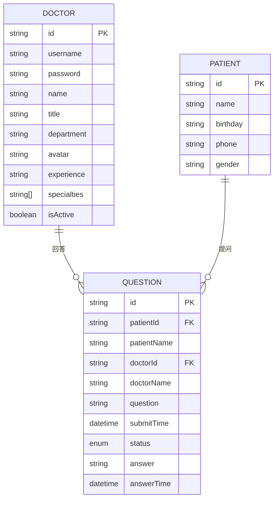
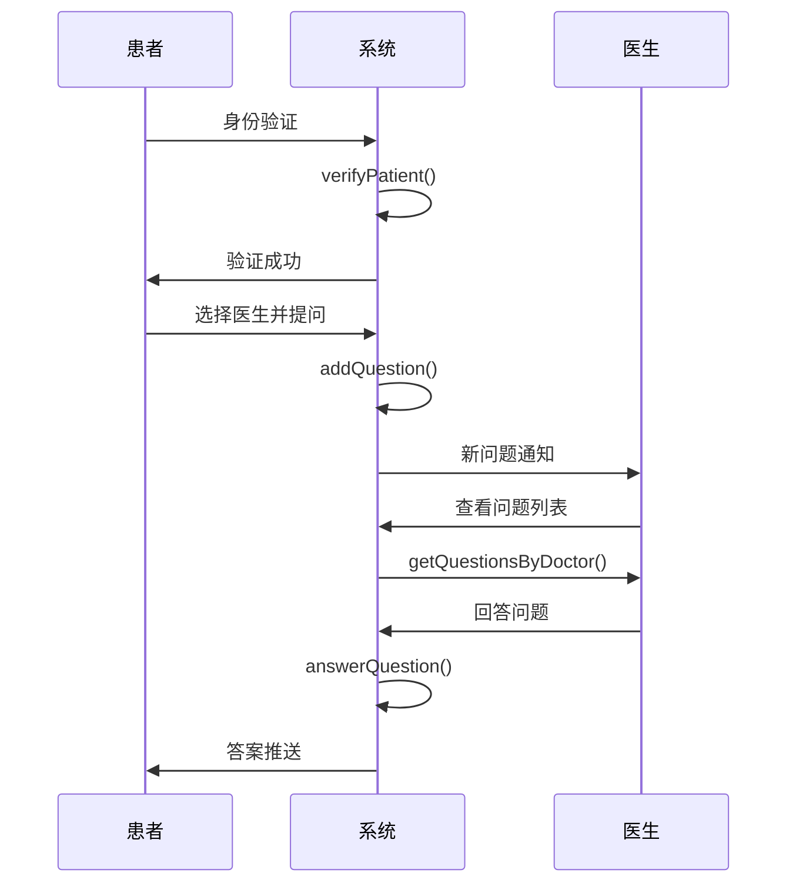
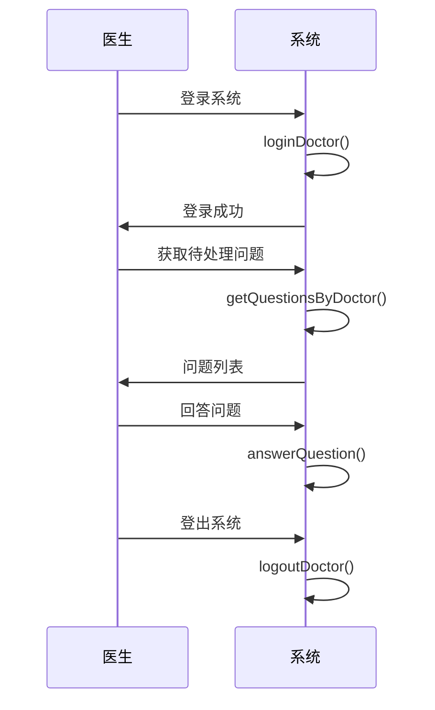

# qa-live-healthcare 数据模型

## 数据模型概览

本系统采用基于 TypeScript 接口的强类型数据模型，包含三个核心实体：**医生 (Doctor)**、**患者 (Patient)** 和**咨询问题 (Question)**。

## 实体关系图



## 核心实体定义

### 1. 医生 (Doctor)

**接口定义** (`src/store/index.ts`):
```typescript
export interface Doctor {
  id: string;
  username: string;
  password: string;
  name: string;
  title: string;
  department: string;
  avatar: string;
  experience: string;
  specialties: string[];
  isActive: boolean;
}
```

**示例数据** (`src/data/doctor-user-list.json`):
```json
{
  "id": "doc001",
  "username": "dr-zhang-wei",
  "password": "123456",
  "name": "张伟医生",
  "title": "主任医师",
  "department": "心内科",
  "avatar": "https://images.pexels.com/photos/5215024/pexels-photo-5215024.jpeg",
  "experience": "15年临床经验",
  "specialties": ["高血压", "冠心病", "心律失常"],
  "isActive": true
}
```

**字段说明**:
- `id`: 医生唯一标识符 (格式: doc001, doc002...)
- `username`: 登录用户名 (格式: dr-zhang-wei)
- `password`: 登录密码 (明文存储，生产环境需加密)
- `name`: 医生姓名 (包含"医生"后缀)
- `title`: 职称 (主任医师、副主任医师、主治医师)
- `department`: 所属科室
- `avatar`: 头像图片 URL
- `experience`: 临床经验描述
- `specialties`: 擅长领域数组
- `isActive`: 是否在线状态

### 2. 患者 (Patient)

**接口定义** (`src/store/index.ts`):
```typescript
export interface Patient {
  id: string;
  name: string;
  birthday: string;
  phone: string;
  gender: string;
}
```

**示例数据** (`src/data/patient-user.json`):
```json
{
  "id": "patient001",
  "name": "赵明",
  "birthday": "1985-03-15",
  "phone": "138****1234",
  "gender": "男"
}
```

**字段说明**:
- `id`: 患者唯一标识符 (格式: patient001, patient002...)
- `name`: 患者姓名
- `birthday`: 出生日期 (YYYY-MM-DD 格式)
- `phone`: 手机号码 (脱敏显示)
- `gender`: 性别 ("男" 或 "女")

### 3. 咨询问题 (Question)

**接口定义** (`src/store/index.ts`):
```typescript
export interface Question {
  id: string;
  patientId: string;
  patientName: string;
  doctorId: string;
  doctorName: string;
  question: string;
  submitTime: string;
  status: 'pending' | 'answered';
  answer: string | null;
  answerTime: string | null;
}
```

**示例数据** (`src/data/question-list.json`):
```json
{
  "id": "q001",
  "patientId": "patient001",
  "patientName": "赵明",
  "doctorId": "doc001",
  "doctorName": "张伟医生",
  "question": "最近总是感觉胸闷气短,特别是爬楼梯的时候,这是什么原因?",
  "submitTime": "2025-11-02T09:30:00",
  "status": "answered",
  "answer": "根据您的描述,可能是心脏功能问题...",
  "answerTime": "2025-11-02T09:45:00"
}
```

**字段说明**:
- `id`: 问题唯一标识符 (格式: q001, q002...)
- `patientId`: 关联患者 ID
- `patientName`: 患者姓名 (冗余字段，便于显示)
- `doctorId`: 关联医生 ID
- `doctorName`: 医生姓名 (冗余字段，便于显示)
- `question`: 问题内容
- `submitTime`: 提交时间 (ISO 8601 格式)
- `status`: 问题状态 ("pending" - 待回答, "answered" - 已回答)
- `answer`: 医生回答内容 (可为 null)
- `answerTime`: 回答时间 (ISO 8601 格式)

## 状态管理模型

### 应用状态 (`src/store/index.ts`)

```typescript
interface State {
  doctors: Doctor[];
  patients: Patient[];
  questions: Question[];
  currentDoctor: Doctor | null;
  currentPatient: Patient | null;
}
```

**状态字段说明**:
- `doctors`: 医生列表 (从 JSON 文件加载)
- `patients`: 患者列表 (从 JSON 文件加载)
- `questions`: 咨询问题列表 (从 JSON 文件加载)
- `currentDoctor`: 当前登录的医生
- `currentPatient`: 当前验证的患者

## 业务逻辑方法

### 医生相关方法

```typescript
// 医生登录验证
loginDoctor(username: string, password: string): Doctor | null

// 医生登出
logoutDoctor(): void

// 根据用户名获取医生
getDoctorByUsername(username: string): Doctor | undefined

// 获取在线医生列表
getActiveDoctors(): Doctor[]
```

### 患者相关方法

```typescript
// 患者身份验证（不存在则创建）
verifyPatient(name: string, birthday: string): Patient

// 患者登出
logoutPatient(): void
```

### 问题管理方法

```typescript
// 获取医生的问题列表
getQuestionsByDoctor(doctorId: string): Question[]

// 获取患者的问题列表
getQuestionsByPatient(patientId: string): Question[]

// 添加新问题
addQuestion(question: Omit<Question, 'id' | 'submitTime' | 'status' | 'answer' | 'answerTime'>): Question

// 回答问题
answerQuestion(questionId: string, answer: string): void

// 标记问题为已回答
markQuestionAsAnswered(questionId: string): void
```

### 统计分析

```typescript
// 获取系统统计信息
getStatistics(): {
  totalDoctors: number;
  totalQuestions: number;
  activeSessions: number;
  totalSessions: number;
}
```

## 数据验证规则

### 医生数据验证
- 用户名格式：以 "dr-" 开头的英文用户名
- 密码长度：至少6位字符
- 职称：预定义值（主任医师、副主任医师、主治医师）
- 科室：标准医疗科室名称

### 患者数据验证
- 姓名：中文字符，2-4个字符
- 出生日期：有效日期格式 (YYYY-MM-DD)
- 手机号：11位数字，支持脱敏显示
- 性别："男" 或 "女"

### 问题数据验证
- 问题内容：非空字符串，最大长度限制
- 时间格式：ISO 8601 标准
- 状态枚举："pending" 或 "answered"

## 数据流程

### 1. 患者咨询流程


### 2. 医生工作流程


## 数据存储策略

### 当前实现
- **存储方式**: JSON 文件静态存储
- **数据位置**: `src/data/` 目录
- **文件格式**: 标准 JSON 数组格式

### 生产环境建议
- **数据库**: PostgreSQL 或 MySQL
- **ORM**: TypeORM 或 Prisma
- **缓存**: Redis 用于会话管理
- **文件存储**: 云存储服务 (如 AWS S3)

## 数据安全考虑

### 敏感信息处理
- **密码**: 当前为明文存储，生产环境需使用 bcrypt 加密
- **手机号**: 支持脱敏显示，保护用户隐私
- **医疗数据**: 符合 HIPAA 或相关医疗数据保护法规

### 数据备份策略
- 定期备份医生和患者数据
- 问题记录永久保存
- 支持数据恢复和审计

---

*本数据模型文档由 Context Builder 工具集自动生成，最后更新于 2026-04-21*