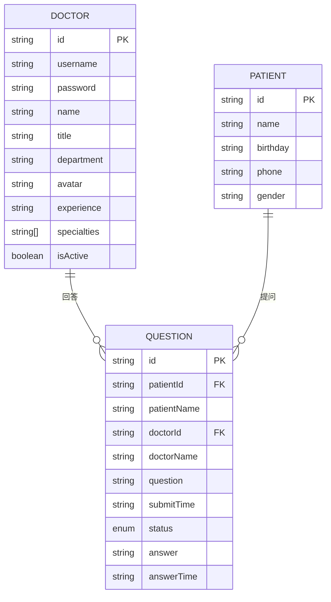
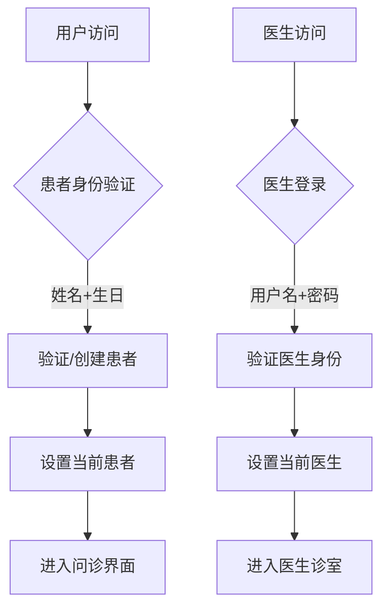
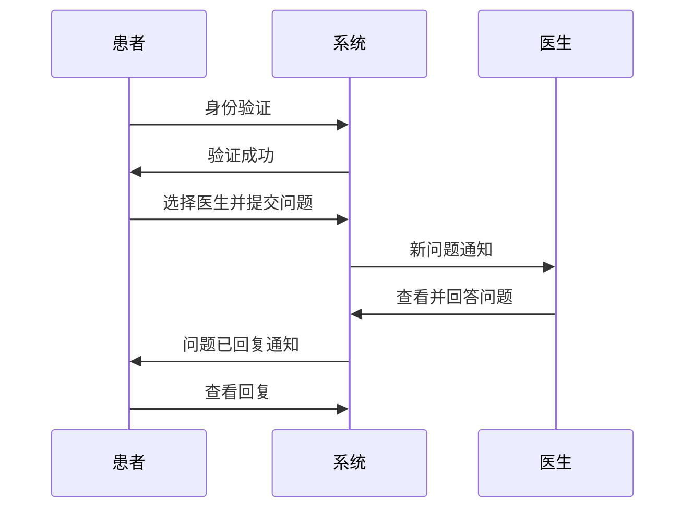

# 数据模型

## 概述
本文档定义了 QA Live Healthcare 项目的核心数据模型，包括医生、患者、问诊问题等主要实体及其关系。

## 实体关系图



## 核心实体定义

### 医生 (Doctor)
医生实体代表平台上的医疗专业人员。

**字段定义：**
```typescript
interface Doctor {
  id: string;                    // 医生唯一标识
  username: string;              // 登录用户名
  password: string;              // 登录密码
  name: string;                  // 医生姓名
  title: string;                // 职称（主任医师、副主任医师等）
  department: string;           // 所属科室
  avatar: string;               // 头像图片URL
  experience: string;           // 临床经验描述
  specialties: string[];         // 擅长领域
  isActive: boolean;            // 是否在线状态
}
```

**示例数据：**
```json
{
  "id": "doc001",
  "username": "dr-zhang-wei",
  "password": "123456",
  "name": "张伟医生",
  "title": "主任医师",
  "department": "心内科",
  "avatar": "https://example.com/avatar.jpg",
  "experience": "15年临床经验",
  "specialties": ["高血压", "冠心病", "心律失常"],
  "isActive": true
}
```

### 患者 (Patient)
患者实体代表使用平台进行问诊的用户。

**字段定义：**
```typescript
interface Patient {
  id: string;                    // 患者唯一标识
  name: string;                  // 患者姓名
  birthday: string;              // 出生日期（YYYY-MM-DD）
  phone: string;                 // 联系电话
  gender: string;                // 性别
}
```

**示例数据：**
```json
{
  "id": "patient001",
  "name": "赵明",
  "birthday": "1985-03-15",
  "phone": "138****1234",
  "gender": "男"
}
```

### 问诊问题 (Question)
问诊问题实体代表患者向医生提出的医疗咨询问题。

**字段定义：**
```typescript
interface Question {
  id: string;                    // 问题唯一标识
  patientId: string;            // 患者ID
  patientName: string;           // 患者姓名
  doctorId: string;             // 医生ID
  doctorName: string;           // 医生姓名
  question: string;              // 问题内容
  submitTime: string;            // 提交时间（ISO格式）
  status: 'pending' | 'answered'; // 问题状态
  answer: string | null;         // 医生回答
  answerTime: string | null;      // 回答时间（ISO格式）
}
```

**示例数据：**
```json
{
  "id": "q001",
  "patientId": "patient001",
  "patientName": "赵明",
  "doctorId": "doc001",
  "doctorName": "张伟医生",
  "question": "最近总是感觉胸闷气短...",
  "submitTime": "2025-11-02T09:30:00",
  "status": "answered",
  "answer": "根据您的描述,可能是心脏功能问题...",
  "answerTime": "2025-11-02T09:45:00"
}
```

## 业务逻辑模型

### 用户认证流程


### 问诊流程模型


## 数据存储结构

### 静态数据文件
项目使用 JSON 文件存储静态数据：

- `src/data/doctor-user-list.json` - 医生数据
- `src/data/patient-user.json` - 患者数据
- `src/data/question-list.json` - 问诊问题数据

### 运行时状态管理
使用 Vue 的响应式状态管理：
```typescript
interface State {
  doctors: Doctor[];            // 医生列表
  patients: Patient[];         // 患者列表
  questions: Question[];        // 问诊问题列表
  currentDoctor: Doctor | null; // 当前登录医生
  currentPatient: Patient | null; // 当前登录患者
}
```

## 数据验证规则

### 患者身份验证
- 姓名：必填，长度限制 2-20 字符
- 生日：必填，有效日期格式

### 医生登录验证
- 用户名：必填，唯一性检查
- 密码：必填，长度验证

### 问诊问题提交
- 医生选择：必选
- 问题内容：必填，长度限制 10-1000 字符

## 扩展性考虑

### 未来可能的扩展
1. **用户角色扩展**
   - 管理员角色
   - 护士角色
   - 药剂师角色

2. **数据字段扩展**
   - 医生：执业证书、擅长疾病、工作时间
   - 患者：病史、过敏史、联系方式
   - 问诊：诊断结果、处方信息、随访计划

3. **关系扩展**
   - 医生团队协作
   - 患者家属关联
   - 转诊关系

---
*此文件由 Context Builder 工具集生成，最后更新于 2026-04-21*