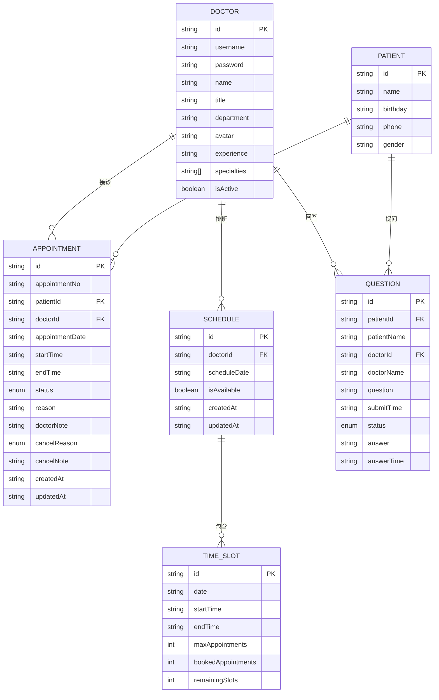
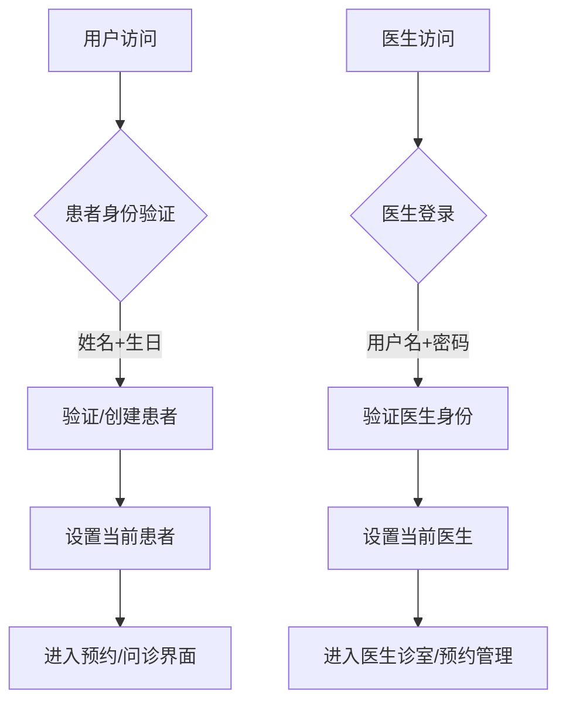
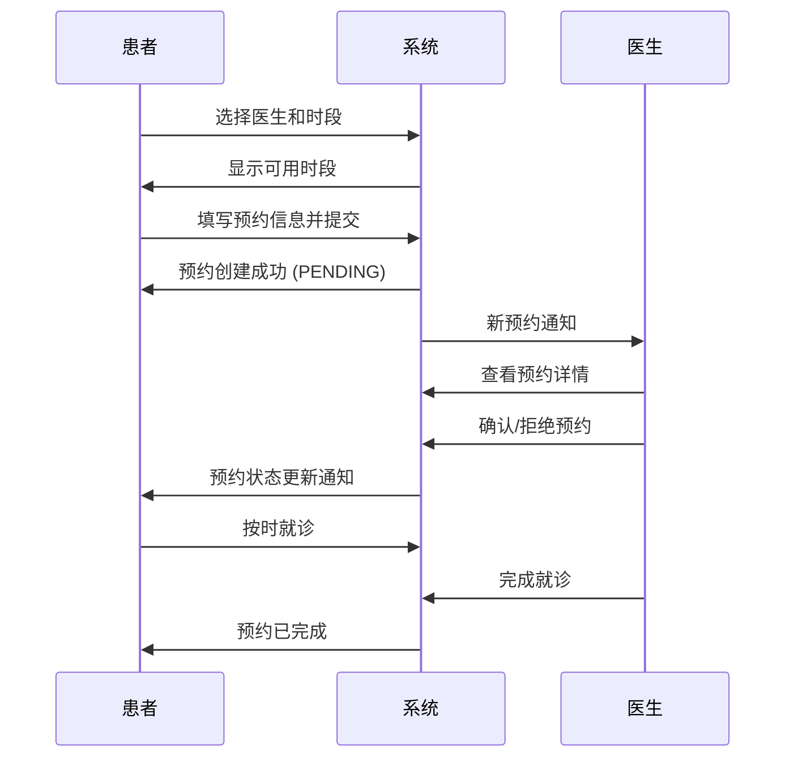
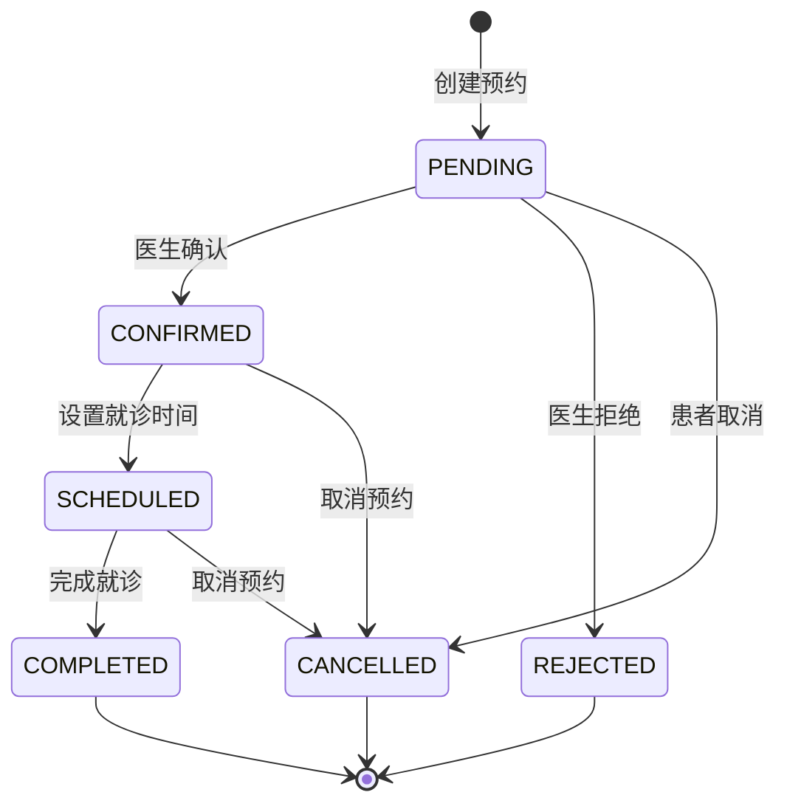

# 数据模型

## 概述
本文档定义了 QA Live Healthcare 项目的核心数据模型，包括医生、患者、预约、问诊问题等主要实体及其关系。

## 实体关系图



## 核心实体定义

### 医生 (Doctor)
医生实体代表平台上的医疗专业人员。

**字段定义：**
```typescript
interface Doctor {
  id: string;                    // 医生唯一标识
  username: string;              // 登录用户名
  password: string;              // 登录密码
  name: string;                  // 医生姓名
  title: string;                 // 职称（主任医师、副主任医师等）
  department: string;             // 所属科室
  avatar: string;                // 头像图片URL
  experience: string;            // 临床经验描述
  specialties: string[];          // 擅长领域
  isActive: boolean;             // 是否在线状态
}
```

**示例数据：**
```json
{
  "id": "doc001",
  "username": "dr-zhang-wei",
  "password": "123456",
  "name": "张伟医生",
  "title": "主任医师",
  "department": "心内科",
  "avatar": "https://example.com/avatar.jpg",
  "experience": "15年临床经验",
  "specialties": ["高血压", "冠心病", "心律失常"],
  "isActive": true
}
```

### 患者 (Patient)
患者实体代表使用平台进行问诊的用户。

**字段定义：**
```typescript
interface Patient {
  id: string;                    // 患者唯一标识
  name: string;                  // 患者姓名
  birthday: string;              // 出生日期（YYYY-MM-DD）
  phone: string;                 // 联系电话
  gender: string;                // 性别
}
```

**示例数据：**
```json
{
  "id": "patient_赵明_20260408",
  "name": "赵明",
  "birthday": "1985-03-15",
  "phone": "138****1234",
  "gender": "男"
}
```

### 时段 (TimeSlot)
时段实体定义医生可预约的具体时间段。

**字段定义：**
```typescript
interface TimeSlot {
  id: string;                    // 时段唯一标识
  date: string;                  // 时段日期（YYYY-MM-DD）
  startTime: string;             // 开始时间（HH:mm）
  endTime: string;                // 结束时间（HH:mm）
  maxAppointments: number;        // 可预约人数
  bookedAppointments: number;     // 已预约人数
  remainingSlots: number;         // 剩余号源
}
```

**示例数据：**
```json
{
  "id": "slot001",
  "date": "2026-04-22",
  "startTime": "09:00",
  "endTime": "09:30",
  "maxAppointments": 10,
  "bookedAppointments": 3,
  "remainingSlots": 7
}
```

### 医生排班 (DoctorSchedule)
医生排班实体定义医生的出诊安排。

**字段定义：**
```typescript
interface DoctorSchedule {
  id: string;                    // 排班唯一标识
  doctor: Doctor;                // 医生信息
  timeSlots: TimeSlot[];          // 时段列表
  scheduleDate: string;           // 排班日期（YYYY-MM-DD）
  isAvailable: boolean;           // 是否可用
  createdAt: string;              // 创建时间
  updatedAt: string;              // 更新时间
}
```

### 预约 (Appointment)
预约实体代表患者的挂号记录。

**字段定义：**
```typescript
interface Appointment {
  id: string;                    // 预约唯一标识
  appointmentNo: string;          // 预约编号（展示用）
  patient: Patient;              // 患者信息
  doctor: Doctor;                // 医生信息
  appointmentDate: string;        // 预约日期（YYYY-MM-DD）
  startTime: string;              // 预约时段开始时间
  endTime: string;               // 预约时段结束时间
  status: AppointmentStatus;      // 预约状态
  reason: string;                 // 预约原因/症状描述
  doctorNote?: string;            // 医生确认/拒绝理由
  cancelReason?: CancelReason;    // 取消原因
  cancelNote?: string;            // 取消说明
  createdAt: string;              // 创建时间
  updatedAt: string;              // 更新时间
}
```

**预约状态枚举：**
```typescript
enum AppointmentStatus {
  PENDING = 'PENDING',           // 待确认
  CONFIRMED = 'CONFIRMED',       // 已确认
  REJECTED = 'REJECTED',         // 已拒绝
  SCHEDULED = 'SCHEDULED',       // 待就诊
  COMPLETED = 'COMPLETED',       // 已完成
  CANCELLED = 'CANCELLED'        // 已取消
}
```

**取消原因枚举：**
```typescript
enum CancelReason {
  TIME_CONFLICT = 'TIME_CONFLICT',       // 时间冲突
  CONDITION_CHANGED = 'CONDITION_CHANGED', // 病情变化
  OTHER_DOCTOR = 'OTHER_DOCTOR',         // 其他医生
  OTHER = 'OTHER'                        // 其他原因
}
```

**示例数据：**
```json
{
  "id": "appt1713772800000",
  "appointmentNo": "APT1713772800000",
  "patient": {
    "id": "patient_赵明_20260408",
    "name": "赵明",
    "birthday": "1985-03-15",
    "phone": "",
    "gender": ""
  },
  "doctor": {
    "id": "doc001",
    "name": "张伟医生",
    "title": "主任医师",
    "department": "心内科",
    "avatar": "",
    "isActive": true
  },
  "appointmentDate": "2026-04-22",
  "startTime": "09:00",
  "endTime": "09:30",
  "status": "CONFIRMED",
  "reason": "头疼、发热",
  "doctorNote": "已确认，请准时就诊",
  "createdAt": "2026-04-20T10:00:00.000Z",
  "updatedAt": "2026-04-20T12:00:00.000Z"
}
```

### 问诊问题 (Question)
问诊问题实体代表患者向医生提出的医疗咨询问题。

**字段定义：**
```typescript
interface Question {
  id: string;                    // 问题唯一标识
  patientId: string;            // 患者ID
  patientName: string;           // 患者姓名
  doctorId: string;              // 医生ID
  doctorName: string;            // 医生姓名
  question: string;               // 问题内容
  submitTime: string;             // 提交时间（ISO格式）
  status: 'pending' | 'answered'; // 问题状态
  answer: string | null;          // 医生回答
  answerTime: string | null;      // 回答时间（ISO格式）
}
```

## 业务逻辑模型

### 用户认证流程


### 预约流程模型


### 预约状态流转


## 数据存储结构

### 静态数据文件
项目使用 JSON 文件存储静态数据：

- `src/data/doctor-user-list.json` - 医生数据
- `src/data/patient-user.json` - 患者数据
- `src/data/question-list.json` - 问诊问题数据

### localStorage 数据存储
项目使用 localStorage 进行预约数据持久化：

| Key | 描述 | 数据类型 |
|-----|------|----------|
| `appointments` | 预约列表 | `Appointment[]` |
| `schedules` | 排班列表 | `DoctorSchedule[]` |
| `currentPatient` | 当前患者 | `Patient` |
| `currentDoctor` | 当前医生 | `Doctor` |

### 运行时状态管理
使用 Vue 的响应式状态管理：
```typescript
interface State {
  doctors: Doctor[];                // 医生列表
  patients: Patient[];              // 患者列表
  appointments: Appointment[];      // 预约列表
  schedules: DoctorSchedule[];      // 排班列表
  questions: Question[];           // 问诊问题列表
  currentDoctor: Doctor | null;     // 当前登录医生
  currentPatient: Patient | null;    // 当前登录患者
}
```

## 数据验证规则

### 患者身份验证
- 姓名：必填，长度限制 2-20 字符
- 生日：必填，有效日期格式

### 医生登录验证
- 用户名：必填，唯一性检查
- 密码：必填，长度验证

### 预约创建验证
- 医生ID：必填
- 患者ID：必填
- 预约日期：必填，格式 YYYY-MM-DD
- 时段ID：必填
- 预约原因：必填，长度限制 1-500 字符

### 预约取消规则
- 取消时间距离预约时间需 >= 2小时
- 已完成/已取消/已拒绝的预约不可再次取消

## 扩展性考虑

### 未来可能的扩展
1. **用户角色扩展**
   - 管理员角色
   - 护士角色
   - 药剂师角色

2. **数据字段扩展**
   - 医生：执业证书、擅长疾病、工作时间
   - 患者：病史、过敏史、联系方式
   - 预约：诊断结果、处方信息、随访计划

3. **关系扩展**
   - 医生团队协作
   - 患者家属关联
   - 转诊关系

4. **预约类型扩展**
   - 普通门诊预约
   - 专家门诊预约
   - 复诊预约
   - 急诊预约

---
*此文件由 Context Builder 工具集生成，最后更新于 2026-04-23*
