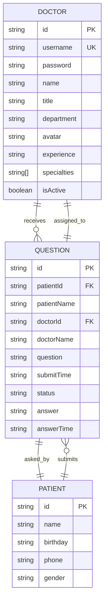
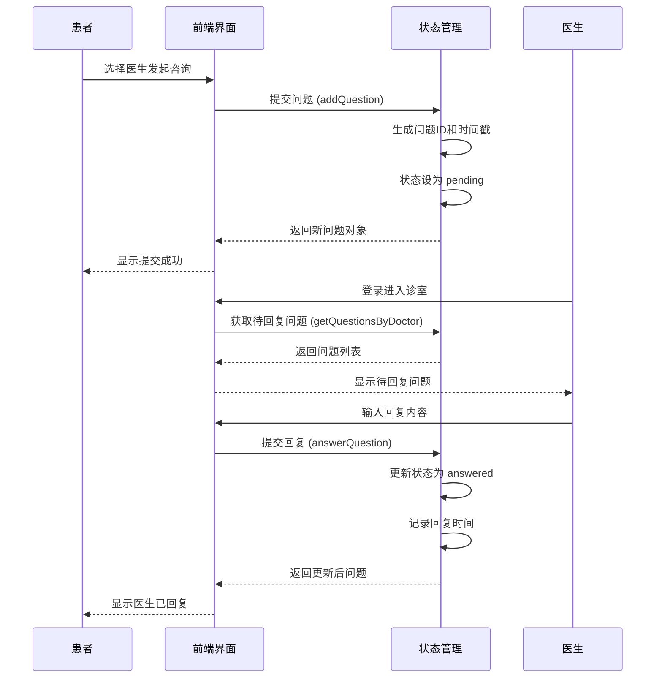
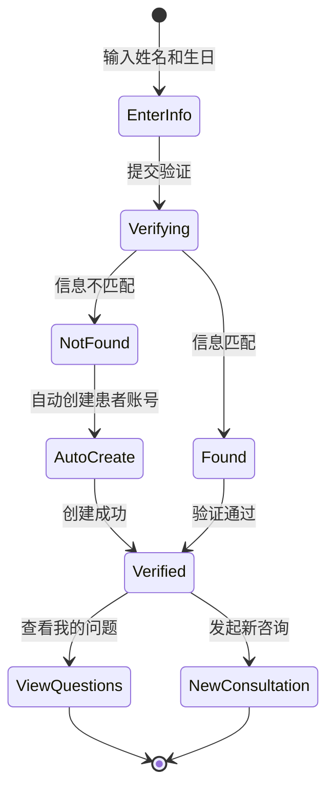

# 数据模型文档

## 概述

本文档描述了在线医疗健康咨询平台的数据模型、实体关系和数据流程。它为 AI 模型提供了理解数据结构的必要知识，以便有效地处理代码库。

## 实体关系图



## 实体定义

### Doctor（医生）实体

**用途**：表示平台上的医生用户，包含个人信息和专业领域。

```typescript
interface Doctor {
  /** 医生唯一标识 */
  id: string;
  /** 登录用户名（唯一） */
  username: string;
  /** 登录密码 */
  password: string;
  /** 医生姓名 */
  name: string;
  /** 职称（如：主任医师、副主任医师、主治医师） */
  title: string;
  /** 所属科室 */
  department: string;
  /** 头像 URL */
  avatar: string;
  /** 从业经验 */
  experience: string;
  /** 专业领域数组 */
  specialties: string[];
  /** 是否在职 */
  isActive: boolean;
}
```

**示例数据**：
```json
{
  "id": "doc001",
  "username": "dr-zhang-wei",
  "password": "123456",
  "name": "张伟医生",
  "title": "主任医师",
  "department": "心内科",
  "avatar": "https://images.pexels.com/photos/5215024/pexels-photo-5215024.jpeg",
  "experience": "15年临床经验",
  "specialties": ["高血压", "冠心病", "心律失常"],
  "isActive": true
}
```

### Patient（患者）实体

**用途**：表示平台上的患者用户，用于身份验证和问题关联。

```typescript
interface Patient {
  /** 患者唯一标识 */
  id: string;
  /** 患者姓名 */
  name: string;
  /** 出生日期 */
  birthday: string;
  /** 联系电话（脱敏） */
  phone: string;
  /** 性别 */
  gender: string;
}
```

**示例数据**：
```json
{
  "id": "patient001",
  "name": "赵明",
  "birthday": "1985-03-15",
  "phone": "138****1234",
  "gender": "男"
}
```

### Question（咨询问题）实体

**用途**：表示患者向医生提交的咨询问题和医生的回复。

```typescript
interface Question {
  /** 问题唯一标识 */
  id: string;
  /** 患者 ID */
  patientId: string;
  /** 患者姓名 */
  patientName: string;
  /** 医生 ID */
  doctorId: string;
  /** 医生姓名 */
  doctorName: string;
  /** 咨询问题内容 */
  question: string;
  /** 提交时间 */
  submitTime: string;
  /** 问题状态 */
  status: 'pending' | 'answered';
  /** 医生回复内容 */
  answer: string | null;
  /** 回复时间 */
  answerTime: string | null;
}
```

**示例数据**：
```json
{
  "id": "q001",
  "patientId": "patient001",
  "patientName": "赵明",
  "doctorId": "doc001",
  "doctorName": "张伟医生",
  "question": "最近总是感觉胸闷气短,特别是爬楼梯的时候,这是什么原因?",
  "submitTime": "2025-11-02T09:30:00",
  "status": "answered",
  "answer": "根据您的描述,可能是心脏功能问题。建议您做个心电图和心脏彩超检查。",
  "answerTime": "2025-11-02T09:45:00"
}
```

## 数据关系

### 一对多关系

1. **Doctor → Question**：一个医生可以接收多个患者的咨询问题
2. **Patient → Question**：一个患者可以提交多个咨询问题

### 关系说明

| 关系 | 类型 | 说明 |
|------|------|------|
| 医生 ↔ 问题 | 1:N | 一位医生对应多条咨询记录 |
| 患者 ↔ 问题 | 1:N | 一位患者可提交多条咨询 |
| 医生 ↔ 患者 | N:M | 通过问题表间接关联 |

## 数据流程图

### 咨询流程



### 患者登录流程



## 数据验证规则

### 医生登录验证

```typescript
const doctorLoginRules = {
  username: {
    required: true,
    pattern: /^dr-[a-z]+-[a-z]+$/,
    message: '用户名格式：dr-姓-名（如 dr-zhang-wei）',
  },
  password: {
    required: true,
    minLength: 6,
  },
};
```

### 患者身份验证

```typescript
const patientVerifyRules = {
  name: {
    required: true,
    minLength: 2,
    maxLength: 50,
  },
  birthday: {
    required: true,
    pattern: /^\d{4}-\d{2}-\d{2}$/,
    message: '生日格式：YYYY-MM-DD',
  },
};
```

### 问题提交验证

```typescript
const questionSubmitRules = {
  question: {
    required: true,
    minLength: 10,
    maxLength: 1000,
    message: '问题描述需要10-1000字符',
  },
};
```

## 科室与专业领域

### 科室列表

| 科室 | 说明 |
|------|------|
| 心内科 | 心脏及心血管疾病 |
| 儿科 | 儿童疾病和保健 |
| 骨科 | 骨骼、关节、肌肉疾病 |
| 妇产科 | 孕产妇保健和妇科疾病 |
| 消化内科 | 胃肠道疾病 |

### 职称等级

| 职称 | 说明 |
|------|------|
| 主任医师 | 最高级别医师 |
| 副主任医师 | 高级职称医师 |
| 主治医师 | 中级职称医师 |

## 数据存储

### 本地存储文件

| 文件路径 | 说明 | 格式 |
|----------|------|------|
| `src/data/doctor-user-list.json` | 医生用户列表 | JSON Array |
| `src/data/patient-user.json` | 患者用户列表 | JSON Array |
| `src/data/question-list.json` | 咨询问题列表 | JSON Array |

### 状态管理

使用 Vue 3 Reactive API 进行前端状态管理，位于 `src/store/index.ts`。

```typescript
interface State {
  doctors: Doctor[];
  patients: Patient[];
  questions: Question[];
  currentDoctor: Doctor | null;
  currentPatient: Patient | null;
}
```

## Store 方法

### 医生相关

| 方法 | 说明 | 返回值 |
|------|------|--------|
| `loginDoctor(username, password)` | 医生登录验证 | `Doctor \| null` |
| `logoutDoctor()` | 医生登出 | `void` |
| `getDoctorByUsername(username)` | 根据用户名获取医生 | `Doctor \| undefined` |
| `getActiveDoctors()` | 获取所有在职医生 | `Doctor[]` |

### 患者相关

| 方法 | 说明 | 返回值 |
|------|------|--------|
| `verifyPatient(name, birthday)` | 患者身份验证 | `Patient` |
| `logoutPatient()` | 患者登出 | `void` |

### 咨询问题相关

| 方法 | 说明 | 返回值 |
|------|------|--------|
| `addQuestion(...)` | 添加新咨询问题 | `Question` |
| `answerQuestion(questionId, answer)` | 医生回复问题 | `void` |
| `markQuestionAsAnswered(questionId)` | 标记为已口述解答 | `void` |
| `getQuestionsByDoctor(doctorId)` | 获取医生的所有问题 | `Question[]` |
| `getQuestionsByPatient(patientId)` | 获取患者的所有问题 | `Question[]` |

### 统计方法

| 方法 | 说明 | 返回值 |
|------|------|--------|
| `getStatistics()` | 获取平台统计数据 | `Statistics` |

```typescript
interface Statistics {
  totalDoctors: number;
  totalQuestions: number;
  activeSessions: number;
  totalSessions: number;
}
```

## 数据安全

### 当前安全措施

- 患者电话号码已脱敏显示（中间4位用 `****` 替代）
- 医生密码为简单字符串（实际生产环境需加密）
- 数据存储在前端本地（适合演示环境）

### 生产环境建议

- 密码使用 bcrypt 或类似算法加密存储
- 使用 HTTPS 传输敏感数据
- 后端实现身份认证和会话管理
- 添加数据库索引优化查询性能
- 实现数据备份和恢复机制

---

*本数据模型文档会随着数据库架构或数据结构的变更而更新。工作区发生变更时使用 `/asdm-context-update` 更新。*
