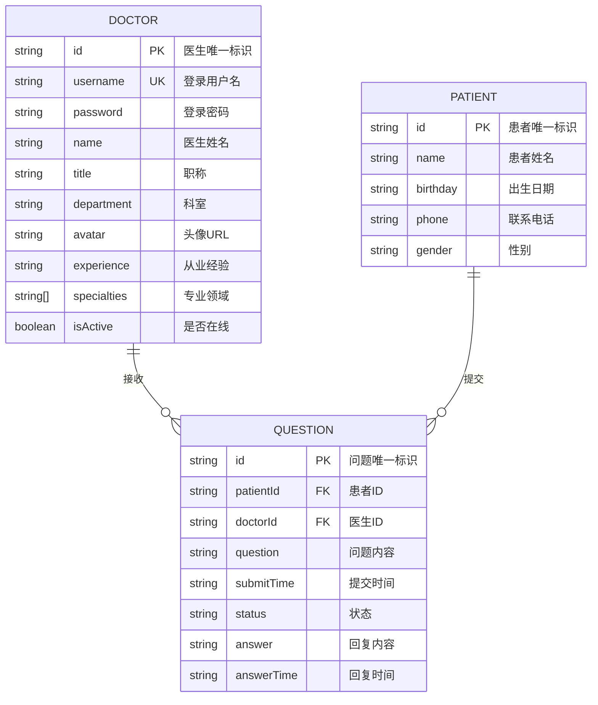
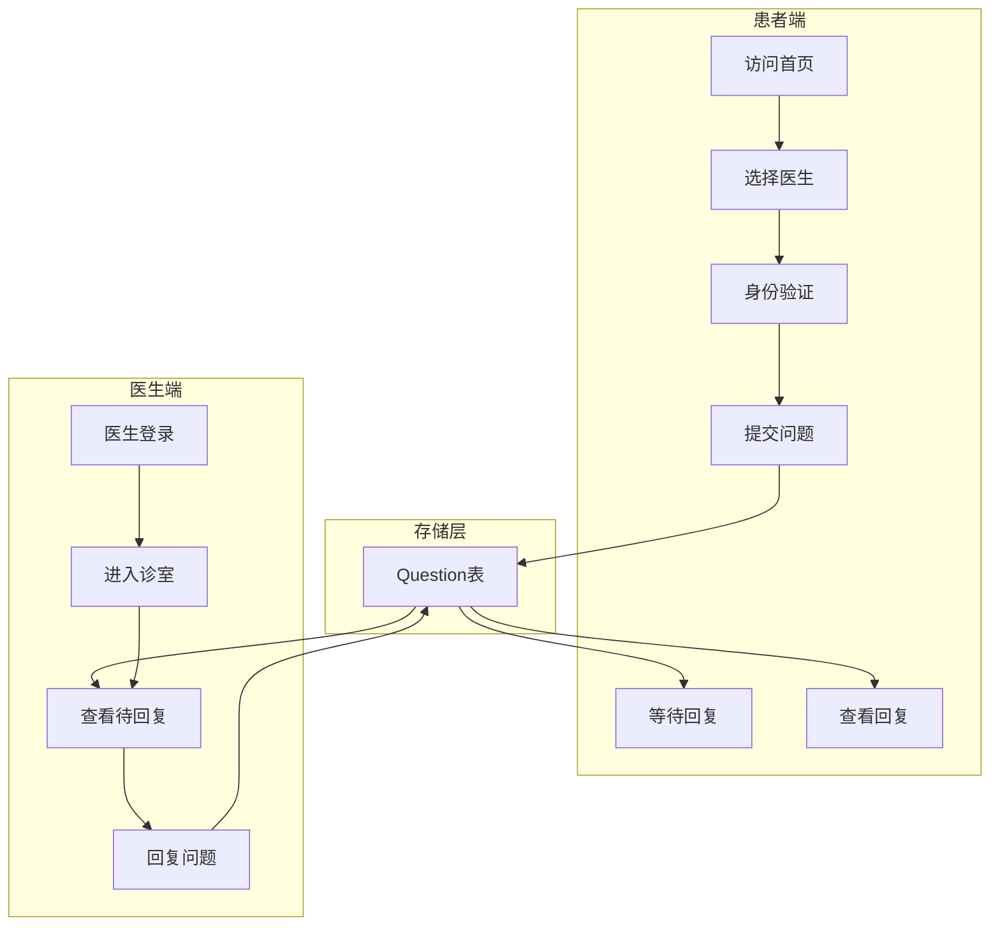
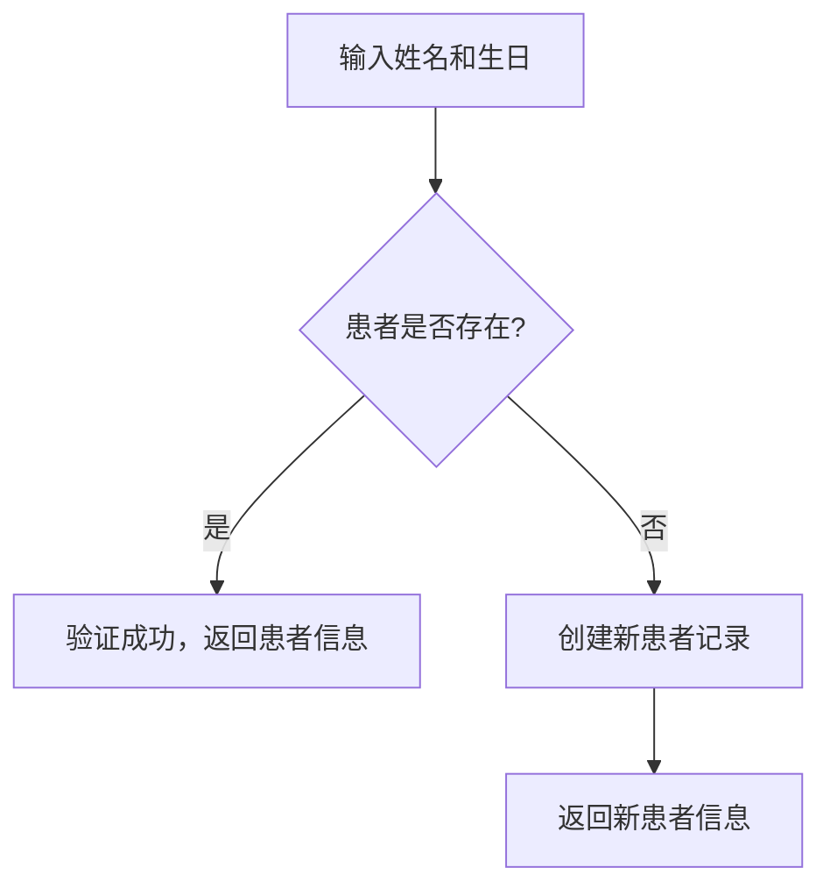
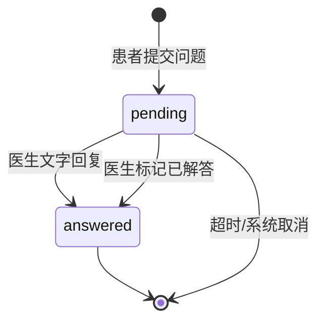
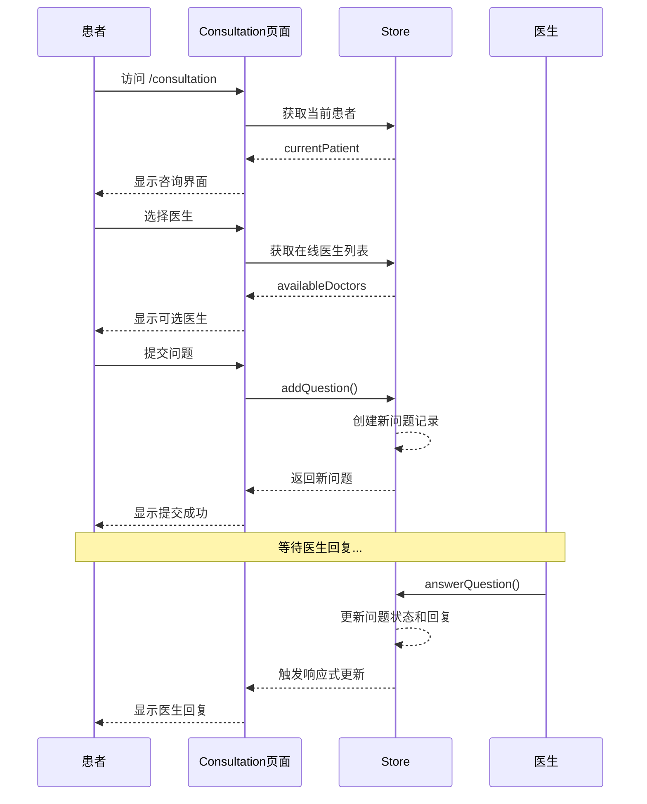
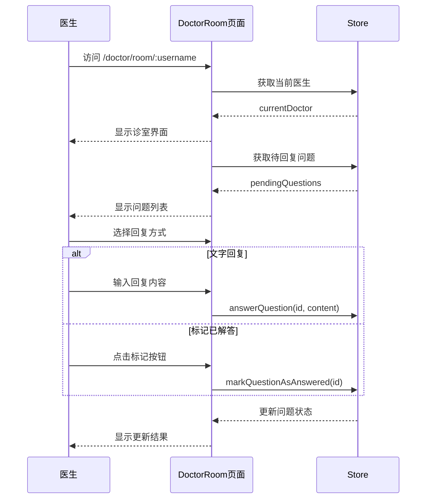

# 数据模型 - 在线医疗咨询平台

## 语言

本文档使用 **简体中文** 编写，所有代码注释和文档均使用中文。

---

## 1. 实体关系概述

### 1.1 概念模型



### 1.2 业务流程图



---

## 2. 数据模型定义

### 2.1 Doctor (医生)

**TypeScript 接口定义：**

```typescript
// src/store/index.ts
export interface Doctor {
  /** 医生唯一标识，格式：doc001 */
  id: string;
  
  /** 登录用户名，URL友好格式，如：dr-zhang-wei */
  username: string;
  
  /** 登录密码（当前为明文存储，生产环境需加密） */
  password: string;
  
  /** 医生姓名，如：张伟医生 */
  name: string;
  
  /** 职称：主任医师 | 副主任医师 | 主治医师 */
  title: string;
  
  /** 所属科室 */
  department: string;
  
  /** 头像图片URL */
  avatar: string;
  
  /** 从业经验描述，如：15年临床经验 */
  experience: string;
  
  /** 专业领域标签列表 */
  specialties: string[];
  
  /** 是否在线接诊 */
  isActive: boolean;
}
```

**示例数据** (`src/data/doctor-user-list.json`)：

```json
[
  {
    "id": "doc001",
    "username": "dr-zhang-wei",
    "password": "123456",
    "name": "张伟医生",
    "title": "主任医师",
    "department": "心内科",
    "avatar": "https://images.pexels.com/photos/5215024/pexels-photo-5215024.jpeg",
    "experience": "15年临床经验",
    "specialties": ["高血压", "冠心病", "心律失常"],
    "isActive": true
  },
  {
    "id": "doc002",
    "username": "dr-li-na",
    "password": "123456",
    "name": "李娜医生",
    "title": "副主任医师",
    "department": "儿科",
    "avatar": "https://images.pexels.com/photos/5327585/pexels-photo-5327585.jpeg",
    "experience": "10年临床经验",
    "specialties": ["儿童感冒", "儿童发育", "疫苗接种"],
    "isActive": true
  },
  {
    "id": "doc003",
    "username": "dr-wang-qiang",
    "password": "123456",
    "name": "王强医生",
    "title": "主治医师",
    "department": "骨科",
    "avatar": "https://images.pexels.com/photos/5452293/pexels-photo-5452293.jpeg",
    "experience": "8年临床经验",
    "specialties": ["骨折", "关节炎", "运动损伤"],
    "isActive": true
  },
  {
    "id": "doc004",
    "username": "dr-liu-min",
    "password": "123456",
    "name": "刘敏医生",
    "title": "主任医师",
    "department": "妇产科",
    "avatar": "https://images.pexels.com/photos/5452201/pexels-photo-5452201.jpeg",
    "experience": "18年临床经验",
    "specialties": ["孕期保健", "妇科炎症", "产后恢复"],
    "isActive": false
  },
  {
    "id": "doc005",
    "username": "dr-chen-jie",
    "password": "123456",
    "name": "陈杰医生",
    "title": "副主任医师",
    "department": "消化内科",
    "avatar": "https://images.pexels.com/photos/5215024/pexels-photo-5215024.jpeg",
    "experience": "12年临床经验",
    "specialties": ["胃炎", "肠道疾病", "肝病"],
    "isActive": true
  }
]
```

---

### 2.2 Patient (患者)

**TypeScript 接口定义：**

```typescript
export interface Patient {
  /** 患者唯一标识，动态生成：patient + 时间戳 */
  id: string;
  
  /** 患者姓名 */
  name: string;
  
  /** 出生日期，格式：YYYY-MM-DD，用于身份验证 */
  birthday: string;
  
  /** 联系电话（可选） */
  phone: string;
  
  /** 性别（可选）：男 | 女 */
  gender: string;
}
```

**示例数据** (`src/data/patient-user.json`)：

```json
[
  {
    "id": "patient001",
    "name": "赵明",
    "birthday": "1990-05-15",
    "phone": "13800138000",
    "gender": "男"
  },
  {
    "id": "patient002",
    "name": "孙丽",
    "birthday": "1988-03-22",
    "phone": "13900139000",
    "gender": "女"
  },
  {
    "id": "patient003",
    "name": "周杰",
    "birthday": "1995-11-08",
    "phone": "13700137000",
    "gender": "男"
  }
]
```

**患者身份验证逻辑：**



---

### 2.3 Question (咨询问题)

**TypeScript 接口定义：**

```typescript
export interface Question {
  /** 问题唯一标识，格式：q + 时间戳 */
  id: string;
  
  /** 提问患者ID */
  patientId: string;
  
  /** 提问患者姓名（冗余存储） */
  patientName: string;
  
  /** 指定医生ID */
  doctorId: string;
  
  /** 指定医生姓名（冗余存储） */
  doctorName: string;
  
  /** 问题内容 */
  question: string;
  
  /** 提交时间，ISO 8601 格式 */
  submitTime: string;
  
  /** 问题状态 */
  status: 'pending' | 'answered';
  
  /** 医生回复内容（未回复时为null） */
  answer: string | null;
  
  /** 回复时间（未回复时为null） */
  answerTime: string | null;
}
```

**状态流转：**



**示例数据** (`src/data/question-list.json`)：

```json
[
  {
    "id": "q001",
    "patientId": "patient001",
    "patientName": "赵明",
    "doctorId": "doc001",
    "doctorName": "张伟医生",
    "question": "最近总是感觉胸闷气短,特别是爬楼梯的时候,这是什么原因?",
    "submitTime": "2025-11-02T09:30:00",
    "status": "answered",
    "answer": "根据您的描述,可能是心脏功能问题。建议您做个心电图和心脏彩超检查,同时注意休息,避免剧烈运动。",
    "answerTime": "2025-11-02T09:45:00"
  },
  {
    "id": "q002",
    "patientId": "patient002",
    "patientName": "孙丽",
    "doctorId": "doc002",
    "doctorName": "李娜医生",
    "question": "孩子5岁,最近总是咳嗽,晚上更严重,需要吃什么药?",
    "submitTime": "2025-11-02T10:15:00",
    "status": "pending",
    "answer": null,
    "answerTime": null
  },
  {
    "id": "q003",
    "patientId": "patient003",
    "patientName": "周杰",
    "doctorId": "doc003",
    "doctorName": "王强医生",
    "question": "打篮球时扭伤了脚踝,肿了很大一块,该怎么处理?",
    "submitTime": "2025-11-02T11:00:00",
    "status": "answered",
    "answer": "立即冰敷,抬高患肢,24小时内不要热敷。建议拍个X光片排除骨折。",
    "answerTime": "2025-11-02T11:20:00"
  }
]
```

---

## 3. 枚举值定义

### 3.1 科室列表

| 科室 | 英文 | 说明 | 对应医生 |
|------|------|------|----------|
| 心内科 | Cardiology | 心脏及心血管疾病 | 张伟医生 |
| 儿科 | Pediatrics | 儿童疾病 | 李娜医生 |
| 骨科 | Orthopedics | 骨骼、关节疾病 | 王强医生 |
| 妇产科 | Obstetrics & Gynecology | 女性健康 | 刘敏医生 |
| 消化内科 | Gastroenterology | 消化系统疾病 | 陈杰医生 |

### 3.2 职称等级

| 职称 | 说明 | 对应医生 |
|------|------|----------|
| 主任医师 | 最高级别医师 | 张伟医生、刘敏医生 |
| 副主任医师 | 副高级职称 | 李娜医生、陈杰医生 |
| 主治医师 | 中级职称 | 王强医生 |

### 3.3 专业领域

| 科室 | 专业领域 |
|------|----------|
| 心内科 | 高血压、冠心病、心律失常 |
| 儿科 | 儿童感冒、儿童发育、疫苗接种 |
| 骨科 | 骨折、关节炎、运动损伤 |
| 妇产科 | 孕期保健、妇科炎症、产后恢复 |
| 消化内科 | 胃炎、肠道疾病、肝病 |

### 3.4 问题状态

| 状态 | 英文 | 说明 |
|------|------|------|
| 待解答 | pending | 患者已提交，等待医生回复 |
| 已解答 | answered | 医生已回复 |

---

## 4. Store API

### 4.1 状态结构

```typescript
// src/store/index.ts
interface State {
  doctors: Doctor[];         // 医生列表
  patients: Patient[];        // 患者列表
  questions: Question[];       // 问题列表
  currentDoctor: Doctor | null;  // 当前登录医生
  currentPatient: Patient | null; // 当前验证患者
}

const state = reactive<State>({
  doctors: doctorData as Doctor[],
  patients: patientData as Patient[],
  questions: questionData as Question[],
  currentDoctor: null,
  currentPatient: null,
});
```

### 4.2 医生相关方法

```typescript
// 医生登录验证
loginDoctor(username: string, password: string): Doctor | null

// 医生登出
logoutDoctor(): void

// 通过用户名获取医生
getDoctorByUsername(username: string): Doctor | undefined

// 获取在线医生列表
getActiveDoctors(): Doctor[]

// 获取某医生的问题列表
getQuestionsByDoctor(doctorId: string): Question[]
```

### 4.3 患者相关方法

```typescript
// 患者身份验证（姓名+生日）
// 如果患者不存在，会自动创建新记录
verifyPatient(name: string, birthday: string): Patient

// 患者登出
logoutPatient(): void

// 获取某患者的问题列表
getQuestionsByPatient(patientId: string): Question[]
```

### 4.4 问题相关方法

```typescript
// 提交新问题
addQuestion(question: {
  patientId: string;
  patientName: string;
  doctorId: string;
  doctorName: string;
  question: string;
}): Question

// 回复问题（文字回复）
answerQuestion(questionId: string, answer: string): void

// 标记问题已解答（口述解答）
markQuestionAsAnswered(questionId: string): void
```

### 4.5 统计相关方法

```typescript
getStatistics(): {
  totalDoctors: number;    // 医生总数
  totalQuestions: number;  // 问题总数
  activeSessions: number;  // 待回复问题数
  totalSessions: number;   // 在线医生数
}
```

---

## 5. 数据流向详解

### 5.1 患者咨询流程



### 5.2 医生诊室流程



---

## 6. URL 路由与数据关系

| 路由 | 页面 | 关联数据 |
|------|------|----------|
| `/` | Home.vue | 所有医生、统计数据 |
| `/doctors` | Doctors.vue | 所有医生列表 |
| `/consultation` | Consultation.vue | 所有问题、当前患者 |
| `/consultation/:doctorUsername` | Consultation.vue | 指定医生的问题 |
| `/doctor/login` | DoctorLogin.vue | 医生登录 |
| `/doctor/room/:username` | DoctorRoom.vue | 医生的问题列表 |
| `/about` | About.vue | 无数据关联 |

---

## 7. 扩展数据模型建议

### 7.1 未来可能添加的功能

| 功能 | 描述 | 建议添加的字段 |
|------|------|----------------|
| 医生排班 | 医生接诊时间管理 | `schedule`, `availableTime` |
| 病历管理 | 患者历史就诊记录 | `MedicalRecord` 表 |
| 在线支付 | 咨询费用支付 | `paymentStatus`, `amount` |
| 预约挂号 | 提前预约咨询时段 | `Appointment` 表 |
| 视频问诊 | 实时视频咨询 | `roomId`, `videoUrl` |
| 满意度评价 | 患者评价医生服务 | `rating`, `comment` |

### 7.2 扩展模型示例

```typescript
// 预约挂号
interface Appointment {
  id: string;
  patientId: string;
  doctorId: string;
  scheduledTime: string;      // 预约时间
  duration: number;           // 咨询时长（分钟）
  status: 'scheduled' | 'completed' | 'cancelled' | 'no-show';
  type: 'text' | 'video';     // 咨询类型
  notes: string;              // 患者备注
  createdAt: string;
}

// 病历记录
interface MedicalRecord {
  id: string;
  patientId: string;
  doctorId: string;
  appointmentId: string;
  diagnosis: string;         // 诊断
  prescription: string;        // 处方
  advice: string;            // 医嘱
  attachments: string[];      // 附件（检查报告等）
  createdAt: string;
}

// 满意度评价
interface Rating {
  id: string;
  questionId: string;
  patientId: string;
  doctorId: string;
  rating: number;             // 1-5 星
  comment: string;            // 评价内容
  createdAt: string;
}
```

---

## 8. 数据验证规则

### 8.1 医生数据

| 字段 | 验证规则 |
|------|----------|
| username | 非空、唯一、URL友好格式 |
| password | 非空、最少6位 |
| name | 非空 |
| title | 非空 |
| department | 非空 |
| specialties | 至少包含1项 |

### 8.2 患者数据

| 字段 | 验证规则 |
|------|----------|
| name | 非空 |
| birthday | 非空、日期格式 YYYY-MM-DD |

### 8.3 问题数据

| 字段 | 验证规则 |
|------|----------|
| question | 非空、最少10字符 |
| answer | 回复时非空 |

---

*最后更新：2026-04-29*
