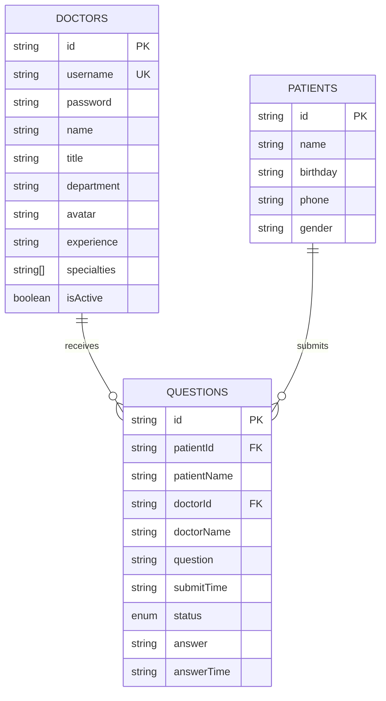
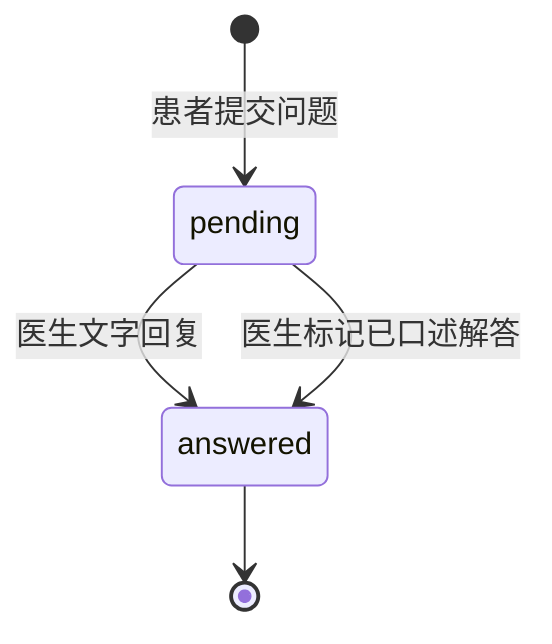
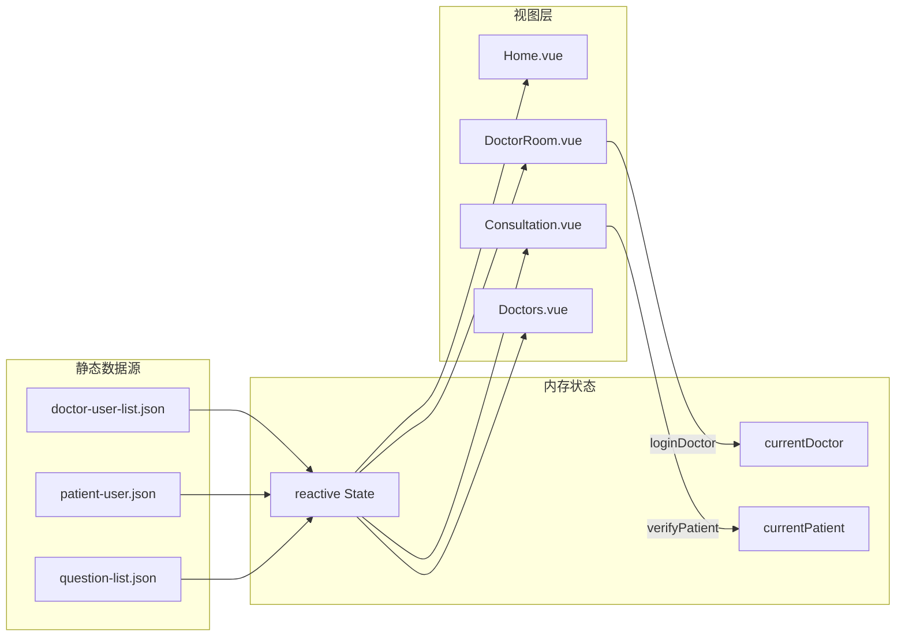

# 数据模型

## Overview
本文档描述 QA Live Healthcare 项目的数据模型、实体关系和数据流。项目为纯前端应用，所有数据存储在内存中（Vue 3 `reactive()` 状态），数据源为静态 JSON 文件。

## Entity Relationship Diagram



## Entity Definitions

### Doctor（医生）

**Purpose**: 代表平台注册的医生，包含登录凭证和专业信息。

**Source**: `src/store/index.ts:6-17` + `src/data/doctor-user-list.json`

```typescript
interface Doctor {
  id: string;          // 唯一标识，如 "doc001"
  username: string;    // 登录用户名，如 "dr-zhang-wei"
  password: string;    // 明文密码（⚠️ 生产环境需加密）
  name: string;        // 显示名称，如 "张伟医生"
  title: string;       // 职称：主任医师 | 副主任医师 | 主治医师
  department: string;  // 科室：心内科 | 儿科 | 骨科 | 妇产科 | 消化内科
  avatar: string;      // 头像 URL（Pexels CDN）
  experience: string;  // 经验描述，如 "15年临床经验"
  specialties: string[]; // 专长标签，如 ["高血压", "冠心病", "心律失常"]
  isActive: boolean;   // 是否在线（控制是否可接诊）
}
```

**Sample Data**:
```json
{
  "id": "doc001",
  "username": "dr-zhang-wei",
  "password": "123456",
  "name": "张伟医生",
  "title": "主任医师",
  "department": "心内科",
  "avatar": "https://images.pexels.com/photos/5215024/...",
  "experience": "15年临床经验",
  "specialties": ["高血压", "冠心病", "心律失常"],
  "isActive": true
}
```

**Current Data**: 共 5 名医生（3 名在线，1 名离线）

### Patient（患者）

**Purpose**: 代表使用问诊服务的患者，支持自动注册。

**Source**: `src/store/index.ts:19-25` + `src/data/patient-user.json`

```typescript
interface Patient {
  id: string;          // 唯一标识，如 "patient001"
  name: string;        // 患者姓名
  birthday: string;    // 生日，格式 YYYY-MM-DD
  phone: string;       // 脱敏手机号，如 "138****1234"
  gender: string;      // 性别：男 | 女
}
```

**Sample Data**:
```json
{
  "id": "patient001",
  "name": "赵明",
  "birthday": "1985-03-15",
  "phone": "138****1234",
  "gender": "男"
}
```

**Current Data**: 共 5 名预设患者。新患者通过 `verifyPatient()` 自动创建（id 使用 `patient${Date.now()}`）。

### Question（问诊问题）

**Purpose**: 代表患者提交的问诊问题，包含状态流转和医生回复。

**Source**: `src/store/index.ts:27-38` + `src/data/question-list.json`

```typescript
interface Question {
  id: string;              // 唯一标识，如 "q001"
  patientId: string;       // 患者ID（FK → Patient.id）
  patientName: string;     // 患者姓名（冗余字段）
  doctorId: string;        // 医生ID（FK → Doctor.id）
  doctorName: string;      // 医生姓名（冗余字段）
  question: string;        // 问题描述
  submitTime: string;      // 提交时间（ISO 8601）
  status: 'pending' | 'answered';  // 问题状态
  answer: string | null;   // 医生回复内容
  answerTime: string | null; // 回复时间（ISO 8601）
}
```

**Sample Data**:
```json
{
  "id": "q001",
  "patientId": "patient001",
  "patientName": "赵明",
  "doctorId": "doc001",
  "doctorName": "张伟医生",
  "question": "最近总是感觉胸闷气短,特别是爬楼梯的时候,这是什么原因?",
  "submitTime": "2025-11-02T09:30:00",
  "status": "answered",
  "answer": "根据您的描述,可能是心脏功能问题。建议您做个心电图和心脏彩超检查。",
  "answerTime": "2025-11-02T09:45:00"
}
```

**Current Data**: 共 7 条问题（4 条待解答，3 条已解答）

## State Management（应用状态）

### State Structure

**Source**: `src/store/index.ts:40-54`

```typescript
interface State {
  doctors: Doctor[];           // 全部医生列表
  patients: Patient[];         // 全部患者列表
  questions: Question[];       // 全部问题列表
  currentDoctor: Doctor | null;  // 当前登录医生
  currentPatient: Patient | null; // 当前登录患者
}
```

### Question Status State Machine



**状态说明**:
- `pending`: 等待医生回复，显示在医生诊室的"待响应问题"区域
- `answered`: 已回复，显示在"已解答问题"折叠面板中

## Data Relationships

### One-to-Many Relationships

| 关系 | 类型 | 说明 |
|------|------|------|
| Doctor → Question | 1:N | 一个医生可接收多个问题 |
| Patient → Question | 1:N | 一个患者可提交多个问题 |

### Data Flow



## Data Validation Rules

### Doctor Login Validation
```typescript
// Source: src/views/DoctorLogin.vue:72-75
const rules = {
  username: [{ required: true, message: '请输入用户名' }],
  password: [{ required: true, message: '请输入密码' }],
};
// 认证方式: 明文比对 state.doctors 中的 username + password
// 测试账号: dr-zhang-wei / 123456
```

### Patient Verification Validation
```typescript
// Source: src/views/Consultation.vue:193-196
const authRules = {
  name: [{ required: true, message: '请输入姓名' }],
  birthday: [{ required: true, message: '请选择生日' }],
};
// 认证方式: 姓名 + 生日匹配，首次输入自动创建账户
```

### Question Submission Validation
```typescript
// Source: src/views/Consultation.vue:270-278
// 1. doctorId 不能为空
// 2. question 不能为空字符串（trim 后判断）
// 3. 提交后自动生成: id, submitTime, status='pending', answer=null
```

## Data Persistence

**⚠️ 无持久化**: 所有数据存储在 Vue `reactive()` 对象中，页面刷新后所有修改丢失。

| 操作 | 持久化 | 刷新后 |
|------|--------|--------|
| 医生登录 | 仅内存 | 需重新登录 |
| 患者验证 | 仅内存 | 需重新验证 |
| 提交问题 | 仅内存 | 丢失 |
| 医生回复 | 仅内存 | 丢失 |
| 新增患者 | 仅内存 | 丢失 |

## Known Issues

1. **密码明文存储**: 医生密码以明文存放在 JSON 中（`src/data/doctor-user-list.json`）
2. **无数据持久化**: 所有 CRUD 操作仅在内存中，刷新即丢失
3. **冗余字段**: Question 中 `patientName` 和 `doctorName` 为冗余字段，可能导致数据不一致
4. **ID 生成策略**: 使用 `Date.now()` 生成 ID，高并发下可能重复

---

*此数据模型文档应随数据结构变更而更新。使用 `/asdm-context-update data-models` 保持文档最新。*
