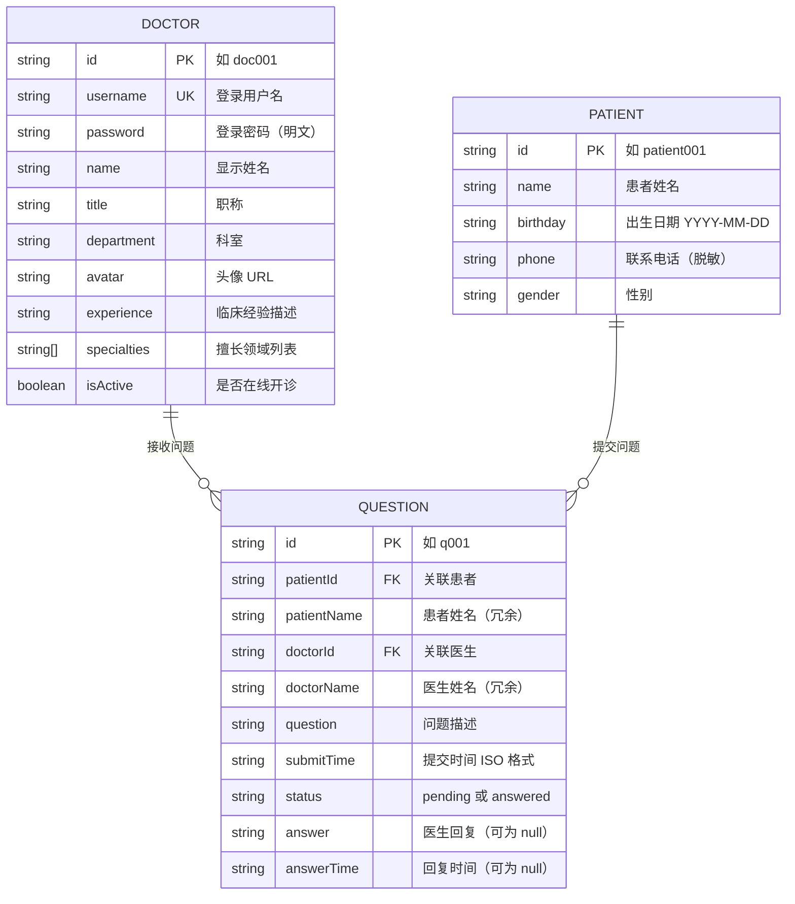
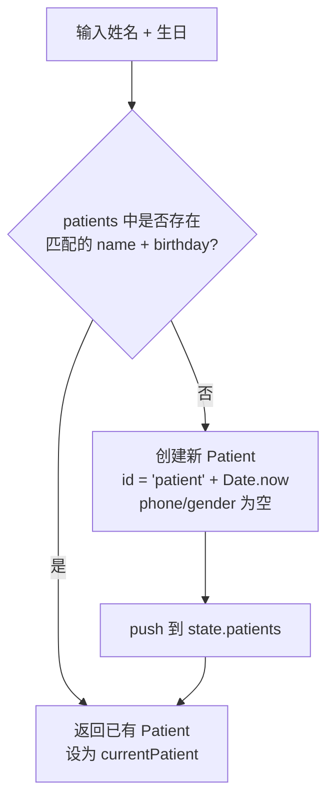
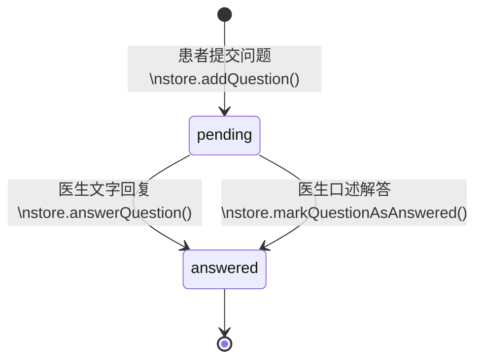
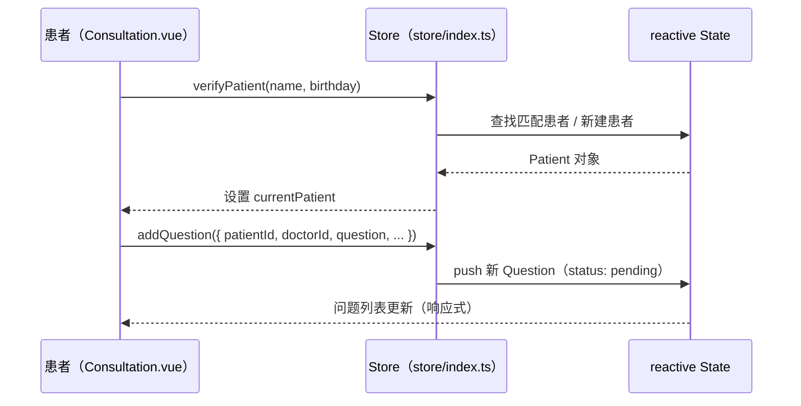
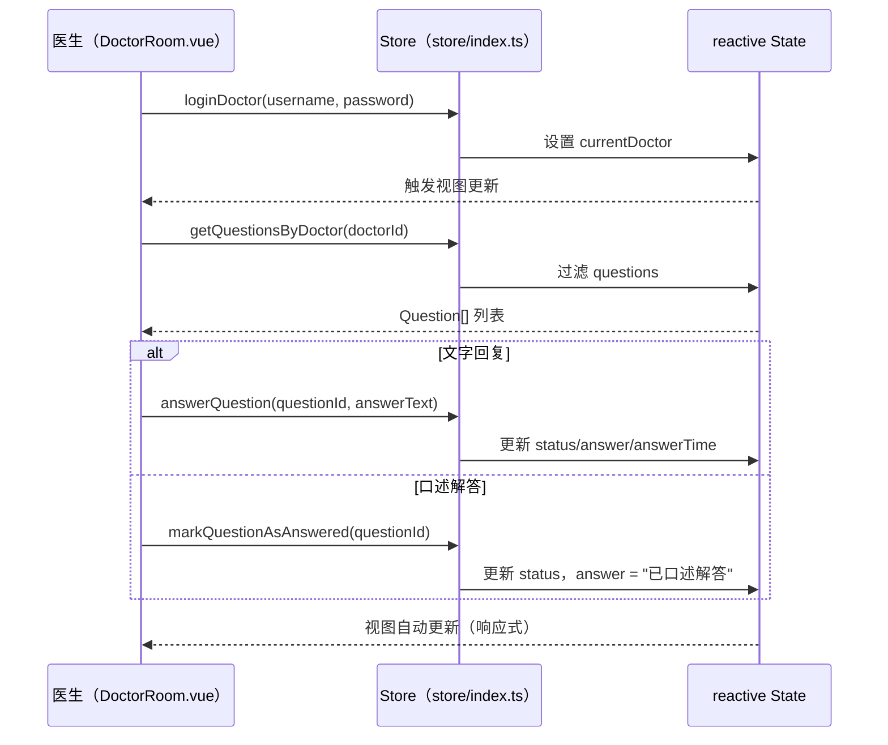

# 数据模型文档

> **生成时间**: 2026-04-28  
> **工具集**: Context Builder (`context-builder`)  
> **语言**: 简体中文  
> **源文件**: [`src/store/index.ts`](../../src/store/index.ts)、[`src/data/`](../../src/data/)

---

## 概览

本项目采用**纯前端内存数据层**，无数据库，所有数据以 JSON 文件初始化后加载至 Vue 3 `reactive` 状态对象中，运行时修改不持久化（页面刷新后恢复初始状态）。

系统共有三个核心实体：**Doctor（医生）**、**Patient（患者）**、**Question（问诊记录）**。

---

## 实体关系图（ER 图）



---

## 实体详细定义

### Doctor（医生）

**用途**：表示平台注册医生，包含身份认证、个人信息及在线状态。

**源文件**：[`src/store/index.ts`](../../src/store/index.ts)（第 6-17 行）、[`src/data/doctor-user-list.json`](../../src/data/doctor-user-list.json)

```typescript
export interface Doctor {
  id: string;           // 唯一标识，格式：doc001、doc002...
  username: string;     // 登录用户名，格式：dr-{姓名拼音}，如 "dr-zhang-wei"
  password: string;     // 登录密码（明文存储，仅 Mock 演示用）
  name: string;         // 显示姓名，如 "张伟医生"
  title: string;        // 职称：主任医师 / 副主任医师 / 主治医师
  department: string;   // 所属科室，如 "心内科"
  avatar: string;       // 头像图片 URL（来自 pexels.com）
  experience: string;   // 临床经验描述，如 "15年临床经验"
  specialties: string[]; // 擅长领域数组，如 ["高血压", "冠心病", "心律失常"]
  isActive: boolean;    // 是否在线开诊（true=开诊，false=暂停）
}
```

**字段约束**：
| 字段 | 约束 |
|------|------|
| `id` | 全局唯一，格式 `doc{3位数字}` |
| `username` | 全局唯一，用于登录和路由参数 |
| `password` | 当前所有医生密码均为 `123456`（仅演示） |
| `specialties` | 数组，通常 2-3 个专科方向 |
| `isActive` | 控制首页诊室展示及患者选医生可用性 |

---

### Patient（患者）

**用途**：表示问诊患者，通过姓名+生日双因子验证身份，无传统账号体系。

**源文件**：[`src/store/index.ts`](../../src/store/index.ts)（第 19-26 行）、[`src/data/patient-user.json`](../../src/data/patient-user.json)

```typescript
export interface Patient {
  id: string;       // 唯一标识，格式：patient001（预置）或 patient{时间戳}（运行时新建）
  name: string;     // 患者姓名（用于身份验证的主键之一）
  birthday: string; // 出生日期，格式：YYYY-MM-DD（用于身份验证的主键之一）
  phone: string;    // 联系电话（脱敏显示，如 "138****1234"）
  gender: string;   // 性别："男" 或 "女"（运行时新建的患者此字段为空）
}
```

**身份验证逻辑**（`store.verifyPatient`）：


---

### Question（问诊记录）

**用途**：记录患者向医生提交的问题及医生的回复，是系统的核心业务实体。

**源文件**：[`src/store/index.ts`](../../src/store/index.ts)（第 27-38 行）、[`src/data/question-list.json`](../../src/data/question-list.json)

```typescript
export interface Question {
  id: string;              // 唯一标识，格式：q001（预置）或 q{时间戳}（运行时新建）
  patientId: string;       // 关联患者 ID（外键引用 Patient.id）
  patientName: string;     // 患者姓名（冗余字段，避免关联查询）
  doctorId: string;        // 关联医生 ID（外键引用 Doctor.id）
  doctorName: string;      // 医生姓名（冗余字段，避免关联查询）
  question: string;        // 患者描述的问题/症状
  submitTime: string;      // 提交时间，ISO 8601 格式，如 "2025-11-02T09:30:00"
  status: 'pending' | 'answered'; // 问题状态
  answer: string | null;   // 医生回复内容；未回复时为 null
  answerTime: string | null; // 医生回复时间；未回复时为 null
}
```

**状态流转**：



**回复方式区别**：

| 操作 | 方法 | `answer` 值 | 场景 |
|------|------|-------------|------|
| 文字回复 | `answerQuestion(id, answer)` | 医生输入的文字内容 | 医生通过弹窗输入回复 |
| 口述解答 | `markQuestionAsAnswered(id)` | 固定值 `"已口述解答"` | 医生已通过电话/视频解答 |

---

## 全局状态结构（Store State）

**源文件**：[`src/store/index.ts`](../../src/store/index.ts)（第 40-54 行）

```typescript
interface State {
  doctors: Doctor[];           // 所有医生列表（从 JSON 初始化，共 5 名）
  patients: Patient[];         // 所有患者列表（从 JSON 初始化，共 5 名；运行时可追加）
  questions: Question[];       // 所有问诊记录（从 JSON 初始化，共 7 条；运行时可追加）
  currentDoctor: Doctor | null;  // 当前登录的医生（null 表示未登录）
  currentPatient: Patient | null; // 当前登录的患者（null 表示未验证身份）
}
```

---

## Store 方法参考

| 方法签名 | 说明 | 返回值 |
|----------|------|--------|
| `loginDoctor(username, password)` | 医生账号密码登录，成功则设置 `currentDoctor` | `Doctor \| null` |
| `logoutDoctor()` | 医生退出，清空 `currentDoctor` | `void` |
| `verifyPatient(name, birthday)` | 患者身份验证，不存在则自动创建 | `Patient` |
| `logoutPatient()` | 患者切换用户，清空 `currentPatient` | `void` |
| `getQuestionsByDoctor(doctorId)` | 获取指定医生的所有问诊记录 | `Question[]` |
| `getQuestionsByPatient(patientId)` | 获取指定患者的所有问诊记录 | `Question[]` |
| `addQuestion(partial)` | 患者提交新问题，自动生成 id/submitTime/status | `Question` |
| `answerQuestion(questionId, answer)` | 医生文字回复问题 | `void` |
| `markQuestionAsAnswered(questionId)` | 标记为口述解答 | `void` |
| `getDoctorByUsername(username)` | 按用户名查找医生（用于路由参数解析） | `Doctor \| undefined` |
| `getActiveDoctors()` | 获取所有在线医生（`isActive === true`） | `Doctor[]` |
| `getStatistics()` | 获取平台统计数据 | `{ totalDoctors, totalQuestions, activeSessions, totalSessions }` |

---

## 数据流图

### 患者提交问题流程



### 医生回复问题流程



---

## Mock 数据示例

### 医生数据样例

```json
{
  "id": "doc001",
  "username": "dr-zhang-wei",
  "password": "123456",
  "name": "张伟医生",
  "title": "主任医师",
  "department": "心内科",
  "avatar": "https://images.pexels.com/photos/5215024/pexels-photo-5215024.jpeg?auto=compress&cs=tinysrgb&w=400",
  "experience": "15年临床经验",
  "specialties": ["高血压", "冠心病", "心律失常"],
  "isActive": true
}
```

### 患者数据样例

```json
{
  "id": "patient001",
  "name": "赵明",
  "birthday": "1985-03-15",
  "phone": "138****1234",
  "gender": "男"
}
```

### 问诊记录样例（已解答）

```json
{
  "id": "q001",
  "patientId": "patient001",
  "patientName": "赵明",
  "doctorId": "doc001",
  "doctorName": "张伟医生",
  "question": "最近总是感觉胸闷气短，特别是爬楼梯的时候，这是什么原因？",
  "submitTime": "2025-11-02T09:30:00",
  "status": "answered",
  "answer": "根据您的描述，可能是心脏功能问题。建议您做个心电图和心脏彩超检查，同时注意休息，避免剧烈运动。",
  "answerTime": "2025-11-02T09:45:00"
}
```

### 问诊记录样例（待解答）

```json
{
  "id": "q002",
  "patientId": "patient002",
  "patientName": "孙丽",
  "doctorId": "doc002",
  "doctorName": "李娜医生",
  "question": "孩子5岁，最近总是咳嗽，晚上更严重，需要吃什么药？",
  "submitTime": "2025-11-02T10:15:00",
  "status": "pending",
  "answer": null,
  "answerTime": null
}
```

---

## 现有数据统计

### 医生列表（共 5 名）

| ID | 姓名 | 职称 | 科室 | 状态 | 擅长领域 |
|----|------|------|------|------|----------|
| doc001 | 张伟医生 | 主任医师 | 心内科 | 🟢 在线 | 高血压、冠心病、心律失常 |
| doc002 | 李娜医生 | 副主任医师 | 儿科 | 🟢 在线 | 儿童感冒、儿童发育、疫苗接种 |
| doc003 | 王强医生 | 主治医师 | 骨科 | 🟢 在线 | 骨折、关节炎、运动损伤 |
| doc004 | 刘敏医生 | 主任医师 | 妇产科 | 🔴 离线 | 孕期保健、妇科炎症、产后恢复 |
| doc005 | 陈杰医生 | 副主任医师 | 消化内科 | 🟢 在线 | 胃炎、肠道疾病、肝病 |

### 问诊记录分布（共 7 条）

| 状态 | 数量 | 记录 ID |
|------|------|---------|
| 已解答 | 3 条 | q001、q003、q007 |
| 待解答 | 4 条 | q002、q004、q005、q006 |

---

## 数据局限性说明

| 局限 | 描述 | 建议改进 |
|------|------|----------|
| 无持久化 | 页面刷新后所有运行时新增数据丢失 | 接入 localStorage 或后端 API |
| 明文密码 | 医生密码以明文存储在 JSON 文件 | 改用哈希存储 + JWT 认证 |
| 冗余字段 | Question 中存储了 patientName/doctorName | 正式系统应通过关联查询获取 |
| 无索引 | 基于数组 `find/filter` 遍历，数据量大时性能差 | 改用 Map 或引入真实数据库 |
| 无并发控制 | 多标签页操作可能产生数据不一致 | 引入后端 + 事务管理 |

---

*本文件由 Context Builder 工具集自动生成。数据模型变更后请执行 `/asdm-context-update` 更新。*
