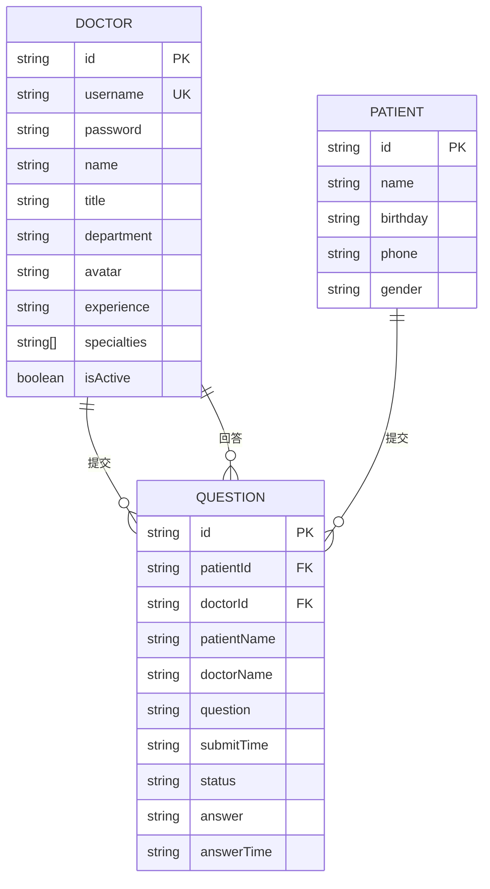
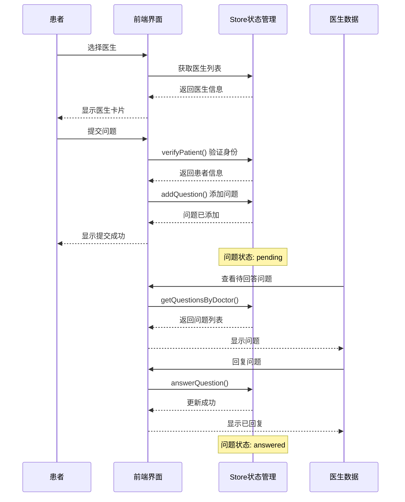
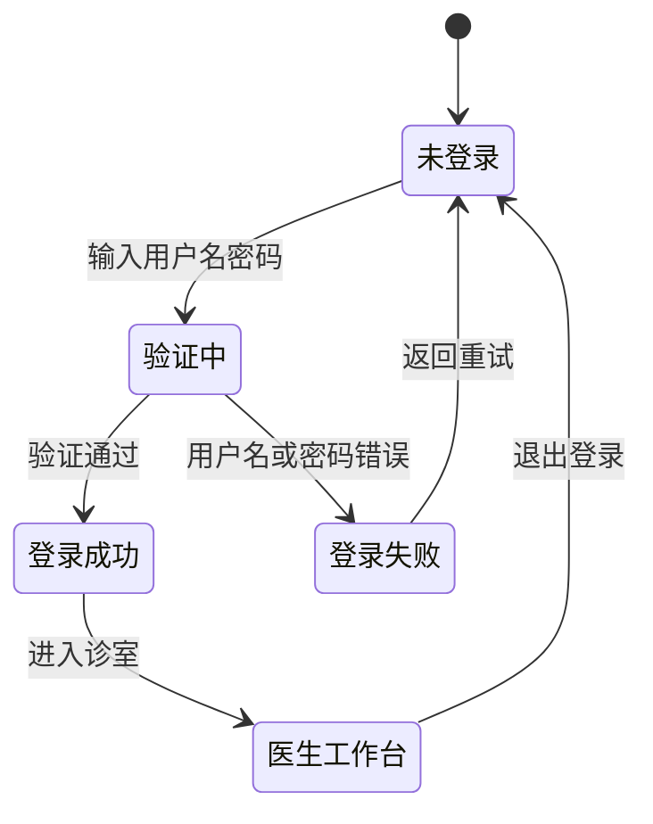

# 数据模型详解

## 概述

本文档描述在线医疗问诊平台的数据模型、实体关系和数据流。

## 实体关系图



## 实体定义

### 医生 (Doctor)

**用途**: 表示平台上的医生用户

```typescript
interface Doctor {
  /** 唯一标识符 */
  id: string;
  /** 登录用户名 */
  username: string;
  /** 登录密码 */
  password: string;
  /** 医生姓名 */
  name: string;
  /** 职称：主任医师/副主任医师/主治医师 */
  title: string;
  /** 所属科室 */
  department: string;
  /** 头像图片 URL */
  avatar: string;
  /** 临床经验描述 */
  experience: string;
  /** 专业领域标签数组 */
  specialties: string[];
  /** 是否在线接诊 */
  isActive: boolean;
}
```

**示例数据**:
```json
{
  "id": "doc001",
  "username": "dr-zhang-wei",
  "password": "123456",
  "name": "张伟医生",
  "title": "主任医师",
  "department": "心内科",
  "avatar": "https://images.pexels.com/photos/5215024/pexels-photo-5215024.jpeg",
  "experience": "15年临床经验",
  "specialties": ["高血压", "冠心病", "心律失常"],
  "isActive": true
}
```

### 患者 (Patient)

**用途**: 表示平台上的患者用户

```typescript
interface Patient {
  /** 唯一标识符 */
  id: string;
  /** 患者姓名 */
  name: string;
  /** 出生日期 */
  birthday: string;
  /** 联系电话 */
  phone: string;
  /** 性别 */
  gender: string;
}
```

**示例数据**:
```json
{
  "id": "patient001",
  "name": "赵明",
  "birthday": "1985-06-15",
  "phone": "13800138000",
  "gender": "男"
}
```

### 问题 (Question)

**用途**: 表示患者的问诊问题

```typescript
interface Question {
  /** 唯一标识符 */
  id: string;
  /** 患者ID */
  patientId: string;
  /** 患者姓名 */
  patientName: string;
  /** 医生ID */
  doctorId: string;
  /** 医生姓名 */
  doctorName: string;
  /** 问题内容 */
  question: string;
  /** 提交时间 (ISO 8601) */
  submitTime: string;
  /** 状态: pending=待回答, answered=已回答 */
  status: 'pending' | 'answered';
  /** 医生回复内容 */
  answer: string | null;
  /** 回复时间 (ISO 8601) */
  answerTime: string | null;
}
```

**示例数据**:
```json
{
  "id": "q001",
  "patientId": "patient001",
  "patientName": "赵明",
  "doctorId": "doc001",
  "doctorName": "张伟医生",
  "question": "最近总是感觉胸闷气短,特别是爬楼梯的时候,这是什么原因?",
  "submitTime": "2025-11-02T09:30:00",
  "status": "answered",
  "answer": "根据您的描述,可能是心脏功能问题。建议您做个心电图和心脏彩超检查。",
  "answerTime": "2025-11-02T09:45:00"
}
```

## 数据关系

### 一对多关系

1. **医生 → 问题**: 一个医生可以回答多个问题
2. **患者 → 问题**: 一个患者可以提交多个问题

### 关系说明


## 数据流程图

### 问诊流程



### 医生登录流程



## 数据验证规则

### 患者身份验证

```typescript
const patientValidationRules = {
  name: {
    required: true,
    minLength: 2,
    maxLength: 50,
  },
  birthday: {
    required: true,
    pattern: /^\d{4}-\d{2}-\d{2}$/,
  },
};
```

### 医生登录验证

```typescript
const doctorLoginRules = {
  username: {
    required: true,
    minLength: 3,
    maxLength: 50,
  },
  password: {
    required: true,
    minLength: 6,
  },
};
```

### 问题提交验证

```typescript
const questionValidationRules = {
  question: {
    required: true,
    minLength: 10,
    maxLength: 1000,
  },
  doctorId: {
    required: true,
  },
};
```

## 数据访问模式

### Store API 接口

```typescript
// 医生相关
loginDoctor(username: string, password: string): Doctor | null
logoutDoctor(): void
getDoctorByUsername(username: string): Doctor | undefined
getActiveDoctors(): Doctor[]

// 患者相关
verifyPatient(name: string, birthday: string): Patient
logoutPatient(): void

// 问题相关
addQuestion(question: Omit<Question, 'id' | 'submitTime' | 'status' | 'answer' | 'answerTime'>): Question
answerQuestion(questionId: string, answer: string): void
getQuestionsByDoctor(doctorId: string): Question[]
getQuestionsByPatient(patientId: string): Question[]

// 统计
getStatistics(): {
  totalDoctors: number;
  totalQuestions: number;
  activeSessions: number;
  totalSessions: number;
}
```

## 科室数据

| 科室 | 代码 | 常见症状 |
|------|------|----------|
| 心内科 | cardiology | 高血压、冠心病、心律失常 |
| 儿科 | pediatrics | 儿童感冒、发育、疫苗接种 |
| 骨科 | orthopedics | 骨折、关节炎、运动损伤 |
| 妇产科 | obstetrics | 孕期保健、妇科炎症、产后恢复 |
| 消化内科 | gastroenterology | 胃炎、肠道疾病、肝病 |

## 职称体系

| 职称 | 英文 | 说明 |
|------|------|------|
| 主任医师 | Chief Physician | 最高级别医师 |
| 副主任医师 | Associate Chief Physician | 副高级别医师 |
| 主治医师 | Attending Physician | 中级医师 |

## 静态数据文件

项目使用 JSON 文件模拟后端数据：

| 文件 | 用途 | 数据量 |
|------|------|--------|
| `doctor-user-list.json` | 医生用户列表 | 5条记录 |
| `patient-user.json` | 患者用户数据 | 1条记录 |
| `question-list.json` | 问诊问题列表 | 7条记录 |

---

*最后更新: 2026-04-21*
