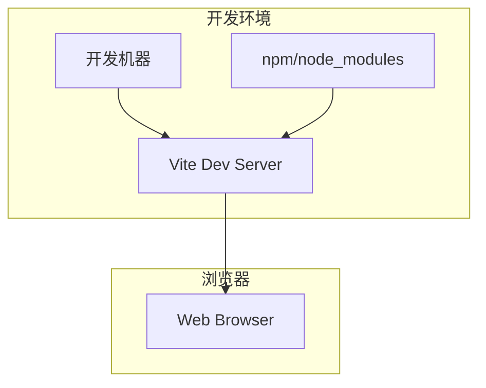

# 部署配置

## 概述

本文档描述在线医疗问诊平台的部署架构、配置和流程。

## 部署架构

### 当前架构



### 生产部署架构 (计划)

```mermaid
graph TB
    subgraph "用户"
        USER[终端用户]
    end
    
    subgraph "CDN"
        CDN[CDN 加速]
    end
    
    subgraph "服务器"
        LB[负载均衡]
        APP1[应用实例 1]
        APP2[应用实例 2]
    end
    
    USER --> CDN
    CDN --> LB
    LB --> APP1
    LB --> APP2
```

## 开发环境配置

### 系统要求

| 要求 | 最低版本 | 推荐版本 |
|------|----------|----------|
| Node.js | 16.x | 18.x LTS |
| npm | 8.x | 10.x |
| 浏览器 | Chrome 90+ / Firefox 88+ / Safari 14+ | 最新版本 |

### 环境变量

```bash
# .env 文件
VITE_APP_TITLE=在线医疗问诊平台
VITE_APP_VERSION=1.0.0
```

### 启动开发服务器

```bash
# 安装依赖
npm install

# 启动开发服务器
npm run dev

# 访问 http://localhost:5173
```

## Vite 构建配置

### vite.config.ts

```typescript
import { defineConfig } from 'vite'
import vue from '@vitejs/plugin-vue'

export default defineConfig({
  plugins: [vue()],
  server: {
    port: 5173,
    host: true,
    proxy: {
      // API 代理配置 (未来扩展)
    }
  },
  build: {
    outDir: 'dist',
    sourcemap: false,
    minify: 'terser',
    rollupOptions: {
      output: {
        manualChunks: {
          vendor: ['vue', 'vue-router', 'ant-design-vue'],
        }
      }
    }
  }
})
```

## 生产构建

### 构建命令

```bash
# 开发构建
npm run build

# 类型检查
npm run build
# 等价于: vue-tsc -b && vite build
```

### 构建产物

```
dist/
├── index.html
├── assets/
│   ├── index-[hash].js
│   ├── index-[hash].css
│   └── images/
└── public/
    └── vite.svg
```

## 部署流程

### 1. 本地构建

```bash
# 克隆项目
git clone <repository-url>
cd qa-live-healthcare

# 安装依赖
npm install

# 开发调试
npm run dev

# 生产构建
npm run build
```

### 2. 部署到静态托管

#### Vercel 部署

```bash
# 安装 Vercel CLI
npm install -g vercel

# 登录
vercel login

# 部署
vercel

# 生产部署
vercel --prod
```

#### Netlify 部署

```bash
# 安装 Netlify CLI
npm install -g netlify-cli

# 登录
netlify login

# 部署
netlify deploy

# 生产部署
netlify deploy --prod
```

#### 手动部署到 Nginx

```bash
# 1. 构建项目
npm run build

# 2. 复制构建产物到 Nginx 目录
cp -r dist/* /var/www/healthcare/

# 3. 配置 Nginx
```

```nginx
# /etc/nginx/sites-available/healthcare
server {
    listen 80;
    server_name your-domain.com;
    
    root /var/www/healthcare;
    index index.html;
    
    location / {
        try_files $uri $uri/ /index.html;
    }
    
    location /api {
        proxy_pass http://backend-server:3000;
    }
    
    # 静态资源缓存
    location ~* \.(js|css|png|jpg|jpeg|gif|ico|svg)$ {
        expires 1y;
        add_header Cache-Control "public, immutable";
    }
}
```

### 3. Docker 部署

#### Dockerfile

```dockerfile
# 构建阶段
FROM node:18-alpine AS builder

WORKDIR /app

COPY package*.json ./
RUN npm ci

COPY . .
RUN npm run build

# 运行阶段
FROM nginx:alpine

COPY --from=builder /app/dist /usr/share/nginx/html
COPY nginx.conf /etc/nginx/conf.d/default.conf

EXPOSE 80

CMD ["nginx", "-g", "daemon off;"]
```

#### nginx.conf

```nginx
server {
    listen 80;
    server_name localhost;
    root /usr/share/nginx/html;
    index index.html;

    location / {
        try_files $uri $uri/ /index.html;
    }

    gzip on;
    gzip_types text/plain text/css application/json application/javascript;
}
```

#### 构建和运行

```bash
# 构建镜像
docker build -t healthcare-app:latest .

# 运行容器
docker run -d -p 80:80 healthcare-app:latest

# 访问 http://localhost
```

#### Docker Compose

```yaml
version: '3.8'

services:
  app:
    build: .
    ports:
      - "80:80"
    environment:
      - NODE_ENV=production
    restart: unless-stopped
```

## 环境配置

### 开发环境 (.env.development)

```bash
VITE_APP_TITLE=在线医疗问诊平台(开发)
VITE_API_BASE_URL=http://localhost:3000/api
```

### 生产环境 (.env.production)

```bash
VITE_APP_TITLE=在线医疗问诊平台
VITE_API_BASE_URL=https://api.example.com/api
```

## 性能优化配置

### Vite 生产构建优化

```typescript
// vite.config.ts
export default defineConfig({
  build: {
    // 目标浏览器
    target: 'es2015',
    
    // 输出目录
    outDir: 'dist',
    
    // 是否生成 sourcemap
    sourcemap: false,
    
    // 代码分割
    rollupOptions: {
      output: {
        // 手动分包
        manualChunks: {
          'vue-vendor': ['vue', 'vue-router'],
          'ui-vendor': ['ant-design-vue'],
        }
      }
    },
    
    // 资源内联
    assetsInlineLimit: 4096,
    
    // CSS 代码分割
    cssCodeSplit: true,
  },
  
  // 压缩配置
  esbuild: {
    drop: ['console', 'debugger'],
  }
})
```

### 静态资源优化

```typescript
// vite.config.ts
export default defineConfig({
  assetsInclude: ['**/*.svg', '**/*.png', '**/*.jpg'],
  
  // 图片优化
  optimizeDeps: {
    include: ['vue', 'vue-router', 'ant-design-vue']
  }
})
```

## CI/CD 配置

### GitHub Actions

```yaml
# .github/workflows/deploy.yml
name: Deploy

on:
  push:
    branches: [main]

jobs:
  build-and-deploy:
    runs-on: ubuntu-latest
    
    steps:
      - uses: actions/checkout@v4
      
      - name: Setup Node.js
        uses: actions/setup-node@v4
        with:
          node-version: '18'
          cache: 'npm'
      
      - name: Install dependencies
        run: npm ci
      
      - name: Type check
        run: npm run type-check
      
      - name: Build
        run: npm run build
      
      - name: Deploy to production
        run: |
          # 部署脚本
          echo "Deploying to production..."
```

## 监控配置 (计划中)

### 前端监控

```typescript
// src/utils/monitor.ts
export const monitor = {
  // 页面性能监控
  reportPerformance() {
    const perf = performance.getEntriesByType('navigation')[0];
    console.log('Load Time:', perf.loadEventEnd - perf.fetchStart);
  },
  
  // 错误监控
  reportError(error: Error) {
    // 上报错误到监控服务
    console.error('Error:', error.message);
  }
}

// 全局错误处理
window.addEventListener('error', (e) => {
  monitor.reportError(e.error);
});
```

## 备份策略

### 数据备份

由于当前使用静态 JSON 文件：

```bash
# 定期备份数据文件
cp src/data/*.json backup/data-$(date +%Y%m%d)/
```

### 版本控制

- 所有数据文件纳入 Git 版本控制
- 建议定期提交数据变更

## 安全配置

### CSP 配置

```html
<!-- index.html -->
<meta http-equiv="Content-Security-Policy" 
      content="default-src 'self'; script-src 'self' 'unsafe-inline'; style-src 'self' 'unsafe-inline'; img-src 'self' data: https:;">
```

### HTTPS 配置

```nginx
server {
    listen 443 ssl http2;
    ssl_certificate /etc/ssl/certs/cert.pem;
    ssl_certificate_key /etc/ssl/private/key.pem;
    
    # 安全头
    add_header X-Frame-Options "SAMEORIGIN" always;
    add_header X-Content-Type-Options "nosniff" always;
    add_header X-XSS-Protection "1; mode=block" always;
}
```

## 故障排查

### 常见问题

#### 1. 构建失败

```bash
# 清理缓存
rm -rf node_modules
rm -rf dist

# 重新安装
npm install

# 重新构建
npm run build
```

#### 2. 端口占用

```bash
# 查看端口占用
netstat -ano | findstr :5173

# 杀死进程
taskkill /PID <PID> /F

# 或使用其他端口
npm run dev -- --port 3000
```

#### 3. 类型错误

```bash
# 运行类型检查
npx vue-tsc --noEmit

# 查看具体错误
npm run build
```

## 部署检查清单

### 部署前

- [ ] 运行 `npm run build` 确认构建成功
- [ ] 检查构建产物大小
- [ ] 测试所有页面功能
- [ ] 确认环境变量配置正确

### 部署后

- [ ] 访问首页确认加载正常
- [ ] 测试医生登录流程
- [ ] 测试患者问诊流程
- [ ] 检查浏览器控制台无错误
- [ ] 验证静态资源加载

### 监控

- [ ] 配置错误监控
- [ ] 设置性能告警
- [ ] 定期检查日志

---

*最后更新: 2026-04-21*
