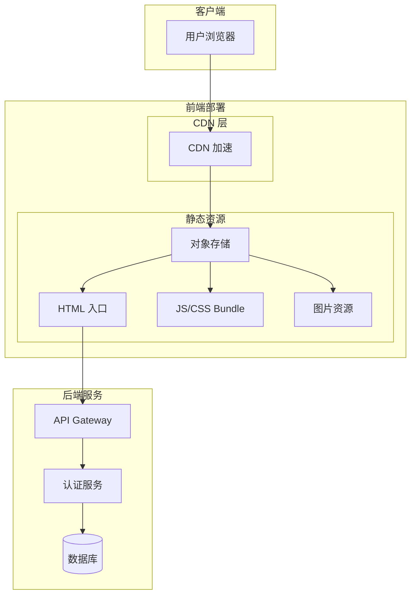
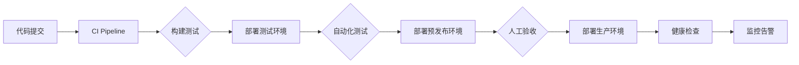

# 部署配置文档

## 概述
本文档描述了 QA Live Healthcare 在线医疗问诊平台的部署架构、配置和流程。为 AI 模型提供理解和管理部署环境所需的信息。

## 项目信息

| 属性 | 值 |
|------|-----|
| **项目名称** | QA Live Healthcare |
| **项目类型** | 在线医疗问诊平台 (B2C) |
| **技术栈** | Vue 3 + TypeScript + Vite + Ant Design Vue |
| **运行环境** | Node.js 18+ |
| **部署方式** | SPA 单页应用 (静态部署) |

## 部署架构

### 系统架构图


### 组件说明
| 组件 | 用途 | 技术方案 | 扩展方式 |
|------|------|----------|----------|
| **CDN** | 静态资源分发 | 阿里云 CDN / 腾讯云 CDN | 全球节点 |
| **对象存储** | 文件存储 | OSS / COS | 无限扩容 |
| **API 网关** | 请求路由、认证 | Nginx / API Gateway | 水平扩展 |
| **后端服务** | 业务逻辑处理 | Node.js / Python | 微服务架构 |
| **数据库** | 数据持久化 | PostgreSQL / MySQL | 主从复制 |

## 环境配置

### 开发环境
```yaml
# .env.development
VITE_APP_TITLE: "问医在线-开发环境"
VITE_APP_BASE_URL: "http://localhost:3000"
VITE_APP_API_PREFIX: "/api/v1"
VITE_APP_ENV: "development"
```

### 生产环境
```yaml
# .env.production
VITE_APP_TITLE: "问医在线"
VITE_APP_BASE_URL: "https://api.qa-live-healthcare.com"
VITE_APP_API_PREFIX: "/api/v1"
VITE_APP_ENV: "production"
```

### 环境变量配置
```typescript
// src/config/env.ts
interface AppConfig {
  appTitle: string;
  baseUrl: string;
  apiPrefix: string;
  env: 'development' | 'production';
}

export const getEnvConfig = (): AppConfig => ({
  appTitle: import.meta.env.VITE_APP_TITLE,
  baseUrl: import.meta.env.VITE_APP_BASE_URL,
  apiPrefix: import.meta.env.VITE_APP_API_PREFIX,
  env: import.meta.env.VITE_APP_ENV,
});
```

## 构建配置

### Vite 配置
```typescript
// vite.config.ts
import { defineConfig } from 'vite';
import vue from '@vitejs/plugin-vue';
import path from 'path';

export default defineConfig({
  plugins: [vue()],
  
  // 基础路径配置
  base: '/',
  
  // 构建输出配置
  build: {
    outDir: 'dist',
    assetsDir: 'assets',
    sourcemap: false,
    minify: 'terser',
    chunkSizeWarningLimit: 1500,
    rollupOptions: {
      output: {
        manualChunks: {
          'vue-vendor': ['vue', 'vue-router', 'pinia'],
          'ant-vendor': ['ant-design-vue', '@ant-design/icons-vue'],
        },
      },
    },
  },
  
  // 开发服务器配置
  server: {
    port: 5173,
    host: true,
    proxy: {
      '/api': {
        target: 'http://localhost:3000',
        changeOrigin: true,
      },
    },
  },
  
  // 路径别名
  resolve: {
    alias: {
      '@': path.resolve(__dirname, 'src'),
    },
  },
  
  // CSS 配置
  css: {
    preprocessorOptions: {
      less: {
        javascriptEnabled: true,
      },
    },
  },
});
```

### 构建命令
```bash
# 开发环境构建
npm run build:dev

# 生产环境构建
npm run build

# 预览生产构建
npm run preview
```

## 部署流程

### 持续部署流程


### 部署步骤

#### 1. 构建前端资源
```bash
# 安装依赖
npm install

# 类型检查
npm run type-check

# 代码检查
npm run lint

# 构建生产资源
npm run build

# 输出目录: dist/
```

#### 2. 部署到对象存储
```bash
# 阿里云 OSS
ossutil cp -r dist/ oss://qa-live-healthcare/ --force

# 腾讯云 COS
cos-cli sync dist/ cos://qa-live-healthcare-1250000000/

# AWS S3
aws s3 sync dist/ s3://qa-live-healthcare --delete
```

#### 3. 配置 CDN
```bash
# 刷新 CDN 缓存
aliyun cdn RefreshObjectCaches --ObjectPaths "https://your-cdn.com/*"

# 预热资源
aliyun cdn PushObjectCache --ObjectPaths "https://your-cdn.com/index.html"
```

#### 4. 验证部署
```bash
# 健康检查
curl -I https://your-domain.com/index.html

# 功能验证
curl -I https://your-domain.com/api/health
```

## Nginx 配置

### 前端 SPA 配置
```nginx
# /etc/nginx/conf.d/qa-live-healthcare.conf

server {
    listen 80;
    server_name qa-live-healthcare.com;
    return 301 https://$server_name$request_uri;
}

server {
    listen 443 ssl http2;
    server_name qa-live-healthcare.com;
    
    # SSL 配置
    ssl_certificate /etc/nginx/ssl/fullchain.pem;
    ssl_certificate_key /etc/nginx/ssl/privkey.pem;
    ssl_protocols TLSv1.2 TLSv1.3;
    ssl_ciphers HIGH:!aNULL:!MD5;
    
    # 根目录
    root /var/www/qa-live-healthcare/dist;
    index index.html;
    
    # Gzip 压缩
    gzip on;
    gzip_types text/plain text/css application/json application/javascript text/xml application/xml;
    gzip_min_length 1000;
    
    # 静态资源缓存
    location ~* \.(js|css|png|jpg|jpeg|gif|ico|svg|woff|woff2)$ {
        expires 1y;
        add_header Cache-Control "public, immutable";
    }
    
    # HTML 不缓存
    location ~* \.html$ {
        expires -1;
        add_header Cache-Control "no-cache, no-store, must-revalidate";
    }
    
    # API 代理
    location /api/ {
        proxy_pass http://backend:3000;
        proxy_http_version 1.1;
        proxy_set_header Host $host;
        proxy_set_header X-Real-IP $remote_addr;
        proxy_set_header X-Forwarded-For $proxy_add_x_forwarded_for;
        proxy_set_header X-Forwarded-Proto $scheme;
        
        # 超时配置
        proxy_connect_timeout 60s;
        proxy_send_timeout 60s;
        proxy_read_timeout 60s;
    }
    
    # SPA 路由 fallback
    location / {
        try_files $uri $uri/ /index.html;
    }
    
    # 安全头
    add_header X-Frame-Options "SAMEORIGIN" always;
    add_header X-Content-Type-Options "nosniff" always;
    add_header X-XSS-Protection "1; mode=block" always;
}
```

### Docker 部署配置
```dockerfile
# Dockerfile
FROM nginx:alpine AS production

# 复制构建产物
COPY dist/ /usr/share/nginx/html/

# 复制 Nginx 配置
COPY nginx.conf /etc/nginx/conf.d/default.conf

# 暴露端口
EXPOSE 80 443

# 启动 Nginx
CMD ["nginx", "-g", "daemon off;"]
```

```yaml
# docker-compose.yml
version: '3.8'

services:
  frontend:
    build:
      context: .
      dockerfile: Dockerfile
    ports:
      - "80:80"
      - "443:443"
    environment:
      - TZ=Asia/Shanghai
    restart: unless-stopped
    networks:
      - app-network

  backend:
    image: backend:latest
    ports:
      - "3000:3000"
    environment:
      - NODE_ENV=production
      - DATABASE_URL=postgresql://user:pass@db:5432/qa_live
    restart: unless-stopped
    networks:
      - app-network
    depends_on:
      - db
      - redis

  db:
    image: postgres:15-alpine
    volumes:
      - postgres_data:/var/lib/postgresql/data
    environment:
      - POSTGRES_DB=qa_live
      - POSTGRES_USER=user
      - POSTGRES_PASSWORD=pass
    restart: unless-stopped
    networks:
      - app-network

  redis:
    image: redis:7-alpine
    volumes:
      - redis_data:/data
    restart: unless-stopped
    networks:
      - app-network

networks:
  app-network:
    driver: bridge

volumes:
  postgres_data:
  redis_data:
```

## 监控与告警

### 健康检查
```typescript
// src/utils/healthCheck.ts
export interface HealthStatus {
  status: 'healthy' | 'unhealthy';
  timestamp: number;
  services: {
    api: boolean;
    database: boolean;
  };
}

export const checkHealth = async (): Promise<HealthStatus> => {
  const services = {
    api: false,
    database: false,
  };

  try {
    const response = await fetch('/api/health');
    services.api = response.ok;
    
    if (response.ok) {
      const data = await response.json();
      services.database = data.database === 'connected';
    }
  } catch {
    services.api = false;
  }

  return {
    status: services.api && services.database ? 'healthy' : 'unhealthy',
    timestamp: Date.now(),
    services,
  };
};
```

### 性能监控
```typescript
// src/utils/monitor.ts
export const reportMetrics = (metrics: {
  page: string;
  loadTime: number;
  apiCalls: number;
  errors: number;
}) => {
  // 上报到监控服务
  if (import.meta.env.VITE_APP_ENV === 'production') {
    navigator.sendBeacon('/api/metrics', JSON.stringify(metrics));
  }
};

// 页面性能监控
window.addEventListener('load', () => {
  const perfData = performance.getEntriesByType('navigation')[0];
  reportMetrics({
    page: window.location.pathname,
    loadTime: perfData.loadEventEnd - perfData.fetchStart,
    apiCalls: 0,
    errors: 0,
  });
});
```

### 错误追踪
```typescript
// src/utils/errorHandler.ts
export const setupErrorTracking = () => {
  window.onerror = (message, source, lineno, colno, error) => {
    console.error('Global error:', { message, source, lineno, colno, error });
    
    // 上报错误
    fetch('/api/errors', {
      method: 'POST',
      headers: { 'Content-Type': 'application/json' },
      body: JSON.stringify({
        message,
        source,
        lineno,
        colno,
        stack: error?.stack,
        userAgent: navigator.userAgent,
        timestamp: new Date().toISOString(),
      }),
    });
  };

  window.onunhandledrejection = (event) => {
    console.error('Unhandled promise rejection:', event.reason);
  };
};
```

## 安全配置

### 安全响应头
```typescript
// src/middleware/securityHeaders.ts
export const securityHeaders = {
  'X-Frame-Options': 'SAMEORIGIN',
  'X-Content-Type-Options': 'nosniff',
  'X-XSS-Protection': '1; mode=block',
  'Referrer-Policy': 'strict-origin-when-cross-origin',
  'Permissions-Policy': 'camera=(), microphone=(), geolocation=()',
  'Content-Security-Policy': "default-src 'self'; script-src 'self' 'unsafe-inline'; style-src 'self' 'unsafe-inline'; img-src 'self' data: https:; connect-src 'self' https://api.qa-live-healthcare.com;",
};
```

### API 认证
```typescript
// src/utils/auth.ts
export interface AuthToken {
  accessToken: string;
  refreshToken: string;
  expiresAt: number;
}

export const getAuthHeader = (): Record<string, string> => {
  const token = localStorage.getItem('auth_token');
  return token ? { Authorization: `Bearer ${token}` } : {};
};

export const refreshTokenIfNeeded = async (): Promise<boolean> => {
  const tokenStr = localStorage.getItem('auth_token');
  if (!tokenStr) return false;

  const token: AuthToken = JSON.parse(tokenStr);
  const now = Date.now();

  // 提前 5 分钟刷新
  if (token.expiresAt - now < 5 * 60 * 1000) {
    try {
      const response = await fetch('/api/auth/refresh', {
        method: 'POST',
        headers: {
          'Content-Type': 'application/json',
        },
        body: JSON.stringify({ refreshToken: token.refreshToken }),
      });

      if (response.ok) {
        const newToken = await response.json();
        localStorage.setItem('auth_token', JSON.stringify(newToken));
        return true;
      }
    } catch {
      return false;
    }
  }

  return true;
};
```

## 备份与灾难恢复

### 备份策略
```bash
#!/bin/bash
# scripts/backup.sh

# 备份对象存储
aliyun oss cp oss://qa-live-healthcare/backups/$(date +%Y%m%d)/ --recursive

# 备份数据库
pg_dump -h $DB_HOST -U $DB_USER -d qa_live > backup_$(date +%Y%m%d).sql

# 上传到备份存储
aws s3 cp backup_$(date +%Y%m%d).sql s3://qa-live-backup/database/

# 保留 30 天备份
find /backups -name "*.sql" -mtime +30 -delete
```

### 灾难恢复
```bash
#!/bin/bash
# scripts/recovery.sh

# 停止服务
kubectl scale deployment frontend --replicas=0
kubectl scale deployment backend --replicas=0

# 恢复数据库
psql -h $DB_HOST -U $DB_USER -d qa_live < backup_latest.sql

# 恢复对象存储
ossutil cp -r oss://qa-live-backup/latest/ oss://qa-live-healthcare/

# 重启服务
kubectl scale deployment frontend --replicas=3
kubectl scale deployment backend --replicas=5

# 健康检查
./scripts/health-check.sh
```

## 性能优化

### 前端优化
```typescript
// vite.config.ts 优化配置
export default defineConfig({
  build: {
    // 代码分割
    rollupOptions: {
      output: {
        // 手动分包策略
        manualChunks: {
          'vue-core': ['vue', 'vue-router', 'pinia'],
          'ant-design': ['ant-design-vue', '@ant-design/icons-vue'],
          'utils': ['axios', 'dayjs', 'lodash-es'],
        },
      },
    },
    
    // 资源内联阈值
    assetsInlineLimit: 4096,
    
    // CSS 代码分割
    cssCodeSplit: true,
    
    // 构建目标
    target: 'es2015',
  },
  
  // 依赖预构建
  optimizeDeps: {
    include: ['vue', 'vue-router', 'pinia', 'ant-design-vue'],
  },
});
```

### CDN 优化
```bash
# 资源预热
aliyun cdn PushObjectCache \
  --ObjectPaths "https://your-cdn.com/assets/index-[hash].js,https://your-cdn.com/assets/vendor-[hash].js"

# 刷新特定资源
aliyun cdn RefreshObjectCaches \
  --ObjectPaths "https://your-cdn.com/index.html"
```

## 部署检查清单

### 部署前
- [ ] 所有测试通过
- [ ] 代码审核完成
- [ ] 安全扫描通过
- [ ] 性能测试完成
- [ ] 回滚方案已准备
- [ ] 变更日志已更新

### 部署中
- [ ] 备份当前版本
- [ ] 部署到预发布环境
- [ ] 执行冒烟测试
- [ ] 监控关键指标
- [ ] 验证核心功能

### 部署后
- [ ] 监控错误率
- [ ] 检查性能指标
- [ ] 验证备份状态
- [ ] 更新部署文档
- [ ] 通知相关人员

## 故障排查

### 常见问题

#### 构建失败
```bash
# 清理缓存
rm -rf node_modules/.vite
npm cache clean --force

# 重新安装
npm install

# 重新构建
npm run build
```

#### 资源加载失败
```bash
# 检查 CDN 配置
curl -I https://your-cdn.com/index.html

# 检查缓存
aliyun cdn DescribeDomainCacheStats

# 刷新缓存
aliyun cdn RefreshObjectCaches --ObjectPaths "https://your-cdn.com/*"
```

#### API 请求超时
```bash
# 检查后端服务
kubectl get pods -n production

# 查看日志
kubectl logs -f deployment/backend -n production

# 检查健康状态
curl http://backend:3000/api/health
```

---

*此部署文档应在基础设施或部署流程变更时更新。使用 `/asdm-context-update` 保持文档最新。*
