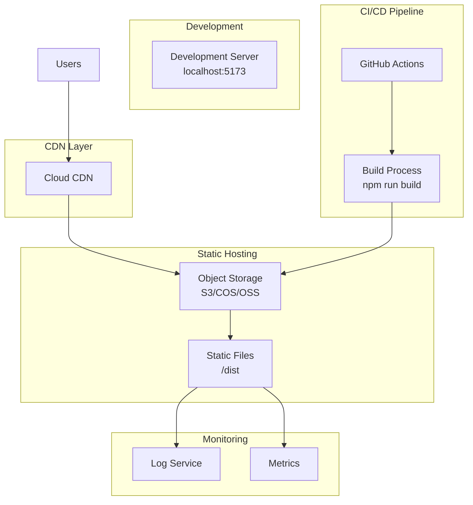
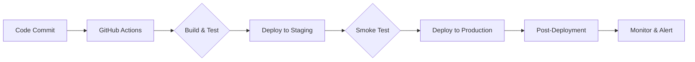

# Deployment Configuration

## Overview
本文档描述了在线问诊健康医疗系统的部署架构、配置和流程。适用于 Vue 3 + Vite 构建的静态 SPA 应用部署。

## Deployment Architecture

### System Architecture Diagram


### Component Description
| 组件 | 用途 | 技术方案 | 说明 |
|------|------|----------|------|
| **CDN** | 静态资源分发 | 腾讯云 CDN / Cloudflare | 全球加速、就近访问 |
| **对象存储** | 前端产物存储 | COS / OSS / S3 | 高可用、成本低 |
| **静态托管** | 前端部署 | Vercel / Netlify / 腾讯云 | Serverless 部署 |
| **CI/CD** | 自动化构建部署 | GitHub Actions | 持续集成部署 |

## Environment Configuration

### Development Environment
```bash
# 启动开发服务器
npm run dev
# 输出: http://localhost:5173

# Vite 开发配置
# vite.config.ts
export default defineConfig({
  plugins: [vue()],
  server: {
    port: 5173,
    host: true,
    open: true
  }
})
```

### Production Build
```bash
# 构建生产版本
npm run build

# 产物输出目录
# dist/
# ├── index.html
# ├── assets/
# │   ├── index-[hash].js
# │   └── index-[hash].css
# └── public/
```

### Environment Variables
```bash
# .env.development
VITE_API_BASE_URL=http://localhost:3000/api
VITE_APP_TITLE=在线问诊系统(开发)

# .env.production
VITE_API_BASE_URL=https://api.example.com
VITE_APP_TITLE=在线问诊系统
```

### Vite Configuration
```typescript
// vite.config.ts
import { defineConfig } from 'vite'
import vue from '@vitejs/plugin-vue'
import path from 'path'

export default defineConfig({
  plugins: [vue()],
  
  // 基础路径
  base: '/',
  
  // 构建选项
  build: {
    outDir: 'dist',
    assetsDir: 'assets',
    
    // 代码分割
    rollupOptions: {
      output: {
        manualChunks: {
          vendor: ['vue', 'vue-router', 'pinia'],
          antd: ['ant-design-vue'],
        },
      },
    },
    
    // 资源内联
    assetsInlineLimit: 4096,
    
    // CSS 代码分割
    cssCodeSplit: true,
    
    // 构建目标
    target: 'es2015',
    
    // Source Map
    sourcemap: false,
  },
  
  // 路径别名
  resolve: {
    alias: {
      '@': path.resolve(__dirname, 'src'),
    },
  },
  
  // 开发服务器
  server: {
    port: 5173,
    proxy: {
      '/api': {
        target: 'http://localhost:3000',
        changeOrigin: true,
      },
    },
  },
})
```

## Deployment Process

### Continuous Deployment Pipeline


### Deployment Methods

#### 1. Static Hosting (Recommended)
```bash
# Vercel 部署
npm i -g vercel
vercel --prod

# Netlify 部署
npm i -g netlify-cli
netlify deploy --prod --dir=dist
```

#### 2. Docker Deployment
```dockerfile
# Dockerfile
FROM nginx:alpine

# 复制构建产物
COPY dist/ /usr/share/nginx/html/

# Nginx 配置
COPY nginx.conf /etc/nginx/conf.d/default.conf

EXPOSE 80

CMD ["nginx", "-g", "daemon off;"]
```

```nginx
# nginx.conf
server {
    listen 80;
    server_name localhost;
    root /usr/share/nginx/html;
    index index.html;

    # SPA 路由支持
    location / {
        try_files $uri $uri/ /index.html;
    }

    # 静态资源缓存
    location /assets/ {
        expires 1y;
        add_header Cache-Control "public, immutable";
    }

    # 安全头
    add_header X-Frame-Options "SAMEORIGIN";
    add_header X-XSS-Protection "1; mode=block";
}
```

```bash
# 构建并部署
docker build -t qa-live-healthcare:latest .
docker run -d -p 80:80 qa-live-healthcare:latest
```

#### 3. 腾讯云 COS 部署
```bash
# 安装 coscmd
pip install coscmd

# 配置
coscmd config -a <SECRET_ID> -s <SECRET_KEY> -b <BUCKET> -r <REGION>

# 上传构建产物
coscmd upload -r dist/ /

# 配置静态网站
coscmd website -s index.html -e error.html
```

### GitHub Actions CI/CD
```yaml
# .github/workflows/deploy.yml
name: Deploy

on:
  push:
    branches: [main]
  pull_request:
    branches: [main]

jobs:
  build-and-deploy:
    runs-on: ubuntu-latest
    
    steps:
      - uses: actions/checkout@v4
      
      - name: Setup Node.js
        uses: actions/setup-node@v4
        with:
          node-version: '20'
          cache: 'npm'
      
      - name: Install dependencies
        run: npm ci
      
      - name: Type check
        run: npm run build
      
      - name: Deploy to Staging
        if: github.ref == 'refs/heads/main'
        env:
          VERCEL_TOKEN: ${{ secrets.VERCEL_TOKEN }}
        run: |
          npm i -g vercel
          vercel --prod --token=$VERCEL_TOKEN
```

## CDN Configuration

### 腾讯云 CDN
```javascript
// CDN 配置
{
  "domain": "your-cdn.domain.com",
  "origin": [
    {
      "origin": "your-cos.cos.ap-guangzhou.myqcloud.com",
      "originType": "cos"
    }
  ],
  "cache": [
    {
      "ruleType": "file",
      "rulePaths": ["/assets/*"],
      "cacheTime": 31536000
    },
    {
      "ruleType": "file",
      "rulePaths": ["*.html", "/*"],
      "cacheTime": 0
    }
  ]
}
```

### 缓存策略
| 资源类型 | 缓存时间 | 说明 |
|----------|----------|------|
| HTML 文件 | 不缓存 | 确保更新及时生效 |
| JS/CSS 文件 | 1 年 | 带 hash 的静态资源 |
| 图片资源 | 1 年 | 媒体文件长期缓存 |
| API 请求 | 不缓存 | 实时数据 |

## Monitoring and Observability

### Health Check
```typescript
// src/utils/health.ts
export async function checkHealth(): Promise<boolean> {
  try {
    const response = await fetch('/api/health', {
      method: 'GET',
      cache: 'no-cache'
    });
    return response.ok;
  } catch {
    return false;
  }
}
```

### Error Tracking
```typescript
// src/utils/errorHandler.ts
window.addEventListener('error', (event) => {
  console.error('Global error:', {
    message: event.message,
    filename: event.filename,
    lineno: event.lineno,
    colno: event.colno
  });
});

window.addEventListener('unhandledrejection', (event) => {
  console.error('Unhandled promise rejection:', event.reason);
});
```

## Security Configuration

### Nginx Security Headers
```nginx
server {
    # 安全头
    add_header X-Frame-Options "SAMEORIGIN" always;
    add_header X-Content-Type-Options "nosniff" always;
    add_header X-XSS-Protection "1; mode=block" always;
    add_header Referrer-Policy "strict-origin-when-cross-origin" always;
    
    # CSP
    add_header Content-Security-Policy "default-src 'self'; script-src 'self' 'unsafe-inline'; style-src 'self' 'unsafe-inline';" always;
}
```

### CORS Configuration
```typescript
// 生产环境 API 配置
const API_CONFIG = {
  baseURL: import.meta.env.VITE_API_BASE_URL,
  timeout: 30000,
  headers: {
    'Content-Type': 'application/json'
  }
}
```

## Performance Optimization

### Bundle Analysis
```bash
# 安装 bundle analyzer
npm i -D rollup-plugin-visualizer

# 分析构建产物
vite build --mode production
npx vite preview
```

### 资源优化
```typescript
// vite.config.ts - 压缩配置
export default defineConfig({
  build: {
    minify: 'terser',
    terserOptions: {
      compress: {
        drop_console: true,
        drop_debugger: true
      }
    }
  }
})
```

### 图片优化
```bash
# 使用 WebP 格式
# 在 index.html 中添加
<picture>
  <source srcset="image.webp" type="image/webp">
  
</picture>
```

## Deployment Checklist

### Pre-Deployment
- [ ] 所有测试通过 `npm run build`
- [ ] TypeScript 类型检查通过 `vue-tsc -b`
- [ ] 代码审查完成
- [ ] 环境变量配置正确
- [ ] 回滚方案准备就绪

### During Deployment
- [ ] 部署到预发布环境
- [ ] 运行冒烟测试
- [ ] 监控构建日志
- [ ] 验证功能正常
- [ ] 检查资源加载

### Post-Deployment
- [ ] 监控错误率
- [ ] 检查性能指标
- [ ] 验证 CDN 缓存
- [ ] 更新部署记录
- [ ] 通知相关人员

## Troubleshooting

### Common Issues

#### 构建失败
```bash
# 检查 Node 版本
node --version  # 需要 >= 18

# 清理缓存重新安装
rm -rf node_modules
npm cache clean --force
npm install
npm run build
```

#### 资源 404
```bash
# 检查 base 配置
# vite.config.ts
export default defineConfig({
  base: '/',  // 确保与实际部署路径一致
})

# Nginx 配置
location / {
    try_files $uri $uri/ /index.html;  # SPA 必须配置
}
```

#### CORS 错误
```typescript
// 检查 API 代理配置
// vite.config.ts
server: {
  proxy: {
    '/api': {
      target: 'http://localhost:3000',
      changeOrigin: true,
    }
  }
}
```

#### 缓存问题
```bash
# 强制刷新
Ctrl + Shift + R (Windows)
Cmd + Shift + R (Mac)

# 清除浏览器缓存
Chrome: DevTools -> Network -> Disable cache

# CDN 缓存刷新
# 腾讯云控制台 -> CDN -> 刷新缓存
```

## Future Enhancements

### Planned Infrastructure
- [ ] 添加后端 API 服务
- [ ] 配置 Redis 缓存
- [ ] 实施数据库迁移策略
- [ ] 添加 WebSocket 实时通信
- [ ] 配置 Kubernetes 部署
- [ ] 添加蓝绿部署策略

### Monitoring Stack
- [ ] Prometheus + Grafana 监控
- [ ] ELK 日志收集
- [ ] 链路追踪
- [ ] 告警通知

---

*此部署文档在基础设施或部署流程发生变更时应更新。使用 `/asdm-context-update` 保持文档最新。*
