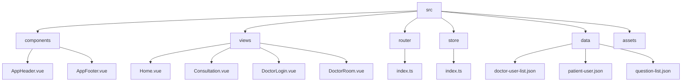

# qa-live-healthcare 项目结构标准

## 项目架构概览

**qa-live-healthcare** 采用现代化的 Vue 3 + TypeScript + Vite 单页应用架构，遵循组件化、模块化的开发原则，具有清晰的目录结构和规范的代码组织。

## 整体目录结构

```
qa-live-healthcare/
├── public/                     # 静态资源目录
├── src/                        # 源代码目录
│   ├── assets/                 # 项目资源文件
│   ├── components/             # 可复用组件
│   ├── data/                   # 模拟数据文件
│   ├── router/                 # 路由配置
│   ├── store/                  # 状态管理
│   ├── views/                  # 页面视图组件
│   ├── App.vue                 # 根组件
│   ├── main.ts                 # 应用入口
│   └── style.css              # 全局样式
├── .asdm/                      # ASDM 工具集配置
│   └── contexts/               # 上下文文件
├── index.html                  # HTML 入口模板
├── package.json               # 项目依赖配置
├── tsconfig.json              # TypeScript 主配置
├── tsconfig.app.json          # 应用 TypeScript 配置
├── tsconfig.node.json         # Node.js 配置
└── vite.config.ts            # Vite 构建配置
```

## 详细目录说明

### 1. 根目录文件

#### `index.html` - HTML 入口模板
```html
<!DOCTYPE html>
<html lang="zh-CN">
  <head>
    <meta charset="UTF-8" />
    <meta name="viewport" content="width=device-width, initial-scale=1.0" />
    <title>qa-live-healthcare</title>
  </head>
  <body>
    <div id="app"></div>
    <script type="module" src="/src/main.ts"></script>
  </body>
</html>
```

**功能**: 应用的主 HTML 模板，包含 Vue 应用的挂载点。

#### `package.json` - 项目依赖配置
```json
{
  "name": "vite-vue-typescript-starter",
  "private": true,
  "type": "module",
  "scripts": {
    "dev": "vite",
    "build": "vue-tsc -b && vite build",
    "preview": "vite preview"
  },
  "dependencies": {
    "ant-design-vue": "^4.2.6",
    "dayjs": "^1.11.19",
    "vue": "^3.5.10",
    "vue-router": "^4.6.3"
  },
  "devDependencies": {
    "@vitejs/plugin-vue": "^5.1.4",
    "typescript": "^5.5.3",
    "vite": "^5.4.8",
    "vue-tsc": "^2.1.6"
  }
}
```

**功能**: 定义项目元数据、依赖项和脚本命令。

### 2. 构建配置目录

#### TypeScript 配置文件
- `tsconfig.json` - 主配置文件，引用其他配置
- `tsconfig.app.json` - 应用代码配置
- `tsconfig.node.json` - Node.js 环境配置

#### `vite.config.ts` - Vite 构建配置
```typescript
import { defineConfig } from 'vite'
import vue from '@vitejs/plugin-vue'

export default defineConfig({
  plugins: [vue()],
})
```

**功能**: 配置 Vite 构建工具和插件。

### 3. 源代码目录 (`src/`)

#### `src/main.ts` - 应用入口
```typescript
import { createApp } from 'vue';
import Antd from 'ant-design-vue';
import 'ant-design-vue/dist/reset.css';
import './style.css';
import App from './App.vue';
import router from './router';

const app = createApp(App);
app.use(Antd);
app.use(router);
app.mount('#app');
```

**功能**: 创建 Vue 应用实例，注册插件和路由。

#### `src/App.vue` - 根组件
```vue
<template>
  <a-layout class="app-layout">
    <AppHeader />
    <a-layout-content class="app-content">
      <RouterView />
    </a-layout-content>
    <AppFooter />
  </a-layout>
</template>
```

**功能**: 应用的主要布局容器，包含头部、内容和底部。

## 功能模块结构

### 1. 组件模块 (`src/components/`)

```
src/components/
├── AppHeader.vue      # 应用头部导航组件
├── AppFooter.vue      # 应用底部组件
└── HelloWorld.vue     # 示例组件
```

**设计原则**:
- **可复用性**: 组件设计为可跨页面复用
- **单一职责**: 每个组件专注于特定功能
- **Props 接口**: 使用 TypeScript 定义 Props 类型

### 2. 页面视图模块 (`src/views/`)

```
src/views/
├── Home.vue           # 首页
├── Consultation.vue   # 患者咨询页面
├── DoctorLogin.vue    # 医生登录页面
├── DoctorRoom.vue     # 医生诊室页面
├── Doctors.vue        # 医生列表页面
└── About.vue          # 关于页面
```

**路由配置** (`src/router/index.ts`):
```typescript
const routes: RouteRecordRaw[] = [
  { path: '/', name: 'Home', component: Home },
  { path: '/consultation', name: 'Consultation', component: Consultation },
  { path: '/doctors', name: 'Doctors', component: Doctors },
  { path: '/doctor/login', name: 'DoctorLogin', component: DoctorLogin },
  { path: '/doctor/room/:username', name: 'DoctorRoom', component: DoctorRoom },
];
```

### 3. 数据管理模块

#### 状态管理 (`src/store/`)
- `src/store/index.ts` - Pinia 风格的状态管理
- 包含医生、患者、问题等业务数据
- 提供完整的 CRUD 操作方法

#### 模拟数据 (`src/data/`)
```
src/data/
├── doctor-user-list.json    # 医生数据
├── patient-user.json         # 患者数据
└── question-list.json       # 咨询问题数据
```

### 4. 路由配置模块 (`src/router/`)

- `src/router/index.ts` - 路由配置和导航守卫
- 支持动态路由参数
- 使用 Vue Router 4.x 版本

## 开发规范

### 文件命名约定

| 文件类型 | 命名规范 | 示例 |
|---------|---------|------|
| Vue 组件 | PascalCase | `AppHeader.vue` |
| TypeScript 文件 | camelCase | `main.ts` |
| 数据文件 | kebab-case | `doctor-user-list.json` |
| 配置文件 | kebab-case | `vite.config.ts` |

### 目录结构规范



### 组件导入规范

**相对路径导入**:
```typescript
// 正确
import AppHeader from './components/AppHeader.vue';
import router from './router';

// 避免
import AppHeader from '@/components/AppHeader.vue';
```

**组件注册**:
```vue
<script setup lang="ts">
import { RouterView } from 'vue-router';
import AppHeader from './components/AppHeader.vue';
import AppFooter from './components/AppFooter.vue';
</script>
```

## 构建和部署

### 开发环境
```bash
npm run dev    # 启动开发服务器
```

### 生产构建
```bash
npm run build  # 构建生产版本
npm run preview # 预览构建结果
```

### 构建产物
```
dist/
├── assets/           # 编译后的静态资源
├── index.html        # 入口 HTML 文件
└── 其他构建文件
```

## 扩展指南

### 添加新页面
1. 在 `src/views/` 创建新的 Vue 组件
2. 在 `src/router/index.ts` 中添加路由配置
3. 更新导航组件中的链接

### 添加新组件
1. 在 `src/components/` 创建新的 Vue 组件
2. 在需要使用的页面中导入组件
3. 遵循 Props 接口定义规范

### 添加数据模型
1. 在 `src/store/index.ts` 中定义接口
2. 在 `src/data/` 中添加模拟数据（可选）
3. 在状态管理中添加相关方法

## 最佳实践

### 代码组织
- **单一文件原则**: 每个文件只包含一个主要功能
- **模块化设计**: 相关功能组织在同一目录
- **类型安全**: 全面使用 TypeScript 类型定义

### 性能优化
- **组件懒加载**: 使用 Vue Router 的懒加载功能
- **代码分割**: 利用 Vite 的自动代码分割
- **Tree Shaking**: 只导入需要的组件和功能

### 可维护性
- **清晰的命名**: 文件和变量命名要直观易懂
- **文档注释**: 重要的函数和组件添加注释
- **一致的风格**: 遵循项目的编码规范

---

*本项目结构文档由 Context Builder 工具集自动生成，最后更新于 2026-04-21*

**相关文件**:
- [数据模型文档](./data-models.md)
- [编码规范文档](./standard-coding-style.md)
- [API 文档](./api.md)