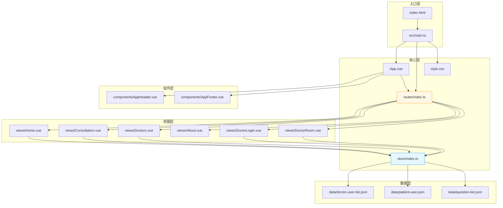

# 标准项目结构文档

> **项目**: QA Live Healthcare
> **生成时间**: 2026-04-29
> **语言**: 中文 (zh)

---

## 项目结构总览

```
qa-live-healthcare/
├── .asdm/                          # ASDM 工作区配置
│   ├── contexts/                   # Context Builder 生成的上下文文件
│   │   ├── index.md                # 工作区索引（已生成）
│   │   └── data-models.md          # 数据模型文档（已生成）
│   └── toolsets/                   # ASDM 工具集
│       └── context-builder/        # Context Builder toolset
│           ├── INSTALL.md          # 安装说明
│           ├── README.md           # 工具集文档
│           └── actions/            # 指令文件
│               ├── asdm-context-build.md    # 初始上下文生成指令
│               └── asdm-context-update.md   # 上下文更新指令
│
├── .codebuddy/                     # Tencent CodeBuddy 配置
│   └── commands/                   # CodeBuddy 自定义命令
│       ├── asdm-context-build.md   # 上下文生成命令
│       └── asdm-context-update.md  # 上下文更新命令
│
├── public/                         # 静态资源目录
│   └── vite.svg                    # Vite 图标
│
├── src/                            # 源代码根目录
│   ├── main.ts                     # 应用入口
│   ├── App.vue                     # 根组件
│   ├── style.css                   # 全局样式
│   ├── vite-env.d.ts               # Vite 环境类型声明
│   │
│   ├── router/                     # 路由模块
│   │   └── index.ts                # 路由定义（7 条路由）
│   │
│   ├── store/                      # 状态管理模块
│   │   └── index.ts                # 响应式 Store + 数据接口定义
│   │
│   ├── data/                       # 静态数据文件（Mock 数据）
│   │   ├── doctor-user-list.json   # 医生数据（5 条）
│   │   ├── patient-user.json       # 患者数据（5 条）
│   │   └── question-list.json      # 问诊问题数据（7 条）
│   │
│   ├── components/                 # 公共组件
│   │   ├── AppHeader.vue           # 顶部导航栏
│   │   ├── AppFooter.vue           # 页脚
│   │   └── HelloWorld.vue          # Vite 默认示例（未使用）
│   │
│   └── views/                      # 页面视图组件
│       ├── Home.vue                # 首页
│       ├── Consultation.vue        # 患者问诊页面
│       ├── Doctors.vue             # 医生团队展示页
│       ├── About.vue               # 关于我们页面
│       ├── DoctorLogin.vue         # 医生登录页
│       └── DoctorRoom.vue          # 医生诊室工作台
│
├── index.html                      # HTML 入口文件
├── package.json                    # 项目配置与依赖声明
├── package-lock.json               # 依赖锁定文件
├── vite.config.ts                  # Vite 构建工具配置
├── tsconfig.json                   # TypeScript 主配置（聚合引用）
├── tsconfig.app.json               # 应用代码 TS 配置
├── tsconfig.node.json              # Node 端 TS 配置
├── tsconfig.app.tsbuildinfo        # TS 构建缓存
├── tsconfig.node.tsbuildinfo       # Node TS 构建缓存
└── README.md                       # 项目说明（默认模板）
```

---

## 目录职责详解

### 根目录文件

| 文件/目录 | 类型 | 职责 |
|-----------|------|------|
| `index.html` | HTML | 应用入口，挂载 `<div id="app">`，加载 `/src/main.ts` |
| `package.json` | JSON | 项目元数据、依赖管理、NPM Scripts 定义 |
| `vite.config.ts` | TypeScript | Vite 构建工具配置，注册 Vue 插件 |
| `tsconfig.json` | JSON | TS 主配置，使用 Project References 聚合子配置 |
| `tsconfig.app.json` | JSON | 应用代码编译配置（target ES2020, strict 模式） |
| `tsconfig.node.json` | JSON | Node 端配置（用于 vite.config.ts 的类型检查） |
| `README.md` | Markdown | 项目说明文档（当前为 Vite 默认模板） |

### `src/` 源码目录

#### 应用入口

**[src/main.ts](../src/main.ts)** — 应用引导文件

```
职责: 创建 Vue 实例、注册全局插件、挂载应用

执行流程:
1. import Antd from 'ant-design-vue'     → 引入 Ant Design Vue 全量组件库
2. import 'ant-design-vue/dist/reset.css' → 引入 Ant Design 基础样式重置
3. import './style.css'                    → 引入全局自定义样式
4. app.use(Antd)                           → 全局注册 Ant Design 组件
5. app.use(router)                         → 注册路由插件
6. app.mount('#app')                       → 挂载到 DOM
```

#### 根组件

**[src/App.vue](../src/App.vue)** — 应用布局骨架

```
职责: 定义全局布局结构（Header + Content + Footer）

布局结构:
┌─────────────────────────────────┐
│         AppHeader (固定顶部)      │  ← height: 64px, position: fixed
├─────────────────────────────────┤
│                                 │
│     <RouterView /> (内容区域)     │  ← 动态路由视图
│                                 │
├─────────────────────────────────┤
│         AppFooter (底部)         │
└─────────────────────────────────┘

全局样式:
- CSS Reset: margin/padding 归零, box-sizing: border-box
- 字体栈: -apple-system, BlinkMacSystemFont, 'Segoe UI'...
- .app-layout: min-height 100vh 全屏铺满
- .app-content: 白色背景
```

#### `src/router/` — 路由模块

**[src/router/index.ts](../src/router/index.ts)** — 路由定义中心

```
职责: 定义所有前端路由规则, 使用 History 模式

路由清单:
路径                          名称              组件             认证要求
/                             Home              Home.vue         无
/consultation                 Consultation       Consultation.vue  无（患者验证）
/consultation/:doctorUsername ConsultationRoom   Consultation.vue  无（患者验证）
/doctors                      Doctors            Doctors.vue       无
/about                        About              About.vue         无
/doctor/login                 DoctorLogin        DoctorLogin.vue   无
/doctor/room/:username        DoctorRoom         DoctorRoom.vue    ✅ 医生登录

技术细节:
- 使用 createWebHistory() HTML5 History 模式
- Consultation 和 ConsultationRoom 复用同一组件（通过 route.params 区分）
- 未配置导航守卫，认证逻辑在各组件 onMounted 中自行处理
```

#### `src/store/` — 状态管理模块

**[src/store/index.ts](../src/store/index.ts)** — 响应式状态管理中心

```
职责:
1. 定义 TypeScript 接口（Doctor, Patient, Question）
2. 创建 reactive 响应式状态对象
3. 导出 Store 方法（CRUD 操作 + 业务逻辑）

设计模式:
- 手写 reactive Store（非 Pinia/Vuex）
- 单一 State 对象集中管理所有数据
- 方法直接作为 store 对象属性导出
- 数据持久化: 仅内存级别（刷新即丢失）

导出内容:
- Interfaces: Doctor, Patient, Question（供其他模块复用）
- store.state: 响应式状态对象
- store.*(): 业务方法集合（12 个方法）
```

#### `src/data/` — 静态 Mock 数据

| 文件 | 记录数 | 用途 | 关联模型 |
|------|--------|------|----------|
| [doctor-user-list.json](../src/data/doctor-user-list.json) | 5 | 医生预置数据 | `Doctor[]` |
| [patient-user.json](../src/data/patient-user.json) | 5 | 患者预置数据 | `Patient[]` |
| [question-list.json](../src/data/question-list.json) | 7 | 问题预置数据 | `Question[]` |

```
数据加载时机: 应用启动时由 src/store/index.ts 静态 import
数据格式: 标准 JSON 数组
ID 规则:
  - 医生: doc + 3位数字（doc001 ~ doc005）
  - 患者: patient + 3位数字（patient001 ~ patient005）
  - 问题: q + 3位数字（q001 ~ q007）
动态 ID: 新建数据时使用时间戳（如 q1714382400000）
```

#### `src/components/` — 公共组件

##### **AppHeader.vue** — 顶部导航栏

**[src/components/AppHeader.vue](../src/components/AppHeader.vue)**

```
位置: 固定在页面顶部 (position: fixed, z-index: 1000)
高度: 64px

布局结构:
┌──────────────────────────────────────────────────────┐
│ [Logo]  首页  问诊  医生  关于        [医生登录按钮]  │
└──────────────────────────────────────────────────────┘

功能:
- Logo 点击返回首页
- 导航菜单（首页/问诊/医生/关于）+ 高亮当前路由
- 医生登录入口按钮（绿色主题色）
- 通过 watch(route.path) 自动同步菜单选中状态

依赖图标: HomeOutlined, MessageOutlined, TeamOutlined,
         InfoCircleOutlined, UserOutlined
```

##### **AppFooter.vue** — 页脚

**[src/components/AppFooter.vue](../src/components/AppFooter.vue)**

```
背景: 渐变紫色 (#667eea → #764ba2)

四列网格布局:
┌─────────────┬─────────────┬─────────────┬─────────────┐
│ 平台简介     │ 快速链接     │ 联系我们     │ 法律信息     │
│ ...         │ 首页/问诊... │ 客服热线...  │ 隐私政策...  │
└─────────────┴─────────────┴─────────────┴─────────────┘
                        版权声明行

响应式: grid-template-columns: repeat(auto-fit, minmax(250px, 1fr))
```

##### **HelloWorld.vue** — 未使用的 Vite 示例组件

> 该文件为 Vite 脚手架自动生成，项目中**未被任何地方引用**。可安全删除。

#### `src/views/` — 页面视图组件

##### **Home.vue** — 首页

**[src/views/Home.vue](../src/views/Home.vue)**

```
路由: / (名称: Home)
行数: 380 行（含样式）

页面分区:
┌─────────────────────────────────────────────┐
│  Hero 区域                                  │
│  ┌───────────────┐  ┌─────────────────────┐│
│  │ 标题 + 特性列表 │  │   医疗场景图片        ││
│  │ [立即问诊]     │  │                     ││
│  │ [查看医生]     │  │                     ││
│  └───────────────┘  └─────────────────────┘│
├─────────────────────────────────────────────┤
│  统计数据面板（渐变紫色背景）                  │
│  ┌─────────┐ ┌─────────┐ ┌─────────┐ ┌────┐│
│  │ 专业医生  │ │ 问题总数  │ │待响应问题│ │在线││
│  │   5     │ │   7     │ │   4     │ │ 4  ││
│  └─────────┘ └─────────┘ └─────────┘ └────┘│
├─────────────────────────────────────────────┤
│  开放诊室列表                               │
│  ┌─────────┐ ┌─────────┐ ┌─────────┐ ┌────┐│
│  │ 张伟医生 │ │ 李娜医生 │ │ 王强医生 │ │陈杰││
│  │ [进入]   │ │ [进入]   │ │ [进入]   │ │...││
│  └─────────┘ └─────────┘ └─────────┘ └────┘│
└─────────────────────────────────────────────┘

数据来源:
- statistics: computed(() => store.getStatistics())
- activeDoctors: computed(() => store.getActiveDoctors())

交互:
- "立即问诊" → router.push('/consultation')
- "查看医生" → router.push('/doctors')
- 诊室卡片点击 → router.push('/consultation/${doctor.username}')
```

##### **Consultation.vue** — 患者问诊页面

**[src/views/Consultation.vue](../src/views/Consultation.vue)**

```
路由: /consultation 和 /consultation/:doctorUsername（双路由复用）
行数: 480 行（含样式）

状态机:
┌─────────────────┐     验证成功     ┌─────────────────┐
│  身份验证界面     │ ─────────────→ │  患者门户界面      │
│  (姓名+生日表单)  │                │  (问题列表+提交)   │
└─────────────────┘                └─────────────────┘

身份验证流程:
1. 显示表单: 姓名(a-input) + 生日(a-date-picker)
2. 用户提交 → verifyPatient(name, birthday)
3. Store 逻辑: 查找已有患者 或 自动创建新患者
4. 验证通过后切换到患者门户界面

参数处理 (onMounted):
- 若 route.params.doctorUsername 存在
- 查找对应医生并预设为 selectedDoctor
- 锁定医生选择（不可更改）

患者门户功能:
- 显示当前登录患者信息
- 展示该患者的所有历史问题列表
- 支持查看已回复问题的医生答复
- "提交问题" 按钮 → 弹出模态框

提交问题弹窗:
- 选择医生（a-select，显示头像+职称+科室）— 可被 URL 参数锁定
- 输入问题描述（a-textarea, 6行）
- 提交后调用 store.addQuestion()

关键变量:
- currentPatient: computed → store.state.currentPatient
- myQuestions: computed → 当前患者的问题列表
- selectedDoctor: ref → URL 参数指定的医生（可为 null）
- availableDoctors: computed → selectedDoctor ? [它] : 在线医生列表
```

##### **Doctors.vue** — 医生团队展示页

**[src/views/Doctors.vue](../src/views/Doctors.vue)**

```
路由: /doctors
行数: 177 行（含样式）

页面结构:
┌─────────────────────────────────────────────┐
│  页面标题（渐变紫色背景）                      │
│  医生团队                                    │
│  我们的专业医疗团队随时为您服务                 │
├─────────────────────────────────────────────┤
│  医生卡片网格                                │
│  ┌──────────┐ ┌──────────┐ ┌──────────┐    │
│  │ [头像]在线│ │ [头像]在线│ │ [头像]离线│    │
│  │ 张伟医生  │ │ 李娜医生  │ │ 刘敏医生  │    │
│  │ 主任医师  │ │ 副主任...│ │ 主任医师  │    │
│  │ 心内科    │ │ 儿科     │ │ 妇产科    │    │
│  │ [进入诊室]│ │ [进入诊室]│ │ [暂未开放]│    │
│  └──────────┘ └──────────┘ └──────────┘    │
└─────────────────────────────────────────────┘

数据源: store.state.doctors（全部医生，含离线）
交互: "进入诊室" → router.push('/consultation/${doctor.username}')
视觉: 在线医生卡片有绿色边框高亮
```

##### **About.vue** — 关于我们页面

**[src/views/About.vue](../src/views/About.vue)**

```
路由: /about
行数: 293 行（含样式）

页面分区:
┌─────────────────────────────────────────────┐
│  页面标题（渐变紫色背景）                      │
│  关于我们                                    │
├─────────────────────────────────────────────┤
│  平台简介（文字介绍段落）                      │
├─────────────────────────────────────────────┤
│  平台特色（4 个特色卡片网格）                  │
│  ┌──────────┐ ┌──────────┐ ┌──────────┐    │
│  │专业医生团队│ │实时在线问诊│ │隐私安全保护│    │
│  └──────────┘ └──────────┘ └──────────┘    │
│  ┌──────────┐                              │
│  │便捷易用   │                              │
│  └──────────┘                              │
├─────────────────────────────────────────────┤
│  服务流程（4 步骤流程图）                     │
│  ①选择医生 → ②提交问题 → ③医生解答 → ④查看回复 │
├─────────────────────────────────────────────┤
│  联系我们（客服热线 / 邮箱 / 服务时间）        │
└─────────────────────────────────────────────┘

特点: 纯静态展示页面,无状态管理交互,仅使用 Ant Design 图标
```

##### **DoctorLogin.vue** — 医生登录页面

**[src/views/DoctorLogin.vue](../src/views/DoctorLogin.vue)**

```
路由: /doctor/login
行数: 145 行（含样式）

页面结构:
┌─────────────────────────────────────┐
│      （渐变紫色背景全屏）              │
│  ┌─────────────────────────┐        │
│  │      医生登录            │        │
│  │  请使用您的医生账号登录系统 │        │
│  │                          │        │
│  │  [👤 用户名 ___________] │        │
│  │  [🔒 密码 _____________] │        │
│  │                          │        │
│  │      [ 登 录 ]           │        │
│  │                          │        │
│  │  ℹ️ 测试账号提示:         │        │
│  │  用户名: dr-zhang-wei   │        │
│  │  密码: 123456            │        │
│  └─────────────────────────┘        │
└─────────────────────────────────────┘

认证流程:
1. 用户填写用户名 + 密码
2. 表单校验（必填项）
3. 点击登录 → setTimeout 模拟 500ms 延迟
4. 调用 store.loginDoctor(username, password)
5. 成功 → message.success + router.push('/doctor/room/${username}')
6. 失败 → message.error('用户名或密码错误')
```

##### **DoctorRoom.vue** — 医生诊室工作台

**[src/views/DoctorRoom.vue](../src/views/DoctorRoom.vue)**

```
路由: /doctor/room/:username（需登录）
行数: 400 行（含样式）

权限检查 (onMounted):
if (!currentDoctor || currentDoctor.username !== username) {
  → message.error('请先登录')
  → router.push('/doctor/login')
}

页面结构:
┌─────────────────────────────────────────────────────┐
│  诊室头部                                           │
│  [头像] 张伟医生的诊室  主任医师 · 心内科  [复制链接][退出] │
├─────────────────────────────────────────────────────┤
│  ℹ️ 诊室URL: https://xxx/consultation/dr-zhang-wei   │
├─────────────────────────────────────────────────────┤
│  待响应问题 (N)                              [刷新]   │
│  ┌───────────────────────────────────────────────┐  │
│  │ 👤 赵明                        2025-11-02 14:20│  │
│  │ 血压最近有点高,早上测量是145/95...             │  │
│  │              [文字回复]  [标记已解答]          │  │
│  └───────────────────────────────────────────────┘  │
├─────────────────────────────────────────────────────┤
│  已解答问题 (N)                                      │
│  ▸ 赵明: 最近总是感觉胸闷气短,特别是爬楼梯的时候...  │
│  ├ 问题: ...                                       │
│  └ 回复: 建议您做个心电图和心脏彩超检查...            │
└─────────────────────────────────────────────────────┘

核心操作:
1. copyRoomUrl() → navigator.clipboard 写入诊室分享链接
2. showAnswerModal(q) → 打开回复对话框
3. submitAnswer() → store.answerQuestion(id, answer)
4. markAsAnswered(id) → store.markQuestionAsAnswered(id)
5. logout() → store.logoutDoctor() + 跳转首页

计算属性:
- pendingQuestions: 当前医生的 pending 状态问题
- answeredQuestions: 当前医生的 answered 状态问题
- roomUrl: ${origin}/consultation/${username}
```

---

## 模块依赖关系图



---

## 文件大小与复杂度概览

| 文件 | 行数 | 职责 | 复杂度 |
|------|------|------|--------|
| `src/store/index.ts` | 159 | 状态管理 + 数据接口 + 12 个方法 | ★★★★☆ 核心 |
| `src/views/Consultation.vue` | 480 | 双状态机 + 参数处理 + 提交流程 | ★★★★★ 最复杂 |
| `src/views/DoctorRoom.vue` | 400 | 权限守卫 + CRUD + 模态框 | ★★★★☆ |
| `src/views/Home.vue` | 380 | Hero + 统计 + 诊室卡片网格 | ★★★☆☆ |
| `src/views/About.vue` | 293 | 纯静态展示 | ★★☆☆☆ |
| `src/components/AppHeader.vue` | 121 | 导航 + 華单同步 | ★★★☆☆ |
| `src/components/AppFooter.vue` | 107 | 静态页脚 | ★★☆☆☆ |
| `src/router/index.ts` | 52 | 7 条路由定义 | ★★☆☆☆ |
| `src/views/Doctors.vue` | 177 | 医生卡片网格 | ★★☆☆☆ |
| `src/views/DoctorLogin.vue` | 145 | 登录表单 | ★★☆☆☆ |
| `src/main.ts` | 12 | 应用引导 | ★☆☆☆☆ |
| `src/App.vue` | 39 | 布局骨架 | ★☆☆☆☆ |

**总计**: 约 **2365 行**源代码（不含 JSON 数据和配置文件）

---

## 目录命名规范总结

| 目录/文件类型 | 命名风格 | 示例 |
|--------------|----------|------|
| 源码目录 | kebab-case | `src/`, `router/`, `store/`, `views/`, `components/`, `data/` |
| Vue 组件文件 | PascalCase | `AppHeader.vue`, `DoctorRoom.vue` |
| TypeScript 文件 | camelCase | `main.ts`, `vite.config.ts` |
| 数据文件 | kebab-case + 描述名 | `doctor-user-list.json`, `question-list.json` |
| 配置文件 | kebab-case | `tsconfig.app.json`, `vite.config.ts` |
| 样式文件 | kebab-case | `style.css` |

---

*此文件由 Context Builder toolset 自动生成。*
