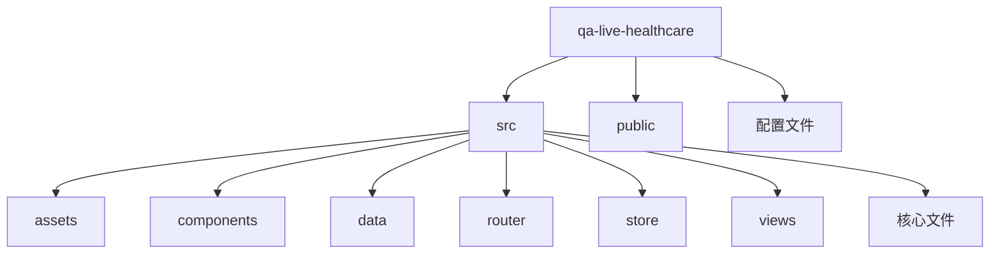
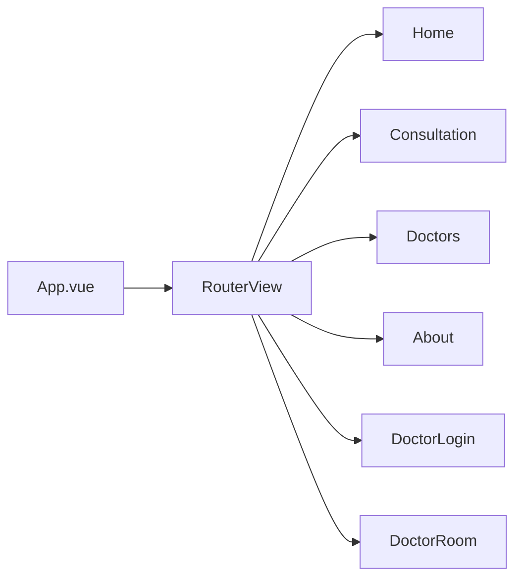

# 标准项目结构文档

## 📁 项目结构概览

QA Live Healthcare 项目采用标准的 Vue 3 + TypeScript + Vite 项目结构，按照功能模块进行组织。项目遵循前端开发的最佳实践，将组件、数据、路由等代码进行清晰的分离。



## 🗂️ 完整目录结构

```
qa-live-healthcare/
│
├── src/                          # 源代码目录
│   ├── assets/                   # 静态资源目录
│   │   └── vue.svg               # Vue Logo
│   │
│   ├── components/               # 公共组件目录
│   │   ├── AppHeader.vue         # 应用顶部导航栏
│   │   ├── AppFooter.vue         # 应用底部
│   │   └── HelloWorld.vue        # 示例组件（保留）
│   │
│   ├── data/                     # 静态数据目录
│   │   ├── doctor-user-list.json # 医生用户数据
│   │   ├── patient-user.json     # 患者用户数据
│   │   └── question-list.json    # 咨询问题数据
│   │
│   ├── router/                   # 路由配置目录
│   │   └── index.ts              # 路由定义和配置
│   │
│   ├── store/                    # 状态管理目录
│   │   └── index.ts              # 响应式状态管理
│   │
│   ├── views/                    # 页面视图目录
│   │   ├── Home.vue              # 首页
│   │   ├── Consultation.vue      # 在线咨询页
│   │   ├── DoctorLogin.vue        # 医生登录页
│   │   ├── DoctorRoom.vue        # 医生诊室页
│   │   ├── Doctors.vue           # 医生列表页
│   │   └── About.vue              # 关于页面
│   │
│   ├── App.vue                   # 根组件
│   ├── main.ts                   # 应用入口文件
│   ├── style.css                 # 全局样式
│   └── vite-env.d.ts             # Vite 类型声明
│
├── public/                       # 公共资源目录
│   └── *.svg                     # 公共 SVG 文件
│
├── package.json                  # 项目依赖配置
├── package-lock.json             # 依赖锁定文件
├── vite.config.ts                # Vite 构建配置
├── tsconfig.json                 # TypeScript 基础配置
├── tsconfig.app.json             # TypeScript 应用配置
├── tsconfig.node.json            # TypeScript Node 配置
├── index.html                    # HTML 入口文件
├── README.md                     # 项目说明文档
└── .gitignore                    # Git 忽略配置
```

## 📂 核心目录详解

### 1. src/components - 公共组件

**目录路径**: `src/components/`

**说明**: 存放应用的公共组件，这些组件可在多个页面中复用。

**组件列表**:

| 组件名称 | 文件名 | 功能描述 | 依赖关系 |
|---------|--------|---------|---------|
| 应用头部 | AppHeader.vue | 顶部导航栏，包含 Logo 和导航菜单 | Ant Design Vue |
| 应用底部 | AppFooter.vue | 页面底部信息展示 | 无 |
| 示例组件 | HelloWorld.vue | Vue 欢迎示例组件 | 无 |

**使用规范**:
```typescript
// 在其他组件中导入使用
import AppHeader from '@/components/AppHeader.vue';
import AppFooter from '@/components/AppFooter.vue';
```

### 2. src/views - 页面视图

**目录路径**: `src/views/`

**说明**: 存放应用的主要页面组件，每个文件对应一个路由页面。

**页面列表**:

| 页面名称 | 路由路径 | 组件名 | 功能描述 |
|---------|---------|--------|---------|
| 首页 | `/` | Home.vue | 展示平台介绍和在线医生 |
| 咨询页 | `/consultation` | Consultation.vue | 患者咨询入口和我的问题 |
| 医生列表 | `/doctors` | Doctors.vue | 展示所有医生信息 |
| 关于页 | `/about` | About.vue | 平台介绍 |
| 医生登录 | `/doctor/login` | DoctorLogin.vue | 医生身份验证 |
| 医生诊室 | `/doctor/room/:username` | DoctorRoom.vue | 医生工作台 |

**页面层级关系**:


### 3. src/router - 路由配置

**目录路径**: `src/router/`

**核心文件**: `index.ts`

**功能**: 集中管理应用的所有路由配置，使用 Vue Router 4。

**路由定义示例**:
```typescript
const routes: RouteRecordRaw[] = [
  {
    path: '/',
    name: 'Home',
    component: Home,
  },
  {
    path: '/consultation/:doctorUsername',
    name: 'ConsultationRoom',
    component: Consultation,
  },
];
```

### 4. src/store - 状态管理

**目录路径**: `src/store/`

**核心文件**: `index.ts`

**功能**: 使用 Vue 3 的响应式系统实现轻量级状态管理。

**状态结构**:
```typescript
interface State {
  doctors: Doctor[];           // 医生数据
  patients: Patient[];         // 患者数据
  questions: Question[];       // 咨询问题
  currentDoctor: Doctor | null; // 当前医生
  currentPatient: Patient | null; // 当前患者
}
```

**使用方式**:
```typescript
import { store } from '@/store';

// 读取状态
const doctors = store.state.doctors;

// 调用方法
store.loginDoctor(username, password);
```

### 5. src/data - 静态数据

**目录路径**: `src/data/`

**说明**: 存放应用的静态 JSON 数据文件。

**数据文件列表**:

| 文件名 | 内容 | 用途 |
|-------|------|------|
| doctor-user-list.json | 医生用户列表 | 医生数据源 |
| patient-user.json | 患者用户列表 | 患者数据源 |
| question-list.json | 咨询问题列表 | 问题数据源 |

**数据加载方式**:
```typescript
import doctorData from '../data/doctor-user-list.json';
import patientData from '../data/patient-user.json';
import questionData from '../data/question-list.json';
```

### 6. src/assets - 静态资源

**目录路径**: `src/assets/`

**说明**: 存放需要经过 Webpack/Vite 处理静态资源，如图片、字体等。

**当前内容**:
- `vue.svg` - Vue 官方 Logo

## ⚙️ 配置文件说明

### package.json - 项目配置

**位置**: 项目根目录

**主要配置**:
```json
{
  "name": "vite-vue-typescript-starter",
  "type": "module",
  "scripts": {
    "dev": "vite",           // 开发服务器
    "build": "vue-tsc -b && vite build",  // 生产构建
    "preview": "vite preview" // 预览构建结果
  },
  "dependencies": {
    "vue": "^3.5.10",        // Vue 核心
    "vue-router": "^4.6.3",  // 路由管理
    "ant-design-vue": "^4.2.6", // UI 组件库
    "dayjs": "^1.11.19"      // 日期处理
  },
  "devDependencies": {
    "@vitejs/plugin-vue": "^5.1.4",  // Vue 插件
    "typescript": "^5.5.3",           // TypeScript
    "vite": "^5.4.8",                // 构建工具
    "vue-tsc": "^2.1.6"              // TS 类型检查
  }
}
```

### vite.config.ts - Vite 配置

**位置**: 项目根目录

**当前配置**:
```typescript
import { defineConfig } from 'vite';
import vue from '@vitejs/plugin-vue';

export default defineConfig({
  plugins: [vue()],
});
```

### TypeScript 配置文件

| 文件 | 用途 |
|------|------|
| tsconfig.json | 基础配置，继承默认配置 |
| tsconfig.app.json | 应用特定配置 |
| tsconfig.node.json | Node 环境配置 |

## 📐 组件开发规范

### Vue 组件结构

项目使用 Vue 3 的 `<script setup>` 语法，组件文件应遵循以下结构：

```vue
<script setup lang="ts">
// 1. 导入
import { ref, computed } from 'vue';
import { useRouter } from 'vue-router';
import { store } from '@/store';

// 2. 类型定义（如果需要）
interface Props {
  title: string;
}

// 3. Props 和 Emit
const props = defineProps<Props>();
const emit = defineEmits<{
  (e: 'update', value: string): void;
}>();

// 4. 响应式数据
const count = ref(0);

// 5. 计算属性
const doubled = computed(() => count.value * 2);

// 6. 方法
const increment = () => {
  count.value++;
  emit('update', String(count.value));
};

// 7. 生命周期钩子（如需要）
import { onMounted } from 'vue';
onMounted(() => {
  console.log('Component mounted');
});
</script>

<template>
  <!-- 模板内容 -->
</template>

<style scoped>
/* 样式内容 */
</style>
```

### 文件命名规范

| 类型 | 规范 | 示例 |
|------|------|------|
| 组件 | PascalCase | AppHeader.vue |
| 视图 | PascalCase | Home.vue |
| 工具函数 | camelCase | utils.ts |
| 类型定义 | camelCase | types.ts |
| 样式文件 | kebab-case | style.css |

### 目录组织原则

1. **单一职责**: 每个文件只负责一个功能
2. **就近原则**: 相关代码应放在一起
3. **公共提取**: 多次使用的代码应提取为公共组件
4. **清晰命名**: 文件和目录命名应清晰表达用途

## 🔧 开发工作流

### 新增页面流程

1. 在 `src/views/` 创建页面组件
2. 在 `src/router/index.ts` 添加路由配置
3. 如需状态管理，在 `src/store/index.ts` 添加相关方法
4. 如需组件，在 `src/components/` 创建

### 新增组件流程

1. 在 `src/components/` 创建组件文件
2. 遵循组件结构规范编写代码
3. 在需要的地方导入使用

### 数据管理流程

1. 静态数据存放在 `src/data/` 目录
2. 通过 `src/store/index.ts` 统一管理
3. 使用 TypeScript 接口定义数据类型

## 📊 目录规模统计

| 目录 | 文件数 | 主要用途 |
|------|--------|---------|
| src/components | 3 | 公共组件 |
| src/views | 6 | 页面视图 |
| src/data | 3 | 静态数据 |
| src | 6 | 核心文件 |

## 🚀 扩展建议

### 未来可扩展的目录

| 目录 | 用途 | 建议时机 |
|------|------|---------|
| src/api | API 接口封装 | 对接后端时 |
| src/utils | 工具函数 | 代码复用增多时 |
| src/types | 类型定义 | 类型较多时 |
| src/hooks | 组合式函数 | 逻辑复用增多时 |
| src/composables | 组合式 API | 复杂逻辑封装时 |
| src/constants | 常量定义 | 常量增多时 |

---

*最后更新: 2026年4月21日*
*本文档由 Context Builder 工具集自动生成*
