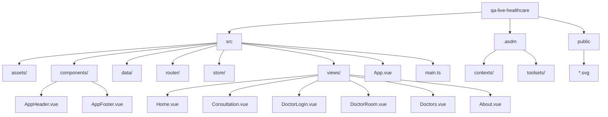

# 项目结构标准

## 概述

本文档定义了 QA Live Healthcare 项目的标准目录结构规范。它为团队协作提供文件组织指南，确保代码库的一致性和可维护性。

## 当前项目结构

```
qa-live-healthcare/
├── .asdm/                              # ASDM 配置和工具集
│   ├── contexts/                       # AI 上下文文件
│   │   ├── index.md                   # 工作区索引
│   │   ├── data-models.md             # 数据模型文档
│   │   ├── standard-project-structure.md  # 本文档
│   │   ├── standard-coding-style.md   # 编码规范
│   │   ├── deployment.md              # 部署配置
│   │   ├── api.md                     # API 文档
│   │   └── architecture.md            # 架构文档
│   └── toolsets/                       # 已安装的 ASDM 工具集
├── public/                              # 公共静态资源
│   └── *.svg                            # SVG 图标文件
├── src/                                 # 源代码目录
│   ├── assets/                         # 静态资源
│   ├── components/                     # 公共组件
│   ├── data/                          # 模拟数据文件
│   ├── router/                        # 路由配置
│   ├── store/                         # 状态管理
│   ├── views/                         # 页面视图
│   ├── App.vue                        # 根组件
│   ├── main.ts                        # 应用入口
│   ├── style.css                      # 全局样式
│   └── vite-env.d.ts                  # Vite 类型声明
├── index.html                          # HTML 入口文件
├── package.json                       # 项目依赖配置
├── vite.config.ts                     # Vite 构建配置
├── tsconfig.json                      # TypeScript 配置
└── README.md                          # 项目说明文档
```

## 目录详解

### 根目录文件

| 文件/目录 | 说明 | 是否必需 |
|-----------|------|----------|
| `package.json` | npm 依赖配置 | ✅ |
| `vite.config.ts` | Vite 构建配置 | ✅ |
| `tsconfig.json` | TypeScript 配置 | ✅ |
| `index.html` | 应用 HTML 入口 | ✅ |
| `README.md` | 项目说明文档 | ✅ |
| `.asdm/` | ASDM 工具集目录 | ✅ |

### src/ 目录结构

```
src/
├── assets/              # 静态资源（图片、字体等）
├── components/          # 公共可复用组件
├── data/               # JSON 模拟数据
├── router/             # Vue Router 配置
├── store/              # 状态管理（Vue Reactive）
├── views/              # 页面级组件
├── App.vue             # 根组件
├── main.ts             # 应用入口文件
├── style.css           # 全局样式
└── vite-env.d.ts       # Vite 类型声明
```

### 目录职责

| 目录 | 职责 | 内容类型 |
|------|------|----------|
| `src/assets/` | 静态资源存储 | 图片、字体、图标等 |
| `src/components/` | 公共组件 | 可在多个页面复用的组件 |
| `src/data/` | 模拟数据 | JSON 数据文件 |
| `src/router/` | 路由管理 | 路由配置和守卫 |
| `src/store/` | 状态管理 | 全局状态和业务逻辑 |
| `src/views/` | 页面视图 | 路由对应的页面组件 |

## 组件组织规范

### components/ 目录

```
src/components/
├── AppHeader.vue      # 应用头部导航栏
├── AppFooter.vue      # 应用底部
└── HelloWorld.vue     # 示例组件
```

**命名规范**：
- 使用 PascalCase：`AppHeader.vue`、`UserProfile.vue`
- 组件名应为名词或"组件类型 + 功能"：`AppHeader`、`DataTable`

### views/ 目录

```
src/views/
├── Home.vue           # 首页
├── Consultation.vue   # 问诊页面
├── DoctorLogin.vue    # 医生登录
├── DoctorRoom.vue     # 医生诊室
├── Doctors.vue        # 医生列表
└── About.vue          # 关于页面
```

**命名规范**：
- 使用 PascalCase
- 应与路由名称对应
- 复杂页面可创建子文件夹

## 文件命名规范

### Vue 组件

| 类型 | 规范 | 示例 |
|------|------|------|
| 页面组件 | PascalCase | `Home.vue`、`DoctorProfile.vue` |
| 公共组件 | PascalCase | `AppHeader.vue`、`DataTable.vue` |
| 基础组件 | PascalCase + 前缀 | `BaseButton.vue`、`BaseInput.vue` |

### TypeScript 文件

| 类型 | 规范 | 示例 |
|------|------|------|
| 类型定义 | camelCase 或 PascalCase | `types.ts`、`UserTypes.ts` |
| 工具函数 | camelCase | `dateUtils.ts`、`formatUtils.ts` |
| 配置文件 | camelCase | `router/index.ts`、`store/index.ts` |

### 其他文件

| 类型 | 规范 | 示例 |
|------|------|------|
| JSON 数据 | camelCase | `userData.json`、`config.json` |
| 样式文件 | camelCase 或 kebab-case | `main.css`、`common-style.css` |
| 环境变量 | 全大写 + 下划线 | `.env.production` |

## 路由组织

### router/index.ts 结构

```typescript
// 1. 导入依赖
import { createRouter, createWebHistory, RouteRecordRaw } from 'vue-router';
import Home from '../views/Home.vue';

// 2. 定义路由
const routes: RouteRecordRaw[] = [
  {
    path: '/',
    name: 'Home',
    component: Home,
  },
  // ... 其他路由
];

// 3. 创建路由实例
const router = createRouter({
  history: createWebHistory(),
  routes,
});

// 4. 导出
export default router;
```

### 路由最佳实践

1. **动态路由参数**：使用冒号前缀
   ```typescript
   path: '/doctor/room/:username'
   ```

2. **路由命名**：使用 PascalCase 或 camelCase
   ```typescript
   name: 'DoctorRoom'
   ```

3. **组件导入**：使用同步加载优化性能
   ```typescript
   component: () => import('../views/Home.vue')
   ```

## 状态管理结构

### store/index.ts 结构

```typescript
// 1. 类型定义
export interface Doctor { ... }
export interface Patient { ... }
export interface Question { ... }

// 2. 状态接口
interface State {
  doctors: Doctor[];
  patients: Patient[];
  questions: Question[];
  currentDoctor: Doctor | null;
  currentPatient: Patient | null;
}

// 3. 状态初始化
const state = reactive<State>({ ... });

// 4. Store 对象（包含所有方法）
export const store = {
  state,
  // 方法...
};
```

### Store 方法命名

| 方法类型 | 命名规范 | 示例 |
|----------|----------|------|
| 获取数据 | `get` + 名词 | `getActiveDoctors()` |
| 设置数据 | `set` + 名词 | `setCurrentUser()` |
| 添加数据 | `add` + 名词 | `addQuestion()` |
| 更新数据 | `update` + 名词 | `updateProfile()` |
| 删除数据 | `delete` + 名词 / `remove` + 名词 | `deleteItem()` |
| 业务操作 | 动词短语 | `loginDoctor()`、`logoutPatient()` |

## 数据文件组织

### data/ 目录

```
src/data/
├── doctor-user-list.json   # 医生用户数据
├── patient-user.json       # 患者用户数据
└── question-list.json      # 问诊问题数据
```

### JSON 数据文件规范

```json
{
  "filename": "camelCase.json",
  "content": [
    {
      "id": "唯一标识",
      "字段名": "值"
    }
  ]
}
```

## 新增文件流程

### 添加新页面

1. 在 `src/views/` 创建页面组件
2. 在 `src/router/index.ts` 添加路由
3. 在 `src/components/` 添加需要的组件

```bash
# 示例：添加新页面 UserProfile
1. 创建视图: src/views/UserProfile.vue
2. 添加路由: src/router/index.ts
3. 添加链接: src/components/AppHeader.vue
```

### 添加新组件

1. 在 `src/components/` 创建组件文件
2. 遵循组件命名规范
3. 在需要的页面中导入使用

```bash
# 示例：添加 UserCard 组件
1. 创建组件: src/components/UserCard.vue
2. 在视图中使用:
   <script setup>
   import UserCard from '../components/UserCard.vue';
   </script>
```

### 添加新数据

1. 在 `src/data/` 添加 JSON 文件
2. 在 `src/store/index.ts` 导入并使用
3. 定义相应的 TypeScript 类型

## 目录深度限制

**推荐最大深度**：3 层

```
✅ 推荐
src/
├── views/
│   └── UserProfile/
│       ├── index.vue
│       └── UserForm.vue

❌ 不推荐（过深）
src/
├── views/
│   └── user/
│       └── profile/
│           └── components/
│               └── form/
```

## 导入路径规范

```typescript
// 相对导入
import Home from '../views/Home.vue';
import AppHeader from './components/AppHeader.vue';

// 组件库导入
import { Button, Card } from 'ant-design-vue';

// 路由导入
import { useRouter } from 'vue-router';

// 状态管理导入
import { store } from '../store';
```

## 目录结构图示



## 相关文档

- [编码规范](./standard-coding-style.md)
- [数据模型](./data-models.md)
- [架构文档](./architecture.md)

---

*本文档由 ASDM Context Builder 自动生成。项目结构变更时请更新本文档并使用 `/asdm-context-update` 同步更新。*
