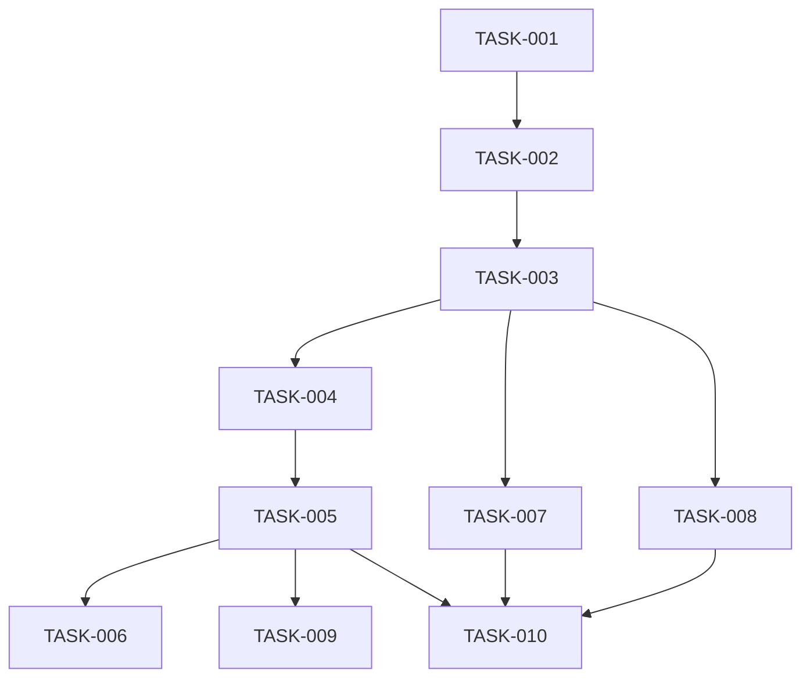

# Task List for FEA-001-appointment-booking

**Feature ID**: FEA-001
**Feature Name**: 预约挂号功能
**Created Date**: 2026-05-20
**Last Updated**: 2026-05-20
**Language**: zh

## Summary

| 统计项 | 总任务数 | TODO | In Progress | Done | Blocked | Cancelled |
|--------|----------|------|-------------|------|---------|-----------|
| 数量   | 10       | 10   | 0           | 0    | 0       | 0         |

## Task Registry

| Task ID | Task Name | Status | Task PRD | Dependencies | Estimated Effort | Created | Updated |
|---------|-----------|--------|----------|--------------|------------------|---------|---------|
| TASK-001 | 设计预约数据模型 | TODO | NOT GENERATED | NONE | 1 hour | 2026-05-20 | 2026-05-20 |
| TASK-002 | 创建预约数据存储文件 | TODO | NOT GENERATED | TASK-001 | 30 min | 2026-05-20 | 2026-05-20 |
| TASK-003 | 扩展 Store 状态管理 | TODO | NOT GENERATED | TASK-002 | 1 hour | 2026-05-20 | 2026-05-20 |
| TASK-004 | 添加预约挂号路由 | TODO | NOT GENERATED | TASK-003 | 30 min | 2026-05-20 | 2026-05-20 |
| TASK-005 | 创建预约挂号页面组件 | TODO | NOT GENERATED | TASK-004 | 2 hours | 2026-05-20 | 2026-05-20 |
| TASK-006 | 实现医生排班日历组件 | TODO | NOT GENERATED | TASK-005 | 1.5 hours | 2026-05-20 | 2026-05-20 |
| TASK-007 | 创建我的预约页面 | TODO | NOT GENERATED | TASK-003 | 1 hour | 2026-05-20 | 2026-05-20 |
| TASK-008 | 创建医生预约管理页面 | TODO | NOT GENERATED | TASK-003 | 1 hour | 2026-05-20 | 2026-05-20 |
| TASK-009 | 添加导航入口 | TODO | NOT GENERATED | TASK-005 | 30 min | 2026-05-20 | 2026-05-20 |
| TASK-010 | 编写单元测试 | TODO | NOT GENERATED | TASK-005, TASK-007, TASK-008 | 1 hour | 2026-05-20 | 2026-05-20 |

## Task Dependencies Diagram



## Status Legend

- **TODO**: 任务待开始
- **IN PROGRESS**: 任务执行中
- **DONE**: 任务已完成
- **BLOCKED**: 任务被阻塞
- **CANCELLED**: 任务已取消

## Quick Commands

```bash
# 继续任务分解
/asdm-prd-breakdown FEA-001

# 执行特定任务
/asdm-prd-execution TASK-001
```

---

*Last updated: 2026-05-20*
