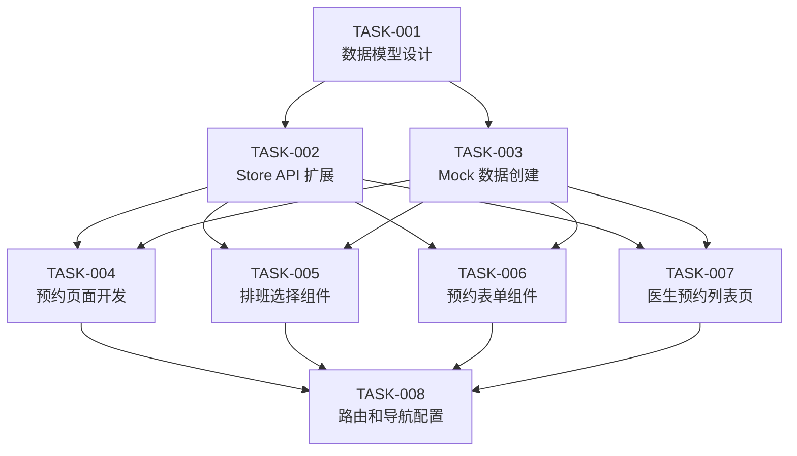

# Task List for FEAT-001-appointment-registration

**Feature ID**: FEAT-001
**Feature Name**: 预约挂号
**Created Date**: 2026-04-29
**Last Updated**: 2026-04-29
**Language**: 简体中文

---

## 摘要

| 总任务数 | TODO | 进行中 | 已完成 | 已阻塞 | 已取消 |
|---------|------|--------|--------|--------|--------|
| 8       | 8    | 0      | 0      | 0      | 0      |

---

## 任务注册表

| 任务 ID | 任务名称 | 状态 | Task PRD | 依赖关系 | 预估工时 | 创建日期 | 更新日期 |
|---------|---------|------|----------|---------|---------|----------|----------|
| TASK-001 | 数据模型设计 | TODO | task-prd-TASK-001.md | NONE | 10 min | 2026-04-29 | 2026-04-29 |
| TASK-002 | Store API 扩展 | TODO | task-prd-TASK-002.md | TASK-001 | 15 min | 2026-04-29 | 2026-04-29 |
| TASK-003 | Mock 数据创建 | TODO | task-prd-TASK-003.md | TASK-001 | 10 min | 2026-04-29 | 2026-04-29 |
| TASK-004 | 预约页面开发 | TODO | task-prd-TASK-004.md | TASK-002, TASK-003 | 20 min | 2026-04-29 | 2026-04-29 |
| TASK-005 | 排班选择组件 | TODO | task-prd-TASK-005.md | TASK-002, TASK-003 | 20 min | 2026-04-29 | 2026-04-29 |
| TASK-006 | 预约表单组件 | TODO | task-prd-TASK-006.md | TASK-002, TASK-003 | 15 min | 2026-04-29 | 2026-04-29 |
| TASK-007 | 医生预约列表页 | TODO | task-prd-TASK-007.md | TASK-002, TASK-003 | 15 min | 2026-04-29 | 2026-04-29 |
| TASK-008 | 路由和导航配置 | TODO | task-prd-TASK-008.md | TASK-004, TASK-005, TASK-006, TASK-007 | 10 min | 2026-04-29 | 2026-04-29 |

---

## 任务执行顺序

---

## 任务详情

### TASK-001：数据模型设计

**Feature**: FEAT-001 - 预约挂号
**描述**: 定义 Schedule 和 Appointment 接口，与现有数据模型风格保持一致
**分类**: 分析与设计
**优先级**: 高
**预估工时**: 10 min
**验收标准**:
- `Schedule` 接口包含：id, doctorId, date, timeSlot, totalSlots, bookedSlots
- `Appointment` 接口包含：id, patientId, patientName, phone, doctorId, doctorName, scheduleId, notes, status, createdAt, cancelledAt
- 预约状态枚举：scheduled, completed, cancelled, no-show
- 时段枚举：morning, afternoon, evening
- 类型定义写入 `src/types/appointment.ts`

**前置条件**: 无
**输出**: `src/types/appointment.ts`

---

### TASK-002：Store API 扩展

**Feature**: FEAT-001 - 预约挂号
**描述**: 扩展 src/store/index.ts，添加排班和预约相关的状态和方法
**分类**: 代码实现
**优先级**: 高
**预估工时**: 15 min
**验收标准**:
- 新增 `schedules` 响应式状态
- 新增 `appointments` 响应式状态
- 实现 `getSchedulesByDoctor(doctorId)` 方法
- 实现 `getAvailableSlots(doctorId, date)` 方法
- 实现 `createAppointment(data)` 方法，含名额校验和更新
- 实现 `cancelAppointment(appointmentId)` 方法，含名额释放
- 实现 `getAppointmentsByPatient(patientId)` 方法
- 实现 `getAppointmentsByDoctor(doctorId)` 方法
- 实现 `markAppointmentArrived(appointmentId)` 方法
- 实现 `markAppointmentNoShow(appointmentId)` 方法

**前置条件**: TASK-001 完成
**输出**: `src/store/index.ts`

---

### TASK-003：Mock 数据创建

**Feature**: FEAT-001 - 预约挂号
**描述**: 创建排班和预约的示例数据 JSON 文件
**分类**: 代码实现
**优先级**: 中
**预估工时**: 10 min
**验收标准**:
- 创建 `src/data/schedule-list.json`，包含 5 位医生未来 7 天的排班数据
- 每个时段设置合理的总名额（如 5 人）
- 部分时段设置已预约人数作为示例
- 创建 `src/data/appointment-list.json`，包含 3 条示例预约记录（不同状态）

**前置条件**: TASK-001 完成
**输出**: `src/data/schedule-list.json`, `src/data/appointment-list.json`

---

### TASK-004：预约页面开发

**Feature**: FEAT-001 - 预约挂号
**描述**: 创建 PatientAppointments.vue 患者预约记录页面
**分类**: 代码实现
**优先级**: 高
**预估工时**: 20 min
**验收标准**:
- 页面路由：/appointments
- Tabs 切换：全部 / 待就诊 / 已完成 / 已取消
- 预约卡片显示：医生姓名、科室、预约时间、状态标签
- 待就诊卡片显示取消按钮，逻辑正确
- 已完成和已取消卡片不显示取消按钮
- 空状态友好提示
- 复用 Ant Design Vue 组件风格

**前置条件**: TASK-002, TASK-003 完成
**输出**: `src/views/PatientAppointments.vue`

---

### TASK-005：排班选择组件

**Feature**: FEAT-001 - 预约挂号
**描述**: 创建 SchedulePicker.vue 排班选择器组件
**分类**: 代码实现
**优先级**: 高
**预估工时**: 20 min
**验收标准**:
- 接收 doctorId 作为 props
- 显示医生未来 7 天的排班日历视图
- 每个日期显示三个时段（上午/下午/晚上）的可预约状态
- 不可预约时段（已满/已过期）显示为禁用状态
- 选中时段高亮显示
- 选中后 emit selected 事件，传递 scheduleId
- 使用 Day.js 格式化日期

**前置条件**: TASK-002, TASK-003 完成
**输出**: `src/components/SchedulePicker.vue`

---

### TASK-006：预约表单组件

**Feature**: FEAT-001 - 预约挂号
**描述**: 创建 AppointmentForm.vue 预约表单组件
**分类**: 代码实现
**优先级**: 高
**预估工时**: 15 min
**验收标准**:
- 接收 selectedSchedule（已选排班信息）作为 props
- 表单字段：患者姓名（必填）、联系电话（必填）、就诊备注（选填）
- 表单验证：姓名非空、联系电话格式正确
- 提交成功后调用 createAppointment
- 显示预约成功确认信息（预约编号、时间、医生）
- 成功后 emit completed 事件

**前置条件**: TASK-002, TASK-003 完成
**输出**: `src/components/AppointmentForm.vue`

---

### TASK-007：医生预约列表页

**Feature**: FEAT-001 - 预约挂号
**描述**: 创建 DoctorAppointments.vue 医生预约列表页
**分类**: 代码实现
**优先级**: 中
**预估工时**: 15 min
**验收标准**:
- 页面路由：/doctor/appointments/:username
- 日期筛选器，默认显示今日预约
- 预约表格显示：患者姓名、预约时间、时段、联系方式、状态
- 支持标记到诊和未到诊操作
- 待就诊状态显示「到诊」「未到」按钮
- 统计栏显示今日待就诊人数

**前置条件**: TASK-002, TASK-003 完成
**输出**: `src/views/DoctorAppointments.vue`

---

### TASK-008：路由和导航配置

**Feature**: FEAT-001 - 预约挂号
**描述**: 配置新路由和患者端导航入口
**分类**: 代码实现
**优先级**: 中
**预估工时**: 10 min
**验收标准**:
- 路由表新增 /appointments，指向 PatientAppointments.vue
- 路由表新增 /doctor/appointments/:username，指向 DoctorAppointments.vue
- AppHeader.vue 新增「我的预约」入口链接
- DoctorRoom.vue 新增「预约管理」标签页入口
- 路由守卫：需要患者身份验证的页面添加权限校验

**前置条件**: TASK-004, TASK-005, TASK-006, TASK-007 完成
**输出**: `src/router/index.ts`, `src/components/AppHeader.vue`, `src/views/DoctorRoom.vue`

---

## 状态管理

### 任务状态定义

| 状态 | 说明 |
|------|------|
| TODO | 任务尚未开始 |
| IN_PROGRESS | 任务正在进行中 |
| DONE | 任务已完成 |
| BLOCKED | 任务被阻塞，等待依赖完成 |
| CANCELLED | 任务已取消 |

### 状态更新规则

- 任务创建时状态为 `TODO`
- 开始执行时更新为 `IN_PROGRESS`
- 完成所有验收标准后更新为 `DONE`
- 遇到阻塞时更新为 `BLOCKED`，并注明阻塞原因
- 取消任务时更新为 `CANCELLED`

---

## 更新日志

| 日期 | 任务 ID | 更新内容 |
|------|---------|---------|
| 2026-04-29 | 全部 | 创建任务清单，8 个任务全部生成 |
| 2026-04-29 | 全部 | 为 8 个任务生成详细 Task PRD 文档 |

---

*最后更新：2026-04-29*
